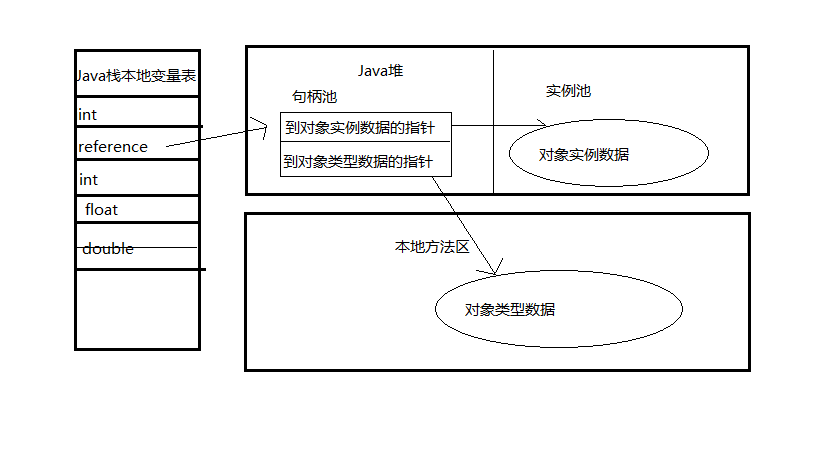
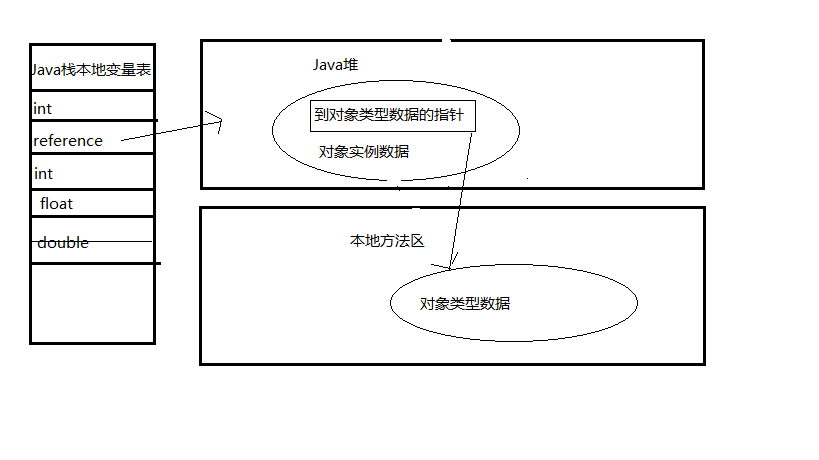

# 对象的创建

一个普通的java对象建立过程如下

虚拟机遇到一个new指令时，首先检查这个指令的参数能否在常量池中定位到一个类的符号引用，并且检查这个符号引用代表的类是否被加载、解析和初始化过。如果没有。那必须先执行相应类的加载过程。

在类加载检查通过后，接下来虚拟机将为新生对象分配内存。对象所需内存的大小在类加载完成后就可以确定下来，为对象分配空间的任务就等同于把一块确定大小的内存从Java堆上划分出来。

## 对象的内存分配方式

### 指针碰撞

假设Java堆中内存是绝对规整的，所有用过的内存都放在一边，空闲的放在另一边，中间放着一个指针作为分界点的指示器，那所分配内存就是仅仅把那个指针向空闲空间那边挪动一段与对象大小相等的距离，这中分配方式称为“指针碰撞”（Bump the Pointer）。

### 空闲列表

如果Java堆中的内存并不是规整的，已使用的内存和未使用的内存相互交错，那就没有办法进行简单的指针碰撞了，虚拟机就必须维护一个列表，记录上哪些内存块是可用的，在分配时从列表中找到一块足够大的空间划分给对象实例，并更新表上的记录，这种分配方式称为“空闲列表”（Free List）。

选择哪种方式由Java堆是否规整决定，而Java堆是否规整又由所采用的垃圾收集器是否带压缩整理功能决定。因此，使用Serial、ParNew（**年轻代使用复制算法**）等带compact过程的收集器时，系统采用的分配算法是指针碰撞。而使用CMS（**使用标记-清除算法**）这种基于Mark-Sweep算法的收集器时，通常采用空闲列表法。

## 保证并发安全的内存分配

对象在虚拟机中创建是非常频繁的行为，即使是仅仅修改一个指针的位置，在并发情况下也不是线程安全的，可能存在即将给A分配内存时，指针还没来得及修改，对象B又同时使用原来的指针来分配内存的情况。

hotspot虚拟机采用的是**cas算法配上失败重试**的方式保证在更新操作的原子性。

## 内存分配之后

内存分配之后，虚拟机需要将分配到的内存空间都初始化为零（不包括对象头），接下来，虚拟机需要对对象进行一些必要的设置，例如这个对象是哪个类的实例，如何才能找到类的元数据信息，对象的哈希码、GC分代年龄等信息。这些信息存放在对象的对象头中，根据虚拟机当前的运行状态的不同，如是否启用偏向锁等，对象头会有不同的设置方式。

在上面的工作都完成之后，从虚拟机的视角看，一个新的对象已经产生了，但从Java视角看，对象创建才刚刚开始`<init>`方法还没有执行，所有的字段都还为零。所以一般来说（由字节码中是否跟随invokespecial指令所决定），执行new指令之后会接着执行`<init>` 方法，把对象按照程序员的意愿进行初始化，这样一个真正可用的对象才算完全产生出来。

# 对象的内存布局

在HotSpot虚拟机中，对象在内存中存储的布局可用分为3个内存区域：对象头（Object Header）、实例数据（Instance Data）、对齐填充（Padding）。

## 对象头

一个对象头分为MarkWord，kclassPoint。（如果这个对象是数组，则还有array length）

### MarkWord

HotSpot虚拟机的对象头包括两部分信息，第一部分用于存储对象的运行时数据，如哈希码、GC分代年龄、锁状态标志、线程持有的锁、偏向线程ID、偏向时间戳等，这部分数据在32位和64位的虚拟机（未开启压缩指针）中分别是32bit和64bit，官方称它为“Mark World”。对象需要存储的运行时数据很多，其实已经超过了32位和64为Bitmap结构所能存储的极限，但是对象头信息是与对象自身定义无关的额外存储成本，考虑到虚拟机的空间效率，Mark World被设计成一个非固定的数据结构以便在极小的空间存储尽量多的信息，它会根据对象的状态复用自己的存储空间。

| 存储内容                             | 标志位 | 状态               |
| ------------------------------------ | ------ | ------------------ |
| 对象哈希码，对象分代年龄             | 01     | 未锁定             |
| 指向锁记录的指针                     | 00     | 轻量级锁定         |
| 指向重量级锁的指针                   | 10     | 膨胀（重量级锁定） |
| 空，不需要记录信息                   | 11     | GC标记             |
| 偏向线程ID，偏向时间戳，对象分代年龄 | 01     | 可偏向             |

### KclassPoint

对象头的另一部分是类型指针，即对象指向它的类元数据的指针，虚拟机通过这个指针来确定对象是哪个类的实例。并不是所有虚拟机实现都必须在对象数据上保留类型指针，换句话说，查找对象的元数据并不一定要经过对象本身。该指针的位长度为JVM的一个字大小，即32位的JVM为32位，64位的JVM为64位。
 如果应用的对象过多，使用64位的指针将浪费大量内存，统计而言，64位的JVM将会比32位的JVM多耗费50%的内存。为了节约内存可以使用选项`+UseCompressedOops`开启指针压缩.

### array length

如果对象是一个数组，那么对象头还需要有额外的空间用于存储数组的长度，这部分数据的长度也随着JVM架构的不同而不同：32位的JVM上，长度为32位；64位JVM则为64位。64位JVM如果开启`+UseCompressedOops`选项，**该区域长度也将由64位压缩至32位**。

## 实例数据

实例数据部分是对象真正存储的有效信息，也是在程序代码中定义的各个字段的内容，无论是从父类继承下来的，还是在子类定义的，都需要记录下来。这部分的存储顺序会受到虚拟机分配策略参数（FieldsAllocationStyle）和字段在Java源码中的定义顺序的影响。HotSpot默认的分配策略为longs/doubles、ints、shorts/chars、bytes/booleans、oops（Ordinary Object Pointers），从分配策略中可以看出，相同宽度的字段总是被分配在一起。在满足这个前提条件的情况下，在父类中定义的字段会出现在子类之前。如果CompactFields参数值为true（默认为true）,那么子类中较窄的变量也可能插入到父类变量的空隙之中。

## 对齐填充

对齐填充并不是必须存在的，也没有特别的含义，它仅仅起着占位符的作用。由于HotSpot虚拟机的内存管理系统要求对象的起始地址必须是8字节的整数倍，换句话说就是对象的大小必须是8字节的整数倍。而对象头部分就是8字节的整数倍，因此，当对象实例数据部分没有对齐时，就需要通过对齐填充来补全。

# 对象的访问定位

Java程序需要通过栈上的reference数据来操作堆上的具体对象。由于reference类型在Java虚拟机规范中只规定了一个指向对象的，并没有规定这个引用应该通过何种方式去定位、访问堆中对象的具体位置，所以对象访问方式也取决于虚拟机实现而定。目前主流的访问方式是使用**直接指针**和**句柄**两种方式。

## 句柄

如果使用句柄的话，那么Java堆中将会划分出一块内存来作为句柄池，reference中存储的就是对象的句柄地址，而句柄中包含了对象实例数据和类型数据各自的具体地址信息。

## 直接指针

如果使用直接指针访问，那么Java堆对象的布局中就必须考虑如何存放访问类型数据的相关信息，而reference中存储的直接就是对象地址。

## 总结

两种方式各有优势，使用句柄来访问的最大好处是reference中存储的是稳定的句柄地址，在对象被移动（垃圾收集时移动对象是很普遍的行为）时,只会修改句柄中的实例数据的指针，而reference本身不需要修改。

使用直接指针访问方式的最大好处就是速度更快，它节省了一次指针定位的时间开销，由于对象的访问在Java中非常频繁，因此这类开销积少成多也是一项非常可观的执行成本。就HotSpot虚拟机而言，它是使用直接指针进行对象访问的，但从整个软件开发的范围来看，各种语言和框架使用句柄来访问的情况也十分常见。
