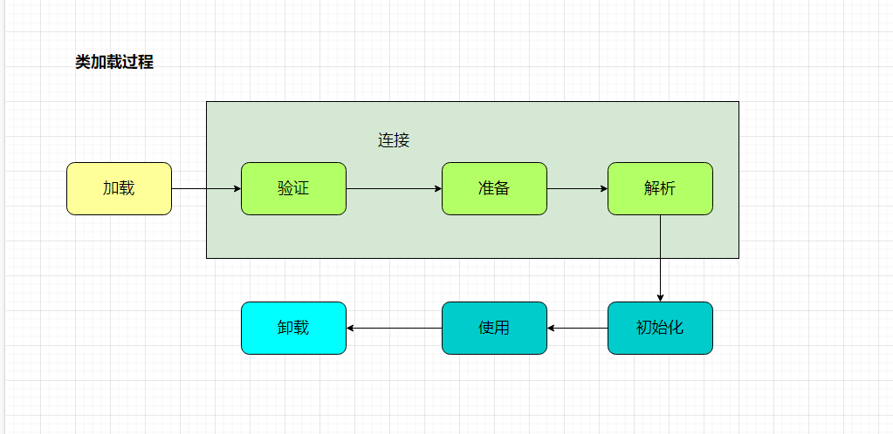

# 类加载的时机

类从被加载到虚拟机内存中，到卸载出内存为止，它的整个生命周期包括：加载（Loading）、验证（Verification）、准备（Preparation）、解析（Resolution）、初始化（Initialization）、使用（Using）和卸载（Unloading）7个阶段。其中验证、准备和解析3个部分统称为连接（Linking）。这7个阶段发生顺序如图7-1所示。



## 初始化的时机

什么情况下需要开始类加载过程的第一个阶段：加载？Java虚拟机规范中并没有进行强制约束，这点可以交给虚拟机的具体实现去自由把握。但是对于初始化阶段，虚拟机规范则是严格规定了只有在5种情况必须立即对类进行“初始化”（而类加载、验证、准备自然需要在此之前开始）：

1）遇到new、getstatic、putstatic或invokestatic这4条字节码指令时，如果类没有进行初始化，则需要先触发其初始化。生成这4条指令的最常见的Java代码场景是：使用new关键字实例化对象的时候、读取或设置一个类的静态字段（被final修饰，已在编译器将结果放入常量池的静态字段除外）的时候，以及调用一个类的静态方法的时候。

2）使用java.lang.reflect包的方法对类进行反射调用的时候，如果类没有进行初始化，则需要先触发其初始化。

3）当初始化一个类的时候，如果发现其父类没有进行过初始化，则需要先触发其父类的初始化。

4）当虚拟机启动的时候，用户需要指定一个要执行的主类（包含main()方法的那个类），虚拟机会先初始化这个主类。

5）当使用JDK1.7的动态语言支持时，如果一个java.lang.invoke.MethodHandle实例最后的解析结果REF_getStatic、REF_putStatic、REF_invokeStatic的方法句柄，并且这个方法的句柄所对应的类没有进行过初始化，则需要触发其初始化。

对于这5种会触发类初始化的场景，虚拟机规范中使用了一个很强烈的限定语：“**有且只有**”，这5中场景中的行为称为对一个类进行主动引用。除此之外，所有引用类的方式都不会触发初始化，称为被动引用。下面通过3个例子说明何为被动引用。

### 被动引用

1**）通过子类引用父类的静态字段，不会导致子类初始化**。

```java
package com.yudi.thread;

/**
 * @author yudi
 * @date 2020-03-30 19:42
 */
public class Init {

    public static void main(String[] args) {
        System.out.println(Sub.i);
    }
}
class Father {

    static {
        System.out.println("father init");
    }

    static int i =10;
}
class Sub extends Father {
    static {
        System.out.println("sub init");
    }
}
-------------------------------------
打印结果为
father init
10
```

2）**通过数组定义来引用类，不会触发此类的初始化**

```java
public static void main(String[] args) {
Father[] fathers = new Father[100];
System.out.println(fathers);
}
--------------------------------
打印结果为
[Lcom.yudi.thread.Father;@1b6d3586    
```

3）常量在编译阶段会存入调用类的常量池中，本质上并没有直接引用到定义常量的类，因此不会触发定义常量的类的初始化。

```java
package com.yudi.thread;

/**
 * @author yudi
 * @date 2020-03-30 19:42
 */
public class Init {

    public static void main(String[] args) {
//        Father[] fathers = new Father[100];
        System.out.println(Father.i);
    }
}

class Father {

    static {
        System.out.println("father init");
    }

    static final int i =10;
}
--------------------------------
打印结果为
10   
```

这是因为其实在编译阶段通过常量传播优化，已经将此常量的值存储到Init类的常量池中，以后Init对常量i的引用实际上都被转化到Init类对自身常量池的引用了。