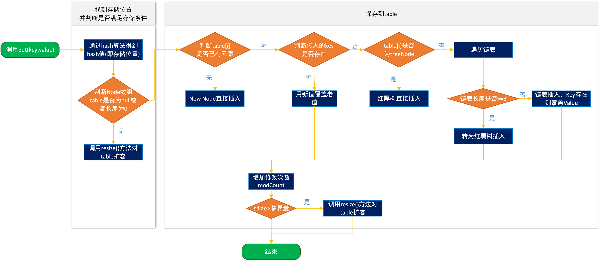
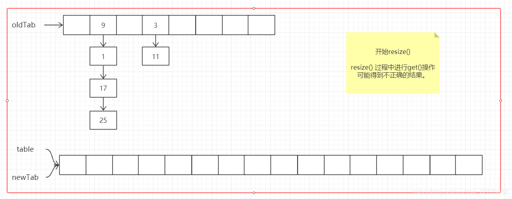
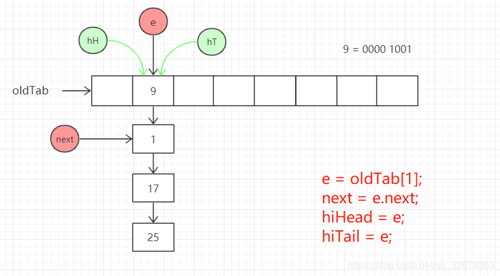

### 前言

此笔记主要基于jdk1.8进行总结，在jdk1.8中，HashMap的数据结构：数组	+	链表	+	红黑树

### 初始化

HashMap<String, String> map = new HashMap<String, String>(16, 0.75);

初始化时会对传参进行校验

```java
if (initialCapacity < 0)    
		throw new IllegalArgumentException("Illegal initial capacity: " + initialCapacity);
if (initialCapacity > MAXIMUM_CAPACITY)
        initialCapacity = MAXIMUM_CAPACITY;
if (loadFactor <= 0 || Float.isNaN(loadFactor))
        throw new IllegalArgumentException("Illegal load factor: " +loadFactor);
```

然后hashmap中某些变量进行初始化：

```java
this.loadFactor = loadFactor;	//负载因子
this.threshold = tableSizeFor(initialCapacity);	//阈值
```


### 添加元素流程

 

​	首先判断table(该变量指存放元素的数组)是否为空或者长度为0，满足条件就初始化数组，数组初始化结束后，通过hash算法计算出的hash值与上数组的长度减一得到元素存放的位置，此时数组的长度是DEFAULT_INITIAL_CAPACITY，根据上面索引位置计算方法，为了保证索引位置在0到DEFAULT_INITIAL_CAPACITY范围内，此值必须是2的幂次方。

```
16		0000 0000 0001 0000
16-1	0000 0000 0000 1111
&
hash	0000 0000 0111 1010
------------------------------
        0000 0000 0000 1010
```

在得到索引位置后，判断该位置上是否有节点存在，如果没有，则直接将节点放入该位置；如果该位置已经有节点存在，首先比较新加入节点与已存在节点的hash值及key的值是否相等，如果相等，直接替换已存在的节点为新加入的节点；如果不想等，判断新加入的节点是否属于TreeNode(用来表示红黑树的节点),如果是直接通过红黑树中添加节点的方式添加节点；如果不是，就遍历链表，在遍历链表的过程中会进行两个判断：判断链表的节点数是否到达转化成红黑树的阈值TREEIFY_THRESHOLD (8)，到达了该阈值，会**尝试**将链表结构转换成红黑树结构；另外判断链表中节点是否出现key值相同(hash值相等、key相等)的情况；

添加完节点后，判断map中节点数是否大于阈值threshold，若大于这个数则进行扩容。

#### 扩容的方式：

1. newTab= new 一个二倍原长度的 Node 数组，threshold 变成两倍；
2. 将 table （Map中存放元素的容器）指向 newTab；
3. 依次遍历原来 Node 数组的每个坑位，将坑中的元素进行 rehash。

  


### 源码解析

put方法中调用putVal((hash(key), key, value, false, true)),其中hash(key)则是通过对key的值进行某种hash算法，最后在存放时利用该hash值找到元素存放在数组中的位置。

#### hash(key)方法

```java
//1、HashMap是允许key为null的，当key为null时，hash值为0
//2、key不为null时，返回的hash值是将key的hashCode值的高16位与低16位进行异或运算，这样充分利用了hashcode的所有32位值，保证了hash值的散列性
int h;
return (key == null) ? 0 : (h = key.hashCode()) ^ (h >>> 16);
	0000 0000 0000 0000 0000 0000 0111 1010
  ^
    0000 0000 0000 0000 0000 0000 0000 0000
 ------------------------------------------------
    0000 0000 0000 0000 0000 0000 0111 1010		//122				
```

进入putVal()方法，会发现在第一行会定义一个Node<K,V>[] tab这样的数组，这个数组其实就是存放元素的数组，数组中元素都是一个节点即Node<K,V>，这个Node在jdk1.8的hashMap中不仅在数组这种结构中，也存在链表的结构中。代码中通过内部类的形式维护节点的属性：key的hash值，key，value，以及next指针指向链表的下一个节点。

```java
final int hash;
final K key;
V value;
Node<K,V> next;
```

首先判断数组是否为null或者数组长度是否为0，是就调用resize()方法进行初始化：

```java
if ((tab = table) == null || (n = tab.length) == 0)    
    n = (tab = resize()).length;
```

#### resize()中初始化代码

```java
final Node<K,V>[] resize() {
    // 记录原 table
    Node<K,V>[] oldTab = table;
    // oldCap：原数组长度；oldThr：原table中节点个数阈值
    int oldCap = (oldTab == null) ? 0 : oldTab.length;
    int oldThr = threshold;
    int newCap, newThr = 0;
    // 原数组已经初始化过了
    if (oldCap > 0) {
        // 数组不能更大，调大threshold
        // 默认 MAXIMUM_CAPACITY = 1 << 30，Integer.MAX_VALUE 的一半
        if (oldCap >= MAXIMUM_CAPACITY) {
            threshold = Integer.MAX_VALUE;
            return oldTab;
        }
        // oldCap >= DEFAULT_INITIAL_CAPACITY 保证map数组已经初始化过了
        else if ((newCap = oldCap << 1) < MAXIMUM_CAPACITY &&
                 oldCap >= DEFAULT_INITIAL_CAPACITY)
            newThr = oldThr << 1; // double threshold
    }
    // 以下是Map数组还没有初始化的情况
    // 分两种：
    // 1. 显式传入初始 capacity的时候，threhold 在构造函数中被赋值，其值为数组初始容量
    // 2. 使用无参构造函数 new HashMap，threshold = 0
    else if (oldThr > 0) // initial capacity was placed in threshold
        newCap = oldThr;
    else {               // zero initial threshold signifies using defaults
        newCap = DEFAULT_INITIAL_CAPACITY;
        newThr = (int)(DEFAULT_LOAD_FACTOR * DEFAULT_INITIAL_CAPACITY);
    }
    // newThr 超过了 Int 的最大值
    if (newThr == 0) {
        float ft = (float)newCap * loadFactor;
        newThr = (newCap < MAXIMUM_CAPACITY && ft < (float)MAXIMUM_CAPACITY ?
                  (int)ft : Integer.MAX_VALUE);
    }
    threshold = newThr;
    @SuppressWarnings({"rawtypes","unchecked"})
        Node<K,V>[] newTab = (Node<K,V>[])new Node[newCap];
    // 新数组创建出来的时候，table 就指向了它
    table = newTab;
```
#### 添加节点操作

如果数组上有元素，则根据(n - 1) & hash此计算方式计算出来的索引位置上有无节点进行后续操作，若该位置为空，则直接将要加入的节点添加到数组上的该位置即可

```java
if ((p = tab[i = (n - 1) & hash]) == null)    tab[i] = newNode(hash, key, value, null);
```

如果该位置上已经存在节点则需分三种情况进行操作：

1、新加入节点与已有节点的hash值以及key相同，则直接替换成新加入节点

```java
if (p.hash == hash && ((k = p.key) == key || (key != null && key.equals(k))))    
	e = p;
```

2、节点已经树化，则使用树华后的方式加入新节点

```java
else if (p instanceof TreeNode)    
	e = ((TreeNode<K,V>)p).putTreeVal(this, tab, hash, key, value);
```

3、节点未树化，需要将新节点加入链表中，循环遍历链表，判断链表的节点数是否到达转化成红黑树的阈值TREEIFY_THRESHOLD (8)，到达了该阈值，会**尝试**将链表结构转换成红黑树结构；另外判断链表中节点是否出现key值相同(hash值相等、key相等)的情况；

```java
for (int binCount = 0; ; ++binCount) {    
    if ((e = p.next) == null) {        
        p.next = newNode(hash, key, value, null);        
        if (binCount >= TREEIFY_THRESHOLD - 1) // -1 for 1st            
            treeifyBin(tab, hash);        
        	break;    
    }    
    if (e.hash == hash && ((k = e.key) == key || (key != null && key.equals(k))))        		 break;    
    p = e;
}
```

节点添加完成后，返回hash值相等，key相等时旧节点的值

```
if (e != null) { // existing mapping for key    
	V oldValue = e.value;    
	if (!onlyIfAbsent || oldValue == null)        
		e.value = value;    
	afterNodeAccess(e);    
	return oldValue;
}
```


对modCount字段进行++操作

```java
++modCount;
```

判断map中节点数量是否大于阈值，若超过阈值，则进行扩容操作；

```java
if (++size > threshold)    
	resize();
```

#### 扩容操作

```java
...
// 原数组已经初始化过了
if (oldCap > 0) {
    // 数组不能更大，调大threshold
    // 默认 MAXIMUM_CAPACITY = 1 << 30，Integer.MAX_VALUE 的一半
    if (oldCap >= MAXIMUM_CAPACITY) {
        threshold = Integer.MAX_VALUE;
        return oldTab;
    }
    // oldCap >= DEFAULT_INITIAL_CAPACITY 保证map数组已经初始化过了
    else if ((newCap = oldCap << 1) < MAXIMUM_CAPACITY &&
             oldCap >= DEFAULT_INITIAL_CAPACITY)
        newThr = oldThr << 1; // double threshold
}
...
@SuppressWarnings({"rawtypes","unchecked"})
Node<K,V>[] newTab = (Node<K,V>[])new Node[newCap];
table = newTab;

if (oldTab != null) {
    // 依次遍历每个坑位
    for (int j = 0; j < oldCap; ++j) {
        Node<K,V> e;
        // 坑位上有元素
        if ((e = oldTab[j]) != null) {
            // oldTab 的这个坑位上元素置空，为 GC 做准备
            oldTab[j] = null;
            // 只有一个元素，直接放
            if (e.next == null)
                newTab[e.hash & (newCap - 1)] = e;
            // 坑位中元素被树化的情况
            else if (e instanceof TreeNode)
                ((TreeNode<K,V>)e).split(this, newTab, j, oldCap);
            // 坑位中元素是链表的情况，见下图
            else { // preserve order

```
  

经过下面一段代码，链表被分为两条链表：

```java
Node<K,V> loHead = null, loTail = null;
Node<K,V> hiHead = null, hiTail = null;
Node<K,V> next;
do {
	next = e.next;
    if ((e.hash & oldCap) == 0) {
    	if (loTail == null)
        	loHead = e;
        else
            loTail.next = e;
        loTail = e;
    }
    else {
    	if (hiTail == null)
        	hiHead = e;
        else
            hiTail.next = e;
        hiTail = e;
    }
}while ((e = next) != null);
```

再将两条链表的首节点分别放入新数组中索引的位置

```java
if (loTail != null) {
	loTail.next = null;
    newTab[j] = loHead;
}
if (hiTail != null) {
    hiTail.next = null;
    newTab[j + oldCap] = hiHead;
}
```

最后返回扩容后的数组即可。