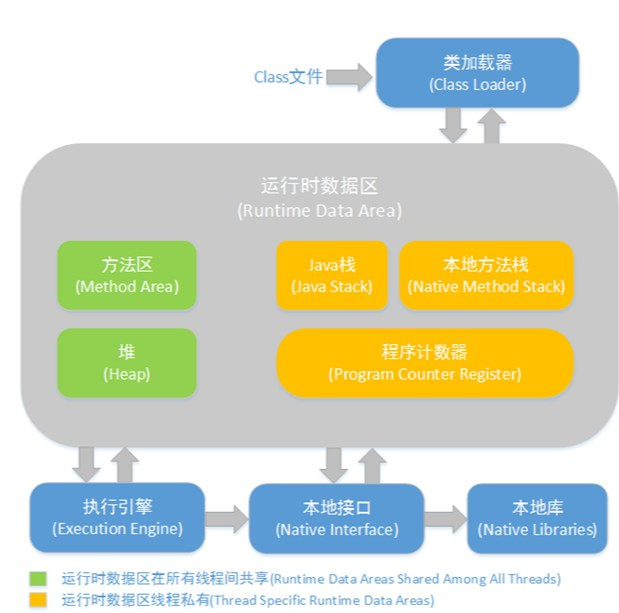
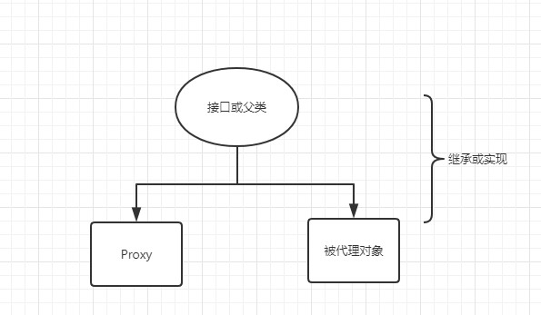

### 反射原理

> ​	Java的反射（reflection）机制是指在程序的运行状态中，可以构造任意一个类的对象，可以了解任意一个对象所属的类，可以了解任意一个类的成员变量和方法，可以调用任意一个对象的属性和方法。这种动态获取程序信息以及动态调用对象的功能称为Java语言的反射机制。反射被视为动态语言的关键.


#### java类加载机制

> 要弄清楚java的反射原理，我们首先需要知道java的类加载机制



* \*.java文件通过代码编译器编译成为\*.class文件
* *.class文件通过类加载器加载到jvm虚拟机内存中
* 此时class文件里的二进制数据存储到方法区中，并同时在堆内存中生成了对应的Class对象，Class对象可以说是方法区中类数据的访问入口
* Class对象可以获得该类的构造函数，成员变量，方法等信息，而这样获取类任意一个对象所有属性和方法的过程就是反射


#### Class类

获得Class类的方式有三种

```java
//获得Class对象的三种方式
Class class1 = Student.class;

Class class2 = new Student().getClass();

//path：Student.java文件的完整路径
Class class3 = Class.forName("path");
```

我们可以通过一个例子来看看Class对象能够做些什么

```java
class Student{
    public String name;
    public String age;

    public void setName(String name) {
        this.name = name;
    }
    public Student(String name, String age) {
        this.name = name;
        this.age = age;
    }
    @Override
    public String toString() {
        return "Student{" +
                "name='" + name + '\'' +
                ", age='" + age + '\'' +
                '}';
    }
}
public class ReflectionDemo {
    public static void main(String[] args) throws ClassNotFoundException, IllegalAccessException, InstantiationException, NoSuchFieldException, NoSuchMethodException, InvocationTargetException {
        
        Class class1 = Class.forName("com.javase.Student");
        //获得指定的构造器
        Constructor constructor = class1.getConstructor(String.class, String.class);
        //获得对象的实例
        Student student = (Student) constructor.newInstance("ZhangSan","12");
        System.out.println(student);
        //得到指定的属性
        Field name = class1.getField("name");
        //获取指定的方法
        Method setName = class1.getDeclaredMethod("setName", String.class);
        //执行方法
        setName.invoke(student,"LiSi");
        System.out.println(student);
    }
}
```

``` shell
#控制台输出结果
Student{name='ZhangSan', age='12'}
Student{name='LiSi', age='12'}
```

​	可以从以上的示例中看到，我们获得了Student类的构造方法，setName方法，指定名称的属性，并可以执行获得的构造方法，setName方法。


#### Reflection（反射）类

那么Class类是如果获得这些信息的呢？我们不妨以getDeclaredMethod为例

```java
@CallerSensitive
    public Method getDeclaredMethod(String name, Class<?>... parameterTypes)
        throws NoSuchMethodException, SecurityException {
        //检查当前类是否有权限访问成员变量和方法
        checkMemberAccess(Member.DECLARED, Reflection.getCallerClass(), true);
        //通过searchMethods方法查询指定方法
        Method method = searchMethods(privateGetDeclaredMethods(false), name, parameterTypes);
        if (method == null) {
            throw new NoSuchMethodException(getName() + "." + name + argumentTypesToString(parameterTypes));
        }
        return method;
    }

@CallerSensitive
public static native Class<?> getCallerClass();

//getCallerClass重载方法
@Deprecated
public static native Class<?> getCallerClass(int var0);
```

​	Reflection类是反射机制的核心，该类通过一个native方法getCallerClass()从而获得调用者的Class类对象，该方法还有一个重载方法，入参是调用者的等级

0 和小于0 -  返回 Reflection类

1 -  返回自己的类

2 -  返回调用者的类

3、4层层传递并返回调用者的类

但是该方法已经过时了，官方的解释是为了防止被恶意调用从而获取到没有获得权限的类

> *这个注解是为了堵住漏洞用的。曾经有黑客通过构造双重反射来提升权限，原理是当时反射只检查固定深度的调用者的类，看它有没有特权，例如固定看两层的调用者（getCallerClass(2)）。如果我的类本来没足够权限群访问某些信息，那我就可以通过双重反射去达到目的：反射相关的类是有很高权限的，而在 我->反射1->反射2 这样的调用链上，反射2检查权限时看到的是反射1的类，这就被欺骗了，导致安全漏洞。使用CallerSensitive后，getCallerClass不再用固定深度去寻找actual caller（“我”），而是把所有跟反射相关的接口方法都标注上CallerSensitive，搜索时凡看到该注解都直接跳过，这样就有效解决了恶意调用的问题*


​	现在我们来继续看getDeclaredMethod（）方法，既然获得了该类的Class类，那么接下来就是判断是否有足够的权限访问类里的成员变量，这一步是在checkMemberAccess（）方法中实现的

```java
private void checkMemberAccess(int which, Class<?> caller, boolean checkProxyInterfaces) {
        final SecurityManager s = System.getSecurityManager();
        if (s != null) {
            /* Default policy allows access to all {@link Member#PUBLIC} members,
             * as well as access to classes that have the same class loader as the caller.
             * In all other cases, it requires RuntimePermission("accessDeclaredMembers")
             * permission.
             */
            final ClassLoader ccl = ClassLoader.getClassLoader(caller);
            final ClassLoader cl = getClassLoader0();
            if (which != Member.PUBLIC) {
                if (ccl != cl) {
                    s.checkPermission(SecurityConstants.CHECK_MEMBER_ACCESS_PERMISSION);
                }
            }
            this.checkPackageAccess(ccl, checkProxyInterfaces);
        }
    }
```

​	首先**int which**决定了访问等级，这里传入的是Member.DECLARED，也就是public，这里检查类成员的访问权限，如果权限不足，那么则会抛出一个SecurityException。接下来通过searchMethods（）方法，搜索到指定的方法，如果查询出来的方法等于null，则抛出NoSuchMethodException。至此成功获得指定的方法。


### 什么是代理模式

> ​	代理可以看作是对调用目标的一个包装，这样我们对目标代码的调用不是直接发生的，而是通过代理完成。而jdk提供的反射机制则是动态代理的具体体现。


### 静态代理

> ​	所谓静态代理可以理解为：在程序运行之前代理对象和目标对象的关系就已经确定下来，代理对象的字节码文件就已经存在，静态代理需要满足的条件：代理对象和目标对象需要继承同一个父类，或者实现同一个接口，如下图



#### 静态代理示例

``` java
//目标接口
public interface ProxyInterface {
    public void sendMsg();
}

//目标对象
public class SourceObject implements ProxyInterface{
    @Override
    public void sendMsg(){
        System.out.println("send message!!");
    }
}
//代理对象
public class ProxyDemo implements ProxyInterface{

    private SourceObject target;

    public ProxyDemo(ProxyInterface target){
        this.target = (SourceObject) target;
    }
    //代理对象对目标对象的sendMsg方法进行增强
    @Override
    public void sendMsg() {
        System.out.println("get phone number!");
        target.sendMsg();
        System.out.println("send the email!");
    }
}
```

> * 这就是一个简单的静态的代理模式的实现。代理模式中的所有角色（代理对象、目标对象、目标对象的接口）等都是在编译期就确定好的。
>
> * 静态代理的用途 控制真实对象的访问权限 通过代理对象控制对真实对象的使用权限。
>
> * 避免创建大对象 通过使用一个代理小对象来代表一个真实的大对象，可以减少系统资源的消耗，对系统进行优化并提高运行速度。
>
> * 增强真实对象的功能 这个比较简单，通过代理可以在调用真实对象的方法的前后增加额外功能。

----


### 动态代理

> ​	前面介绍了[静态代理](https://github.com/hollischuang/toBeTopJavaer/blob/master/basics/java-basic/static-proxy.md)，虽然静态代理模式很好用，但是静态代理还是存在一些局限性的，比如使用静态代理模式需要程序员手写很多代码，这个过程是比较浪费时间和精力的。一旦需要代理的类中方法比较多，或者需要同时代理多个对象的时候，这无疑会增加很大的复杂度。
>
> ​	动态代理中的代理类并不要求在编译期就确定，而是可以在运行期动态生成，从而实现对目标对象的代理功能。反射即是动态代理的一种实现方式


#### JDK动态代理

> java.lang.reflect 包中的Proxy类和InvocationHandler接口提供了生成动态代理类的能力


#### JDK动态代理的步骤

1、定义一个委托类和公共接口。

2、自己定义一个类（调用处理器类，即实现 InvocationHandler 接口），这个类的目的是指定运行时将生成的代理类需要完成的具体任务（包括Preprocess和Postprocess），即代理类调用任何方法都会经过这个调用处理器类

3、生成代理对象（当然也会生成代理类），需要为他指定(1)委托对象(2)实现的一系列接口(3)调用处理器类的实例。因此可以看出一个代理对象对应一个委托对象，对应一个调用处理器实例。


#### 动态代理涉及的类

java.lang.reflect.Proxy: 这是生成代理类的主类，通过 Proxy 类生成的代理类都继承了 Proxy 类，即 DynamicProxyClass extends Proxy。

java.lang.reflect.InvocationHandler: 这里称他为"调用处理器"，他是一个接口，我们动态生成的代理类需要完成的具体内容需要自己定义一个类，而这个类必须实现 InvocationHandler 接口。


#### 动态代理示例

```java
//目标接口
public interface ProxyInterface {
    public void sendMsg();
}

//目标对象
public class SourceObject implements ProxyInterface{
    @Override
    public void sendMsg(){
        System.out.println("send message!!");
    }
}

//动态代理类
public class DynamicProxy implements InvocationHandler {
    private Object target;
    public DynamicProxy(Object target){
        super();
        this.target = target;
    }
    public DynamicProxy(){
        super();
    }
    /**
     * @param proxy 通过Proxy.newProxyInstance()生成的代理类对象
     * @param method 表示代理对象被调用的函数
     * @param args 表示代理类对象被调用的函数的参数
     * @return
     * @throws Throwable
     */
    @Override
    public Object invoke(Object proxy, Method method, Object[] args) throws Throwable {

        System.out.println("----------Start send Msg-----------------");
        Object invoke = method.invoke(target, args);
        System.out.println("----------End send Msg-------------------");
        return invoke;
    }
    //创建代理对象
    public Object getProxy(){
        return Proxy.newProxyInstance(Thread.currentThread().getContextClassLoader(), target.getClass().getInterfaces(), this);
    }
}

//使用动态代理调用sendMsg方法
public class ValueRefer {
    public static void main(String[] args) {
        //创建目标对象
        ProxyInterface proxyInterface = new SourceObject();
        //将目标对象传入动态代理类
        DynamicProxy dynamicProxy = new DynamicProxy(proxyInterface);
        //获得代理对象
        ProxyInterface proxy = (ProxyInterface)dynamicProxy.getProxy();
        //通过代理类调用增强后的方法
        proxy.sendMsg();
    }
}

/*控制台输出
----------Start send Msg-----------------
send message!!
----------End send Msg-------------------
*/
```


#### Cglib动态代理

> ​	Cglib (Code Generation Library )是一个第三方代码生成类库，运行时在内存中动态生成一个子类对象从而实现对目标对象功能的扩展。
>
> Cglib与动态代理最大的区别就是：使用动态代理的对象必须实现一个或多个接口，使用cglib代理的对象则无需实现接口，达到代理类无侵入

