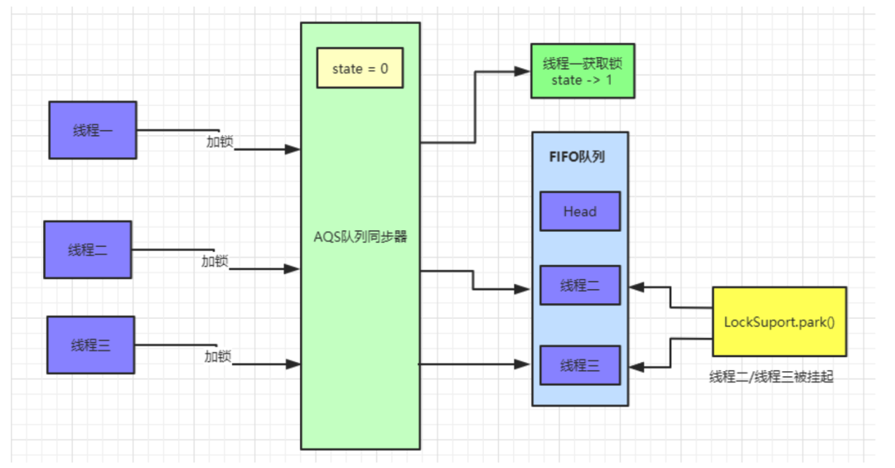

###   前言

谈到并发，我们不得不说`AQS(AbstractQueuedSynchronizer)`，所谓的`AQS`即是抽象的队列式的同步器，内部定义了很多锁相关的方法，我们熟知的`ReentrantLock`、`ReentrantReadWriteLock`、`CountDownLatch`、`Semaphore`等都是基于`AQS`来实现的。

我们先看下`AQS`相关的`UML`图：


###  **AQS实现原理**

`AQS`中 维护了一个`volatile int state`（代表共享资源）和一个`FIFO`线程等待队列（多线程争用资源被阻塞时会进入此队列）。

这里`volatile`能够保证多线程下的可见性，当`state=1`则代表当前对象锁已经被占有，其他线程来加锁时则会失败，加锁失败的线程会被放入一个`FIFO`的等待队列中，比列会被`UNSAFE.park()`操作挂起，等待其他获取锁的线程释放锁才能够被唤醒。

另外`state`的操作都是通过`CAS`来保证其并发修改的安全性。

具体原理我们可以用一张图来简单概括：

     

`AQS` 中提供了很多关于锁的实现方法，

- getState()：获取锁的标志state值
- setState()：设置锁的标志state值
- tryAcquire(int)：独占方式获取锁。尝试获取资源，成功则返回true，失败则返回false。
- tryRelease(int)：独占方式释放锁。尝试释放资源，成功则返回true，失败则返回false。

这里还有一些方法并没有列出来，接下来我们以`ReentrantLock`作为突破点通过源码和画图的形式一步步了解`AQS`内部实现原理。


###  **目录结构**

文章准备模拟多线程竞争锁、释放锁的场景来进行分析`AQS`源码：

**三个线程(线程一、线程二、线程三)同时来加锁/释放锁**

**目录如下：**

- **线程一**加锁成功时`AQS`内部实现
- **线程二/三**加锁失败时`AQS`中等待队列的数据模型
- **线程一**释放锁及**线程二**获取锁实现原理
- 通过线程场景来讲解**公平锁**具体实现原理
- 通过线程场景来讲解Condition中a`wait()`和`signal()`实现原理

这里会通过画图来分析每个线程加锁、释放锁后`AQS`内部的数据结构和实现原理


### **场景分析**

#### 线程一加锁成功

如果同时有**三个线程**并发抢占锁，此时**线程一**抢占锁成功，**线程二**和**线程三**抢占锁失败，具体执行流程如下：



此时`AQS`内部数据为：


**线程二**、**线程三**加锁失败：


有图可以看出，等待队列中的节点`Node`是一个双向链表，这里`SIGNAL`是`Node`中`waitStatus`属性，`Node`中还有一个`nextWaiter`属性，这个并未在图中画出来，这个到后面`Condition`会具体讲解的。

具体看下抢占锁代码实现：

```java
java.util.concurrent.locks.ReentrantLock .NonfairSync:
static final class NonfairSync extends Sync {
    
    final void lock() {
        if (compareAndSetState(0, 1))
            setExclusiveOwnerThread(Thread.currentThread());
        else
            acquire(1);
    }

    protected final boolean tryAcquire(int acquires) {
        return nonfairTryAcquire(acquires);
    }
}
```

这里使用的**ReentrantLock非公平锁**，线程进来直接利用`CAS`尝试抢占锁，如果抢占成功`state`值回被改为1，且设置对象独占锁线程为当前线程。如下所示：

```java
protected final boolean compareAndSetState(int expect, int update) {
    return unsafe.compareAndSwapInt(this, stateOffset, expect, update);
}

protected final void setExclusiveOwnerThread(Thread thread) {
    exclusiveOwnerThread = thread;
}
```

#### 线程二抢占锁失败

我们按照真实场景来分析，**线程一**抢占锁成功后，`state`变为1，**线程二**通过`CAS`修改`state`变量必然会失败。此时`AQS`中`FIFO`(First In First Out 先进先出)队列中数据如图所示：


我们将**线程二**执行的逻辑一步步拆解来看：

`java.util.concurrent.locks.AbstractQueuedSynchronizer.acquire()`:

```java
public final void acquire(int arg) {
    if (!tryAcquire(arg) &&
        acquireQueued(addWaiter(Node.EXCLUSIVE), arg))
        selfInterrupt();
}
```

先看看`tryAcquire()`的具体实现：`java.util.concurrent.locks.ReentrantLock .nonfairTryAcquire()`:

```java
final boolean nonfairTryAcquire(int acquires) {
    final Thread current = Thread.currentThread();
    int c = getState();
    if (c == 0) {
        if (compareAndSetState(0, acquires)) {
            setExclusiveOwnerThread(current);
            return true;
        }
    }
    else if (current == getExclusiveOwnerThread()) {
        int nextc = c + acquires;
        if (nextc < 0)
            throw new Error("Maximum lock count exceeded");
        setState(nextc);
        return true;
    }
    return false;
}
```

`nonfairTryAcquire()`方法中首先会获取`state`的值，如果不为0则说明当前对象的锁已经被其他线程所占有，接着判断占有锁的线程是否为当前线程，如果是则累加`state`值，这就是可重入锁的具体实现，累加`state`值，释放锁的时候也要依次递减`state`值。

如果`state`为0，则执行`CAS`操作，尝试更新`state`值为1，如果更新成功则代表当前线程加锁成功。

以**线程二**为例，因为**线程一**已经将`state`修改为1，所以**线程二**通过`CAS`修改`state`的值不会成功。加锁失败。

**线程二**执行`tryAcquire()`后会返回false，接着执行`addWaiter(Node.EXCLUSIVE)`逻辑，将自己加入到一个`FIFO`等待队列中，代码实现如下：

`java.util.concurrent.locks.AbstractQueuedSynchronizer.addWaiter()`:

```java
private Node addWaiter(Node mode) {    
    Node node = new Node(Thread.currentThread(), mode);
    Node pred = tail;
    if (pred != null) {
        node.prev = pred;
        if (compareAndSetTail(pred, node)) {
            pred.next = node;
            return node;
        }
    }
    enq(node);
    return node;
}
```

这段代码首先会创建一个和当前线程绑定的`Node`节点，`Node`为双向链表。此时等待对内中的`tail`指针为空，直接调用`enq(node)`方法将当前线程加入等待队列尾部：

```java
private Node enq(final Node node) {
    for (;;) {
        Node t = tail;
        if (t == null) {
            if (compareAndSetHead(new Node()))
                tail = head;
        } else {
            node.prev = t;
            if (compareAndSetTail(t, node)) {
                t.next = node;
                return t;
            }
        }
    }
}
```

第一遍循环时`tail`指针为空，进入if逻辑，使用`CAS`操作设置`head`指针，将`head`指向一个新创建的`Node`节点。此时`AQS`中数据：


执行完成之后，`head`、`tail`、`t`都指向第一个`Node`元素。

接着执行第二遍循环，进入`else`逻辑，此时已经有了`head`节点，这里要操作的就是将**线程二**对应的`Node`节点挂到`head`节点后面。此时队列中就有了两个`Node`节点：


`addWaiter()`方法执行完后，会返回当前线程创建的节点信息。继续往后执行`acquireQueued(addWaiter(Node.EXCLUSIVE), arg)`逻辑，此时传入的参数为**线程二**对应的`Node`节点信息：

`java.util.concurrent.locks.AbstractQueuedSynchronizer.acquireQueued()`:

```java
final boolean acquireQueued(final Node node, int arg) {
    boolean failed = true;
    try {
        boolean interrupted = false;
        for (;;) {
            final Node p = node.predecessor();
            if (p == head && tryAcquire(arg)) {
                setHead(node);
                p.next = null; // help GC
                failed = false;
                return interrupted;
            }
            if (shouldParkAfterFailedAcquire(p, node) &&
                parkAndChecknIterrupt())
                interrupted = true;
        }
    } finally {
        if (failed)
            cancelAcquire(node);
    }
}

private static boolean shouldParkAfterFailedAcquire(Node pred, Node node) {
    int ws = pred.waitStatus;
    if (ws == Node.SIGNAL)
        return true;
    if (ws > 0) {
        do {
            node.prev = pred = pred.prev;
        } while (pred.waitStatus > 0);
        pred.next = node;
    } else {
        compareAndSetWaitStatus(pred, ws, Node.SIGNAL);
    }
    return false;
}

private final boolean parkAndCheckInterrupt() {
    LockSupport.park(this);
    return Thread.interrupted();
}
```

`acquireQueued()`这个方法会先判断当前传入的`Node`对应的前置节点是否为`head`，如果是则尝试加锁。加锁成功过则将当前节点设置为`head`节点，然后空置之前的`head`节点，方便后续被垃圾回收掉。

如果加锁失败或者`Node`的前置节点不是`head`节点，就会通过`shouldParkAfterFailedAcquire`方法 将`head`节点的`waitStatus`变为了`SIGNAL=-1`，最后执行`parkAndChecknIterrupt`方法，调用`LockSupport.park()`挂起当前线程。

此时`AQS`中的数据如下图：


此时**线程二**就静静的待在`AQS`的等待队列里面了，等着其他线程释放锁来唤醒它。

#### 线程三抢占锁失败

看完了**线程二**抢占锁失败的分析，那么再来分析**线程三**抢占锁失败就很简单了，先看看`addWaiter(Node mode)`方法：

```java
private Node addWaiter(Node mode) {
    Node node = new Node(Thread.currentThread(), mode);
    Node pred = tail;
    if (pred != null) {
        node.prev = pred;
        if (compareAndSetTail(pred, node)) {
            pred.next = node;
            return node;
        }
    }
    enq(node);
    return node;
}
```

此时等待队列的`tail`节点指向**线程二**，进入`if`逻辑后，通过`CAS`指令将`tail`节点重新指向**线程三**。

接着**线程三**调用`enq()`方法执行入队操作，和上面**线程二**执行方式是一致的，入队后会修改**线程二**对应的`Node`中的`waitStatus=SIGNAL`。最后**线程三**也会被挂起。此时等待队列的数据如图：


#### 线程一释放锁

现在来分析下释放锁的过程，首先是**线程一**释放锁，释放锁后会唤醒`head`节点的后置节点，也就是我们现在的**线程二**，具体操作流程如下：


执行完后等待队列数据如下：


此时**线程二**已经被唤醒，继续尝试获取锁，如果获取锁失败，则会继续被挂起。如果获取锁成功，则`AQS`中数据如图：


接着还是一步步拆解来看，先看看**线程一**释放锁的代码：

```java
java.util.concurrent.locks.AbstractQueuedSynchronizer.release()
public final boolean release(int arg) {
    if (tryRelease(arg)) {
        Node h = head;
        if (h != null && h.waitStatus != 0)
            unparkSuccessor(h);
        return true;
    }
    return false;
}
```

这里首先会执行`tryRelease()`方法，这个方法具体实现在`ReentrantLock`中，如果`tryRelease`执行成功，则继续判断`head`节点的`waitStatus`是否为0

前面我们已经看到过，`head`的`waitStatue`为`SIGNAL(-1)`，这里就会执行`unparkSuccessor()`方法来唤醒`head`的后置节点，也就是我们上面图中**线程二**对应的`Node`节点。

此时看`ReentrantLock.tryRelease()`中的具体实现：

```java
protected final boolean tryRelease(int releases) {
    int c = getState() - releases;
    if (Thread.currentThread() != getExclusiveOwnerThread())
        throw new IllegalMonitorStateException();
    boolean free = false;
    if (c == 0) {
        free = true;
        setExclusiveOwnerThread(null);
    }
    setState(c);
    return free;
}
```

执行完`ReentrantLock.tryRelease()`后，`state`被设置成0，Lock对象的独占锁被设置为null。此时看下`AQS`中的数据：


接着执行`java.util.concurrent.locks.AbstractQueuedSynchronizer.unparkSuccessor()`方法，唤醒`head`的后置节点：

```java
private void unparkSuccessor(Node node) {
    int ws = node.waitStatus;
    if (ws < 0)
        compareAndSetWaitStatus(node, ws, 0);
    Node s = node.next;
    if (s == null || s.waitStatus > 0) {
        s = null;
        for (Node t = tail; t != null && t != node; t = t.prev)
            if (t.waitStatus <= 0)
                s = t;
    }
    if (s != null)
        LockSupport.unpark(s.thread);
}
```

这里主要是将`head`节点的`waitStatus`设置为0，然后解除`head`节点`next`的指向，使`head`节点空置，等待着被垃圾回收。

此时重新将`head`指针指向**线程二**对应的`Node`节点，且使用`LockSupport.unpark`方法来唤醒**线程二**。

被唤醒的**线程二**会接着尝试获取锁，用`CAS`指令修改`state`数据。执行完成后可以查看`AQS`中数据：


此时**线程二**被唤醒，**线程二**接着之前被`park`的地方继续执行，继续执行`acquireQueued()`方法。

#### 线程二唤醒继续加锁

```java
final boolean acquireQueued(final Node node, int arg) {
    boolean failed = true;
    try {
        boolean interrupted = false;
        for (;;) {
            final Node p = node.predecessor();
            if (p == head && tryAcquire(arg)) {
                setHead(node);
                p.next = null; // help GC
                failed = false;
                return interrupted;
            }
            if (shouldParkAfterFailedAcquire(p, node) &&
                parkAndCheckInterrupt())
                interrupted = true;
        }
    } finally {
        if (failed)
            cancelAcquire(node);
    }
}
```

此时**线程二**被唤醒，继续执行`for`循环，判断**线程二**的前置节点是否为`head`，如果是则继续使用`tryAcquire()`方法来尝试获取锁，其实就是使用`CAS`操作来修改`state`值，如果修改成功则代表获取锁成功。接着将**线程二**设置为`head`节点，然后空置之前的`head`节点数据，被空置的节点数据等着被**垃圾回收**。

此时线程三获取锁成功，`AQS`中队列数据如下：


等待队列中的数据都等待着被垃圾回收。

#### 线程二释放锁/线程三加锁

当**线程二**释放锁时，会唤醒被挂起的**线程三**，流程和上面大致相同，被唤醒的**线程三**会再次尝试加锁，具体代码可以参考上面内容。具体流程图如下：


此时`AQS`中队列数据如图：


### **公平锁实现原理**

上面所有的加锁场景都是基于**非公平锁**来实现的，**非公平锁**是`ReentrantLock`的默认实现，那我们接着来看一下**公平锁**的实现原理，这里先用一张图来解释**公平锁**和**非公平锁**的区别：


**非公平锁**执行流程：


这里我们还是用之前的线程模型来举例子，当**线程二**释放锁的时候，唤醒被挂起的**线程三**，**线程三**执行`tryAcquire()`方法使用`CAS`操作来尝试修改`state`值，如果此时又来了一个**线程四**也来执行加锁操作，同样会执行`tryAcquire()`方法。

这种情况就会出现竞争，**线程四**如果获取锁成功，**线程三**仍然需要待在等待队列中被挂起。这就是所谓的**非公平锁**，**线程三**辛辛苦苦排队等到自己获取锁，却眼巴巴的看到**线程四**插队获取到了锁。

**公平锁**执行流程：


公平锁在加锁的时候，会先判断`AQS`等待队列中是存在节点，如果存在节点则会直接入队等待，具体代码如下.

公平锁在获取锁是也是首先会执行`acquire()`方法，只不过公平锁单独实现了`tryAcquire()`方法：

`#java.util.concurrent.locks.AbstractQueuedSynchronizer.acquire()`:

```java
public final void acquire(int arg) {
    if (!tryAcquire(arg) &&
        acquireQueued(addWaiter(Node.EXCLUSIVE), arg))
        selfInterrupt();
}
```

这里会执行`ReentrantLock`中公平锁的`tryAcquire()`方法

`#java.util.concurrent.locks.ReentrantLock.FairSync.tryAcquire()`:

```java
static final class FairSync extends Sync {
    protected final boolean tryAcquire(int acquires) {
        final Thread current = Thread.currentThread();
        int c = getState();
        if (c == 0) {
            if (!hasQueuedPredecessors() &&
                compareAndSetState(0, acquires)) {
                setExclusiveOwnerThread(current);
                return true;
            }
        }
        else if (current == getExclusiveOwnerThread()) {
            int nextc = c + acquires;
            if (nextc < 0)
                throw new Error("Maximum lock count exceeded");
            setState(nextc);
            return true;
        }
        return false;
    }
}
```

这里会先判断`state`值，如果不为0且获取锁的线程不是当前线程，直接返回false代表获取锁失败，被加入等待队列。如果是当前线程则可重入获取锁。

如果`state=0`则代表此时没有线程持有锁，执行`hasQueuedPredecessors()`判断`AQS`等待队列中是否有元素存在，如果存在其他等待线程，那么自己也会加入到等待队列尾部，做到真正的先来后到，有序加锁。具体代码如下：

`#java.util.concurrent.locks.AbstractQueuedSynchronizer.hasQueuedPredecessors()`:

```java
public final boolean hasQueuedPredecessors() {
    Node t = tail;
    Node h = head;
    Node s;
    return h != t &&
        ((s = h.next) == null || s.thread != Thread.currentThread());
}
```

这段代码很有意思，返回`false`代表队列中没有节点或者仅有一个节点是当前线程创建的节点。返回`true`则代表队列中存在等待节点，当前线程需要入队等待。


先判断`head`是否等于`tail`，如果队列中只有一个`Node`节点，那么`head`会等于`tail`，接着判断`head`的后置节点，这里肯定会是`null`，如果此`Node`节点对应的线程和当前的线程是同一个线程，那么则会返回`false`，代表没有等待节点或者等待节点就是当前线程创建的`Node`节点。此时当前线程会尝试获取锁。

如果`head`和`tail`不相等，说明队列中有等待线程创建的节点，此时直接返回`true`，如果只有一个节点，而此节点的线程和当前线程不一致，也会返回`true`

**非公平锁**和**公平锁**的区别：**非公平锁**性能高于**公平锁**性能。**非公平锁**可以减少`CPU`唤醒线程的开销，整体的吞吐效率会高点，`CPU`也不必取唤醒所有线程，会减少唤起线程的数量

**非公平锁**性能虽然优于**公平锁**，但是会存在导致**线程饥饿**的情况。在最坏的情况下，可能存在某个线程**一直获取不到锁**。不过相比性能而言，饥饿问题可以暂时忽略，这可能就是`ReentrantLock`默认创建非公平锁的原因之一了。