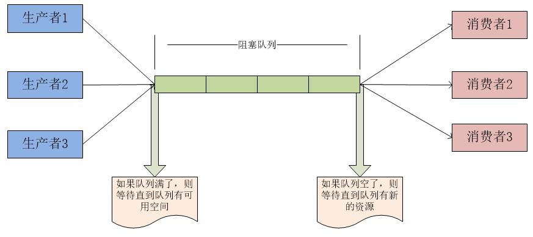
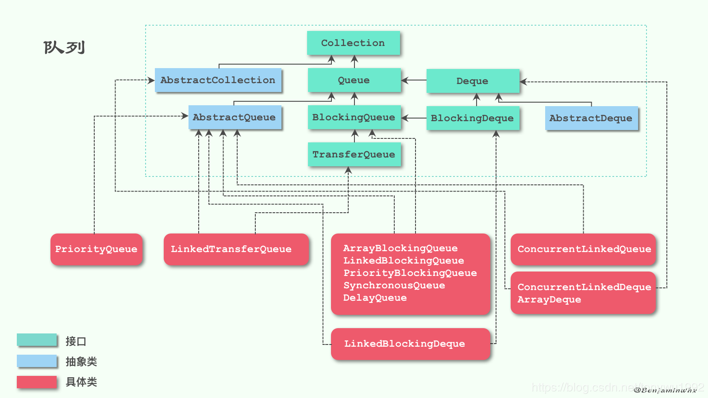
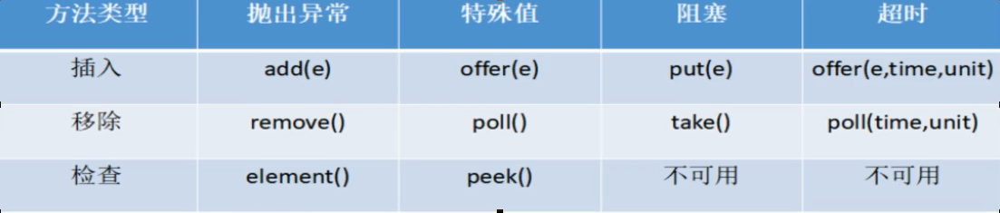
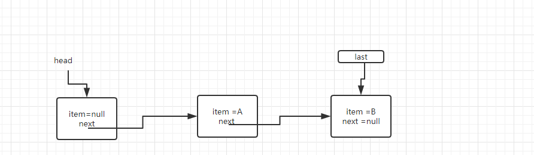
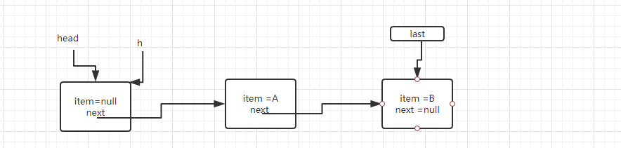
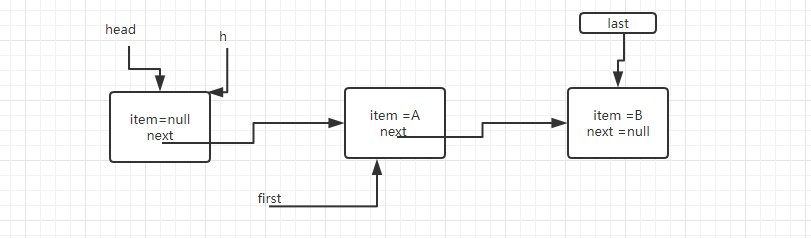
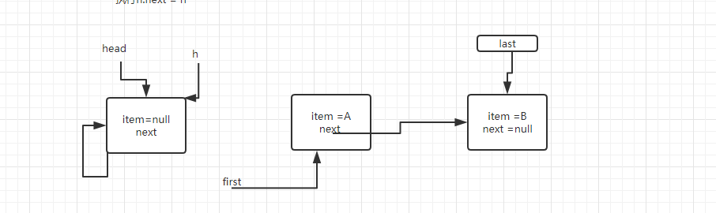
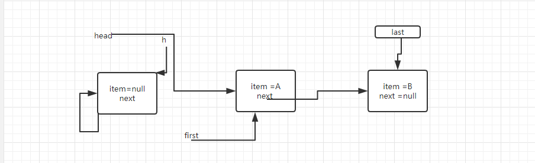
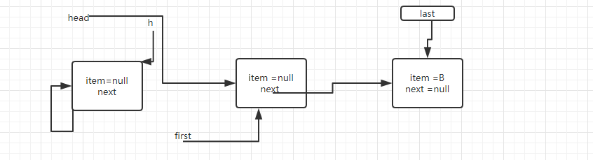

# BlockingQueue详解

阻塞队列，顾名思义，首先它是一个队列，而一个队列在数据结构中所起的作用大致如下图所示



- 当阻塞队列是空时,从队列中获取元素的操作将会被阻塞.
- 当阻塞队列是满时,往队列中添加元素的操作将会被阻塞.
  同样，试图往已满的阻塞队列中添加新元素的线程同样也会被阻塞,直到其他线程从队列中移除一个或者多个元素或者全清空队列后使队列重新变得空闲起来并后续新增.

多线程环境中，通过队列可以很容易实现**数据共享**，比如经典的“生产者”和“消费者”模型中，通过队列可以很便利地实现两者之间的数据共享。假设我们有若干生产者线程，另外又有若干个消费者线程。如果生产者线程需要把准备好的数据共享给消费者线程，利用队列的方式来传递数据，就可以很方便地解决他们之间的数据共享问题。但如果生产者和消费者在某个时间段内，万一发生数据处理速度不匹配的情况呢？理想情况下，如果生产者产出数据的速度大于消费者消费的速度，并且当生产出来的数据累积到一定程度的时候，那么生产者必须暂停等待一下（阻塞生产者线程），以便等待消费者线程把累积的数据处理完毕，反之亦然。然而，在concurrent包发布以前，**在多线程环境下，我们每个程序员都必须去自己控制这些细节，尤其还要兼顾效率和线程安全，而这会给我们的程序带来不小的复杂度**。好在此时，强大的concurrent包横空出世了，而他也给我们带来了强大的BlockingQueue。（在多线程领域：所谓阻塞，在某些情况下会挂起线程（即阻塞），一旦条件满足，被挂起的线程又会自动被唤醒）

# BlockingQueue继承图



# BlockingQueue核心方法



| 抛出异常 | 当阻塞队列满时,再往队列里面add插入元素会抛IllegalStateException: Queue full<br/>当阻塞队列空时,再往队列Remove元素时候回抛出NoSuchElementException |
| -------- | ------------------------------------------------------------ |
| 特殊值   | 插入方法,成功返回true 失败返回false，移除方法,成功返回元素,队列里面没有就返回null |
| 一直阻塞 | 当阻塞队列满时,生产者继续往队列里面put元素,队列会一直阻塞直到put数据or响应中断退出<br/>当阻塞队列空时,消费者试图从队列take元素,队列会一直阻塞消费者线程直到队列可用. |
| 超时退出 | 当阻塞队列满时,队列会阻塞生产者线程一定时间,超过后限时后生产者线程就会退出 |

# BlockingQueue的实现

### ArrayBlockingQueue

​    基于数组的阻塞队列实现，在ArrayBlockingQueue内部，维护了一个定长数组，以便缓存队列中的数据对象，这是一个常用的阻塞队列，除了一个定长数组外，ArrayBlockingQueue内部还保存着两个整形变量，分别标识着队列的头部和尾部在数组中的位置。
　　ArrayBlockingQueue在生产者放入数据和消费者获取数据，都是共用同一个锁对象，由此也意味着两者无法真正并行运行，这点尤其不同于LinkedBlockingQueue；按照实现原理来分析，ArrayBlockingQueue完全可以采用分离锁，从而实现生产者和消费者操作的完全并行运行。Doug Lea之所以没这样去做，也许是因为ArrayBlockingQueue的数据写入和获取操作已经足够轻巧，以至于引入独立的锁机制，除了给代码带来额外的复杂性外，其在性能上完全占不到任何便宜。 ArrayBlockingQueue和LinkedBlockingQueue间还有一个明显的不同之处在于，前者在插入或删除元素时不会产生或销毁任何额外的对象实例，而后者则会生成一个额外的Node对象。这在长时间内需要高效并发地处理大批量数据的系统中，其对于GC的影响还是存在一定的区别。而在创建ArrayBlockingQueue时，我们还可以控制对象的内部锁是否采用公平锁，默认采用非公平锁。

### **LinkedBlockingQueue**

基于链表的阻塞队列，同ArrayListBlockingQueue类似，其内部也维持着一个数据缓冲队列（该队列由一个链表构成），当生产者往队列中放入一个数据时，队列会从生产者手中获取数据，并缓存在队列内部，而生产者立即返回；只有当队列缓冲区达到最大值缓存容量时（LinkedBlockingQueue可以通过构造函数指定该值），才会阻塞生产者队列，直到消费者从队列中消费掉一份数据，生产者线程会被唤醒，反之对于消费者这端的处理也基于同样的原理。而LinkedBlockingQueue之所以能够高效的处理并发数据，还因为其对于生产者端和消费者端分别采用了独立的锁来控制数据同步，这也意味着在高并发的情况下生产者和消费者可以并行地操作队列中的数据，以此来提高整个队列的并发性能。
作为开发者，我们需要注意的是，如果构造一个LinkedBlockingQueue对象，而没有指定其容量大小，LinkedBlockingQueue会默认一个类似无限大小的容量（Integer.MAX_VALUE），这样的话，如果生产者的速度一旦大于消费者的速度，也许还没有等到队列满阻塞产生，系统内存就有可能已被消耗殆尽了。

### **DelayQueue**

​    DelayQueue中的元素只有当其指定的延迟时间到了，才能够从队列中获取到该元素。DelayQueue是一个没有大小限制的队列，因此往队列中插入数据的操作（生产者）永远不会被阻塞，而只有获取数据的操作（消费者）才会被阻塞。
使用场景：
　　DelayQueue使用场景较少，但都相当巧妙，常见的例子比如使用一个DelayQueue来管理一个超时未响应的连接队列。

### **PriorityBlockingQueue**

​    基于优先级的阻塞队列（优先级的判断通过构造函数传入的Compator对象来决定），但需要注意的是PriorityBlockingQueue并不会阻塞数据生产者，而只会在没有可消费的数据时，阻塞数据的消费者。因此使用的时候要特别注意，生产者生产数据的速度绝对不能快于消费者消费数据的速度，否则时间一长，会最终耗尽所有的可用堆内存空间。在实现PriorityBlockingQueue时，内部控制线程同步的锁采用的是公平锁。

### **SynchronousQueue**

​    一种无缓冲的等待队列，类似于无中介的直接交易，有点像原始社会中的生产者和消费者，生产者拿着产品去集市销售给产品的最终消费者，而消费者必须亲自去集市找到所要商品的直接生产者，如果一方没有找到合适的目标，那么对不起，大家都在集市等待。相对于有缓冲的BlockingQueue来说，少了一个中间经销商的环节（缓冲区），如果有经销商，生产者直接把产品批发给经销商，而无需在意经销商最终会将这些产品卖给那些消费者，由于经销商可以库存一部分商品，因此相对于直接交易模式，总体来说采用中间经销商的模式会吞吐量高一些（可以批量买卖）；但另一方面，又因为经销商的引入，使得产品从生产者到消费者中间增加了额外的交易环节，单个产品的及时响应性能可能会降低。
　　声明一个SynchronousQueue有两种不同的方式，它们之间有着不太一样的行为。公平模式和非公平模式的区别:
　　如果采用公平模式：SynchronousQueue会采用公平锁，并配合一个FIFO队列来阻塞多余的生产者和消费者，从而体系整体的公平策略；
　　但如果是非公平模式（SynchronousQueue默认）：SynchronousQueue采用非公平锁，同时配合一个LIFO队列来管理多余的生产者和消费者，而后一种模式，如果生产者和消费者的处理速度有差距，则很容易出现饥渴的情况，即可能有某些生产者或者是消费者的数据永远都得不到处理。

# 源码分析

接下来我们通过介绍LinkedBlockingQueue的源码，来分析Blockingqueue的原理。

## 成员变量

```java
public class LinkedBlockingQueue<E> extends AbstractQueue<E>
    implements BlockingQueue<E>, java.io.Serializable {
    private static final long serialVersionUID = -6903933977591709194L;
    /**
     * Linked list node class
     * 使用Node的内部类来作为队列的每一个节点
     */
    static class Node<E> {
        E item;

        /**
         * One of:
         * - the real successor Node
         * - this Node, meaning the successor is head.next
         * - null, meaning there is no successor (this is the last node)
         */
        Node<E> next;

        Node(E x) { item = x; }
    }

    /** The capacity bound, or Integer.MAX_VALUE if none */
    //默认是Integer.MAX_VALUE，支持构造函数传入容量
    private final int capacity;

    /** Current number of elements */
    //使用原子类来保证队列中元素的数量安全
    private final AtomicInteger count = new AtomicInteger();

    /**
     * Head of linked list.
     * Invariant: head.item == null
     队列首节点指针
     */
    transient Node<E> head;

    /**
     * Tail of linked list.
     * Invariant: last.next == null
     队列尾结点指针
     */
    private transient Node<E> last;

    /** Lock held by take, poll, etc */
    private final ReentrantLock takeLock = new ReentrantLock();

    /** Wait queue for waiting takes */
    private final Condition notEmpty = takeLock.newCondition();

    /** Lock held by put, offer, etc */
    private final ReentrantLock putLock = new ReentrantLock();

    /** Wait queue for waiting puts */
    private final Condition notFull = putLock.newCondition();
```

可以看到LinkedBlockingQueue使用putlock，takeLock两把锁来实现生产和消费线程的并发操作，相比于ArrayBlockingQueue的一把锁，并发时的吞吐量得到了有效的提高。

## put方法

```java
public void put(E e) throws InterruptedException {
    if (e == null) throw new NullPointerException();
    // Note: convention in all put/take/etc is to preset local var
    // holding count negative to indicate failure unless set.
    int c = -1;
    Node<E> node = new Node<E>(e);
    final ReentrantLock putLock = this.putLock;
    final AtomicInteger count = this.count;
    putLock.lockInterruptibly();
    try {
        /*
         * Note that count is used in wait guard even though it is
         * not protected by lock. This works because count can
         * only decrease at this point (all other puts are shut
         * out by lock), and we (or some other waiting put) are
         * signalled if it ever changes from capacity. Similarly
         * for all other uses of count in other wait guards.
         */
        //队列已满，则阻塞
        while (count.get() == capacity) {
            notFull.await();
        }
        //入队列,修改last指针的位置，并将最后一个节点的next指向 新的节点
        enqueue(node);
        //原子性的修改元素数量，返回修改前的值
        c = count.getAndIncrement();
        if (c + 1 < capacity) //说明队列没满。唤醒生产者继续生产
            notFull.signal();
    } finally {
        putLock.unlock();
    }
    //c==0 ：表示原来的队列中为空，put操作之后，唤醒消费者来消费
    if (c == 0)
        signalNotEmpty();
}
```

```java
private void enqueue(Node<E> node) {
    // assert putLock.isHeldByCurrentThread();
    // assert last.next == null;
    last = last.next = node;
}
```

## signalNotEmpty方法

```java
private void signalNotEmpty() {
    final ReentrantLock takeLock = this.takeLock;
    takeLock.lock();
    try {
        notEmpty.signal();
    } finally {
        takeLock.unlock();
    }
}
```

可以看到先获取takeLock，然后再唤醒消费者来消费。

为什么要先获取🔒？因为signal时会先判断 你是否持有🔒，如果没有会抛出IllegalMonitorStateException。

## take方法

```java
public E take() throws InterruptedException {
    E x;
    int c = -1;
    final AtomicInteger count = this.count;
    final ReentrantLock takeLock = this.takeLock;
    takeLock.lockInterruptibly();
    try {
        //等于0 表示队列没有元素，消费者需要阻塞
        while (count.get() == 0) {
            notEmpty.await();
        }
        //出列
        x = dequeue();
        //获取出列前的队列中的元素，并减一
        c = count.getAndDecrement();
        //队列中还有元素，则继续唤醒消费者，去消费
        if (c > 1)
            notEmpty.signal();
    } finally {
        takeLock.unlock();
    }
    //唤醒生产者来生产
    if (c == capacity)
        signalNotFull();
    return x;
}
```

```java
private void signalNotFull() {
    final ReentrantLock putLock = this.putLock;
    putLock.lock();
    try {
        notFull.signal();
    } finally {
        putLock.unlock();
    }
}
```

可以看到put和take的流程基本上时类似的。dequeue的方法比较难以理解，所以我画了如下的图来帮助理解

```java
private E dequeue() {
    // assert takeLock.isHeldByCurrentThread();
    // assert head.item == null;
    Node<E> h = head;
    Node<E> first = h.next;
    h.next = h; // help GC
    head = first;
    E x = first.item;
    first.item = null;
    return x;
}
```

1)  假设队列中现在有两个元素



2）执行Node<E> h = head;



3）执行Node<E> first = h.next;



4）执行 h.next = h; // help GC



5）执行  head = first;



6）执行  E x = first.item;     first.item = null;



## 总结

clear方法和iterator方法都加了两把锁，这里就不详细分析了。通过源码，我们可以知道LinkedBlockingQueue底层使用链表的数据结构来保存元素，**当容器中没有元素时，会有一个元素为空的节点**。为什么要设计这样呢，我觉得跟LinkedBlockingQueue的设计有关，我们知道LinkedBlockingQueue生产和消费各有一把锁，这样做是为了提高并发时的吞吐量。在这种情况下，生产者和消费者会同时操作队列，我一开始的想法是，同时操作队列，会有并发安全问题。通过源码我们可以看到，dequeue时操作的first指针，enqueue时操作的是last指针，这样的话，就能互相不干扰了。

```java
public LinkedBlockingQueue(int capacity) {
    if (capacity <= 0) throw new IllegalArgumentException();
    this.capacity = capacity;
    last = head = new Node<E>(null);
}
```

让我们来分析这样一种情况，**当容器中没有元素时，没有元素为空的节点**。假设这时元素数量为1时，那么first和last节点指向的都是第一个节点，此时put和take操作同时进行了，假设此时take的操作进行的比较快，put的操作较慢。这时last = last.next = node; last指向了null 可能会抛空指针异常。因为put要修改前一个节点的指针，take要修改head的指针，并删除一个元素。**当容器中没有元素时，会有一个元素为空的节点**时，不会造成这种情况