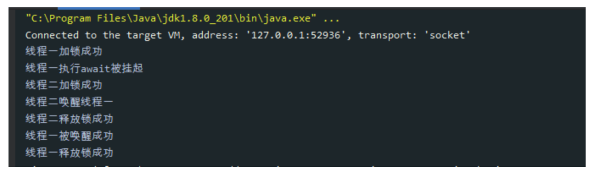
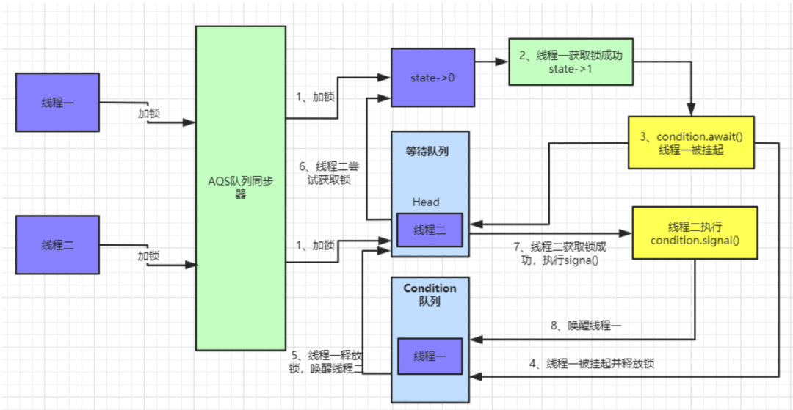
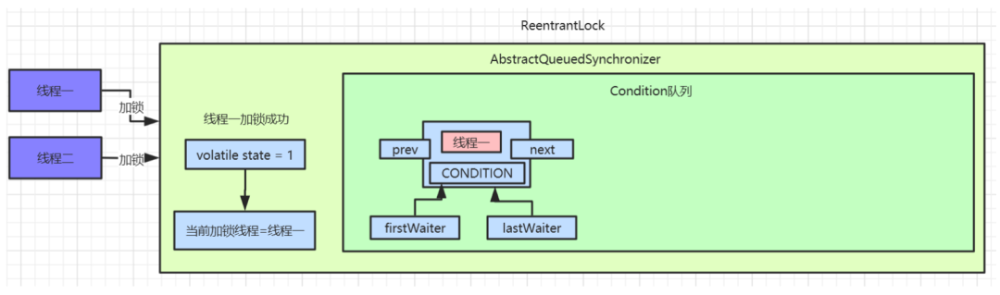
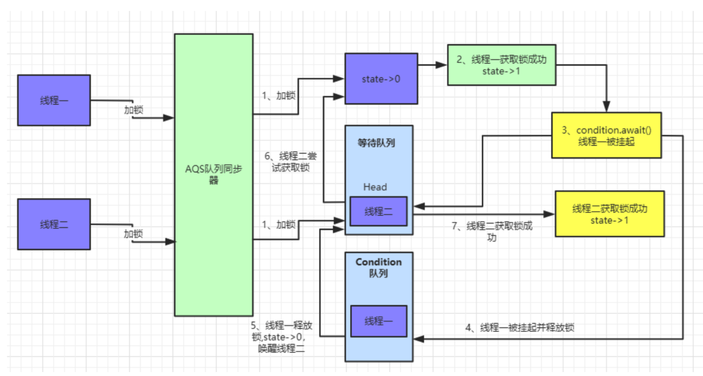
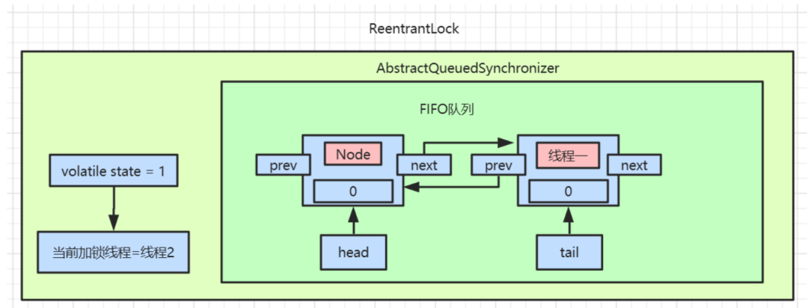
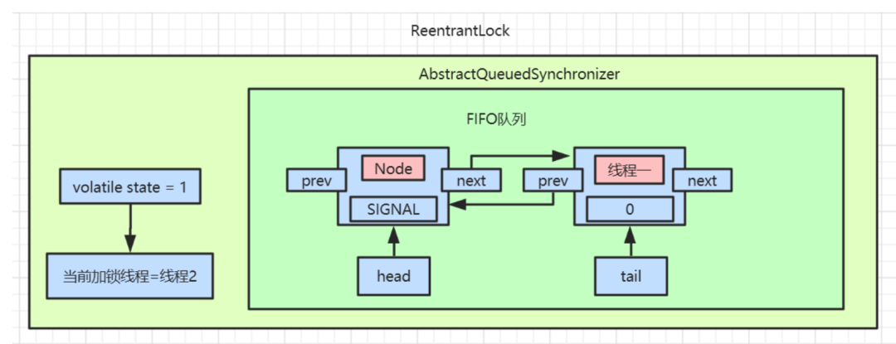

### **Condition 简介**

上面已经介绍了`AQS`所提供的核心功能，当然它还有很多其他的特性，这里我们来继续说下`Condition`这个组件。

```
Condition`是在`java 1.5`中才出现的，它用来替代传统的`Object`的`wait()`、`notify()`实现线程间的协作，相比使用`Object`的`wait()`、`notify()`，使用`Condition`中的`await()`、`signal()`这种方式实现线程间协作更加安全和高效。因此通常来说比较推荐使用`Condition
```

其中`AbstractQueueSynchronizer`中实现了`Condition`中的方法，主要对外提供`awaite(Object.wait())`和`signal(Object.notify())`调用。

#### Condition Demo示例

使用示例代码：

```java
public class ReentrantLockDemo {
    static ReentrantLock lock = new ReentrantLock();

    public static void main(String[] args) {
        Condition condition = lock.newCondition();

        new Thread(() -> {
            lock.lock();
            try {
                System.out.println("线程一加锁成功");
                System.out.println("线程一执行await被挂起");
                condition.await();
                System.out.println("线程一被唤醒成功");
            } catch (Exception e) {
                e.printStackTrace();
            } finally {
                lock.unlock();
                System.out.println("线程一释放锁成功");
            }
        }).start();

        new Thread(() -> {
            lock.lock();
            try {
                System.out.println("线程二加锁成功");
                condition.signal();
                System.out.println("线程二唤醒线程一");
            } finally {
                lock.unlock();
                System.out.println("线程二释放锁成功");
            }
        }).start();
    }
}
```

执行结果如下图：



这里**线程一**先获取锁，然后使用`await()`方法挂起当前线程并**释放锁**，**线程二**获取锁后使用`signal`唤醒**线程一**。

#### Condition实现原理图解

我们还是用上面的`demo`作为实例，执行的流程如下：



**线程一**执行`await()`方法：

先看下具体的代码实现，`#java.util.concurrent.locks.AbstractQueuedSynchronizer.ConditionObject.await()`：

```java
 public final void await() throws InterruptedException {
    if (Thread.interrupted())
        throw new InterruptedException();
    Node node = addConditionWaiter();
    int savedState = fullyRelease(node);
    int interruptMode = 0;
    while (!isOnSyncQueue(node)) {
        LockSupport.park(this);
        if ((interruptMode = checkInterruptWhileWaiting(node)) != 0)
            break;
    }
    if (acquireQueued(node, savedState) && interruptMode != THROW_IE)
        interruptMode = REINTERRUPT;
    if (node.nextWaiter != null) // clean up if cancelled
        unlinkCancelledWaiters();
    if (interruptMode != 0)
        reportInterruptAfterWait(interruptMode);
}
```

`await()`方法中首先调用`addConditionWaiter()`将当前线程加入到`Condition`队列中。

执行完后我们可以看下`Condition`队列中的数据：



具体实现代码为：

```java
private Node addConditionWaiter() {
    Node t = lastWaiter;
    if (t != null && t.waitStatus != Node.CONDITION) {
        unlinkCancelledWaiters();
        t = lastWaiter;
    }
    Node node = new Node(Thread.currentThread(), Node.CONDITION);
    if (t == null)
        firstWaiter = node;
    else
        t.nextWaiter = node;
    lastWaiter = node;
    return node;
}
```

这里会用当前线程创建一个`Node`节点，`waitStatus`为`CONDITION`。接着会释放该节点的锁，调用之前解析过的`release()`方法，释放锁后此时会唤醒被挂起的**线程二**，**线程二**会继续尝试获取锁。

接着调用`isOnSyncQueue()`方法判断当前节点是否为`Condition`队列中的头部节点，如果是则调用`LockSupport.park(this)`挂起`Condition`中当前线程。此时**线程一**被挂起，**线程二**获取锁成功。

具体流程如下图：



**线程二**执行`signal()`方法：

首先我们考虑下**线程二**已经获取到锁，此时`AQS`等待队列中已经没有了数据。

接着就来看看**线程二**唤醒**线程一**的具体执行流程：

```java
public final void signal() {
    if (!isHeldExclusively())
        throw new IllegalMonitorStateException();
    Node first = firstWaiter;
    if (first != null)
        doSignal(first);
}
```

先判断当前线程是否为获取锁的线程，如果不是则直接抛出异常。接着调用`doSignal()`方法来唤醒线程。

```java
private void doSignal(Node first) {
    do {
        if ( (firstWaiter = first.nextWaiter) == null)
            lastWaiter = null;
        first.nextWaiter = null;
    } while (!transferForSignal(first) &&
             (first = firstWaiter) != null);
}

final boolean transferForSignal(Node node) {
    if (!compareAndSetWaitStatus(node, Node.CONDITION, 0))
        return false;

    Node p = enq(node);
    int ws = p.waitStatus;
    if (ws > 0 || !compareAndSetWaitStatus(p, ws, Node.SIGNAL))
        LockSupport.unpark(node.thread);
    return true;
}

/**
 * Inserts node into queue, initializing if necessary. See picture above.
 * @param node the node to insert
 * @return node's predecessor
 */
private Node enq(final Node node) {
    for (;;) {
        Node t = tail;
        if (t == null) { // Must initialize
            if (compareAndSetHead(new Node()))
                tail = head;
        } else {
            node.prev = t;
            if (compareAndSetTail(t, node)) {
                t.next = node;
                return t;
            }
        }
    }
}
```

这里先从`transferForSignal()`方法来看，通过上面的分析我们知道`Condition`队列中只有线程一创建的一个`Node`节点，且`waitStatue`为`CONDITION`，先通过`CAS`修改当前节点`waitStatus`为0，然后执行`enq()`方法将当前线程加入到等待队列中，并返回当前线程的前置节点。

加入等待队列的代码在上面也已经分析过，此时等待队列中数据如下图：



接着开始通过`CAS`修改当前节点的前置节点`waitStatus`为`SIGNAL`，并且唤醒当前线程。此时`AQS`中等待队列数据为：



**线程一**被唤醒后，继续执行`await()`方法中的 while 循环。

```java
public final void await() throws InterruptedException {
    if (Thread.interrupted())
        throw new InterruptedException();
    Node node = addConditionWaiter();
    int savedState = fullyRelease(node);
    int interruptMode = 0;
    while (!isOnSyncQueue(node)) {
        LockSupport.park(this);
        if ((interruptMode = checkInterruptWhileWaiting(node)) != 0)
            break;
    }
    if (acquireQueued(node, savedState) && interruptMode != THROW_IE)
        interruptMode = REINTERRUPT;
    if (node.nextWaiter != null) // clean up if cancelled
        unlinkCancelledWaiters();
    if (interruptMode != 0)
        reportInterruptAfterWait(interruptMode);
}
```

因为此时线程一的`waitStatus`已经被修改为0，所以执行`isOnSyncQueue()`方法会返回`false`。跳出`while`循环。

接着执行`acquireQueued()`方法，这里之前也有讲过，尝试重新获取锁，如果获取锁失败继续会被挂起。直到另外线程释放锁才被唤醒。

```java
final boolean acquireQueued(final Node node, int arg) {
    boolean failed = true;
    try {
        boolean interrupted = false;
        for (;;) {
            final Node p = node.predecessor();
            if (p == head && tryAcquire(arg)) {
                setHead(node);
                p.next = null; // help GC
                failed = false;
                return interrupted;
            }
            if (shouldParkAfterFailedAcquire(p, node) &&
                parkAndCheckInterrupt())
                interrupted = true;
        }
    } finally {
        if (failed)
            cancelAcquire(node);
    }
}
```

此时**线程一**的流程都已经分析完了，等**线程二**释放锁后，**线程一**会继续重试获取锁，流程到此终结。

#### Condition总结

我们总结下 Condition 和 wait/notify 的比较：

- Condition 可以精准的对多个不同条件进行控制，wait/notify 只能和 synchronized 关键字一起使用，并且只能唤醒一个或者全部的等待队列；
- Condition 需要使用 Lock 进行控制，使用的时候要注意 lock() 后及时的 unlock()，Condition 有类似于 await 的机制，因此不会产生加锁方式而产生的死锁出现，同时底层实现的是 park/unpark 的机制，因此也不会产生先唤醒再挂起的死锁，一句话就是不会产生死锁，但是 wait/notify 会产生先唤醒再挂起的死锁。