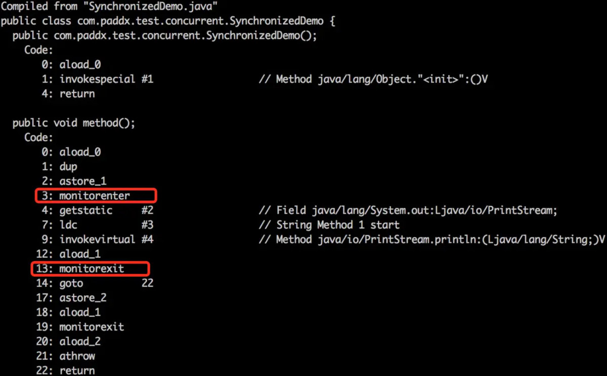
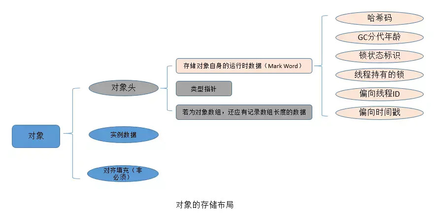
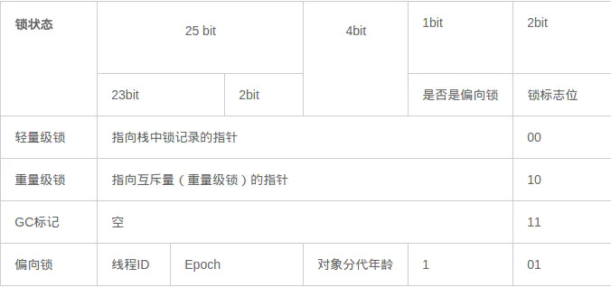
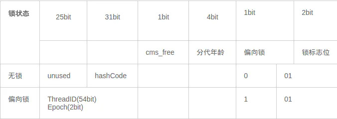
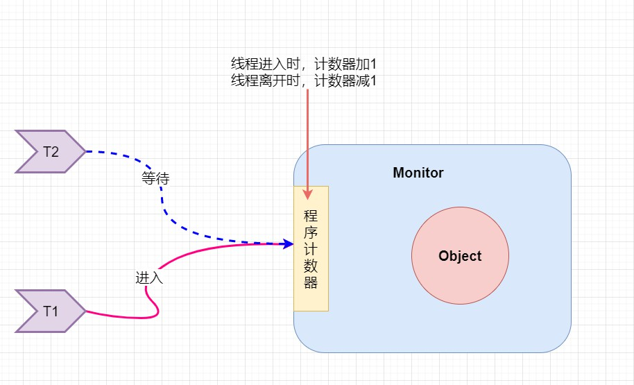
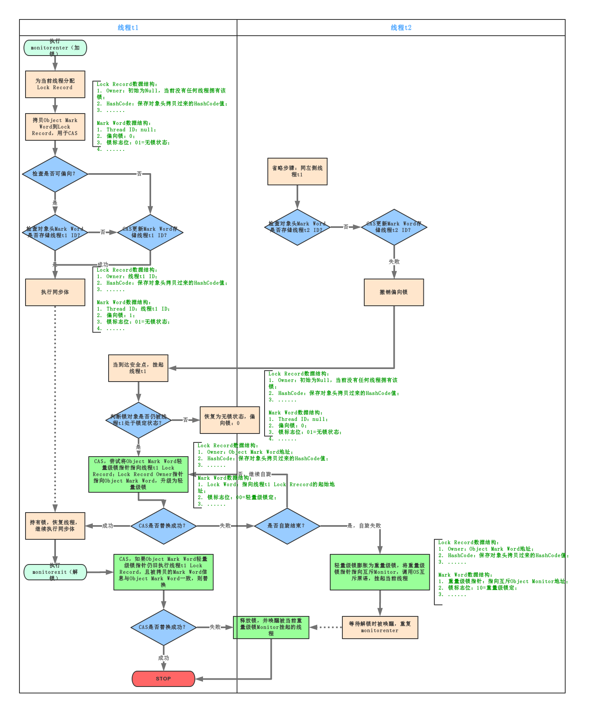

### sychronized底层是如何实现同步机制的

​		从语法角度来说，sychronized语义为可以将一切不为null的对象作为锁，从而实现同步机制（可见性，原子性，有序性），在HotSpot JVM实现中，锁有个专门的名字：**对象监视器（Object Monitor）**每一个非空的java对象都有一个monitor对象与之关联。如果我们去反编译一段被sychronized修饰的代码片段，我们会发现sychronized似乎是使用了一个monitor对象来控制同步代码的入口和出口



**Synchronized总共有三种用法**：

> * 当synchronized作用在实例方法时，**监视器锁（monitor）便是对象实例（this）**；
>
> * 当synchronized作用在静态方法时，**监视器锁（monitor）便是对象的Class实例**，因为Class数据存在于永久代，**因此静态方法锁相当于该类的一个全局锁**；
>
> * 当synchronized作用在某一个对象实例时，**监视器锁（monitor）便是括号括起来的对象实例**；

至于**Monitor**对象是如何工作了，我们放在下个问题进行探讨


### 如何获取对象的锁，请解释“锁”的概念

​		锁这个概念是一个抽象的概念，在这里我们可以理解为对象的一种状态，在JVM中，对象的存储状态可以分为三个部分：对象头，实例数据，对齐填充，我们的重点是**对象头**。



> 对象头信息是与对象自身定义的数据无关的额外存储成本，但是考虑到虚拟机的空间效率，**Mark Word被设计成一个非固定的数据结构以便在极小的空间内存存储尽量多的数据，它会根据对象的状态复用自己的存储空间**，也就是说，**Mark Word会随着程序的运行发生变化，(32位)可能变化为存储以下4种数据**：



在64位虚拟机下，**Mark Word是64bit大小的**，其存储结构如下：



> 对象头的最后两位存储了锁的标志位，**01是初始状态，未加锁**，其对象头里存储的是对象本身的哈希码，随着锁级别的不同，对象头里会存储不同的内容。**偏向锁存储的是当前占用此对象的线程ID**；**而轻量级则存储指向线程栈中锁记录的指针**。从这里我们可以看到，“锁”这个东西，**可能是个锁记录+对象头里的引用指针**（判断线程是否拥有锁时将线程的锁记录地址和对象头里的指针地址比较)，**也可能是对象头里的线程ID**（判断线程是否拥有锁时将线程的ID和对象头里存储的线程ID比较）。


### sychronized是如何实现可重入锁的

​		从之前的几个问题中我们已经得知，每一个非null的java对象都有一个**monitor**对象与之关联，这在并发环境下，monitor对象就像是一个安检门，当线程进入同步方法的时候，每一次安检门，领取一个临时证件，线程离开同步方法的时候归还临时证件，同时再过一遍安检门，如下图所示




### sychronized是如何实现可重入锁的

​		如果能了解Monitor对象的结构，那么我们对于同步就会有更清晰的认识，以下是Monitor对象的结构，等待进入同步方法的线程会进入EntryList进行等待，当线程获取到对象的monitor后，首先查询计数器的值，如果为0那么代表当前对象是可以加锁的状态，首先owner会记录当前的线程，接着Monitor将count计数器+1，当线程再次遇到同步代码时，先判断该同步方法需要加锁的对象是否是当前持有的对象，如果是，那count计数器继续+1，同理线程离开同步方法时，count计数器依次-1，最终置为0，owner重新设置为null，对象回到了可以被加锁的状态，从而实现了可重入锁的流程。

```c++
ObjectMonitor() {
    _header       = NULL;
    _count        = 0; // 记录个数
    _waiters      = 0,
    _recursions   = 0;
    _object       = NULL;
    _owner        = NULL; //记录当前线程
    _WaitSet      = NULL; // 处于wait状态的线程，会被加入到_WaitSet
    _WaitSetLock  = 0 ;
    _Responsible  = NULL ;
    _succ         = NULL ;
    _cxq          = NULL ;
    FreeNext      = NULL ;
    _EntryList    = NULL ; // 处于等待锁block状态的线程，会被加入到该列表
    _SpinFreq     = 0 ;
    _SpinClock    = 0 ;
    OwnerIsThread = 0 ;
  }
```


### Jvm对java原生锁做了哪些优化


#### CAS自旋

synchronized的等待策略从原来的阻塞变为了进行CAS自旋不断的请求锁


#### 锁消除

> 为了保证数据的完整性，在进行操作时需要对这部分操作进行同步控制，**但是在有些情况下，JVM检测到不可能存在共享数据竞争，这是JVM会对这些同步锁进行锁消除。**

**锁消除的依据是逃逸分析的数据支持** 分析以下代码

```java
public void vectorTest(){
    Vector<String> vector = new Vector<String>();
    for(int i = 0 ; i < 10 ; i++){
        vector.add(i + "");
    }
    System.out.println(vector);
}
```


#### 锁粗化

> **锁粗话概念比较好理解，就是将多个连续的加锁、解锁操作连接在一起，扩展成一个范围更大的锁**


#### 偏向锁

偏向锁是JDK6中的重要引进，因为HotSpot作者经过研究实践发现，**在大多数情况下，锁不仅不存在多线程竞争，而且总是由同一线程多次获得**，为了让线程获得锁的代价更低，引进了偏向锁。

**偏向锁是在单线程执行代码块时使用的机制**，如果在多线程并发的环境下（即线程A尚未执行完同步代码块，线程B发起了申请锁的申请），则一定会转化为轻量级锁或者重量级锁。<font color='red'>单线程</font>

**在JDK5中偏向锁默认是关闭的，而到了JDK6中偏向锁已经默认开启**。如果并发数较大同时同步代码块执行时间较长，则被多个线程同时访问的概率就很大，就可以使用参数-XX:-UseBiasedLocking来禁止偏向锁(但这是个JVM参数，不能针对某个对象锁来单独设置)。

引入偏向锁主要目的是：**为了在没有多线程竞争的情况下尽量减少不必要的轻量级锁执行路径**。因为轻量级锁的加锁解锁操作是需要依赖多次CAS原子指令的，**而偏向锁只需要在置换ThreadID的时候依赖一次CAS原子指令**（由于一旦出现多线程竞争的情况就必须撤销偏向锁，所以偏向锁的撤销操作的性能损耗也必须小于节省下来的CAS原子指令的性能消耗）。

> **轻量级锁是为了在线程交替执行同步块时提高性能，而偏向锁则是在只有一个线程执行同步块时进一步提高性能。**


#### 轻量级锁 

> 引入轻量级锁的主要目的是 **在没有多线程竞争的前提下，减少传统的重量级锁使用操作系统互斥量产生的性能消耗**。当关闭偏向锁功能或者多个线程竞争偏向锁导致偏向锁升级为轻量级锁，则会尝试获取轻量级锁


### 锁状态的互相转换（锁膨胀，锁升级）

