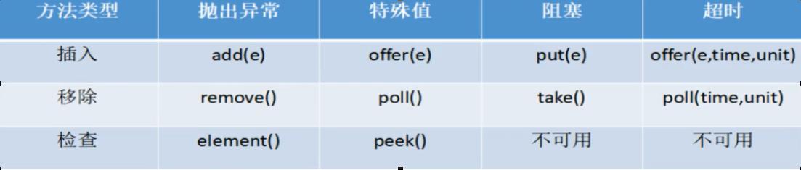

抛出异常

# 线程

## 程序，进程，线程

- 程序：含有指令和数据的文件，被存储在磁盘或其他的数据存储设备中，也就是说程序是**静态**的代码。
- 进程：程序的一次执行过程，是系统运行程序的基本单位，因此进程是**动态**的。系统运行一个程序就是一个进程从创建、运行到消亡的过程。简单来说，一个进程就是一个执行中的程序，它在计算机中一个指令接着一个指令执行着，同时，每个进程还占有某些系统资源如CPU时间，内存空间，文件，输入输出设备的使用权等。
- 线程：个进程在其执行的过程中可以产生多个线程。与进程不同的是同类的多个线程共享同一块内存空间和一组系统资源，所以系统在产生一个线程，或是在各个线程之间作切换工作时，负担要比进程小得多，也正因为如此，线程也被称为轻量级进程。

线程上下文的切换比进程上下文的切换快得多，进程切换时，涉及到当前进程的CPU环境的保存和新被调度运行进程的CPU环境的设置。线程切换仅需要保存和设置少量的寄存器内容，不涉及存储管理方面的操作。

## 线程的几种状态

通过Thread的源码可以看到线程一共有六种状态

```java
/**
     * A thread state.  A thread can be in one of the following states:
     * <ul>
     * <li>{@link #NEW}<br> 
     *     A thread that has not yet started is in this state.
     *     </li>
     * <li>{@link #RUNNABLE}<br>
     *     A thread executing in the Java virtual machine is in this state.
     *     </li>
     * <li>{@link #BLOCKED}<br>
     *     A thread that is blocked waiting for a monitor lock
     *     is in this state.
     *     </li>
     * <li>{@link #WAITING}<br>
     *     A thread that is waiting indefinitely for another thread to
     *     perform a particular action is in this state.
     *     </li>
     * <li>{@link #TIMED_WAITING}<br>
     *     A thread that is waiting for another thread to perform an action
     *     for up to a specified waiting time is in this state.
     *     </li>
     * <li>{@link #TERMINATED}<br>
     *     A thread that has exited is in this state.
     *     </li>
     * </ul>
     *
     * <p>
     * A thread can be in only one state at a given point in time.
     * These states are virtual machine states which do not reflect
     * any operating system thread states.
     *
     * @since   1.5
     * @see #getState
     */
    public enum State {
        /**
         * Thread state for a thread which has not yet started.
           线程还没有启动
         */
        NEW,

        /**
         * Thread state for a runnable thread.  A thread in the runnable
         * state is executing in the Java virtual machine but it may
         * be waiting for other resources from the operating system
         * such as processor.
         线程正在jvm中运行，但是可能在等待操作系统分配资源（如处理器）
         */
        RUNNABLE,

        /**
         * Thread state for a thread blocked waiting for a monitor lock.
         * A thread in the blocked state is waiting for a monitor lock
         * to enter a synchronized block/method or
         * reenter a synchronized block/method after calling
         * {@link Object#wait() Object.wait}.
         线程正在等待一个锁去进入同步代码块或同步方法，或者重进入同步代码块或同步方法，在调用wait()之后
         */
        BLOCKED,

        /**
         * Thread state for a waiting thread.
         * A thread is in the waiting state due to calling one of the
         * following methods:
         * <ul>
         *   <li>{@link Object#wait() Object.wait} with no timeout</li>
         *   <li>{@link #join() Thread.join} with no timeout</li>
         *   <li>{@link LockSupport#park() LockSupport.park}</li>
         * </ul>
         *
         * <p>A thread in the waiting state is waiting for another thread to
         * perform a particular action.
         *
         * For example, a thread that has called <tt>Object.wait()</tt>
         * on an object is waiting for another thread to call
         * <tt>Object.notify()</tt> or <tt>Object.notifyAll()</tt> on
         * that object. A thread that has called <tt>Thread.join()</tt>
         * is waiting for a specified thread to terminate.
         线程在调用以下几个方法时，会处于WAITING状态。
          1）调用没有timeout参数的wait()
          2）调用没有timeout参数的Thread.join()
          3）调用LockSupport.park()方法
          线程处于WAITING状态时，会等待另一个线程去执行一个特定的操作。
          例如：
             1，一个线程调用了wait（），就会等待另一个线程去调用Object.notify()或
             Object.notifyAll()
             2，一个线程调用了Thread.join()，等待一个指定的线程执行终止
         */
        WAITING,

        /**
         * Thread state for a waiting thread with a specified waiting time.
         * A thread is in the timed waiting state due to calling one of
         * the following methods with a specified positive waiting time:
         * <ul>
         *   <li>{@link #sleep Thread.sleep}</li>
         *   <li>{@link Object#wait(long) Object.wait} with timeout</li>
         *   <li>{@link #join(long) Thread.join} with timeout</li>
         *   <li>{@link LockSupport#parkNanos LockSupport.parkNanos}</li>
         *   <li>{@link LockSupport#parkUntil LockSupport.parkUntil}</li>
         * </ul>
         线程拥有一个指定的wait时间，在调用以下方法时，同时参数为正的waiting时间，会处于TIMED_WAITING状态
          1） Thread.sleep（）
          2） Object.wait（）
          3） Thread.join（）
          4） LockSupport.parkNanos（）
          5） LockSupport.parkUntil（）
         */
        TIMED_WAITING,

        /**
         * Thread state for a terminated thread.
         * The thread has completed execution.
         线程完成了执行动作
         */
        TERMINATED;
    }
```

## Thread.start()源码分析

```java
 /**
     * Causes this thread to begin execution; the Java Virtual Machine
     * calls the <code>run</code> method of this thread.
     Jvm执行start方法，会调用run方法
     * <p>
     * The result is that two threads are running concurrently: the
     * current thread (which returns from the call to the
     * <code>start</code> method) and the other thread (which executes its
     * <code>run</code> method).
     * <p>
     * It is never legal to start a thread more than once.
     不能启动一个线程超过一次
     * In particular, a thread may not be restarted once it has completed
     * execution.
     *
     * @exception  IllegalThreadStateException  if the thread was already
     *               started.
     * @see        #run()
     * @see        #stop()
     */
    public synchronized void start() {
        /**
         * This method is not invoked for the main method thread or "system"
         * group threads created/set up by the VM. Any new functionality added
         * to this method in the future may have to also be added to the VM.
         *
         * A zero status value corresponds to state "NEW".
         */
        //成员变量threadStatus保存了线程状态，0代表着时"NEW"状态，否则会抛异常
        if (threadStatus != 0)
            throw new IllegalThreadStateException();

        /* Notify the group that this thread is about to be started
         * so that it can be added to the group's list of threads
         * and the group's unstarted count can be decremented. */
        //每个线程会加入一个线程组里，默认加入到父线程的线程组中，组的未开始计数可以减少
        group.add(this);

        boolean started = false;
        try {
            //调用 本地start0方法 start0方法会去调 线程的run方法。
            start0();
            started = true;
        } finally {
            try {
                if (!started) {
                    group.threadStartFailed(this);
                }
            } catch (Throwable ignore) {
                /* do nothing. If start0 threw a Throwable then
                  it will be passed up the call stack */
            }
        }
    }
    private native void start0();
```

## Thread的构造函数

Thread的构造函数如下：

```java
Thread()   
Thread(Runnable target) 
Thread(Runnable target, String name) 
Thread(String name)  
Thread(ThreadGroup group, Runnable target)  
Thread(ThreadGroup group, Runnable target, String name) 
Thread(ThreadGroup group, Runnable target, String name, long stackSize)   
Thread(ThreadGroup group, String name)  

```

1）想创建一个线程来调用自定义的方法时，需要重写Thread的run方法，或者构造函数中传一个Runnable对象

2）当创建Thread时，没有传入ThreadGroup，默认使用父线程的ThreadGroup，

3）调用线程的start方法时，会将线程加入线程组中

4）创建Thread时，可以设置线程的name，若不设置，线程的name从“Thread-”+0开始

```java
  /**
     * Allocates a new {@code Thread} object. This constructor has the same
     * effect as {@linkplain #Thread(ThreadGroup,Runnable,String) Thread}
     * {@code (null, null, gname)}, where {@code gname} is a newly generated
     * name. Automatically generated names are of the form
     * {@code "Thread-"+}<i>n</i>, where <i>n</i> is an integer.
     */
    public Thread() {
        init(null, null, "Thread-" + nextThreadNum(), 0);
    }
```

5) 创建线程时，可以设置线程的statcksize,来为线程分配栈空间大小。

​    1，stackSize参数的影响（如果有的话）与平台有关

​    2，**在某些平台上**，该值*stackSize*参数**可能没有任何效果**。

## Thread常见的API

### 守护线程

1，setDaemon（）设置线程是否为守护线程，true表示该线程为守护线程，默认false

2，isDaemon（），返回线程是否为守护线程，true表示该线程为守护线程

3，setDaemon必须在线程启动前调用

4，当运行的唯一线程都是守护进程线程时，Java虚拟机将退出。

### 线程ID和优先级

1，线程ID，为当前创建的线程数

```java
/* For generating thread ID */
    private static long threadSeqNumber
         
    private static synchronized long nextThreadID() {
        return ++threadSeqNumber;
    }


	/**线程初始化时，会调用如下方法/
	/* Set thread ID */
    tid = nextThreadID();

 /**
     * Returns the identifier of this Thread.  The thread ID is a positive
     * <tt>long</tt> number generated when this thread was created.
     * The thread ID is unique and remains unchanged during its lifetime.
     * When a thread is terminated, this thread ID may be reused.
     *
     * @return this thread's ID.
     * @since 1.5
     */
    public long getId() {
        return tid;
    }

```


2，线程优先级默认为为5，最大优先级为10，最小优先级为1。**OS并不会绝对的先执行优先级高的线程**

### Join方法使用

1，join方法作用：等待某一个线程结束

```java
 public static void main(String[] args) throws InterruptedException {
        Thread t1 = new Thread(() -> {

            try {
                Optional.of(Thread.currentThread()
                            .getName() + "is running")
                            .ifPresent(System.out::println);
                Thread.sleep(10_000);
                Optional.of(Thread.currentThread()
                            .getName() + "is Done")
                    .ifPresent(System.out::println);
            } catch (InterruptedException e) {
                e.printStackTrace();
            }
        });
        t1.start();
		//当前线程等待t1线程结束
        t1.join();
        IntStream.range(1,100).forEach(i -> {
            System.out.println(Thread.currentThread().getName() + i);
        });
    }
```

2，join方法重载

```java
join() 
等待这个线程死亡。  
join(long millis) 
等待这个线程死亡最多 millis毫秒。  
void join(long millis, int nanos) 
等待最多 millis毫秒加上 nanos纳秒这个线程死亡。 
```

### Interrupt方法详解

```java
public static boolean interrupted() {
    return currentThread().isInterrupted(true);
}
/**测试当前线程是否中断。 该方法可以清除线程的中断状态 。 换句话说，如果这个方法被连续调用两次，那么第二个调用将返回false（除非当前线程再次中断，在第一个调用已经清除其中断状态之后，在第二个调用之前已经检查过）。 
忽略线程中断，因为线程在中断时不存在将被该方法返回false所反映。 **/
public boolean isInterrupted() {
    return isInterrupted(false);
}
/**测试当前线程是否被中断。 线程的中断状态不受此方法的影响。 
忽略线程中断，因为线程在中断时不存在将被该方法返回false所反映**/
    
public void interrupt()
/**
如果该线程阻塞的调用wait() ， wait(long) ，或wait(long, int)的方法Object类，或者在join() ， join(long) ， join(long, int) ， sleep(long) ，或sleep(long, int) ，这个类的方法，那么它的中断状态将被清除，并且将收到一个InterruptedException 。
**/
```

1）interrupted和isInterrupted底层调用的都是isInterrupted方法

2）静态的interrupted()判断的**是当前执行线程 ，不是调用的线程**

```java
 public static void main(String[] args) {

        Thread t = new Thread(() -> {
            for(;;) {

            }
        });

        t.start();
        t.interrupt();
        System.out.println(t.isInterrupted()); //true
        System.out.println(t.interrupted()); //false
        System.out.println(Thread.interrupted());//false
        System.out.println(t.isInterrupted());//true
    }
```


### Sleep方法详解

```java
 /**
     * Causes the currently executing thread to sleep (temporarily cease
     * execution) for the specified number of milliseconds, subject to
     * the precision and accuracy of system timers and schedulers. The thread
     * does not lose ownership of any monitors.
     *
     * @param  millis
     *         the length of time to sleep in milliseconds
     *
     * @throws  IllegalArgumentException
     *          if the value of {@code millis} is negative
     *
     * @throws  InterruptedException
     *          if any thread has interrupted the current thread. The
     *          <i>interrupted status</i> of the current thread is
     *          cleared when this exception is thrown.
     */
    public static native void sleep(long millis) throws InterruptedException;

```

1） 通过源码可知，当线程调用sleep方法时，调用线程会被阻塞挂起指定的时间，在这期间线程调度器不会去调度该线程

2）当线程调用sleep方法时，并**不会放弃当前线程已经获得的锁**

### yield方法详解

```java
 /**
     * A hint to the scheduler that the current thread is willing to yield
     * its current use of a processor. The scheduler is free to ignore this
     * hint.
     *
     * <p> Yield is a heuristic attempt to improve relative progression
     * between threads that would otherwise over-utilise a CPU. Its use
     * should be combined with detailed profiling and benchmarking to
     * ensure that it actually has the desired effect.
     *
     * <p> It is rarely appropriate to use this method. It may be useful
     * for debugging or testing purposes, where it may help to reproduce
     * bugs due to race conditions. It may also be useful when designing
     * concurrency control constructs such as the ones in the
     * {@link java.util.concurrent.locks} package.
     */
    public static native void yield();
```

1）当一个线程调用yeild方法时，实际上就是暗示线程调度器自己会让出当前cpu的执行权，但是调度器可以无条件忽略这个暗示

2）线程只是让出自己的时间片，并没有被阻塞挂起，而是出于就绪状态，线程调度器下一次调度的可能就是当前线程

## 线程死锁

### 线程的四个必要条件

- **互斥性**：进程要求对所分配的资源（如打印机）进行排他性控制，即在一段时间内某资源仅为一个进程所占有。此时若有其他进程请求该资源，则请求进程只能等待
- **不可剥夺条件**：进程所获得的资源在未使用完毕之前，不能被其他进程强行夺走，即只能由获得该资源的进程自己来释放（只能是主动释放)。
- **请求与保持条件**：进程已经保持了至少一个资源，但又提出了新的资源请求，而该资源已被其他进程占有，此时请求进程被阻塞，但对自己已获得的资源保持不放。
- **循环等待条件**：存在一种进程资源的循环等待链，链中每一个进程已获得的资源同时被 链中下一个进程所请求。即存在一个处于等待状态的进程集合{Pl, P2, …, pn}，其中Pi等 待的资源被P(i+1)占有（i=0, 1, …, n-1)，Pn等待的资源被P0占有

### 避免死锁的办法

1）有序资源分配法

这种算法资源按某种规则系统中的所有资源统一编号（例如打印机为1、磁带机为2、磁盘为3、等等），申请时必须以上升的次序。系统要求申请进程： 
　　1、对它所必须使用的而且属于同一类的所有资源，必须一次申请完； 
　　2、在申请不同类资源时，必须按各类设备的编号依次申请。例如：进程PA，使用资源的顺序是R1，R2； 进程PB，使用资源的顺序是R2，R1；若采用动态分配有可能形成环路条件，造成死锁。 
　　采用有序资源分配法：R1的编号为1，R2的编号为2； 
　　PA：申请次序应是：R1，R2 
　　PB：申请次序应是：R1，R2 
　　这样就破坏了环路条件，避免了死锁的发生。

## ThreadLocal详解

### ThreadLocal简介

​	多线程访问同一个共享变量的时候容易出现并发问题，特别是多个线程对一个变量进行写入的时候，为了保证线程安全，一般使用者在访问共享变量的时候需要进行额外的同步措施才能保证线程安全性。ThreadLocal是除了加锁这种同步方式之外的一种保证一种规避多线程访问出现线程不安全的方法，当我们在创建一个变量后，如果每个线程对其进行访问的时候访问的都是线程自己的变量这样就不会存在线程不安全问题。

　ThreadLocal是JDK包提供的，它提供线程本地变量，如果创建一乐ThreadLocal变量，那么访问这个变量的每个线程都会有这个变量的一个副本，在实际多线程操作的时候，操作的是自己本地内存中的变量，从而规避了线程安全问题，如下图所示

### ThreadLocal简单使用

```java
public class test3 {
    static ThreadLocal<String> threadLocal = new ThreadLocal<>();
    public static void main(String[] args) {
        Thread t1 = new Thread(() -> {
            threadLocal.set("t1");
            System.out.println(threadLocal.get());
        });
        Thread t2 = new Thread(() -> {
            threadLocal.set("t2");
            System.out.println(threadLocal.get());
        });
        t1.start();
        t2.start();
    }
}
```

### 实现原理

Thread类中有两个变量**threadLocals**和**inheritableThreadLocals**，二者都是**ThreadLocal**内部类ThreadLocalMap类型的变量，我们通过查看内部内ThreadLocalMap可以发现实际上它类似于一个**HashMap**。在默认情况下，每个线程中的这两个变量都为null，只有当线程第一次调用ThreadLocal的set或者get方法的时候才会创建他们。除此之外，每个线程的本地变量不是存放在ThreadLocal实例中，而是放在调用线程的ThreadLocals变量里面（前面也说过，该变量是Thread类的变量）。也就是说，ThreadLocal类型的本地变量是存放在具体的线程空间上，其本身相当于一个装载本地变量的工具壳，通过set方法将value添加到调用线程的threadLocals中，当调用线程调用get方法时候能够从它的threadLocals中取出变量。如果调用线程一直不终止，那么这个本地变量将会一直存放在他的threadLocals中，所以不使用本地变量的时候需要调用remove方法将threadLocals中删除不用的本地变量。

### 源码解析

1）set方法

```java
public void set(T value) {
    //1,获取当前线程
    Thread t = Thread.currentThread();
    //2，获取ThreadLocalMap
    ThreadLocalMap map = getMap(t);
    //3,以当前threadlocal实例为key 线程的本地内存变量为value put进map中
    if (map != null)
        map.set(this, value);
    else
        //若map为null，则创建一个新的map
        createMap(t, value);
}
```

```java
//由如下代码可知，获取map，其实就是获取当前线程的成员变量 threadLocals的值
ThreadLocalMap getMap(Thread t) {
        return t.threadLocals;
}
```

上面说过，当线程创建时，默认threadLocals为null，所以当第一次创建时，会调用createMap来创建threadLocals

```java
 void createMap(Thread t, T firstValue) {
        t.threadLocals = new ThreadLocalMap(this, firstValue);
 }
```

2) get方法

在get方法的实现中，首先获取当前调用者线程，如果当前线程的threadLocals不为null，就直接返回当前线程绑定的本地变量值，否则执行setInitialValue方法初始化threadLocals变量。在setInitialValue方法中，类似于set方法的实现，都是判断当前线程的threadLocals变量是否为null，是则添加本地变量（这个时候由于是初始化，所以添加的值为null），否则创建threadLocals变量，同样添加的值为null。

```java
  public T get() {
        Thread t = Thread.currentThread();
        ThreadLocalMap map = getMap(t);
        if (map != null) {
            //从threadLocals中获取当前ThreadLocalde 引用
            ThreadLocalMap.Entry e = map.getEntry(this);
            if (e != null) {
                @SuppressWarnings("unchecked")
                T result = (T)e.value;
                return result;
            }
        }
      //当threadLocals为null，或者当threadLocals中没有当前ThreadLocal的对象时，执行以下初始化方法
        return setInitialValue();
    }
```

```java
private T setInitialValue() {
    //value = null;
     T value = initialValue();
     Thread t = Thread.currentThread();
     ThreadLocalMap map = getMap(t);
     if (map != null)
         map.set(this, value);
     else
         createMap(t, value);
     return value;
}
```

3）remove方法

```java
public void remove() {
   ThreadLocalMap m = getMap(Thread.currentThread());
   if (m != null)
   m.remove(this);
}
```

注意：每个线程内部有一个名为threadLocals的成员变量，该变量的类型为ThreadLocal.ThreadLocalMap类型（类似于一个HashMap），**其中的key为当前定义的ThreadLocal变量的this引用**，value为我们使用set方法设置的值。每个线程的本地变量存放在自己的本地内存变量threadLocals中，如果当前线程一直不消亡，**那么这些本地变量就会一直存在（所以可能会导致内存溢出）**，因此使用完毕需要将其remove掉。

### ThreadLocal不支持继承性

同一个ThreadLocal变量在父线程中被设置值后，在子线程中是获取不到的。（threadLocals中为当前调用线程对应的本地变量，所以二者自然是不能共享的）

### InheritableThreadLocal类

在上面说到的ThreadLocal类是不能提供子线程访问父线程的本地变量的，而InheritableThreadLocal类则可以做到这个功能，下面是该类的源码

```java
public class InheritableThreadLocal<T> extends ThreadLocal<T> {
    
    protected T childValue(T parentValue) {
        return parentValue;
    }

    ThreadLocalMap getMap(Thread t) {
       return t.inheritableThreadLocals;
    }

    void createMap(Thread t, T firstValue) {
        t.inheritableThreadLocals = new ThreadLocalMap(this, firstValue);
    }
}
```

从上面代码可以看出，InheritableThreadLocal类继承了ThreadLocal类，并重写了childValue、getMap、createMap三个方法。其中createMap方法在被调用（当前线程调用set方法时得到的map为null的时候需要调用该方法）的时候，创建的是inheritableThreadLocal而不是threadLocals。同理，getMap方法在当前调用者线程调用get方法的时候返回的也不是threadLocals而是inheritableThreadLocal。

　　下面我们看看重写的childValue方法在什么时候执行，怎样让子线程访问父线程的本地变量值。我们首先从Thread类开始说起

```java
private void init(ThreadGroup g, Runnable target, String name,
                  long stackSize) {
    init(g, target, name, stackSize, null, true);
}
private void init(ThreadGroup g, Runnable target, String name,
                  long stackSize, AccessControlContext acc,
                  boolean inheritThreadLocals) {
    //判断名字的合法性
    if (name == null) {
        throw new NullPointerException("name cannot be null");
    }

    this.name = name;
    //(1)获取当前线程(父线程)
    Thread parent = currentThread();
    //安全校验
    SecurityManager security = System.getSecurityManager();
    if (g == null) { //g:当前线程组
        if (security != null) {
            g = security.getThreadGroup();
        }
        if (g == null) {
            g = parent.getThreadGroup();
        }
    }
    g.checkAccess();
    if (security != null) {
        if (isCCLOverridden(getClass())) {
            security.checkPermission(SUBCLASS_IMPLEMENTATION_PERMISSION);
        }
    }

    g.addUnstarted();

    this.group = g; //设置为当前线程组
    this.daemon = parent.isDaemon();//守护线程与否(同父线程)
    this.priority = parent.getPriority();//优先级同父线程
    if (security == null || isCCLOverridden(parent.getClass()))
        this.contextClassLoader = parent.getContextClassLoader();
    else
        this.contextClassLoader = parent.contextClassLoader;
    this.inheritedAccessControlContext =
            acc != null ? acc : AccessController.getContext();
    this.target = target;
    setPriority(priority);
    //(2)如果父线程的inheritableThreadLocal不为null
    if (inheritThreadLocals && parent.inheritableThreadLocals != null)
        //（3）设置子线程中的inheritableThreadLocals为父线程的inheritableThreadLocals
        this.inheritableThreadLocals =
            ThreadLocal.createInheritedMap(parent.inheritableThreadLocals);
    this.stackSize = stackSize;

    tid = nextThreadID();
}
```

​    在init方法中，首先(1)处获取了当前线程(父线程)，然后（2）处判断当前父线程的inheritableThreadLocals是否为null，然后调用createInheritedMap将父线程的inheritableThreadLocals作为构造函数参数创建了一个新的ThreadLocalMap变量，然后赋值给子线程。下面是createInheritedMap方法和ThreadLocalMap的构造方法

```java
static ThreadLocalMap createInheritedMap(ThreadLocalMap parentMap) {
    return new ThreadLocalMap(parentMap);
}

private ThreadLocalMap(ThreadLocalMap parentMap) {
    Entry[] parentTable = parentMap.table;
    int len = parentTable.length;
    setThreshold(len);
    table = new Entry[len];

    for (int j = 0; j < len; j++) {
        Entry e = parentTable[j];
        if (e != null) {
            @SuppressWarnings("unchecked")
            ThreadLocal<Object> key = (ThreadLocal<Object>) e.get();
            if (key != null) {
                //调用重写的方法
                Object value = key.childValue(e.value);
                Entry c = new Entry(key, value);
                int h = key.threadLocalHashCode & (len - 1);
                while (table[h] != null)
                    h = nextIndex(h, len);
                table[h] = c;
                size++;
            }
        }
    }
}
```

在构造函数中将父线程的inheritableThreadLocals成员变量的值赋值到新的ThreadLocalMap对象中。返回之后赋值给子线程的inheritableThreadLocals。总之，InheritableThreadLocals类通过重写getMap和createMap两个方法将本地变量保存到了具体线程的inheritableThreadLocals变量中，当线程通过InheritableThreadLocals实例的set或者get方法设置变量的时候，就会创建当前线程的inheritableThreadLocals变量。而父线程创建子线程的时候，ThreadLocalMap中的构造函数会将父线程的inheritableThreadLocals中的变量复制一份到子线程的inheritableThreadLocals变量中。

### 内存泄漏问题

1)基础概念 

在前面的介绍中，我们知道ThreadLocal只是一个工具类，他为用户提供get、set、remove接口操作实际存放本地变量的threadLocals（调用线程的成员变量），也知道threadLocals是一个ThreadLocalMap类型的变量，下面我们来看看ThreadLocalMap这个类。在此之前，我们回忆一下Java中的四种引用类型，

①强引用：Java中默认的引用类型，一个对象如果具有强引用那么只要这种引用还存在就不会被GC。

②软引用：简言之，如果一个对象具有弱引用，在JVM发生OOM之前（即内存充足够使用），是不会GC这个对象的；只有到JVM内存不足的时候才会GC掉这个对象。软引用和一个引用队列联合使用，如果软引用所引用的对象被回收之后，该引用就会加入到与之关联的引用队列中

③弱引用（这里讨论ThreadLocalMap中的Entry类的重点）：如果一个对象只具有弱引用，那么这个对象就会被垃圾回收器GC掉(被弱引用所引用的对象只能生存到下一次GC之前，当发生GC时候，无论当前内存是否足够，弱引用所引用的对象都会被回收掉)。弱引用也是和一个引用队列联合使用，如果弱引用的对象被垃圾回收期回收掉，JVM会将这个引用加入到与之关联的引用队列中。若引用的对象可以通过弱引用的get方法得到，当引用的对象呗回收掉之后，再调用get方法就会返回null

④虚引用：虚引用是所有引用中最弱的一种引用，其存在就是为了将关联虚引用的对象在被GC掉之后收到一个通知。（不能通过get方法获得其指向的对象）

2) 分析ThreadLocalMap内部实现

上面我们知道ThreadLocalMap内部实际上是一个Entry数组，我们先看看Entry的这个内部类

```java
/**
 * 是继承自WeakReference的一个类，该类中实际存放的key是
 * 指向ThreadLocal的弱引用和与之对应的value值(该value值
 * 就是通过ThreadLocal的set方法传递过来的值)
 * 由于是弱引用，当get方法返回null的时候意味着坑能引用
 */
static class Entry extends WeakReference<ThreadLocal<?>> {
    /** value就是和ThreadLocal绑定的 */
    Object value;

    //k：ThreadLocal的引用，被传递给WeakReference的构造方法
    Entry(ThreadLocal<?> k, Object v) {
        super(k);
        value = v;
    }
}
//WeakReference构造方法(public class WeakReference<T> extends Reference<T> )
public WeakReference(T referent) {
    super(referent); //referent：ThreadLocal的引用
}

//Reference构造方法     
Reference(T referent) {
    this(referent, null);//referent：ThreadLocal的引用
}

Reference(T referent, ReferenceQueue<? super T> queue) {
    this.referent = referent;
    this.queue = (queue == null) ? ReferenceQueue.NULL : queue;
}
```

在上面的代码中，我们可以看出，当前ThreadLocal的引用k被传递给WeakReference的构造函数，所以ThreadLocalMap中的key为ThreadLocal的弱引用。当一个线程调用ThreadLocal的set方法设置变量的时候，当前线程的ThreadLocalMap就会存放一个记录，这个记录的key值为ThreadLocal的弱引用，value就是通过set设置的值。如果当前线程一直存在且没有调用该ThreadLocal的remove方法，如果这个时候别的地方还有对ThreadLocal的引用，那么当前线程中的ThreadLocalMap中会存在对ThreadLocal变量的引用和value对象的引用，是不会释放的，就会造成内存泄漏。

　　考虑这个ThreadLocal变量没有其他强依赖，如果当前线程还存在，由于线程的ThreadLocalMap里面的key是弱引用，所以当前线程的ThreadLocalMap里面的ThreadLocal变量的弱引用在gc的时候就被回收，但是对应的value还是存在的这就可能造成内存泄漏(因为这个时候ThreadLocalMap会存在key为null但是value不为null的entry项)。

　　总结：ThreadLocalMap中的Entry的key使用的是ThreadLocal对象的弱引用，在没有其他地方对ThreadLoca依赖，ThreadLocalMap中的ThreadLocal对象就会被回收掉，但是对应的value不会被回收，这个时候Map中就可能存在key为null但是value不为null的项，这需要实际的时候使用完毕及时调用remove方法避免内存泄漏。


# volatile

## volatile简介

volatile是java的中的一个关键字，它提供了一种**轻量级的同步机制**。用volatile修饰的变量，线程在每次使用变量的时候，都会读取变量修改后的最新的值，说volatile之前，我们得先聊下JMM的工作方式

## java内存模型（JMM）

JMM(Java内存模型Java Memory Model,简称JMM)本身是一种抽象的概念 并不真实存在,它描述的是一组规则或规范通过规范定制了程序中各个变量(包括实例字段,静态字段和构成数组对象的元素)的访问方式.
JMM关于同步规定:
1.线程解锁前,必须把共享变量的值刷新回主内存
2.线程加锁前,必须读取主内存的最新值到自己的工作内存
3.加锁解锁是同一把锁

由于JVM运行程序的实体是线程,而每个线程创建时JVM都会为其创建一个工作内存(有些地方成为栈空间),工作内存是每个线程的私有数据区域,而Java内存模型中规定所有变量都存储在主内存,主内存是共享内存区域,所有线程都可访问,但线程对变量的操作(读取赋值等)必须在工作内存中进行,首先要将变量从主内存拷贝到自己的工作空间,然后对变量进行操作,操作完成再将变量写回主内存,不能直接操作主内存中的变量,各个线程中的工作内存储存着主内存中的变量副本拷贝,因此不同的线程无法访问对方的工作内存,此案成间的通讯(传值) 必须通过主内存来完成,其简要访问过程如下图:


## volatile实现原理

volatile是怎样实现了？比如一个很简单的Java代码：

```java
instance = new Instancce()  //instance是volatile变量
```

在生成汇编代码时会在volatile修饰的共享变量进行写操作的时候会多出**Lock前缀的指令**（具体的大家可以使用一些工具去看一下，这里我就只把结果说出来）。我们想这个**Lock**指令肯定有神奇的地方，那么Lock前缀的指令在多核处理器下会发现什么事情了？主要有这两个方面的影响：

1. 将当前处理器缓存行的数据写回系统内存；
2. 这个写回内存的操作会使得其他CPU里缓存了该内存地址的数据无效

为了提高处理速度，处理器不直接和内存进行通信，而是先将系统内存的数据读到内部缓存（L1，L2或其他）后再进行操作，但操作完不知道何时会写到内存。如果对声明了volatile的变量进行写操作，JVM就会向处理器发送一条Lock前缀的指令，将这个变量所在缓存行的数据写回到系统内存。但是，就算写回到内存，如果其他处理器缓存的值还是旧的，再执行计算操作就会有问题。所以，在多处理器下，为了保证各个处理器的缓存是一致的，就会实现**缓存一致性**协议，**每个处理器通过嗅探在总线上传播的数据来检查自己缓存的值是不是过期**了，当处理器发现自己缓存行对应的内存地址被修改，就会将当前处理器的缓存行设置成无效状态，当处理器对这个数据进行修改操作的时候，会重新从系统内存中把数据读到处理器缓存里。因此，经过分析我们可以得出如下结论：

1. Lock前缀的指令会引起处理器缓存写回内存；
2. 一个处理器的缓存回写到内存会导致其他处理器的缓存失效；
3. 当处理器发现本地缓存失效后，就会从内存中重读该变量数据，即可以获取当前最新值。

这样针对volatile变量通过这样的机制就使得每个线程都能获得该变量的最新值。

## volatile特点

1，**保证可见性**

2，**不保证原子性**

3，**禁止指令重排序**

当一个变量定义为 volatile 之后，将具备两种特性：

　　1.保证此变量对所有的线程的可见性，这里的“可见性”，如本文开头所述，当一个线程修改了这个变量的值，volatile 保证了新值能立即同步到主内存，以及每次使用前立即从主内存刷新。但普通变量做不到这点，普通变量的值在线程间传递均需要通过主内存来完成。

　　2.禁止指令重排序优化。有volatile修饰的变量，赋值后多执行了一个“load addl $0x0, (%esp)”操作，这个操作相当于一个**内存屏障**（指令重排序时不能把后面的指令重排序到内存屏障之前的位置），只有一个CPU访问内存时，并不需要内存屏障；（什么是指令重排序：是指CPU采用了允许将多条指令不按程序规定的顺序分开发送给各相应电路单元处理）。

### volatile 性能

　　volatile 的读性能消耗与普通变量几乎相同，但是写操作稍慢，因为它需要在本地代码中插入许多内存屏障指令来保证处理器不发生乱序执行。

### volatile代码

```java
public class VolatileTest {

    public static void main(String[] args) {
        MyData myData =new MyData();
        new Thread(()->{
            try {
                Thread.sleep(3_000);
            } catch (InterruptedException e) {
                e.printStackTrace();
            }
            myData.add();
            System.out.println(Thread.currentThread().getName()+myData.n);
        },"myThread").start();
	//若n不用volatile修饰，则该程序会一直在死循环中，线程改变了n的值，main线程并不会马上知道，还是使用从主内存copy过来的0
        while(myData.n == 0) {

        }
    }
}
class MyData{
    volatile int n;
    public void add(){
        n++;
    }
}
```


# CAS算法

## CAS简介

CAS是英文单词CompareAndSwap的缩写，中文意思是：比较并替换。CAS需要有3个操作数：内存地址V，旧的预期值A，即将要更新的目标值B。

CAS指令执行时，当且仅当内存地址V的值与预期值A相等时，将内存地址V的值修改为B，否则就什么都不做。整个比较并替换的操作是一个原子操作。

CAS是**乐观锁**技术，当多个线程尝试使用CAS同时更新同一个变量时，只有其中一个线程能更新变量的值，而其它线程都失败，失败的线程并不会被挂起，而是被告知这次竞争中失败，并可以再次尝试

## 源码分析

juc下的atomic子包中很多类都用到了cas算法，下面分析下AtomicInteger的源码

```java
// setup to use Unsafe.compareAndSwapInt for updates
private static final Unsafe unsafe = Unsafe.getUnsafe();
private static final long valueOffset;

static {
    try {
        //获取value属性在AtomicInteger内存地址的偏移量
        valueOffset = unsafe.objectFieldOffset
            (AtomicInteger.class.getDeclaredField("value"));
    } catch (Exception ex) { throw new Error(ex); }
}
```

Unsafe是jdk内部一个类，它提供了硬件级别的原子性操作，Unsafe中的方法大多数都是native方法，它使用JNI的方式访问本地c++实现库，来做到原子性操作。

```java
private volatile int value;
```

可以看到value使用volatile关键字修饰，保证value的可见性。

```java
/**
  * Atomically increments by one the current value.
  *  原子性的加1
  * @return the updated value
  */
public final int incrementAndGet() {
    return unsafe.getAndAddInt(this, valueOffset, 1) + 1;
}
//可以看到底层调了unsafe的方法
public final int getAndAddInt(Object var1, long var2, int var4) {
    int var5;
    do {
       //根据该对象和属性的偏移量，去获取该属性的实时值
        var5 = this.getIntVolatile(var1, var2);
    } while(!this.compareAndSwapInt(var1, var2, var5, var5 + var4));
	//
    return var5;
}

public final native boolean compareAndSwapInt(Object var1, long var2, int var4, int var5);

```

compareAndSwapInt是native方法，该方法的作用：根据var1和var2找到AtomicInteger对象的value属性的值

与期望的value做对比，判断是否相等，若相等则代表，这个值没有被别人改动，则将value值修改为var5+var4。

若不相等，则代表这个值被修改过了，则重新获取value的最新值，重复以上操作。compareAndSwapInt是用硬件来实现**原子性**。

## 优缺点

优点：

1）线程没有竞争锁，避免了死锁

2）性能相较于synchronized比较好，因为使用synchronized，会导致线程频繁阻塞和唤醒，会使操作系统频繁在用户态和内核态来回切换，会使性能变差。

缺点：

1）**引发ABA问题**

2）**循环时间长开销大：**自旋CAS（不成功，就一直循环执行，直到成功）如果长时间不成功，会给CPU带来非常大的执行开销。

3）**只能保证一个共享变量的原子操作****：当对一个共享变量执行操作时，我们可以使用循环CAS的方式来保证原子操作，但是对多个共享变量操作时，循环CAS就无法保证操作的原子性，这个时候就可以用锁，或者有一个取巧的办法，就是把多个共享变量合并成一个共享变量来操作。比如有两个共享变量i＝2,j=a，合并一下ij=2a，然后用CAS来操作ij。从Java1.5开始JDK提供了**AtomicReference**类来保证引用对象之间的原子性，你可以把多个变量放在一个对象里来进行CAS操作。

## ABA问题

### ABA问题的产生

当vlaue的值，从A->B->A时，cas算法认为预期值和实际值相等，则会将value的值改为新值，但是这样会带来一个安全问题。

现有一个用单向链表实现的堆栈，栈顶为A，这时线程T1已经知道A.next为B，然后希望用CAS将栈顶替换为B，

```java
head.compareAndSet(A,B);
```

在T1执行上面这条指令之前，线程T2介入，将A、B出栈，再pushD、C、A，而对象B此时处于游离状态，此时轮到线程T1执行CAS操作，检测发现栈顶仍为A，所以CAS成功，栈顶变为B，但实际上B.next为null，所以此时的情况变为：其中堆栈中只有B一个元素，C和D组成的链表不再存在于堆栈中，平白无故就把C、D丢掉了。

### 解决方法

从Java1.5开始JDK的atomic包里提供了一个类AtomicStampedReference来解决ABA问题。这个类的compareAndSet方法作用是首先检查当前引用是否等于预期引用，并且当前标志是否等于预期标志，如果全部相等，则以原子方式将该引用和该标志的值设置为给定的更新值。

```java
public boolean compareAndSet(
    V      expectedReference,//预期引用
    V      newReference,//更新后的引用
    int    expectedStamp, //预期标志
    int    newStamp //更新后的标志
)
```

```java
private static AtomicStampedReference<Integer> atomicStampedRef = new AtomicStampedReference<Integer>(100, 0);
atomicStampedRef.compareAndSet(100, 101, stamp, stamp + 1);
```


# 并发安全容器

ArrayList，HashSet，HashMap等集合类，在多线程的环境是不安全的，因为为了保证效率，这个类的方法都没加锁，导致多个线程同时操作时，可能会抛出ConcurrentModificationException，那么如何保证多线程环境下集合的安全性呢？有以下三中方式

1）使用远古时期的java类，例如vector，hashtable等类

2）使用Collections工具提供的方法来包装集合，返回一个线程安全的集合

3）使用juc下并发安全容器

## Collections.synchronizedCollection

```java
public static <T> Collection<T> synchronizedCollection(Collection<T> c) {
        return new SynchronizedCollection<>(c);
    }
```

可以看到它其实是new了一个内部类SynchronizedCollection

```java
static class SynchronizedCollection<E> implements Collection<E>, Serializable {
    private static final long serialVersionUID = 3053995032091335093L;

    final Collection<E> c;  // Backing Collection
    final Object mutex;     // Object on which to synchronize

    SynchronizedCollection(Collection<E> c) {
        this.c = Objects.requireNonNull(c);
        mutex = this;
    }

    SynchronizedCollection(Collection<E> c, Object mutex) {
        this.c = Objects.requireNonNull(c);
        this.mutex = Objects.requireNonNull(mutex);
    }

    public int size() {
        synchronized (mutex) {return c.size();}
    }
    public boolean isEmpty() {
        synchronized (mutex) {return c.isEmpty();}
    }
    public boolean contains(Object o) {
        synchronized (mutex) {return c.contains(o);}
    }
    public Object[] toArray() {
        synchronized (mutex) {return c.toArray();}
    }
    public <T> T[] toArray(T[] a) {
        synchronized (mutex) {return c.toArray(a);}
    }

    public Iterator<E> iterator() {
        return c.iterator(); // Must be manually synched by user!
    }

    public boolean add(E e) {
        synchronized (mutex) {return c.add(e);}
    }
    public boolean remove(Object o) {
        synchronized (mutex) {return c.remove(o);}
    }

    public boolean containsAll(Collection<?> coll) {
        synchronized (mutex) {return c.containsAll(coll);}
    }
    public boolean addAll(Collection<? extends E> coll) {
        synchronized (mutex) {return c.addAll(coll);}
    }
    public boolean removeAll(Collection<?> coll) {
        synchronized (mutex) {return c.removeAll(coll);}
    }
    public boolean retainAll(Collection<?> coll) {
        synchronized (mutex) {return c.retainAll(coll);}
    }
    public void clear() {
        synchronized (mutex) {c.clear();}
    }
    public String toString() {
        synchronized (mutex) {return c.toString();}
    }
    // Override default methods in Collection
    @Override
    public void forEach(Consumer<? super E> consumer) {
        synchronized (mutex) {c.forEach(consumer);}
    }
    @Override
    public boolean removeIf(Predicate<? super E> filter) {
        synchronized (mutex) {return c.removeIf(filter);}
    }
    @Override
    public Spliterator<E> spliterator() {
        return c.spliterator(); // Must be manually synched by user!
    }
    @Override
    public Stream<E> stream() {
        return c.stream(); // Must be manually synched by user!
    }
    @Override
    public Stream<E> parallelStream() {
        return c.parallelStream(); // Must be manually synched by user!
    }
    private void writeObject(ObjectOutputStream s) throws IOException {
        synchronized (mutex) {s.defaultWriteObject();}
    }
}
```

通过源码可以看到 其实它就是给传进来的不安全的集合的每个方法加了个**synchronized**，来保证它的安全性。

可以发现，**它的iterrator方法没加锁**，所以在调用它的iterator时，需要用户手动加锁。

## CopyOnWriteArrayList详解

### CopyOnWriteArrayList简介

CopyOnWriteArrayList时juc下提供的一个并发安全的容器。CopyOnWrite容器即写时复制的容器。通俗的理解是**当我们往一个容器添加元素的时候，不直接往当前容器添加，而是先将当前容器进行Copy，复制出一个新的容器，然后新的容器里添加元素，添加完元素之后，再将原容器的引用指向新的容器。**这样做的好处是我们可以对CopyOnWrite容器进行并发的读，而不需要加锁，因为当前容器不会添加任何元素。所以CopyOnWrite容器也是一种读写分离的思想，读和写不同的容器。

### 源码解析

```java
/**
  * Appends the specified element to the end of this list.
  *添加元素到集合的结尾
  * @param e element to be appended to this list
  * @return {@code true} (as specified by {@link Collection#add})
  */
public boolean add(E e) {
    final ReentrantLock lock = this.lock;
    lock.lock();
    try {
        Object[] elements = getArray();
        int len = elements.length;
        Object[] newElements = Arrays.copyOf(elements, len + 1);
        newElements[len] = e;
        setArray(newElements);
        return true;
    } finally {
        lock.unlock();
    }
}
```

添加元素时，使用ReentrantLock来加锁，然后将底层数组复制为长度+1的新数组，然后在新数组上修改，然后将新数组赋值为原数组。

```java
public E get(int index) {
    return get(getArray(), index);
}
private E get(Object[] a, int index) {
    return (E) a[index];
}

/** The lock protecting all mutators */
final transient ReentrantLock lock = new ReentrantLock();

/** The array, accessed only via getArray/setArray. */
private transient volatile Object[] array;
```

```java
public E set(int index, E element) {
    final ReentrantLock lock = this.lock;
    lock.lock();
    try {
        Object[] elements = getArray();
        E oldValue = get(elements, index);

        if (oldValue != element) {
            int len = elements.length;
            Object[] newElements = Arrays.copyOf(elements, len);
            newElements[index] = element;
            setArray(newElements);
        } else {
            // Not quite a no-op; ensures volatile write semantics
            setArray(elements);
        }
        return oldValue;
    } finally {
        lock.unlock();
    }
}
```

set方法和添加方法的流程差不多，也是先加锁，然后复制数组一份，设置新值，然后将array的值指向新数组

```java
public Iterator<E> iterator() {
    return new COWIterator<E>(getArray(), 0);
}
static final class COWIterator<E> implements ListIterator<E> {
    /** Snapshot of the array */
    private final Object[] snapshot;
    /** Index of element to be returned by subsequent call to next.  */
    private int cursor;

    private COWIterator(Object[] elements, int initialCursor) {
        cursor = initialCursor;
        snapshot = elements;
    }
    /**
         * Not supported. Always throws UnsupportedOperationException.
         * @throws UnsupportedOperationException always; {@code remove}
         *         is not supported by this iterator.
         */
    public void remove() {
        throw new UnsupportedOperationException();
    }

    /**
         * Not supported. Always throws UnsupportedOperationException.
         * @throws UnsupportedOperationException always; {@code set}
         *         is not supported by this iterator.
         */
    public void set(E e) {
        throw new UnsupportedOperationException();
    }

    /**
         * Not supported. Always throws UnsupportedOperationException.
         * @throws UnsupportedOperationException always; {@code add}
         *         is not supported by this iterator.
         */
    public void add(E e) {
        throw new UnsupportedOperationException();
    }
```

在调用iterator()方法后，会返回一个COWIterator对象，COWIterator对象的snapshot变量保存了当前list的内容，cursor是遍历list时数据的下标。那么为什么说snapshot是list的快照呢，明明传的是引用。其实这就和CopyOnWriteArrayList本身有关了，如果在返回迭代器后没有对里面的数组array进行修改，则这两个变量指向的确实是同一个数组；但是若修改了，则根据前面所讲，它是会新建一个数组，然后将修改后的数组复制到新建的数组，而老的数组就会被“丢弃”，所以如果修改了数组，则此时snapshot指向的还是原来的数组，而array变量已经指向了新的修改后的数组了。这也就说明获取迭代器后，**使用迭代器元素时，其他线程对该list的增删改不可见，**因为他们操作的是两个不同的数组，这就是弱一致性。**在使用迭代器时，remove，set，add等对集合修改的方法都不可用，因为，底层的数组的引用可能已经指向另一个数组了，所以remove，set，add方法对原来数组的修改其实没有作用。**

### 优缺点以及应用场景

**优点**：既保证了多线程环境下并发安全，在读的时候不加锁，写的时候加锁，性能比vector那种增上改查的集合的性能更好

**缺点**：

​	1）**内存占用问题**：因为CopyOnWrite的写时复制机制，所以在进行写操作的时候，内存里会同时驻扎两个对象的内存，旧的对象和新写入的对象（注意:在复制的时候只是复制容器里的引用，只是在写的时候会创建新对象添加到新容器里，而旧容器的对象还在使用，所以有两份对象内存）。如果这些对象占用的内存比较大，比如说200M左右，那么再写入100M数据进去，内存就会占用300M，那么这个时候很有可能造成频繁的Yong GC和Full GC。

​    2）**数据一致性问题**。CopyOnWrite容器只能保证数据的最终一致性，不能保证数据的实时一致性。所以如果你希望写入的的数据，马上能读到，请不要使用CopyOnWrite容器。

**应用场景**：

CopyOnWrite并发容器用于读多写少的并发场景。比如白名单，黑名单，商品类目的访问和更新场景，假如我们有一个搜索网站，用户在这个网站的搜索框中，输入关键字搜索内容，但是某些关键字不允许被搜索。这些不能被搜索的关键字会被放在一个黑名单当中，黑名单每天晚上更新一次。当用户搜索时，会检查当前关键字在不在黑名单当中，如果在，则提示不能搜索。实现代码如下：

```java
import java.util.Map;

import com.ifeve.book.forkjoin.CopyOnWriteMap;

/**
* 黑名单服务
*
*
*/
public class BlackListServiceImpl {

private static CopyOnWriteMap<String, Boolean> blackListMap = new CopyOnWriteMap<String, Boolean>(
1000);

public static boolean isBlackList(String id) {
return blackListMap.get(id) == null ? false : true;
}

public static void addBlackList(String id) {
blackListMap.put(id, Boolean.TRUE);
}

/**
* 批量添加黑名单
*
* @param ids
*/
public static void addBlackList(Map<String,Boolean> ids) {
blackListMap.putAll(ids);
}
}
```

# AQS原理

## Lock

```java
void lock() // 如果锁可用就获得锁，如果锁不可用就阻塞直到锁释放
void lockInterruptibly() // 和 lock()方法相似, 但阻塞的线程可中断，抛出 java.lang.InterruptedException异常
boolean tryLock() // 非阻塞获取锁;尝试获取锁，如果成功返回true
boolean tryLock(long timeout, TimeUnit timeUnit) //带有超时时间的获取锁方法
void unlock() // 释放锁
```

### Lock的实现

实现Lock接口的类有很多，以下为几个常见的锁实现

- ReentrantLock：表示重入锁，它是唯一一个实现了Lock接口的类。重入锁指的是线程在获得锁之后，再次获取该锁不需要阻塞，而是直接关联一次计数器增加重入次数
- ReentrantReadWriteLock：重入读写锁，它实现了ReadWriteLock接口，在这个类中维护了两个锁，一个是ReadLock，一个是WriteLock，他们都分别实现了Lock接口。读写锁是一种适合读多写少的场景下解决线程安全问题的工具，基本原则是：`读和读不互斥、读和写互斥、写和写互斥`。也就是说涉及到影响数据变化的操作都会存在互斥。
- StampedLock： stampedLock是JDK8引入的新的锁机制，可以简单认为是读写锁的一个改进版本，读写锁虽然通过分离读和写的功能使得读和读之间可以完全并发，但是读和写是有冲突的，如果大量的读线程存在，可能会引起写线程的饥饿。stampedLock是一种乐观的读策略，使得乐观锁完全不会阻塞写线程

## 什么是AQS

aqs全称为AbstractQueuedSynchronizer，它提供了一个**FIFO队列**，可以看成是一个用来实现同步锁以及其他涉及到同步功能的核心组件，常见的有:ReentrantLock、CountDownLatch等。
AQS是一个抽象类，主要是通过继承的方式来使用，它本身没有实现任何的同步接口，仅仅是定义了同步状态的获取以及释放的方法来提供自定义的同步组件。
可以这么说，只要搞懂了AQS，那么J.U.C中绝大部分的api都能轻松掌握。

### AQS的两种功能

从使用层面来说，AQS的功能分为两种：独占和共享

- 独占锁，每次只能有一个线程持有锁，比如前面给大家演示的ReentrantLock就是以独占方式实现的互斥锁
- 共享锁，允许多个线程同时获取锁，并发访问共享资源，比如ReentrantReadWriteLock

### ReentrantLock的类图

仍然以ReentrantLock为例，来分析AQS在重入锁中的使用。毕竟单纯分析AQS没有太多的含义。先理解这个类图，可以方便我们理解AQS的原理


### AQS的内部实现

AQS的实现依赖内部的同步队列,也就是FIFO的双向队列，如果当前线程竞争锁失败，那么AQS会把当前线程以及等待状态信息构造成一个Node加入到同步队列中，同时再阻塞该线程。当获取锁的线程释放锁以后，会从队列中唤醒一个阻塞的节点(线程)。


AQS队列内部维护的是一个FIFO的双向链表，这种结构的特点是每个数据结构都有两个指针，分别指向直接的后继节点和直接前驱节点。所以双向链表可以从任意一个节点开始很方便的访问前驱和后继。每个Node其实是由线程封装，当线程争抢锁失败后会封装成Node加入到ASQ队列中去

```java
static final class Node {
        static final Node SHARED = new Node();
        static final Node EXCLUSIVE = null;
        static final int CANCELLED =  1;
        static final int SIGNAL    = -1;
        static final int CONDITION = -2;
        static final int PROPAGATE = -3;
        volatile int waitStatus;
        volatile Node prev; //前驱节点
        volatile Node next; //后继节点
        volatile Thread thread;//当前线程
        Node nextWaiter; //存储在condition队列中的后继节点
        //是否为共享锁
        final boolean isShared() { 
            return nextWaiter == SHARED;
        }

        final Node predecessor() throws NullPointerException {
            Node p = prev;
            if (p == null)
                throw new NullPointerException();
            else
                return p;
        }

        Node() {    // Used to establish initial head or SHARED marker
        }
        //将线程构造成一个Node，添加到等待队列
        Node(Thread thread, Node mode) {     // Used by addWaiter
            this.nextWaiter = mode;
            this.thread = thread;
        }
        //这个方法会在Condition队列使用，后续单独写一篇文章分析condition
        Node(Thread thread, int waitStatus) { // Used by Condition
            this.waitStatus = waitStatus;
            this.thread = thread;
        }
    }
```

### 释放锁以及添加线程对于队列的变化

1）添加节点：当出现锁竞争以及释放锁的时候，AQS同步队列中的节点会发生变化，首先看一下添加节点的场景。


这里会涉及到两个变化

1. 新的线程封装成Node节点追加到同步队列中，设置prev节点以及修改当前节点的前置节点的next节点指向自己
2. 通过CAS讲tail重新指向新的尾部节点

2）释放锁移除节点

head节点表示获取锁成功的节点，当头结点在释放同步状态时，会唤醒后继节点，如果后继节点获得锁成功，会把自己设置为头结点，节点的变化过程如下


这个过程也是涉及到两个变化

1. 修改head节点指向下一个获得锁的节点
2. 新的获得锁的节点，将prev的指针指向null

这里有一个小的变化，就是设置head节点不需要用CAS，原因是设置head节点是由获得锁的线程来完成的，而同步锁只能由一个线程获得，所以不需要CAS保证，只需要把head节点设置为原首节点的后继节点，并且断开原head节点的next引用即可

## AQS的源码分析

清楚了AQS的基本架构以后，我们来分析一下AQS的源码，仍然以ReentrantLock为模型。

### ReentrantLock的时序图

调用ReentrantLock中的lock()方法，源码的调用过程我使用了时序图来展现


从图上可以看出来，当锁获取失败时，会调用addWaiter()方法将当前线程封装成Node节点加入到AQS队列，基于这个思路，我们来分析AQS的源码实现

### 分析源码

```java
public void lock() {
    sync.lock();
}
```

这个是获取锁的入口，调用sync这个类里面的方法，sync是什么呢？

```java
abstract static class Sync extends AbstractQueuedSynchronizer
```

sync是一个静态内部类，它继承了AQS这个抽象类，前面说过AQS是一个同步工具，主要用来实现同步控制。我们在利用这个工具的时候，会继承它来实现同步控制功能。
通过进一步分析，发现Sync这个类有两个具体的实现，分别是`NofairSync(非公平锁)`,`FailSync(公平锁)`.

- 公平锁 表示所有线程严格按照FIFO来获取锁
- 非公平锁 表示可以存在抢占锁的功能，也就是说不管当前队列上是否存在其他线程等待，新线程都有机会抢占锁

公平锁和非公平锁的实现上的差异，我会在文章后面做一个解释，接下来的分析仍然以`非公平锁`作为主要分析逻辑。

#### NonfairSync.lock

```java
final void lock() {
    if (compareAndSetState(0, 1)) //通过cas操作来修改state状态，表示争抢锁的操作
      setExclusiveOwnerThread(Thread.currentThread());//设置当前获得锁状态的线程
    else
      acquire(1); //尝试去获取锁
}
```

这段代码简单解释一下

- 由于这里是非公平锁，所以调用lock方法时，先去通过cas去抢占锁
- 如果抢占锁成功，保存获得锁成功的当前线程
- 抢占锁失败，调用acquire来走锁竞争逻辑

```java
// See below for intrinsics setup to support this
return unsafe.compareAndSwapInt(this, stateOffset, expect, update);
//就是通过cas乐观锁的方式来做比较并替换。如果当前内存中的state的值和预期值expect相等，则替换为update。更新成功返回true，否则返回false.这个操作是原子的，不会出现线程安全问题.
```

- 当state=0时，表示无锁状态
- 当state>0时，表示已经有线程获得了锁，也就是state=1，但是因为ReentrantLock允许重入，所以同一个线程多次获得同步锁的时候，state会递增，比如重入5次，那么state=5。 而在释放锁的时候，同样需要释放5次直到state=0其他线程才有资格获得锁

```java
private volatile int state;
```

#### acquire

acquire是AQS中的方法，如果CAS操作未能成功，说明state已经不为0，此时继续acquire(1)操作,线程再次尝试枷锁

```java
public final void acquire(int arg) {
    if (!tryAcquire(arg) &&
        acquireQueued(addWaiter(Node.EXCLUSIVE), arg))
        selfInterrupt();
}
```

这个方法的主要逻辑是

- 通过tryAcquire尝试获取独占锁，如果成功返回true，失败返回false
- 如果tryAcquire失败，则会通过addWaiter方法将当前线程封装成Node添加到AQS队列尾部
- acquireQueued，将Node作为参数，通过自旋去尝试获取锁。


#### NonfairSync.tryAcquire

这个方法的作用是尝试获取锁，如果成功返回true，不成功返回false,它是重写AQS类中的tryAcquire方法，

```java
protected final boolean tryAcquire(int acquires) {
    return nonfairTryAcquire(acquires);
}
```

```java
final boolean nonfairTryAcquire(int acquires) {
    //获得当前执行的线程
    final Thread current = Thread.currentThread();
    int c = getState(); //获得state的值
    if (c == 0) { //state=0说明当前是无锁状态
        //通过cas操作来替换state的值改为1，大家想想为什么要用cas呢？
        //理由是，在多线程环境中，直接修改state=1会存在线程安全问题，你猜到了吗？
        if (compareAndSetState(0, acquires)) {
             //保存当前获得锁的线程
            setExclusiveOwnerThread(current);
            return true;
        }
    }
    //这段逻辑就很简单了。如果是同一个线程来获得锁，则直接增加重入次数
    else if (current == getExclusiveOwnerThread()) {
        int nextc = c + acquires; //增加重入次数
        if (nextc < 0) // overflow
            throw new Error("Maximum lock count exceeded");
        setState(nextc);
        return true;
    }
    return false;
}
```

- 获取当前线程，判断当前的锁的状态
- 如果state=0表示当前是无锁状态，通过cas更新state状态的值
- 如果当前线程是属于重入，则增加重入次数

#### addWaiter

```java
private Node addWaiter(Node mode) { //mode=Node.EXCLUSIVE
        //将当前线程封装成Node，并且mode为独占锁
        Node node = new Node(Thread.currentThread(), mode); 
        // Try the fast path of enq; backup to full enq on failure
        // tail是AQS的中表示同步队列队尾的属性，刚开始为null，所以进行enq(node)方法
        Node pred = tail;
        if (pred != null) { //tail不为空的情况，说明队列中存在节点数据
            node.prev = pred;  //讲当前线程的Node的prev节点指向tail
            if (compareAndSetTail(pred, node)) {//通过cas讲node添加到AQS队列
                pred.next = node;//cas成功，把旧的tail的next指针指向新的tail
                return node;
            }
        }
        enq(node); //tail=null，将node添加到同步队列中
        return node;
    }
```

当tryAcquire方法获取锁失败以后，则会先调用addWaiter将当前线程封装成Node，然后添加到AQS队列

- 将当前线程封装成Node
- 判断当前链表中的tail节点是否为空，如果不为空，则通过cas操作把当前线程的node添加到AQS队列
- 如果为空或者cas失败，调用enq将节点添加到AQS队列

#### enq

enq就是通过自旋操作把当前节点加入到队列中

```java
private Node enq(final Node node) {
        //自旋，不做过多解释，不清楚的关注公众号[架构师修炼宝典]
        for (;;) {
            Node t = tail; //如果是第一次添加到队列，那么tail=null
            if (t == null) { // Must initialize
                //CAS的方式创建一个空的Node作为头结点
                if (compareAndSetHead(new Node()))
                   //此时队列中只一个头结点，所以tail也指向它
                    tail = head;
            } else {
//进行第二次循环时，tail不为null，进入else区域。将当前线程的Node结点的prev指向tail，然后使用CAS将tail指向Node
                node.prev = t;
                if (compareAndSetTail(t, node)) {
//t此时指向tail,所以可以CAS成功，将tail重新指向Node。此时t为更新前的tail的值，即指向空的头结点，t.next=node，就将头结点的后续结点指向Node，返回头结点
                    t.next = node;
                    return t;
                }
            }
        }
    }
```

假如有两个线程t1,t2同时进入enq方法，t==null表示队列是首次使用，需要先初始化
另外一个线程cas失败，则进入下次循环，通过cas操作将node添加到队尾

> 到目前为止，通过addwaiter方法构造了一个AQS队列，并且将线程添加到了队列的节点中

#### acquireQueued

将添加到队列中的Node作为参数传入acquireQueued方法，这里面会做抢占锁的操作

```java
final boolean acquireQueued(final Node node, int arg) {
    boolean failed = true;
    try {
        boolean interrupted = false;
        for (;;) {
            final Node p = node.predecessor();// 获取prev节点,若为null即刻抛出NullPointException
            if (p == head && tryAcquire(arg)) {// 如果前驱为head才有资格进行锁的抢夺
                setHead(node); // 获取锁成功后就不需要再进行同步操作了,获取锁成功的线程作为新的head节点
//凡是head节点,head.thread与head.prev永远为null, 但是head.next不为null
                p.next = null; // help GC
                failed = false; //获取锁成功
                return interrupted;
            }
//如果获取锁失败，则根据节点的waitStatus决定是否需要挂起线程
            if (shouldParkAfterFailedAcquire(p, node) &&
                parkAndCheckInterrupt())// 若前面为true,则执行挂起,待下次唤醒的时候检测中断的标志
                interrupted = true;
        }
    } finally {
        if (failed) // 如果抛出异常则取消锁的获取,进行出队(sync queue)操作
            cancelAcquire(node);
    }
}
```

- 获取当前节点的prev节点
- 如果prev节点为head节点，那么它就有资格去争抢锁，调用tryAcquire抢占锁
- 抢占锁成功以后，把获得锁的节点设置为head，并且移除原来的初始化head节点
- 如果获得锁失败，则根据waitStatus决定是否需要挂起线程
- 最后，通过cancelAcquire取消获得锁的操作

#### shouldParkAfterFailedAcquire

从上面的分析可以看出，只有队列的第二个节点可以有机会争用锁，如果成功获取锁，则此节点晋升为头节点。对于第三个及以后的节点，if (p == head)条件不成立，首先进行shouldParkAfterFailedAcquire(p, node)操作 
shouldParkAfterFailedAcquire方法是判断一个争用锁的线程是否应该被阻塞。它首先判断一个节点的前置节点的状态是否为Node.SIGNAL，如果是，是说明此节点已经将状态设置-如果锁释放，则应当通知它，所以它可以安全的阻塞了，返回true。

```java
private static boolean shouldParkAfterFailedAcquire(Node pred, Node node) {
    int ws = pred.waitStatus; //前继节点的状态
    if (ws == Node.SIGNAL)//如果是SIGNAL状态，意味着当前线程需要被unpark唤醒
               return true;
如果前节点的状态大于0，即为CANCELLED状态时，则会从前节点开始逐步循环找到一个没有被“CANCELLED”节点设置为当前节点的前节点，返回false。在下次循环执行shouldParkAfterFailedAcquire时，返回true。这个操作实际是把队列中CANCELLED的节点剔除掉。
    if (ws > 0) {// 如果前继节点是“取消”状态，则设置 “当前节点”的 “当前前继节点” 为 “‘原前继节点'的前继节点”。
       
        do {
            node.prev = pred = pred.prev;
        } while (pred.waitStatus > 0);
        pred.next = node;
    } else { // 如果前继节点为“0”或者“共享锁”状态，则设置前继节点为SIGNAL状态。
        /*
         * waitStatus must be 0 or PROPAGATE.  Indicate that we
         * need a signal, but don't park yet.  Caller will need to
         * retry to make sure it cannot acquire before parking.
         */
        compareAndSetWaitStatus(pred, ws, Node.SIGNAL);
    }
    return false;
}
```

#### parkAndCheckInterrupt

如果shouldParkAfterFailedAcquire返回了true，则会执行：`parkAndCheckInterrupt()`方法，它是通过LockSupport.park(this)将当前线程挂起到WATING状态，它需要等待一个中断、unpark方法来唤醒它，通过这样一种FIFO的机制的等待，来实现了Lock的操作。

```java
private final boolean parkAndCheckInterrupt() {
        LockSupport.park(this);
        return Thread.interrupted();
}
```

**LockSupport**
LockSupport类是Java6引入的一个类，提供了基本的线程同步原语。LockSupport实际上是调用了Unsafe类里的函数，归结到Unsafe里，只有两个函数：

```java
public native void unpark(Thread jthread);  
public native void park(boolean isAbsolute, long time);  
```

unpark函数为线程提供“许可(permit)”，线程调用park函数则等待“许可”。这个有点像信号量，但是这个“许可”是不能叠加的，“许可”是一次性的。
permit相当于0/1的开关，默认是0，调用一次unpark就加1变成了1.调用一次park会消费permit，又会变成0。 如果再调用一次park会阻塞，因为permit已经是0了。直到permit变成1.这时调用unpark会把permit设置为1.每个线程都有一个相关的permit，permit最多只有一个，重复调用unpark不会累积

### 锁的释放

#### ReentrantLock.unlock

加锁的过程分析完以后，再来分析一下释放锁的过程，调用release方法，这个方法里面做两件事，

1，释放锁 

2，唤醒park的线程

```java
public final boolean release(int arg) {
    if (tryRelease(arg)) {
        Node h = head;
        if (h != null && h.waitStatus != 0)
            unparkSuccessor(h);
        return true;
    }
    return false;
}
```

#### tryRelease

这个动作可以认为就是一个设置锁状态的操作，而且是将状态减掉传入的参数值（参数是1），如果结果状态为0，就将排它锁的Owner设置为null，以使得其它的线程有机会进行执行。
在排它锁中，加锁的时候状态会增加1（当然可以自己修改这个值），在解锁的时候减掉1，同一个锁，在可以重入后，可能会被叠加为2、3、4这些值，只有unlock()的次数与lock()的次数对应才会将Owner线程设置为空，而且也只有这种情况下才会返回true。

```java
protected final boolean tryRelease(int releases) {
    int c = getState() - releases; // 这里是将锁的数量减1
    if (Thread.currentThread() != getExclusiveOwnerThread())
        // 如果释放的线程和获取锁的线程不是同一个，抛出非法监视器状态异常
        throw new IllegalMonitorStateException();
    boolean free = false;
    if (c == 0) { 
// 由于重入的关系，不是每次释放锁c都等于0，
    // 直到最后一次释放锁时，才会把当前线程释放
        free = true;
        setExclusiveOwnerThread(null);
    }
    setState(c);
    return free;
}
```

#### unparkSuccessor

在方法unparkSuccessor(Node)中，就意味着真正要释放锁了，它传入的是head节点（head节点是占用锁的节点），当前线程被释放之后，需要唤醒下一个节点的线程

```java
private void unparkSuccessor(Node node) {
    int ws = node.waitStatus;
    if (ws < 0)
        compareAndSetWaitStatus(node, ws, 0);
    Node s = node.next;
    if (s == null || s.waitStatus > 0) {//判断后继节点是否为空或者是否是取消状态,
        s = null;
        for (Node t = tail; t != null && t != node; t = t.prev)
            if (t.waitStatus <= 0) 
//然后从队列尾部向前遍历找到最前面的一个waitStatus小于0的节点, 至于为什么从尾部开始向前遍历，因为在doAcquireInterruptibly.cancelAcquire方法的处理过程中只设置了next的变化，没有设置prev的变化，在最后有这样一行代码：node.next = node，如果这时执行了unparkSuccessor方法，并且向后遍历的话，就成了死循环了，所以这时只有prev是稳定的
                s = t;
    }
//内部首先会发生的动作是获取head节点的next节点，如果获取到的节点不为空，则直接通过：“LockSupport.unpark()”方法来释放对应的被挂起的线程，这样一来将会有一个节点唤醒后继续进入循环进一步尝试tryAcquire()方法来获取锁
    if (s != null)
        LockSupport.unpark(s.thread); //释放许可
}
```

## Condition原理

### Condition用途

我们知道当多个线程需要访问一个共享资源时，需要第共享资源加锁。 当一个线程释放锁时，所有等待锁的线程都会尝试去获取锁。 但是如果我们想只让部分等待锁的线程去获取锁时，就需要用到Condition。

在使用Synchronized来同步时，使用wait和notify来实现线程间的通信。Synchronized底层用的是monitor对象，wait方法会释放锁，这些都是通过native方法来实现的。当我们使用Lock来加锁时，也需要一种线程中通信的方法，来实现wait和signal类似的功能，condition应运而生。

### Condition源码分析

之前我们介绍AQS的时候说过，AQS的同步排队用了一个隐式的双向队列，同步队列的每个节点是一个AbstractQueuedSynchronizer.Node实例。

Node的主要字段有：

1. waitStatus：等待状态

   | 状态      | 值   | 含义                                                         |
   | --------- | ---- | ------------------------------------------------------------ |
   | CANCELLED | 1    | 当前节点因为超时或中断被取消同步状态获取，该节点进入该状态不会再变化 |
   | SIGNAL    | -1   | 标识后继的节点处于阻塞状态，当前节点在释放同步状态或被取消时，需要通知后继节点继续运行。每个节点在阻塞前，需要标记其前驱节点的状态为SIGNAL。 |
   | CONDITION | -2   | 标识当前节点是作为等待队列节点使用的。                       |
   | PROPAGATE | -3   |                                                              |
   | 0         | 0    | 初始状态                                                     |

2. prev：前驱节点

3. next：后继节点

4. thread：当前节点代表的线程

5. nextWaiter：Node既可以作为同步队列节点使用，也可以作为Condition的等待队列节点使用(将会在后面讲Condition时讲到)。**在作为同步队列节点时，nextWaiter可能有两个值：EXCLUSIVE、SHARED标识当前节点是独占模式还是共享模式；**在**作为等待队列节点使用时，nextWaiter保存后继节点。**

#### await方法

```java
public final void await() throws InterruptedException {
    if (Thread.interrupted())
        throw new InterruptedException();
    //构造一个新的等待队列Node加入到队尾
    Node node = addConditionWaiter();
    //释放锁
    int savedState = fullyRelease(node);
    int interruptMode = 0;
    //是否在同步队列中，即等待获取锁的队列，不是等待signal的等待队列
    while (!isOnSyncQueue(node)) {
        LockSupport.park(this);
        //主要是区分两种中断：是在被signal前中断还是在被signal后中断，如果是被signal前就被中断则抛出 InterruptedException，否则执行 Thread.currentThread().interrupt();
        if ((interruptMode = checkInterruptWhileWaiting(node)) != 0)
            break;
    }
    //退出了上面自旋说明当前节点已经在同步队列上，但是当前节点不一定在同步队列队首。acquireQueued将阻塞直到当前节点成为队首，即当前线程获得了锁。然后await()方法就可以退出了，让线程继续执行await()后的代码。
    if (acquireQueued(node, savedState) && interruptMode != THROW_IE)
        interruptMode = REINTERRUPT;
    if (node.nextWaiter != null) // clean up if cancelled
        unlinkCancelledWaiters();
    if (interruptMode != 0)
        reportInterruptAfterWait(interruptMode);
}
```

当线程中断状态为true，则抛出InterruptedException。让我们回顾线程中断部分的知识，由于condition的await方法实现了和wait方法的类似功能，而wait方法在线程中断时，会抛出InterruptedException，所以await方法也会抛出InterruptedException。

#### addConditionWaiter（）方法

```java
/**
 * Adds a new waiter to wait queue.
 * @return its new wait node
 */
private Node addConditionWaiter() {
    Node t = lastWaiter;
    // If lastWaiter is cancelled, clean out.
    if (t != null && t.waitStatus != Node.CONDITION) {
        //将队列中的所有不是CONDITION状态的Node全部移除
        unlinkCancelledWaiters();
        t = lastWaiter;
    }
    Node node = new Node(Thread.currentThread(), Node.CONDITION);
    if (t == null)
        firstWaiter = node;
    else
        t.nextWaiter = node;
    lastWaiter = node;
    return node;
}
```

```java
//将队列中的所有不是CONDITION状态的Node全部移除
//从前向后遍历一遍，trail指向新的队列的最后一位
private void unlinkCancelledWaiters() {
    Node t = firstWaiter;
    Node trail = null;
    while (t != null) {
        Node next = t.nextWaiter;
        if (t.waitStatus != Node.CONDITION) {
            t.nextWaiter = null;
            if (trail == null) //第一个节点的状态不是Node.CONDITION
                firstWaiter = next;
            else
                trail.nextWaiter = next;//
            if (next == null) //表明已经遍历完成  则trail的值赋值给lastWaiter
                lastWaiter = trail;
        }
        else
            trail = t;
        t = next;
    }
}
```

addConditionWaiter方法的主要功能是清除等待队列中的所有不是CONDITION状态的NODE，并将当前线程包装为一个Node节点，加入到等待队列的最后。

#### fullyRelease方法

```java
final int fullyRelease(Node node) {
    boolean failed = true;
    try {
        //获取state
        int savedState = getState();
        //不管重入了几次，都将state -> 0
        if (release(savedState)) {
            failed = false;
            return savedState;
        } else {
            throw new IllegalMonitorStateException();
        }
    } finally {
        if (failed)//如果释放锁 失败，将节点状态改为 Node.CANCELLED
            node.waitStatus = Node.CANCELLED;
    }
}
```

#### isOnSyncQueue方法

```java
final boolean isOnSyncQueue(Node node) {
    //如果当前节点状态是CONDITION或node.prev是null，则证明当前节点在等待队列上而不是同步队列上。之所以可以用node.prev来判断，是因为一个节点如果要加入同步队列，在加入前就会设置好prev字段。
    if (node.waitStatus == Node.CONDITION || node.prev == null)
        return false;
    //如果node.next不为null，则一定在同步队列上，因为node.next是在节点加入同步队列后设置的
    if (node.next != null) // If has successor, it must be on queue
        return true;
    return findNodeFromTail(node); //前面的两个判断没有返回的话，就从同步队列队尾遍历一个一个看是不是当前节点。
}
```

isOnSyncQueue方法主要是用来判断节点是否在同步队列中。

#### checkInterruptWhileWaiting

```java
/**
* Checks for interrupt, returning THROW_IE if interrupted
* before signalled, REINTERRUPT if after signalled, or
* 0 if not interrupted.
*/
private int checkInterruptWhileWaiting(Node node) {
    return Thread.interrupted() ?
        (transferAfterCancelledWait(node) ? THROW_IE : REINTERRUPT) :
    0;
}
final boolean transferAfterCancelledWait(Node node) {
    if (compareAndSetWaitStatus(node, Node.CONDITION, 0)) {
        enq(node);
        return true;
    }
    /*
         * If we lost out to a signal(), then we can't proceed
         * until it finishes its enq().  Cancelling during an
         * incomplete transfer is both rare and transient, so just
         * spin.
         */
    while (!isOnSyncQueue(node))
        Thread.yield();
    return false;
}
```

checkInterruptWhileWaiting:判断线程是否中断，若中断了，则调用transferAfterCancelledWait方法，通过返回值来判断是否在signal之前。**THROW_IE**：signal之前中断，**REINTERRUPT**：signal之后中断。

transferAfterCancelledWait：判断是否在signal之前中断。通过cas，waitstatus来判断，若在signal之前中断，则waitstatus的expect为Node.CONDITION，所以cas能成功，然后将该节点加入到同步队列中。否则自旋。

#### signal方法

```java
public final void signal() {
    if (!isHeldExclusively())
        throw new IllegalMonitorStateException();
    Node first = firstWaiter;
    if (first != null)
        doSignal(first);
}
```

判断当前线程是否获取锁，若没有获取锁 ，抛IllegalMonitorStateException异常。

```java
/**
* Removes and transfers nodes until hit non-cancelled one or
* null. Split out from signal in part to encourage compilers
* to inline the case of no waiters.
* @param first (non-null) the first node on condition queue
*/
private void doSignal(Node first) {
    do {
        if ( (firstWaiter = first.nextWaiter) == null)
            lastWaiter = null;
        first.nextWaiter = null;
    } while (!transferForSignal(first) &&
             (first = firstWaiter) != null);
}
```

#### transferForSignal方法

```java
/**
     * Transfers a node from a condition queue onto sync queue.
     * Returns true if successful.
     * @param node the node
     * @return true if successfully transferred (else the node was
     * cancelled before signal)
     */
final boolean transferForSignal(Node node) {
    /*
     * If cannot change waitStatus, the node has been cancelled.
     * 不是condition状态，代表这个node已经关闭，return false，循环下个节点
     */
    if (!compareAndSetWaitStatus(node, Node.CONDITION, 0))
        return false;

    /*
         * Splice onto queue and try to set waitStatus of predecessor to
         * indicate that thread is (probably) waiting. If cancelled or
         * attempt to set waitStatus fails, wake up to resync (in which
         * case the waitStatus can be transiently and harmlessly wrong).
         */
    //将节点入 同步队列
    Node p = enq(node);
    int ws = p.waitStatus;//将节点加入同步队列，返回的p是节点在同步队列中的先驱节点
     //如果先驱节点的状态为CANCELLED(>0) 或设置先驱节点的状态为SIGNAL失败，那么就立即唤醒当前节点对应的线程，线程被唤醒后会执行acquireQueued方法，该方法会重新尝试将节点的先驱状态设为SIGNAL并再次park线程；如果当前设置前驱节点状态为SIGNAL成功，那么就不需要马上唤醒线程了，当它的前驱节点成为同步队列的首节点且释放同步状态后，会自动唤醒它。
        //其实笔者认为这里不加这个判断条件应该也是可以的。只是对于CAS修改前驱节点状态为SIGNAL成功这种情况来说，如果不加这个判断条件，提前唤醒了线程，等进入acquireQueued方法了节点发现自己的前驱不是首节点，还要再阻塞，等到其前驱节点成为首节点并释放锁时再唤醒一次；而如果加了这个条件，线程被唤醒的时候它的前驱节点肯定是首节点了，线程就有机会直接获取同步状态从而避免二次阻塞，节省了硬件资源。
    if (ws > 0 || !compareAndSetWaitStatus(p, ws, Node.SIGNAL))
        LockSupport.unpark(node.thread);
    return true;
}
```

将Node从等待队列传输到同步队列。

### Condition的本质

总的来说，Condition的本质就是等待队列和同步队列的交互：

当一个持有锁的线程调用Condition.await()时，它会执行以下步骤：

1. 构造一个新的等待队列节点加入到等待队列队尾
2. 释放锁，也就是将它的同步队列节点从同步队列队首移除
3. 自旋，直到它在等待队列上的节点移动到了同步队列（通过其他线程调用signal()）或被中断
4. 阻塞当前节点，直到它获取到了锁，也就是它在同步队列上的节点排队排到了队首。

当一个持有锁的线程调用Condition.signal()时，它会执行以下操作：

从等待队列的队首开始，尝试对队首节点执行唤醒操作；如果节点CANCELLED，就尝试唤醒下一个节点；如果再CANCELLED则继续迭代。

对每个节点执行唤醒操作时，首先将节点加入同步队列，此时await()操作的步骤3的解锁条件就已经开启了。然后分两种情况讨论：

1. 如果先驱节点的状态为CANCELLED(>0) 或设置先驱节点的状态为SIGNAL失败，那么就立即唤醒当前节点对应的线程，此时await()方法就会完成步骤3，进入步骤4.
2. 如果成功把先驱节点的状态设置为了SIGNAL，那么就不立即唤醒了。等到先驱节点成为同步队列首节点并释放了同步状态后，会自动唤醒当前节点对应线程的，这时候await()的步骤3才执行完成，而且有很大概率快速完成步骤4.

*之所以同步队列要设计成双向的，是因为在同步队列中，节点唤醒是接力式的，由每一个节点唤醒它的下一个节点，如果是由next指针获取下一个节点，是有可能获取失败的，因为虚拟队列每添加一个节点，是先用CAS把tail设置为新节点，然后才修改原tail的next指针到新节点的。因此用next向后遍历是不安全的，但是如果在设置新节点为tail前，为新节点设置prev，则可以保证从tail往前遍历是安全的。因此要安全的获取一个节点Node的下一个节点，先要看next是不是null，如果是null，还要从tail往前遍历看看能不能遍历到Node。*

*而等待队列就简单多了，等待的线程就是等待者，只负责等待，唤醒的线程就是唤醒者，只负责唤醒，因此每次要执行唤醒操作的时候，直接唤醒等待队列的首节点就行了。等待队列的实现中不需要遍历队列，因此也不需要prev指针。*

# BlockingQueue

阻塞队列，顾名思义，首先它是一个队列，而一个队列在数据结构中所起的作用大致如下图所示


- 当阻塞队列是空时,从队列中获取元素的操作将会被阻塞.
- 当阻塞队列是满时,往队列中添加元素的操作将会被阻塞.
  同样，试图往已满的阻塞队列中添加新元素的线程同样也会被阻塞,直到其他线程从队列中移除一个或者多个元素或者全清空队列后使队列重新变得空闲起来并后续新增.

多线程环境中，通过队列可以很容易实现**数据共享**，比如经典的“生产者”和“消费者”模型中，通过队列可以很便利地实现两者之间的数据共享。假设我们有若干生产者线程，另外又有若干个消费者线程。如果生产者线程需要把准备好的数据共享给消费者线程，利用队列的方式来传递数据，就可以很方便地解决他们之间的数据共享问题。但如果生产者和消费者在某个时间段内，万一发生数据处理速度不匹配的情况呢？理想情况下，如果生产者产出数据的速度大于消费者消费的速度，并且当生产出来的数据累积到一定程度的时候，那么生产者必须暂停等待一下（阻塞生产者线程），以便等待消费者线程把累积的数据处理完毕，反之亦然。然而，在concurrent包发布以前，**在多线程环境下，我们每个程序员都必须去自己控制这些细节，尤其还要兼顾效率和线程安全，而这会给我们的程序带来不小的复杂度**。好在此时，强大的concurrent包横空出世了，而他也给我们带来了强大的BlockingQueue。（在多线程领域：所谓阻塞，在某些情况下会挂起线程（即阻塞），一旦条件满足，被挂起的线程又会自动被唤醒）

## BlockingQueue的核心方法



| 抛出异常 | 当阻塞队列满时,再往队列里面add插入元素会抛IllegalStateException: Queue full<br/>当阻塞队列空时,再往队列Remove元素时候回抛出NoSuchElementException |
| -------- | ------------------------------------------------------------ |
| 特殊值   | 插入方法,成功返回true 失败返回false，移除方法,成功返回元素,队列里面没有就返回null |
| 一直阻塞 | 当阻塞队列满时,生产者继续往队列里面put元素,队列会一直阻塞直到put数据or响应中断退出<br/>当阻塞队列空时,消费者试图从队列take元素,队列会一直阻塞消费者线程直到队列可用. |
| 超时退出 | 当阻塞队列满时,队列会阻塞生产者线程一定时间,超过后限时后生产者线程就会退出 |

## BlockingQueue的实现

### ArrayBlockingQueue

​    基于数组的阻塞队列实现，在ArrayBlockingQueue内部，维护了一个定长数组，以便缓存队列中的数据对象，这是一个常用的阻塞队列，除了一个定长数组外，ArrayBlockingQueue内部还保存着两个整形变量，分别标识着队列的头部和尾部在数组中的位置。
　　ArrayBlockingQueue在生产者放入数据和消费者获取数据，都是共用同一个锁对象，由此也意味着两者无法真正并行运行，这点尤其不同于LinkedBlockingQueue；按照实现原理来分析，ArrayBlockingQueue完全可以采用分离锁，从而实现生产者和消费者操作的完全并行运行。Doug Lea之所以没这样去做，也许是因为ArrayBlockingQueue的数据写入和获取操作已经足够轻巧，以至于引入独立的锁机制，除了给代码带来额外的复杂性外，其在性能上完全占不到任何便宜。 ArrayBlockingQueue和LinkedBlockingQueue间还有一个明显的不同之处在于，前者在插入或删除元素时不会产生或销毁任何额外的对象实例，而后者则会生成一个额外的Node对象。这在长时间内需要高效并发地处理大批量数据的系统中，其对于GC的影响还是存在一定的区别。而在创建ArrayBlockingQueue时，我们还可以控制对象的内部锁是否采用公平锁，默认采用非公平锁。

### **LinkedBlockingQueue**

基于链表的阻塞队列，同ArrayListBlockingQueue类似，其内部也维持着一个数据缓冲队列（该队列由一个链表构成），当生产者往队列中放入一个数据时，队列会从生产者手中获取数据，并缓存在队列内部，而生产者立即返回；只有当队列缓冲区达到最大值缓存容量时（LinkedBlockingQueue可以通过构造函数指定该值），才会阻塞生产者队列，直到消费者从队列中消费掉一份数据，生产者线程会被唤醒，反之对于消费者这端的处理也基于同样的原理。而LinkedBlockingQueue之所以能够高效的处理并发数据，还因为其对于生产者端和消费者端分别采用了独立的锁来控制数据同步，这也意味着在高并发的情况下生产者和消费者可以并行地操作队列中的数据，以此来提高整个队列的并发性能。
作为开发者，我们需要注意的是，如果构造一个LinkedBlockingQueue对象，而没有指定其容量大小，LinkedBlockingQueue会默认一个类似无限大小的容量（Integer.MAX_VALUE），这样的话，如果生产者的速度一旦大于消费者的速度，也许还没有等到队列满阻塞产生，系统内存就有可能已被消耗殆尽了。

### **DelayQueue**

​    DelayQueue中的元素只有当其指定的延迟时间到了，才能够从队列中获取到该元素。DelayQueue是一个没有大小限制的队列，因此往队列中插入数据的操作（生产者）永远不会被阻塞，而只有获取数据的操作（消费者）才会被阻塞。
使用场景：
　　DelayQueue使用场景较少，但都相当巧妙，常见的例子比如使用一个DelayQueue来管理一个超时未响应的连接队列。

### **PriorityBlockingQueue**

​    基于优先级的阻塞队列（优先级的判断通过构造函数传入的Compator对象来决定），但需要注意的是PriorityBlockingQueue并不会阻塞数据生产者，而只会在没有可消费的数据时，阻塞数据的消费者。因此使用的时候要特别注意，生产者生产数据的速度绝对不能快于消费者消费数据的速度，否则时间一长，会最终耗尽所有的可用堆内存空间。在实现PriorityBlockingQueue时，内部控制线程同步的锁采用的是公平锁。

### **SynchronousQueue**

​    一种无缓冲的等待队列，类似于无中介的直接交易，有点像原始社会中的生产者和消费者，生产者拿着产品去集市销售给产品的最终消费者，而消费者必须亲自去集市找到所要商品的直接生产者，如果一方没有找到合适的目标，那么对不起，大家都在集市等待。相对于有缓冲的BlockingQueue来说，少了一个中间经销商的环节（缓冲区），如果有经销商，生产者直接把产品批发给经销商，而无需在意经销商最终会将这些产品卖给那些消费者，由于经销商可以库存一部分商品，因此相对于直接交易模式，总体来说采用中间经销商的模式会吞吐量高一些（可以批量买卖）；但另一方面，又因为经销商的引入，使得产品从生产者到消费者中间增加了额外的交易环节，单个产品的及时响应性能可能会降低。
　　声明一个SynchronousQueue有两种不同的方式，它们之间有着不太一样的行为。公平模式和非公平模式的区别:
　　如果采用公平模式：SynchronousQueue会采用公平锁，并配合一个FIFO队列来阻塞多余的生产者和消费者，从而体系整体的公平策略；
　　但如果是非公平模式（SynchronousQueue默认）：SynchronousQueue采用非公平锁，同时配合一个LIFO队列来管理多余的生产者和消费者，而后一种模式，如果生产者和消费者的处理速度有差距，则很容易出现饥渴的情况，即可能有某些生产者或者是消费者的数据永远都得不到处理。