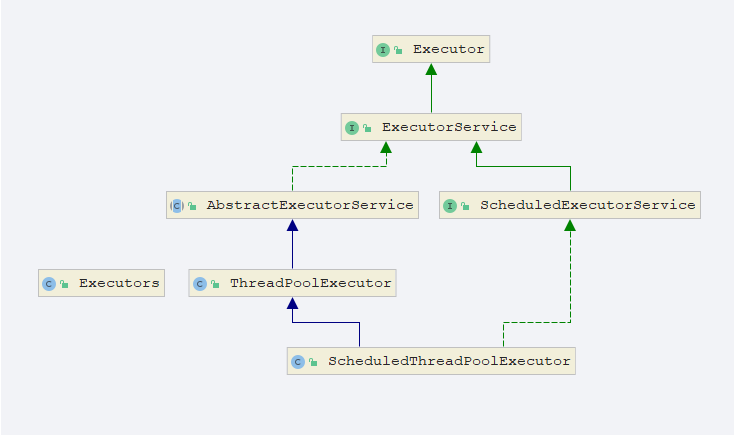

# 线程池详解

## 线程池的好处

使用线程池有如下好处：

1. **降低资源消耗.**通过重复利用自己创建的线程，降低线程创建和销毁造成的消耗.
2. **提高响应速度**.当任务到达时,任务可以不需要等到线程创建，就能立即执行。省去了thread.start(),即底层操作系统创建线程的时间开销。
3. **提高线程的可管理性**.线程是稀缺资源,如果无限的创建线程,不仅会消耗资源,还会较低系统的稳定性,使用线程池可以进行统一分配,调优和监控.

## 线程池的继承关系



从JDK 5开始，把工作单元与执行机制分离开来，工作单元包括`Runnable`和`Callable`，而执行机制有Executor框架提供。只需要传递一个Runnable的参数，就可以执行了。

## 线程池的创建方法

java提供了Executors的工具类来为我们创建线程池。

```java
ExecutorService newCachedThreadPool = Executors.newCachedThreadPool();
ExecutorService newFixedThreadPool = Executors.newFixedThreadPool(100);
ExecutorService newSingleThreadExecutor = Executors.newSingleThreadExecutor();
ExecutorService newScheduledThreadPool = Executors.newScheduledThreadPool(100);
```

### Executors.newCachedThreadPool()

创建一个根据需要创建新线程的线程池，但在可用时将重新使用以前构造的线程。  这些池通常会提高执行许多短暂异步任务的程序的性能。  调用`execute`将重用以前构造的线程（如果可用）。  如果没有可用的线程，将创建一个新的线程并将其添加到该池中。 未使用六十秒的线程将被终止并从缓存中删除。  因此，长时间保持闲置的池将不会消耗任何资源。

```java
public static ExecutorService newCachedThreadPool() {
    return new ThreadPoolExecutor(0, Integer.MAX_VALUE,
                                  60L, TimeUnit.SECONDS,
                                  new SynchronousQueue<Runnable>());
}
```

### Executors.newFixedThreadPool()

创建一个定长线程池，可控制线程最大并发数，超出的线程会在队列中等待。  在任何时候，最多`nThreads`线程将处于主动处理任务。  

```java
public static ExecutorService newFixedThreadPool(int nThreads) {
    return new ThreadPoolExecutor(nThreads, nThreads,
                                  0L, TimeUnit.MILLISECONDS,
                                  new LinkedBlockingQueue<Runnable>());
}
```

### Executors.newSingleThreadExecutor()

创建一个单线程化的线程池，它只会用唯一的工作线程来执行任务，保证所有任务按照顺序执行。等价于`newFixedThreadPool（1）`

```java
public static ExecutorService newSingleThreadExecutor() {
    return new FinalizableDelegatedExecutorService
        (new ThreadPoolExecutor(1, 1,
                                0L, TimeUnit.MILLISECONDS,
                                new LinkedBlockingQueue<Runnable>()));
}
```

### Executors.newScheduledThreadPool()

创建一个线程池，可以调度命令在给定的延迟之后运行，或定期执行。 

```java
public ScheduledThreadPoolExecutor(int corePoolSize) {
    super(corePoolSize, Integer.MAX_VALUE, 0, NANOSECONDS,
          new DelayedWorkQueue());
}
```

可以看到以上几种类型的线程池底层都是调用了ThreadPoolExecutor这个类的初始化方法，那么接下来让我们去了解下ThreadPoolExecutor的构造函数的七大参数的含义

## ThreadPoolExecutor构造方法

```java
public ThreadPoolExecutor(int corePoolSize,
                          int maximumPoolSize,
                          long keepAliveTime,
                          TimeUnit unit,
                          BlockingQueue<Runnable> workQueue,
                          ThreadFactory threadFactory,
                          RejectedExecutionHandler handler) {
    if (corePoolSize < 0 ||
        maximumPoolSize <= 0 ||
        maximumPoolSize < corePoolSize ||
        keepAliveTime < 0)
        throw new IllegalArgumentException();
    if (workQueue == null || threadFactory == null || handler == null)
        throw new NullPointerException();
    this.acc = System.getSecurityManager() == null ?
        null :
    AccessController.getContext();
    this.corePoolSize = corePoolSize;
    this.maximumPoolSize = maximumPoolSize;
    this.workQueue = workQueue;
    this.keepAliveTime = unit.toNanos(keepAliveTime);
    this.threadFactory = threadFactory;
    this.handler = handler;
}
```

1）**corePoolSize**：表示核心线程池的大小。当提交一个任务时，如果当前核心线程池的线程个数没有达到corePoolSize，则会创建新的线程来执行所提交的任务，**即使当前核心线程池有空闲的线程**。如果当前核心线程池的线程个数已经达到了corePoolSize，则不再重新创建线程。如果调用了`prestartCoreThread()`或者 `prestartAllCoreThreads()`，线程池创建的时候所有的核心线程都会被创建并且启动。

2）**maximumPoolSize**：表示线程池能创建线程的最大个数。如果当阻塞队列已满时，并且当前线程池线程个数没有超过maximumPoolSize的话，就会创建新的线程来执行任务。

3）**keepAliveTime**：空闲线程存活时间。如果当前线程池的线程个数已经超过了corePoolSize，并且线程空闲时间超过了keepAliveTime的话，就会将这些空闲线程销毁，这样可以尽可能降低系统资源消耗。

4） **unit**：时间单位。为keepAliveTime指定时间单位。

5） **workQueue**：阻塞队列。用于保存任务的阻塞队列，关于阻塞队列[可以看这篇文章](https://www.jianshu.com/p/c422ed5ea9ce)。可以使用**ArrayBlockingQueue, LinkedBlockingQueue, SynchronousQueue, PriorityBlockingQueue**。

6） **threadFactor**y：创建线程的工程类。可以通过指定线程工厂为每个创建出来的线程设置更有意义的名字，如果出现并发问题，也方便查找问题原因。

7）**handler**：饱和策略。当线程池的阻塞队列已满和指定的线程都已经开启，说明当前线程池已经处于饱和状态了，那么就需要采用一种策略来处理这种情况。采用的策略有这几种：

1. AbortPolicy： 直接拒绝所提交的任务，并抛出**RejectedExecutionException**异常；
2. CallerRunsPolicy：只用调用者所在的线程来执行任务；
3. DiscardPolicy：不处理直接丢弃掉任务；
4. DiscardOldestPolicy：丢弃掉阻塞队列中存放时间最久的任务，执行当前任务

## 线程池原理

当一个并发任务提交给线程池，线程池分配线程去执行任务的过程如下图所示：


1）当一个并发任务过来的时候，如果此时线程池中的数量小于corePoolSize，即使线程池中的线程都处于空闲状态，也要创建新的线程来处理被添加的任务。
2） 如果此时线程池中的数量等于corePoolSize，但是缓冲队列workQueue未满，那么任务被放入缓冲队列。
3） 如果此时线程池中的数量大于等于corePoolSize，缓冲队列workQueue满，并且线程池中的数量小于maximumPoolSize，建新的线程来处理被添加的任务。
4） 如果此时线程池中的数量大于corePoolSize，缓冲队列workQueue满，并且线程池中的数量等于maximumPoolSize，那么通过 handler所指定的策略来处理此任务。
5）当线程池中的线程数量大于 corePoolSize时，如果某线程空闲时间超过keepAliveTime，线程将被终止。这样，线程池可以动态的调整池中的线程数。

总结即：处理任务判断的优先级为 核心线程corePoolSize、任务队列workQueue、最大线程maximumPoolSize，如果三者都满了，使用handler处理被拒绝的任务。

**注意：**

1. 当workQueue使用的是无限队列时，maximumPoolSize参数就变的无意义了，比如new LinkedBlockingQueue(),或者new ArrayBlockingQueue(Integer.MAX_VALUE);
2. 使用SynchronousQueue队列时由于该队列没有容量的特性，所以不会对任务进行排队，如果线程池中没有空闲线程，会立即创建一个新线程来接收这个任务。maximumPoolSize要设置大一点。
3. 核心线程和最大线程数量相等时，keepAliveTime和unit无作用。