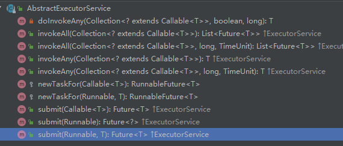

# 线程池详解

## 线程池的好处

使用线程池有如下好处：

1. **降低资源消耗.**通过重复利用自己创建的线程，降低线程创建和销毁造成的消耗.（<font color='red'>创建线程 是否会从用户态， 内核态之间切换</font>）
2. **提高响应速度**.当任务到达时,任务可以不需要等到线程创建，就能立即执行。省去了thread.start(),即底层操作系统创建线程的时间开销。
3. **提高线程的可管理性**.线程是稀缺资源,如果无限的创建线程,不仅会消耗资源,还会降低系统的稳定性,使用线程池可以进行统一分配,调优和监控.

## 线程池的继承关系


### Executor介绍


可以看到顶层接口Executor，只有一个execute方法，即Executor的核心功能就是运行一个Runnable的任务。

### ExecutorService介绍


ExecutorService是个接口，里面的12个方法全都是抽象方法，下面一一介绍这些方法 。

1. awaitTermination：别的线程等待线程池最终处于终结状态
2. invokeAll：批量执行任务
3. invokeAny：执行批量任务中的某一个
4. isShutdow：线程池是否处于被终止（**只要线程池不是Running，则返回true**）
5. isTerminated：线程池是否到达**TERMINATED**状态
6. shutdown：终止线程池，**继续执行已经再运行的任务，处理完队列中的任务才会结束**
7. shutdownNow：终止线程池，**尝试终结正在运行的任务，并不在执行队列中的任务**
8. submit：提交一个任务（**并不是执行一个任务，提交任务返回的是Future<T>对象，通过Future可以拿到执行的结果，或者关闭线程执行的任务等。执行一个任务则失去对正在运行的任务的控制**）

### AbstractExecutorService

AbstractExecutorService则是ExecutorService接口的抽象实现类，其中实现几个通用方法。



```java
protected <T> RunnableFuture<T> newTaskFor(Runnable runnable, T value) {
    return new FutureTask<T>(runnable, value);
}
protected <T> RunnableFuture<T> newTaskFor(Callable<T> callable) {
    return new FutureTask<T>(callable);
}
```

这两个方法是将runnable和callable的任务封装到`FutureTask`的run方法中执行。

#### submit

```java
public Future<?> submit(Runnable task) {
    if (task == null) throw new NullPointerException();
    RunnableFuture<Void> ftask = newTaskFor(task, null);
    execute(ftask);
    return ftask;
}
//调用future的get方法 返回固定值result
public <T> Future<T> submit(Runnable task, T result) {
    if (task == null) throw new NullPointerException();
    RunnableFuture<T> ftask = newTaskFor(task, result);
    execute(ftask);
    return ftask;
}

public <T> Future<T> submit(Callable<T> task) {
    if (task == null) throw new NullPointerException();
    RunnableFuture<T> ftask = newTaskFor(task);
    execute(ftask);
    return ftask;
}
```

Future提供了给Runnable接口的适配类，来获取返回的结果。

```java
static final class RunnableAdapter<T> implements Callable<T> {
    final Runnable task;
    final T result;
    RunnableAdapter(Runnable task, T result) {
        this.task = task;
        this.result = result;
    }
    public T call() {
        task.run();
        return result;
    }
}
```

invokeAll：执行所有的任务，

invokeAny：执行某一个任务

这两个方法就不一一介绍了。

## 线程池的创建方法

java提供了Executors的工具类来为我们创建线程池。

```java
ExecutorService newCachedThreadPool = Executors.newCachedThreadPool();
ExecutorService newFixedThreadPool = Executors.newFixedThreadPool(100);
ExecutorService newSingleThreadExecutor = Executors.newSingleThreadExecutor();
ExecutorService newScheduledThreadPool = Executors.newScheduledThreadPool(100);
```

### Executors.newCachedThreadPool()

创建一个根据需要创建新线程的线程池，但在可用时将重新使用以前构造的线程。  这些池通常会提高执行许多短暂异步任务的程序的性能。  调用`execute`将重用以前构造的线程（如果可用）。  如果没有可用的线程，将创建一个新的线程并将其添加到该池中。 未使用六十秒的线程将被终止并从缓存中删除。  因此，长时间保持闲置的池将不会消耗任何资源。

```java
public static ExecutorService newCachedThreadPool() {
    return new ThreadPoolExecutor(0, Integer.MAX_VALUE,
                                  60L, TimeUnit.SECONDS,
                                  new SynchronousQueue<Runnable>());
}
```

### Executors.newFixedThreadPool()

创建一个定长线程池，可控制线程最大并发数，超出的线程会在队列中等待。  在任何时候，最多`nThreads`线程将处于主动处理任务。  

```java
public static ExecutorService newFixedThreadPool(int nThreads) {
    return new ThreadPoolExecutor(nThreads, nThreads,
                                  0L, TimeUnit.MILLISECONDS,
                                  new LinkedBlockingQueue<Runnable>());
}
```

### Executors.newSingleThreadExecutor()

创建一个单线程化的线程池，它只会用唯一的工作线程来执行任务，保证所有任务按照顺序执行。等价于`newFixedThreadPool（1）`

```java
public static ExecutorService newSingleThreadExecutor() {
    return new FinalizableDelegatedExecutorService
        (new ThreadPoolExecutor(1, 1,
                                0L, TimeUnit.MILLISECONDS,
                                new LinkedBlockingQueue<Runnable>()));
}
```

### Executors.newScheduledThreadPool()

创建一个线程池，可以调度命令在给定的延迟之后运行，或定期执行。 

```java
public ScheduledThreadPoolExecutor(int corePoolSize) {
    super(corePoolSize, Integer.MAX_VALUE, 0, NANOSECONDS,
          new DelayedWorkQueue());
}
```

可以看到以上几种类型的线程池底层都是调用了ThreadPoolExecutor这个类的初始化方法，那么接下来让我们去了解下ThreadPoolExecutor的构造函数的七大参数的含义

## ThreadPoolExecutor构造方法

```java
public ThreadPoolExecutor(int corePoolSize,
                          int maximumPoolSize,
                          long keepAliveTime,
                          TimeUnit unit,
                          BlockingQueue<Runnable> workQueue,
                          ThreadFactory threadFactory,
                          RejectedExecutionHandler handler) {
    if (corePoolSize < 0 ||
        maximumPoolSize <= 0 ||
        maximumPoolSize < corePoolSize ||
        keepAliveTime < 0)
        throw new IllegalArgumentException();
    if (workQueue == null || threadFactory == null || handler == null)
        throw new NullPointerException();
    this.acc = System.getSecurityManager() == null ?
        null :
    AccessController.getContext();
    this.corePoolSize = corePoolSize;
    this.maximumPoolSize = maximumPoolSize;
    this.workQueue = workQueue;
    this.keepAliveTime = unit.toNanos(keepAliveTime);
    this.threadFactory = threadFactory;
    this.handler = handler;
}
```

1）**corePoolSize**：表示核心线程池的大小。当提交一个任务时，如果当前核心线程池的线程个数没有达到corePoolSize，则会创建新的线程来执行所提交的任务，**即使当前核心线程池有空闲的线程**。如果当前核心线程池的线程个数已经达到了corePoolSize，则不再重新创建线程。如果调用了`prestartCoreThread()`或者 `prestartAllCoreThreads()`，线程池创建的时候所有的核心线程都会被创建并且启动。

2）**maximumPoolSize**：表示线程池能创建线程的最大个数。如果当阻塞队列已满时，并且当前线程池线程个数没有超过maximumPoolSize的话，就会创建新的线程来执行任务。

3）**keepAliveTime**：空闲线程存活时间。如果当前线程池的线程个数已经超过了corePoolSize，并且线程空闲时间超过了keepAliveTime的话，就会将这些空闲线程销毁，这样可以尽可能降低系统资源消耗。

4） **unit**：时间单位。为keepAliveTime指定时间单位。

5） **workQueue**：阻塞队列。用于保存任务的阻塞队列，关于阻塞队列[可以看这篇文章](https://www.jianshu.com/p/c422ed5ea9ce)。可以使用**ArrayBlockingQueue, LinkedBlockingQueue, SynchronousQueue, PriorityBlockingQueue**。

6） **threadFactor**y：创建线程的工程类。可以通过指定线程工厂为每个创建出来的线程设置更有意义的名字，如果出现并发问题，也方便查找问题原因。

7）**handler**：饱和策略。当线程池的阻塞队列已满和指定的线程都已经开启，说明当前线程池已经处于饱和状态了，那么就需要采用一种策略来处理这种情况。采用的策略有这几种：

1. AbortPolicy： 直接拒绝所提交的任务，并抛出**RejectedExecutionException**异常；
2. CallerRunsPolicy：只用调用者所在的线程来执行任务；
3. DiscardPolicy：不处理直接丢弃掉任务；
4. DiscardOldestPolicy：丢弃掉阻塞队列中存放时间最久的任务，执行当前任务

## 线程池原理

当一个并发任务提交给线程池，线程池分配线程去执行任务的过程如下图所示：


1）当一个并发任务过来的时候，如果此时线程池中的数量小于corePoolSize，即使线程池中的线程都处于空闲状态，也要创建新的线程来处理被添加的任务。
2） 如果此时线程池中的数量等于corePoolSize，但是缓冲队列workQueue未满，那么任务被放入缓冲队列。
3） 如果此时线程池中的数量大于等于corePoolSize，缓冲队列workQueue满，并且线程池中的数量小于maximumPoolSize，建新的线程来处理被添加的任务。
4） 如果此时线程池中的数量大于corePoolSize，缓冲队列workQueue满，并且线程池中的数量等于maximumPoolSize，那么通过 handler所指定的策略来处理此任务。
5）当线程池中的线程数量大于 corePoolSize时，如果某线程空闲时间超过keepAliveTime，线程将被终止。这样，线程池可以动态的调整池中的线程数。

总结即：处理任务判断的优先级为 核心线程corePoolSize、任务队列workQueue、最大线程maximumPoolSize，如果三者都满了，使用handler处理被拒绝的任务。

**注意：**

1. 当workQueue使用的是无限队列时，maximumPoolSize参数就变的无意义了，比如new LinkedBlockingQueue(),或者new ArrayBlockingQueue(Integer.MAX_VALUE);
2. 使用SynchronousQueue队列时由于该队列没有容量的特性，所以不会对任务进行排队，如果线程池中没有空闲线程，会立即创建一个新线程来接收这个任务。maximumPoolSize要设置大一点。
3. 核心线程和最大线程数量相等时，keepAliveTime和unit无作用。

## ThreadPoolExecutor的源码解析

### 成员变量

```java
//使用原子整型类，来表示线程池中线程数和线程状态
private final AtomicInteger ctl = new AtomicInteger(ctlOf(RUNNING, 0));
//线程池的最大容量 = 2^29-1
private static final int COUNT_BITS = Integer.SIZE - 3;
private static final int CAPACITY   = (1 << COUNT_BITS) - 1;

// runState is stored in the high-order bits
private static final int RUNNING    = -1 << COUNT_BITS;
private static final int SHUTDOWN   =  0 << COUNT_BITS;
private static final int STOP       =  1 << COUNT_BITS;
private static final int TIDYING    =  2 << COUNT_BITS;
private static final int TERMINATED =  3 << COUNT_BITS;

//线程池中为执行的任务队列
private final BlockingQueue<Runnable> workQueue;
//线程池锁
private final ReentrantLock mainLock = new ReentrantLock();
//线程池中的工作线程的集合
private final HashSet<Worker> workers = new HashSet<Worker>();
//与mainLock对应的等待队列
private final Condition termination = mainLock.newCondition();
//线程池中出现的线程最大数
private int largestPoolSize;
//线程池中已经完成的任务数
private long completedTaskCount;
//线程工厂类
private volatile ThreadFactory threadFactory;
//拒绝策略
private volatile RejectedExecutionHandler handler;
//超时时间
private volatile long keepAliveTime;
//是否运行核心线程在没有任务的timeout时间后，停止
private volatile boolean allowCoreThreadTimeOut;
//核心线程数
private volatile int corePoolSize;
//最大线程数
private volatile int maximumPoolSize;
//默认拒绝策略
private static final RejectedExecutionHandler defaultHandler = new AbortPolicy();
```

可以看到线程池有五种状态分为**RUNNING**，**SHUTDOWN**，**STOP**，**TIDYING**，**TERMINATED**。变量ctl用来同时保存线程池中的工作线程数和线程池状态，它是怎么做到的呢？

**ctl**是一个**32**位的Integer变量，它的前四位用来保存线程状态，后29位用来保存线程池中的工作线程数。


这个有个很巧妙的点：

**RUNNING** < **SHUTDOWN** < **STOP** < **TIDYING** < **TERMINATED**

这样判断线程池的状态时，或满足线程池的状态时，有时候可以很巧妙的判断大小来是实现。

从源码可以发现，每一个线程都被包装成了一个Worker类，我们来看下Worker的实现。

```java
//Worker类继承了aqs并实现了Runnable接口
private final class Worker
    extends AbstractQueuedSynchronizer
    implements Runnable
{
    /**
         * This class will never be serialized, but we provide a
         * serialVersionUID to suppress a javac warning.
         */
    private static final long serialVersionUID = 6138294804551838833L;

    /** Thread this worker is running in.  Null if factory fails. */
    //执行的线程
    final Thread thread;
    /** Initial task to run.  Possibly null. */
    //该线程执行的第一个任务
    Runnable firstTask;
    /** Per-thread task counter */
    //该线程执行的任务数量
    volatile long completedTasks;

    /**
         * Creates with given first task and thread from ThreadFactory.
         * @param firstTask the first task (null if none)
         */
    Worker(Runnable firstTask) {
        setState(-1); // inhibit interrupts until runWorker
        this.firstTask = firstTask;
        this.thread = getThreadFactory().newThread(this);
    }

    /** Delegates main run loop to outer runWorker  */
    public void run() {
        runWorker(this);
    }

    // Lock methods
    //
    // The value 0 represents the unlocked state.
    // The value 1 represents the locked state.

    //判断是否获取到锁
    protected boolean isHeldExclusively() {
        return getState() != 0;
    }

    //尝试获取锁
    protected boolean tryAcquire(int unused) {
        if (compareAndSetState(0, 1)) {
            setExclusiveOwnerThread(Thread.currentThread());
            return true;
        }
        return false;
    }

    //尝试释放锁，不需要cas，因为只有一个线程可以释放锁。
    protected boolean tryRelease(int unused) {
        setExclusiveOwnerThread(null);
        setState(0);
        return true;
    }

    public void lock()        { acquire(1); }
    public boolean tryLock()  { return tryAcquire(1); }
    public void unlock()      { release(1); }
    public boolean isLocked() { return isHeldExclusively(); }
```

**思考：为什么Worker要继承AQS？**

**任务执行的时候需要获取对应线程的锁，但运行线程不持有锁的时候，代表这个线程多半处于空闲状态，这种空闲状态的线程在调用shutdown关闭线程池时可以直接被中断！**

当我们执行任务的时候会先获取锁

```java
try {
    while (task != null || (task = getTask()) != null) {
        w.lock();
```

在调用shutdown方法时，我们会去判断线程是否持有锁，若线程持有锁，则不中断线程。若线程没有持有锁，那么这个线程多半处于空闲状态，则直接被中断。

```java
private void interruptIdleWorkers(boolean onlyOne) {
    final ReentrantLock mainLock = this.mainLock;
    mainLock.lock();
    try {
        for (Worker w : workers) {
            Thread t = w.thread;
            if (!t.isInterrupted() && w.tryLock()) {
                try {
                    t.interrupt();
```

而shutdownNow方法则不管线程是否正在执行，直接全部全部中断。

```java
void interruptIfStarted() {
    Thread t;
    if (getState() >= 0 && (t = thread) != null && !t.isInterrupted()) {
        try {
            t.interrupt();
        } catch (SecurityException ignore) {
        }
    }
}
```

### excute方法

我们知道submit方法底层调的也是excute方法，所以excute方法时线程池中的核心方法，下面我们来分析源码

```java
public void execute(Runnable command) {
    if (command == null)
        throw new NullPointerException();
    int c = ctl.get();
    //当前线程数<核心线程数 会创建一个线程来执行任务
    if (workerCountOf(c) < corePoolSize) {
        //添加一个核心线程去执行任务，成功则直接返回
        if (addWorker(command, true))
            return;
        //创建核心线程失败，这时很有可能时线程池状态发生了改变
        c = ctl.get();
    }
    //如果这时线程池处于运行状态，并且入队列成功
    if (isRunning(c) && workQueue.offer(command)) {
        int recheck = ctl.get();
        //double-check线程状态
        //若不是Running状态，移除队列，并执行拒绝策略
        if (! isRunning(recheck) && remove(command))
            reject(command);
        //当前线程池还是Running状态，但是工作线程数为0，则开启一个非核心线程去执行空任务。
        else if (workerCountOf(recheck) == 0)
            addWorker(null, false);
    }
    //如果无法加入到阻塞队列中，尝试开启非核心线程，成功直接返回，失败，执行拒绝策略
    else if (!addWorker(command, false))
        reject(command);
}
```

问题：为什么要double-check

如果任务可以成功入队列，那么我们仍然需要仔细检查我们是否应该添加线程。（因为自上次检查以来现有的已经死亡）或者自从进入这个方法，线程池已经处于shutdown状态。所以我们需要检查这个状态，如果它stoped，必要时要回滚入列操作，如果线程池中的线程为空，则创建一个新的。

### addWorker方法

```java
//firstTask -> 线程第一次执行的任务，后面会将这个变量 -> null
//core -> 代表是否开启核心线程
private boolean addWorker(Runnable firstTask, boolean core) {
    retry:
    for (;;) {
        int c = ctl.get();
        //线程池状态
        int rs = runStateOf(c);
        // Check if queue empty only if necessary.
        //状态为SHUTDOWN及以上 并且 不是 （状态为SHUTDOWN,firstTask为null，队列不为null）
        if (rs >= SHUTDOWN &&
            ! (rs == SHUTDOWN &&
               firstTask == null &&
               ! workQueue.isEmpty()))
            return false;
        //自旋
        for (;;) {
            //当前线程数
            int wc = workerCountOf(c);
            //超过线程最大值，或者超过核心线程数或最大线程数，返回false
            if (wc >= CAPACITY ||
                wc >= (core ? corePoolSize : maximumPoolSize))
                return false;
            //cas 当前线程数，若成功，则退出retry循环
            if (compareAndIncrementWorkerCount(c))
                break retry;
            //否则，重新获取线程状态，判断与第一次获取的状态是否相同，若不同，则需要跳到外层循环重新判断状态
            c = ctl.get();  // Re-read ctl
            if (runStateOf(c) != rs)
                continue retry;
            // else CAS failed due to workerCount change; retry inner loop
        }
    }

    //Worker的添加和开启的状态为false
    boolean workerStarted = false;
    boolean workerAdded = false;
    Worker w = null;
    try {
        w = new Worker(firstTask);
        final Thread t = w.thread;
        if (t != null) {
            //加锁，将Worker加入到set中需要先获取锁
            final ReentrantLock mainLock = this.mainLock;
            mainLock.lock();
            try {
                // Recheck while holding lock.
                // Back out on ThreadFactory failure or if
                // shut down before lock acquired.
                //重新获取状态
                int rs = runStateOf(ctl.get());

                //线程池为Running状态 或者 为shutdown且firsttask为null
                if (rs < SHUTDOWN ||
                    (rs == SHUTDOWN && firstTask == null)) {
                    //判断线程是否开启
                    if (t.isAlive()) // precheck that t is startable
                        throw new IllegalThreadStateException();
                    //添加到集合中
                    workers.add(w);
                    int s = workers.size();
                    //记录线程池中的最大线程数
                    if (s > largestPoolSize)
                        largestPoolSize = s;
                    //走到这一步，说明worker已经添加到集合中
                    workerAdded = true;
                }
            } finally {
                mainLock.unlock();
            }
            //这里没加锁
            if (workerAdded) {
                t.start();
                workerStarted = true;
            }
        }
    } finally {
        if (! workerStarted)
            addWorkerFailed(w);
    }
    return workerStarted;
}
```

若线程启动失败，则大概率是线程池状态发生了改变，前面说过 **调用shutdown会判断线程是否获取了锁**，如果没获取锁，会被中断。（**线程start的过程中被打断，不知道会发生啥情况？应该会抛异常，直接走到finally里面，将集合中的worker移除**）会则执行addWorkerFailed方法。

```java
private void addWorkerFailed(Worker w) {
    final ReentrantLock mainLock = this.mainLock;
    //对workers的操作都需要加锁
    mainLock.lock();
    try {
        //移除刚刚添加到集合中的worker
        if (w != null)
            workers.remove(w);
        //cas 将线程数减一
        decrementWorkerCount();
        //尝试终止线程池
        tryTerminate();
    } finally {
        mainLock.unlock();
    }
}
```

### tryTerminate方法

```java
/**
以下两种情况会使得线程池的方法到达 TERMINATED
SHUTDOWN 并且线程池线程数为0，队列为null， or STOP 并且线程池线程数为0
如果有条件终止，但workerCount非零，则中断没有任务的线程，以确保terminate信号传播
该方法会被任何可以使得线程池为terminate的方法中调用
减少woker数量 or SHUTDOWN时，从队列中移除任务
*/
final void tryTerminate() {
    for (;;) {
        int c = ctl.get();
        //线程池正在运行，
        if (isRunning(c) ||
            // >= TIDYING 说明已经执行过terminate
            runStateAtLeast(c, TIDYING) ||
            // SHUTDOWN 且队列不为空
            (runStateOf(c) == SHUTDOWN && ! workQueue.isEmpty()))
            return;
        if (workerCountOf(c) != 0) { // Eligible to terminate
            //尝试中断一个线程
            interruptIdleWorkers(ONLY_ONE);
            return;
        }
        final ReentrantLock mainLock = this.mainLock;
        mainLock.lock();
        try {
            //cas 状态以及pool的线程数
            if (ctl.compareAndSet(c, ctlOf(TIDYING, 0))) {
                try {
                    //钩子函数，留给用户定义
                    terminated();
                } finally {
                    //状态至为 terminated
                    ctl.set(ctlOf(TERMINATED, 0));
                    //唤醒等待队列中的线程
                    termination.signalAll();
                }
                return;
            }
        } finally {
            mainLock.unlock();
        }
        // else retry on failed CAS
    }
}
```

### runWorker方法

我们来看下worker时怎么来执行任务的

```java
final void runWorker(Worker w) {
    Thread wt = Thread.currentThread();
    Runnable task = w.firstTask;
    w.firstTask = null;
    //通过unlock 使得state为0
    w.unlock(); // allow interrupts
    boolean completedAbruptly = true;
    try {
        //第一次执行task不为null，以后执行都通过getTask方法来判断
        while (task != null || (task = getTask()) != null) {
            w.lock();
            // If pool is stopping, ensure thread is interrupted;
            // if not, ensure thread is not interrupted.  This
            // requires a recheck in second case to deal with
            // shutdownNow race while clearing interrupt
            //如果线程至少是sleep状态，而且没有被中断过，直接中断线程，因为stop状态不需要在执行任务了，这里只是中断，并不能保证任务不能执行，如果任务响应了中断，依旧是可以正常运行的。
            if ((runStateAtLeast(ctl.get(), STOP) ||
                 (Thread.interrupted() &&
                  runStateAtLeast(ctl.get(), STOP))) &&
                !wt.isInterrupted())
                wt.interrupt();
            try {
                //钩子函数，任务执行前的处理
                beforeExecute(wt, task);
                Throwable thrown = null;
                try {
                    //执行任务
                    task.run();
                } catch (RuntimeException x) {
                    thrown = x; throw x;
                } catch (Error x) {
                    thrown = x; throw x;
                } catch (Throwable x) {
                    thrown = x; throw new Error(x);
                } finally {
                    //钩子函数，任务执行后的处理
                    afterExecute(task, thrown);
                }
            } finally {
                task = null;
               //将worker的完成的工作数+1，并释放锁
                w.completedTasks++;
                w.unlock();
            }
        }
        //当执行任务出现异常时，则 completedAbruptly =true
        completedAbruptly = false;
    } finally {
        //线程退出 调用tryTerminate 尝试终结线程池
        processWorkerExit(w, completedAbruptly);
    }
}
```

### processWorkerExit方法

```java
 private void processWorkerExit(Worker w, boolean completedAbruptly) {
     //用户任务执行抛异常，则需要将worker减1，因为这个worker已经执行完毕了
     //如果正常情况下，decrementWorkerCount在gettask方法里面减一
        if (completedAbruptly) // If abrupt, then workerCount wasn't adjusted
            decrementWorkerCount();
        final ReentrantLock mainLock = this.mainLock;
        mainLock.lock();
        try {
            //当工作线程Worker结束了，需要更新全局的已完成工作数
            completedTaskCount += w.completedTasks;
            //从集合中移除
            workers.remove(w);
        } finally {
            mainLock.unlock();
        }
	    //尝试终止线程池
        tryTerminate();
        int c = ctl.get();
     //小于STOP 不是Running就是SHUTDOWN，需要把任务队列中的和已经跑着的任务处理完毕
        if (runStateLessThan(c, STOP)) {
            //不是异常退出，看一下运行的最小线程数是否满足要求，满足返回，不用在专门开个线程
            if (!completedAbruptly) {
                int min = allowCoreThreadTimeOut ? 0 : corePoolSize;
                if (min == 0 && ! workQueue.isEmpty())
                    min = 1;
                if (workerCountOf(c) >= min)
                    return; // replacement not needed
            }
            //如果异常退出，添加一个线程来工作
            addWorker(null, false);
        }
    }
```

### getTask()方法

那我们怎么源源不断的获取任务呢，或者在没有任务的时候，线程阻塞住呢？

```java
private Runnable getTask() {
    boolean timedOut = false; // Did the last poll() time out?

    for (;;) {
        int c = ctl.get();
        int rs = runStateOf(c);
        // Check if queue empty only if necessary.
        //shutdown状态 并且队列为null ，或者为stop状态，删除worker
        if (rs >= SHUTDOWN && (rs >= STOP || workQueue.isEmpty())) {
            decrementWorkerCount();
            return null;
        }

        int wc = workerCountOf(c);

        // Are workers subject to culling?
        //是否超时获取，有两种情况
        // 允许核心线程回收 || 线程数大于核心线程数
        boolean timed = allowCoreThreadTimeOut || wc > corePoolSize;

        //最大线程数修改 ——》当前线程数多了，所以该线程需要退出
        //或者超时没有获取到任务
        // && (线程数 >1 || 队列为null）
        if ((wc > maximumPoolSize || (timed && timedOut))
            && (wc > 1 || workQueue.isEmpty())) {
            //尝试wc -1 ，代表线程需要退出了
            if (compareAndDecrementWorkerCount(c))
                return null;
            continue;
        }
        try {
            //运行核心线程超时回收，或者当前线程数大于核心线程数，则poll函数，会等待
            //keepAliveTime时间，返回结果，否则阻塞住，等待队列中有数据
            Runnable r = timed ?
                workQueue.poll(keepAliveTime, TimeUnit.NANOSECONDS) :
            workQueue.take();
            //代表拿到了任务
            if (r != null)
                return r;
            //代表超时没有拿到任务，在if ((wc > maximumPoolSize || (timed && timedOut)) 可能退出
            timedOut = true;
        } catch (InterruptedException retry) {
            //take poll 会抛出中断异常，忽略这种异常
            timedOut = false;
        }
    }
}
```

