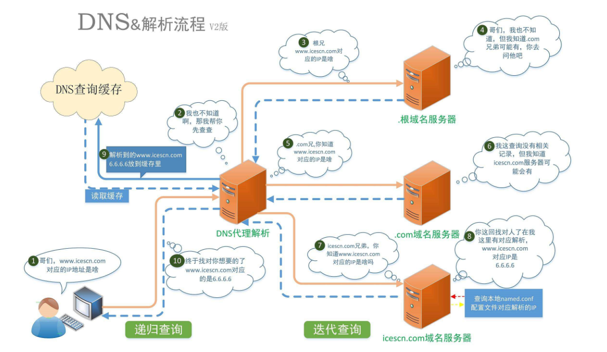
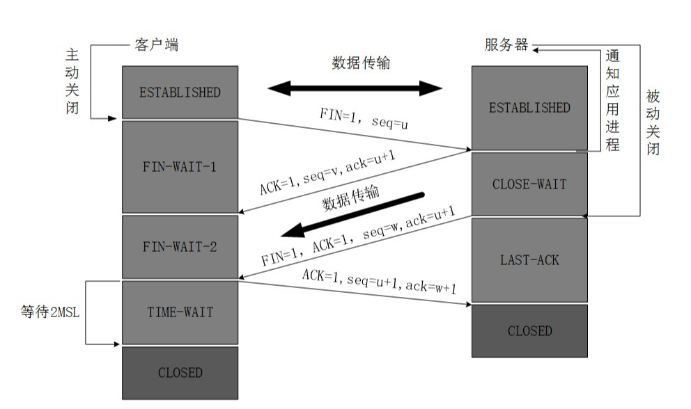

# 浏览器输入URL发生了什么

## 前言

这是一道非常经典的面试题，可以覆盖绝大多数网络相关的知识点，重点考察 `TCP/IP 网络模型`、`tcp`、`http 网络协议`、`DNS 地址解析过程`等知识点，当然也可以衍生出许多其他的网络相关的面试题，比如：

* TCP协议为什么需要进行三次握手，而不是四次，五次
* TCP协议为什么要进行四次挥手
* DNS 服务器是如何解析地址的，流程是怎样的
* HTTP 协议的特点
* TCP/IP 网络模型分为哪几层，分别有什么作用

这篇文章主要是对浏览器一次完整的请求进行大致的分析，并且在分析的过程中穿插常见的面试题进行解答，希望能对大家有所帮助

## 具体过程

### URL解析

* 用户输入`URL`，浏览器会根据用户输入的信息判断是搜索还是网址，如果是搜索内容，就将搜索内容+默认搜索引擎合成新的URL；如果用户输入的内容符合URL规则，浏览器就会根据URL协议，在这段内容上加上协议合成合法的URL
* 浏览器进程浏览器构建请求行信息，会通过进程间通信（IPC）将URL请求发送给网络进程 `GET /index.html HTTP1.1`
* 网络进程获取到`URL`，先去本地缓存中查找是否有缓存文件，如果有，拦截请求，直接结果返回返回；否则，进入网络请求过程

### DNS域名解析

#### 在本地 host 中查询地址映射

当`URL`合法性验证通过后，我们会在本地的`host`文件中进行查询，看是否有已知的`IP`地址和`www.baidu.com`域名进行匹配，如果有，那么直接访问对应的`IP`地址

#### 本地域名服务器

如果本地的`host`文件，浏览器缓存等没有查询到相应的`IP`地址，那么浏览器就会发送一个 DNS 请求到`本地DNS服务器`，在上图中是以DNS代理表示的，`本地DNS服务器`首先会查询**缓存**，如果**缓存**中存在那么直接返回相应的`IP`地址，如果不存在，本地服务器会把这个请求转发给`根域名服务器`

#### 根域名服务器（IPV4）

> `根域名服务器`主要用来管理互联网的主目录。所有IPv4根服务器均由美国政府授权的互联网域名与号码分配机构ICANN统一管理，负责全球互联网域名IPv4根服务器、域名体系和IP地址等的管理。全世界只有13台IPv4根域名服务器。1个为主根服务器在[美国](https://baike.baidu.com/item/美国/125486)。其余12个均为辅根服务器，其中9台在美国，欧洲2个，位于英国和瑞典，亚洲1个位于日本

注意：根域名服务器只保存下一级域名服务器的相关信息，而非具体的域名服务对应的 IP 地址，网上很多博客在这一步骤会说，先在根域名服务器上寻找是否有域名对应的`IP`地址，如果没有再去查询一级域名服务器，这实际上是错误的

`根域名服务器`会根据域名地址，匹配出相应的`一级域名服务器`并把服务器地址返回给`本地域名服务器`，之后`本地域名服务器`会将地址解析请求发送到相应的`一级域名服务器`上，这样层层查询下去，整体上是一个迭代查询的过程

#### 一级域名服务器，二级域名服务器等等

本地DNS服务器继续向域服务器发出请求，在这个例子中，请求的对象是`.com域服务器`。`.com域服务器`收到请求之后，也不会直接返回域名和IP地址的对应关系，而是告诉`本地DNS服务器`，你的域名的解析服务器的地址

最后，`本地DNS服务器`向域名的解析服务器发出请求，这时就能收到一个域名和`IP`地址对应关系，`本地DNS服务器`不仅要把`IP`地址返回给用户电脑，还要把这个对应关系保存在**缓存**中，以备下次别的用户查询时，可以直接返回结果，加快网络访问

### TCP三次握手

拿到域名对应的`IP`地址后，会以随机端口（1024~~65535）向**WEB服务器程序**`80`端口发起`TCP`的连接请求，这个连接请求进入到内核的`TCP/IP`协议栈（用于识别该连接请求，解封包，一层一层的剥开），，最终到达WEB程序，最终建立了`TCP/IP`的连接，那么在这里我们就不得不提到`TCP`三次握手的连接过程

#### 三次握手流程图

#### 具体过程

* `TCP`服务器进程先创建传输控制块`TCB`，时刻准备接受客户进程的连接请求，此时服务器就进入了`LISTEN`（监听）状态；
* `TCP`客户进程也是先创建传输控制块`TCB`，然后向服务器发出连接请求报文，这是报文首部中的同部位SYN=1，同时选择一个初始序列号 seq=x ，此时，`TCP`客户端进程进入了 `SYN-SENT`（同步已发送状态）状态。`TCP`规定，`SYN`报文段（SYN=1的报文段）不能携带数据，但需要消耗掉一个序号。
* `TCP`服务器收到请求报文后，如果同意连接，则发出确认报文。确认报文中应该 ACK=1，SYN=1，确认号是ack=x+1，同时也要为自己初始化一个序列号 seq=y，此时，`TCP`服务器进程进入了SYN-RCVD（同步收到）状态。这个报文也不能携带数据，但是同样要消耗一个序号。
* `TCP`客户进程收到确认后，还要向服务器给出确认。确认报文的ACK=1，ack=y+1，自己的序列号seq=x+1，此时，TCP连接建立，客户端进入ESTABLISHED（已建立连接）状态。`TCP`规定，`ACK`报文段可以携带数据，但是如果不携带数据则不消耗序号。
* 当服务器收到客户端的确认后也进入`ESTABLISHED`状态，此后双方就可以开始通信了。
  

#### 为什么需要进行三次握手，而不是二次，四次？

这是一种安全机制，主要是为了防止失效连接的再次请求会产生错误的通讯，举个例子，如果只用`两次`握手通信来建立`TCP`连接，那么假设`第一次`握手请求在网络传输过程中发生了延迟，客户端没有接受到来自服务端的反馈，客户端以为这次请求失败了，于是进行了`第二次`请求，这时候服务端接受到了第二次请求并返回确认报文，这样一次`二次`握手的通信便建立完成了，那么`第一次`延迟的请求便会置为无效，假设`第一次`请求在`二次`握手建立成功之后才到达服务器，那么服务器这时候是没有办法判断这个请求是否有效，服务器根据协议规则再次返回确认报文，这样，原本只应该存在一次有效的请求就变成了两个。

`三次`握手增加了一次客户端再次确认的过程，可以避免这个问题，同时三次握手可以确认双发收发功能都正常，其过程可以抽象为：

* 第一次：客户端确认可以发送请求（不确认自己的请求是否发送成功，发送数据是否正确），服务端确认自己可以接受请求（不确认数据是否正确，不确认自己是否可以发送请求，不确认请求数据是否正确）

* 第二次：客户端收到确认报文，确认自己可以发送请求，确认发送成功，确认数据正确，服务端确认自己可以接受请求，确认自己可以发送请求，（不确认数据是否正确，，不确认请求数据是否正确）
* 第三次：客户端收到确认报文，确认自己可以发送请求，确认发送成功，确认数据正确，服务端确认自己可以接受请求，确认自己可以发送请求，确认客户端可以接受自己发出的请求，确认自己发出的请求数据正确

### 游览器向WEB服务器发起Http请求

> 建立起TCP连接后，浏览器开始发送 HTTP 请求。一个请求报文由请求行、请求头、空行、实体（Get 请求没有）组成。请求头由通用首部、请求首部、实体首部、扩展首部组成。其中，通用首部表示无论是请求报文还是响应报文都可以使用，比如 Date；请求首部表示只有在请求报文中才有意义，分为 Accept 首部、条件请求首部、安全请求首部和代理请求首部这四类；实体首部作用于实体内容，分为内容首部和缓存首部这两类；扩展首部表示用户自定义的首部，通过 `X-` 前缀来添加。另外需要注意的是，HTTP 请求头是不区分大小写的，它基于 ASCII 进行编码，而实体可以基于其它编码方式，由 `Content-Type` 决定。

* `http`是工作在应用层的协议，一个请求报文由请求行、请求头、空行、实体（Get 请求没有）组成，封装成http请求报文后向下传输
* `http`请求报文加上`TCP头部`——包括源端口号、目的程序端口号和用于校验数据完整性的序号，封装成数据包，向下传输
* 数据包经过`IP`协议，`以太网协议`添加源IP地址，目标IP地址，源mac地址，目标mac地址等头部信息，层层封装后形成最终的数据包，通过网络接口层或者物理层进行传输
* 目的服务器主机网络层接收到数据包，解析出IP头部，识别出数据部分，将解开的数据包向上传输到传输层
* 目的服务器主机传输层获取到数据包，解析出TCP头部，识别端口，将解开的数据包向上传输到应用层
* 应用层HTTP解析请求头和请求体
* 数据传输完成，TCP四次挥手断开连接

### 服务器响应http请求至浏览器

此略，不同的服务器，不同的技术栈有不同的处理流程，可以针对具体的服务类型再做分析

### 浏览器解析资源，渲染流程

对于获取到的HTML、CSS、JS、图片等等资源。浏览器通过解析HTML，生成DOM树，解析CSS，生成CSS规则树，然后通过DOM树和CSS规则树生成渲染树，由于关于浏览器渲染资源的流程网上有更加详细的说明，在这里就不展开了

### TCP四次挥手

> 数据传输完毕后，双方都可释放连接。最开始的时候，客户端和服务器都是处于ESTABLISHED状态，然后客户端主动关闭，服务器被动关闭

#### 四次挥手流程图

#### 具体过程

* 客户端进程发出连接释放报文，并且停止发送数据。释放数据报文首部，FIN=1，其序列号为seq=u（等于前面已经传送过来的数据的最后一个字节的序号加1），此时，客户端进入FIN-WAIT-1（终止等待1）状态。 `TCP`规定，FIN报文段即使不携带数据，也要消耗一个序号。
* 服务器收到连接释放报文，发出确认报文，ACK=1，ack=u+1，并且带上自己的序列号seq=v，此时，服务端就进入了`CLOSE-WAIT`（关闭等待）状态。`TCP`服务器通知高层的应用进程，客户端向服务器的方向就释放了，这时候处于半关闭状态，即客户端已经没有数据要发送了，但是服务器若发送数据，客户端依然要接受。这个状态还要持续一段时间，也就是整个`CLOSE-WAIT`状态持续的时间。
* 客户端收到服务器的确认请求后，此时，客户端就进入`FIN-WAIT-2`（终止等待2）状态，等待服务器发送连接释放报文（在这之前还需要接受服务器发送的最后的数据）。
  服务器将最后的数据发送完毕后，就向客户端发送连接释放报文，FIN=1，ack=u+1，由于在半关闭状态，服务器很可能又发送了一些数据，假定此时的序列号为seq=w，此时，服务器就进入了`LAST-ACK`（最后确认）状态，等待客户端的确认。
* 客户端收到服务器的连接释放报文后，必须发出确认，ACK=1，ack=w+1，而自己的序列号是seq=u+1，此时，客户端就进入了TIME-WAIT（时间等待）状态。注意此时TCP连接还没有释放，必须经过`2MSL`（最长报文段寿命）的时间后，当客户端撤销相应的`TCB`后，才进入`CLOSED`状态。
* 服务器只要收到了客户端发出的确认，立即进入`CLOSED`状态。同样，撤销`TCB`后，就结束了这次的TCP连接。可以看到，服务器结束`TCP`连接的时间要比客户端早一些。

#### 为什么需要四次挥手

如果通过举例来说明，四次挥手就好比两个人在打电话，`A`告诉`B`：我说完了，我准备挂了【**第一次挥手**】，`B`回答`A`：我知道了【**第二次挥手**】，`B`告诉`A`：但是我还有一些话没有说完，你先听我说完.....，好的我说完了【**第三次挥手**】，`A`回复`B`，我确定你全部都说完了，那么我这次真的挂断电话了【**第四次挥手**】

## 总结

其实浏览器进行一次完整的`http`请求还有非常多的细节可以深究，在这里我仅仅是对一些重点流程做出我的理解，没有涉及到的内容还有，`http`在服务器如何处理，如何将响应数据发送给浏览器，浏览器如何渲染，加载资源等等，关于这些细节欢迎大家加以补充