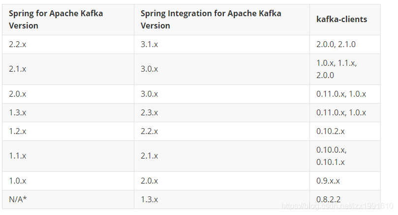
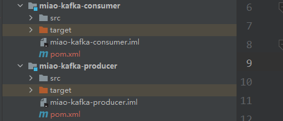
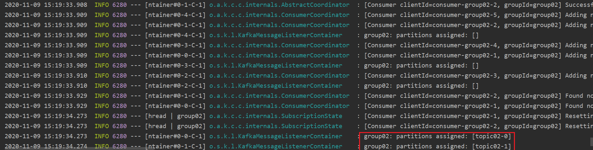
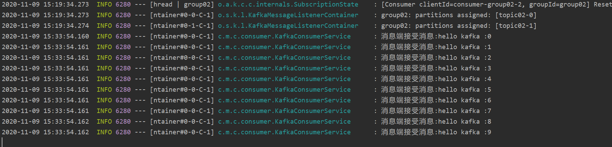
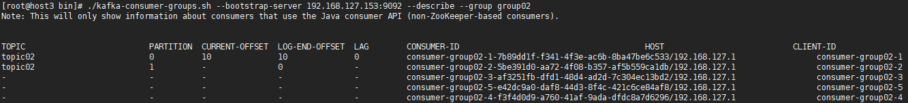

# kafka 入门-集群搭建&简单示例

## 集群搭建

### 搭建 ZooKeeper 集群

#### 1、官网下载

#### [zookeeper下载地址](https://zookeeper.apache.org/releases.html#download)

#### 2、解压安装

准备三台机器，分别解压 `apache-zookeeper-3.5.8-bin.tar.gz `到 /opt/zookeeper 下

```bash
tar -zxvf apache-zookeeper-3.5.8-bin.tar.gz -C /opt/zookeeper/
```

分别修改三台 `zookeeper `的配置文件

```bash
# 先备份配置文件，养成好习惯
cp zoo_sample.cfg zoo_sample.cfg.bk
mv zoo_sample.cfg zoo_cfg

# 创建 dataDir 文件夹和 dataLogDir 文件夹
[root@host3 zookeeper01]# mkdir -p /data/logs

# 修改配置文件中的内容，三台服务器，修改成各自的 logs 文件位置和 dataDir 位置，其余一致
dataDir=/opt/zookeeper/zookeeper01/data
dataLogDir=/opt/zookeeper/zookeeper01/data/logs
clientPort=2181
server.1=192.168.127.153:2881:3881
server.2=192.168.127.154:2882:3882
server.3=192.168.127.155:2883:3883
```

在`data`目录下创建`myid`文件，文件中填写服务实例对应的编号，三台服务器分别为1，2，3

```bash
drwxr-xr-x. 3 root root 23 Nov  8 15:05 logs
-rw-r--r--. 1 root root  2 Nov  8 14:32 myid
drwxr-xr-x. 2 root root 65 Nov  8 15:07 version-2
-rw-r--r--. 1 root root  4 Nov  8 15:05 zookeeper_server.pid
[root@host3 data]# cat myid 
1
```

#### 3、启动 zookeeper 集群`./zkServer.sh start`

```bash
-rwxr-xr-x. 1 root root  232 May  4  2020 README.txt
-rwxr-xr-x. 1 root root 2067 May  4  2020 zkCleanup.sh
-rwxr-xr-x. 1 root root 1158 May  4  2020 zkCli.cmd
-rwxr-xr-x. 1 root root 1621 May  4  2020 zkCli.sh
-rwxr-xr-x. 1 root root 1766 May  4  2020 zkEnv.cmd
-rwxr-xr-x. 1 root root 3690 May  4  2020 zkEnv.sh
-rwxr-xr-x. 1 root root 1286 May  4  2020 zkServer.cmd
-rwxr-xr-x. 1 root root 4573 May  4  2020 zkServer-initialize.sh
-rwxr-xr-x. 1 root root 9386 May  4  2020 zkServer.sh
-rwxr-xr-x. 1 root root  996 May  4  2020 zkTxnLogToolkit.cmd
-rwxr-xr-x. 1 root root 1385 May  4  2020 zkTxnLogToolkit.sh
[root@host3 bin]# ./zkServer.sh start
```


### 搭建 Kafka 集群

#### 1、确定 Kafka 和 Springboot 的版本



#### 2、下载 Kafka

[kafka下载地址](https://kafka.apache.org/downloads)

#### 3、安装 Kafka

同样准备三台服务器，在 `/opt/kafka-cluster/`目录下解压 kafka 安装包 

```bash
tar -zxvf kafka_2.11-0.11.0.3.tgz /opt/kafka-cluster/
```

创建 logs 文件夹

```bash
[root@host3 kafka01]# mkdir kafka-logs/
```

修改配置文件`server.properties`，同样先备份配置文件

```properties
# brokerId，每台kafka实例机器都有一个唯一的brokerId
broker.id=0
port=9092
host.name=192.168.127.153
advertised.host.name=192.168.127.153
# 设置为 true 表示可以手动删除 topic，方便学习使用
delete.topic.enable=true
# 日志文件夹
log.dirs=/opt/kafka-cluster/kafka01/kafka-logs
# 分区数量
num.partitions=2
# zookeeper 集群地址（这里使用的是伪集群模式的zookeeper，方便学习）
zookeeper.connect=192.168.127.153:2181,192.168.127.153:2182,192.168.127.153:2183 
```

#### 4、启动 Kafka

```bash
# kafka启动 
./bin/kafka-server-start.sh ./config/server.properties &
```


## Springboot 集成 Kafka 的简单 Demo

### 创建消费者工程和生产者工程



### pom.xml

#### 1、miao-kafka-producer

```xml
<dependencies>
     <!--lombok插件-->
        <dependency>
            <groupId>org.projectlombok</groupId>
            <artifactId>lombok</artifactId>
            <version>1.18.12</version>
        </dependency>
        <dependency>
            <groupId>com.miao</groupId>
            <artifactId>miao-common</artifactId>
            <version>1.0-SNAPSHOT</version>
        </dependency>
        <dependency>
            <groupId>org.springframework.boot</groupId>
            <artifactId>spring-boot-starter</artifactId>
        </dependency>

        <dependency>
            <groupId>org.springframework.kafka</groupId>
            <artifactId>spring-kafka</artifactId>
        </dependency>

        <dependency>
            <groupId>org.springframework.boot</groupId>
            <artifactId>spring-boot-starter-test</artifactId>
            <scope>test</scope>
        </dependency>
    </dependencies>
```

#### 2、miao-kafka-consumer

```xml
<dependencies>
    <!--lombok插件-->
        <dependency>
            <groupId>org.projectlombok</groupId>
            <artifactId>lombok</artifactId>
            <version>1.18.12</version>
        </dependency>
        <dependency>
            <groupId>com.miao</groupId>
            <artifactId>miao-common</artifactId>
            <version>1.0-SNAPSHOT</version>
        </dependency>
        <dependency>
            <groupId>org.springframework.boot</groupId>
            <artifactId>spring-boot-starter</artifactId>
        </dependency>
        <dependency>
            <groupId>org.springframework.kafka</groupId>
            <artifactId>spring-kafka</artifactId>
        </dependency>
        <dependency>
            <groupId>org.springframework.boot</groupId>
            <artifactId>spring-boot-starter-test</artifactId>
            <scope>test</scope>
        </dependency>
    </dependencies>
```

### 配置文件

#### 生产者

```yml
server:
  port: 11000
spring:
  application:
    name: kafka-producer
  kafka:
    bootstrap-servers: 192.168.127.153:9092,192.168.127.154:9092,192.168.127.155:9092
    producer:
      retries: 0 # Kafka消息发送失败重试次数
      batch-size: 16384 # 批处理大小
      buffer-memory: 33554432 # 生产者内存缓冲区大小
      key-serializer: org.apache.kafka.common.serialization.StringSerializer # 序列化配置
      value-serializer: org.apache.kafka.common.serialization.StringSerializer
      # Kafka 生产者端最重要配置
      # 确认机制，0：成功写入消息之前不会等待任何来自服务器的响应消息
      #           1：只要kafka集群的leader节点收到消息，生产者就会接收到一个来自服务器的响应
      #          -1：当所有的副本写入消息才认为本次producer请求成功（吞吐量最低，性能最差）
      acks: 1
```

#### 消费者

```yml
server:
  port: 11001
spring:
  application:
    name: kafka-consumer
  kafka:
    consumer:
      enable-auto-commit: false #  消息签收机制：手工签收
      # 当消费者读取到偏移量无效或者分区没有偏移量的情况该如何处理
      # latest(默认)当偏移量无效的情况下，消费者将从最新的记录开始读取分区
      # earliest 当偏移量无效的情况下，消费者将从起始位置读取分区记录
      auto-offset-reset: earliest
      key-deserializer: org.apache.kafka.common.serialization.StringDeserializer
      value-deserializer: org.apache.kafka.common.serialization.StringDeserializer
    listener:
      ack-mode: manual
      concurrency: 5
    bootstrap-servers: 192.168.127.153:9092
```

### 生产者服务类

> 引入`KafkaTemplate`，使用`KafkaTemplate`的 `send()`方法获得`ListenableFuture`的实例对象，并调用`addCallbac()`方法定义消息发送成功或失败返回的信息

```java
@RequiredArgsConstructor
@Slf4j
@Component
public class KafkaProducerService {

    private final KafkaTemplate<String,Object> kafkaTemplate;

    public void sendMessage(String topic,Object data) {
        ListenableFuture<SendResult<String, Object>> send = kafkaTemplate.send(topic, data);

        send.addCallback(new ListenableFutureCallback<SendResult<String, Object>>() {
            @Override
            public void onFailure(Throwable throwable) {
                log.error("消息发送失败！！！" + throwable.getMessage());
            }

            @Override
            public void onSuccess(SendResult<String, Object> result) {
                log.info("消息发送成功 " + result.toString());
            }
        });
    }
}
```

### 消费者服务类

> 使用 `@KafkaListener`注解定义消费者组的 Id ，并指定消费的主题

```java
@Slf4j
@Component
public class KafkaConsumerService {

    @KafkaListener(groupId = "group02", topics = "topic02")
    public void onMessage(ConsumerRecord<String,Object> record, Acknowledgment acknowledgment, Consumer<?,?> consumer) {
        log.info("消息端接受消息:{}",record.value());
        acknowledgment.acknowledge();
    }
}

```

### 创建主题：topic02

我们在服务器中连接`Kafka`的客户端进行主题的查询，新增，删除操作

```bash
# 查看所有主题 
./kafka-topics.sh --zookeeper 192.168.127.153:2181 --list
# 创建主题
 ./kafka-topics.sh --zookeeper 192.168.127.153:2181 --create --topic [主题名称] --partitions [分区个数] --replication-factor [副本个数]
 # 根据名称删除主题
./kafka-topics.sh --delete --zookeeper 192.168.127.153:2181 --topic [主题名称]
```

### 启动消费端服务，查看日志输出

从日志输出的信息我们可以得知，消费组的名称为：group02，并创建了两个 partition(分区)



### 编写测试类，测试生产出来的消息是否可以被正确消费

测试类比较简单，循环十次，生产 10 条消息并加上循环次数以示区分

```java
@RunWith(SpringRunner.class)
@SpringBootTest
public class TestProducer {

    @Resource
    KafkaProducerService kafkaProducerService;

    @Test
    public void testProducer() {
        String topic = "topic02";
        for (int i = 0; i < 10; i++) {
            kafkaProducerService.sendMessage(topic,"hello kafka :"+i);
        }
    }
}
```

### 查看测试结果

启动测试类，可以在消费端的日志中查询到消费信息



同样，我们在 Kafka 中借助客户端命令可以查询到这次消费记录，从下图中可以看出，这十条消息被消费端两个 partition 消费了，`LAG`表示消息积压数量，0可以得知消息全部被消费了，并且`CURRENT-OFFSET`记录消息的偏移量也来到了 10 的位置，说明前面有 10 条消息已经被消费了

```bash
./kafka-consumer-groups.sh --bootstrap-server 192.168.127.153:9092 --describe --group group02
```




