# RabbitMQ消息服务用户手册

 

# 1  架构设计

## 1.1  服务架构概述

架构：RabbitMQ Cluster + Queue HA + Haproxy + Keepalived

解释：3台rabbitMQ服务器构建broker集群，允许任意2台服务器故障而服务不受影响，在此基础上，通过Queue HA （queue mirror）实现队列的高可用，在本例中镜像到所有服务器节点（即1个master，2个slave）；为保证客户端访问入口地址的唯一性，通过haproxy做4层代理来提供MQ服务，并通过简单的轮询方式来进行负载均衡，设置健康检查来屏蔽故障节点对客户端的影响；使用2台haproxy并且通过keepalived实现客户端访问入口的高可用机制。

## 1.2  服务架构设计

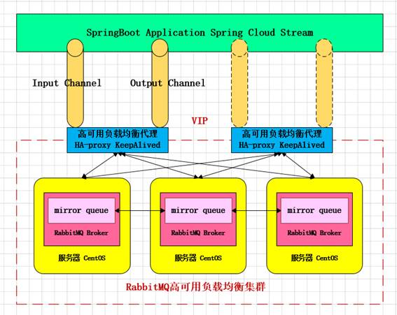

## 1.3  服务节点分配

| 服务器IP      | hostname | 节点说明           | 端口 | 管控台地址                                                   |
| ------------- | -------- | ------------------ | ---- | ------------------------------------------------------------ |
| 192.168.11.71 | bhz71    | rabbitmq  master   | 5672 | http://192.168.11.71:15672                                   |
| 192.168.11.72 | bhz72    | rabbitmq  slave    | 5672 | http://192.168.11.72:15672                                   |
| 192.168.11.73 | bhz73    | rabbitmq  slave    | 5672 | http://192.168.11.73:15672                                   |
| 192.168.11.74 | bhz74    | haproxy+keepalived | 8100 | [http://192.168.11.74:8100/rabbitmq-stats](http://192.168.1.27:8100/rabbitmq-stats) |
| 192.168.11.75 | bhz75    | haproxy+keepalived | 8100 | [http://192.168.11.75:8100/rabbitmq-stats](http://192.168.1.28:8100/rabbitmq-stats) |

 

 

 

## 1.4  官方文档手册

集群配置文档：http://www.rabbitmq.com/clustering.html

镜像队列文档：http://www.rabbitmq.com/ha.html

集群操作文档：http://www.rabbitmq.com/man/rabbitmqctl.1.man.html

**中文版AMQP用户手册：**

**Spring AMQP****文档：http://www.blogjava.net/qbna350816/category/55056.html?Show=All**

**事务文档：http://www.blogjava.net/qbna350816/archive/2016/08/13/431567.html**

 

 

# 2  集群搭建

## 2.1  集群节点安装

### 1、安装依赖包

PS:安装rabbitmq所需要的依赖包

```bash
  yum install  build-essential openssl openssl-devel unixODBC unixODBC-devel make gcc  gcc-c++ kernel-devel m4 ncurses-devel tk tc xz     
```


### 2、下载安装包

```bash
wget [www.rabbitmq.com/releases/erlang/erlang-18.3-1.el7.centos.x86_64.rpm](http://www.rabbitmq.com/releases/erlang/erlang-18.3-1.el7.centos.x86_64.rpm)  

wget  http://repo.iotti.biz/CentOS/7/x86_64/socat-1.7.3.2-5.el7.lux.x86_64.rpm 

wget  www.rabbitmq.com/releases/rabbitmq-server/v3.6.5/[**rabbitmq-server-3.6.5-1.noarch.rpm**](https://github.com/rabbitmq/rabbitmq-server/releases/download/rabbitmq_v3_6_5/rabbitmq-server-3.6.5-1.noarch.rpm)  
```


### 3、安装服务命令

```bash
rpm -ivh erlang-18.3-1.el7.centos.x86_64.rpm 
rpm -ivh socat-1.7.3.2-1.1.el7.x86_64.rpm
rpm -ivh rabbitmq-server-3.6.5-1.noarch.rpm
//卸载
rpm -qa | grep rabbitmq
rpm -e --allmatches rabbitmq-server-3.6.5-1.noarch
rpm -qa | grep erlang
rpm -e --allmatches erlang-18.3-1.el7.centos.x86_64
rpm -qa | grep socat
rpm -e --allmatches socat-1.7.3.2-5.el7.lux.x86_64
rm -rf /usr/lib/rabbitmq/ /etc/rabbitmq/ /var/lib/rabbitmq/
```


 

### 4、修改集群用户与连接心跳检测

 ```bash
注意修改vim /usr/lib/rabbitmq/lib/rabbitmq_server-3.6.5/ebin/rabbit.app文件
修改：loopback_users 中的 <<"guest">>,只保留guest
修改：heartbeat 为10

 ```


### 5、安装管理插件

```bash
//首先启动服务
/etc/init.d/rabbitmq-server start stop status restart
//查看服务有没有启动： lsof -i:5672
rabbitmq-plugins enable rabbitmq_management
//可查看管理端口有没有启动： lsof -i:15672 或者 netstat -tnlp|grep 15672
```


### 6、服务指令

```bash
/etc/init.d/rabbitmq-server start stop status restart
验证单个节点是否安装成功：http://192.168.11.71:15672/
Ps：以上操作三个节点（71、72、73）同时进行操作
```


## 2.2  文件同步步骤

**PS：选择71、72、73任意一个节点为Master（这里选择71为Master），也就是说我们需要把71的Cookie文件同步到72、73节点上去，进入/var/lib/rabbitmq目录下，把/var/lib/rabbitmq/.erlang.cookie文件的权限修改为777，原来是400；然后把.erlang.cookie文件copy到各个节点下；最后把所有cookie文件权限还原为400即可。**

```bash
//进入目录修改权限；远程copy72、73节点
scp /var/lib/rabbitmq/.erlang.cookie 192.168.11.72:/var/lib/rabbitmq/
scp /var/lib/rabbitmq/.erlang.cookie 192.168.11.73:/var/lib/rabbitmq/
```

 

## 2.3  组成集群步骤

### 1、停止MQ服务

**PS:我们首先停止3个节点的服务：(这里不能使用原来的命令：/etc/init.d/rabbitmq-server stop)**

```bash
  rabbitmqctl  stop  
```

### 2、组成集群操作

PS:接下来我们就可以使用集群命令，配置71、72、73为集群模式，3个节点（71、72、73）执行启动命令，后续启动集群使用此命令即可。

```bash
rabbitmq-server -detached
```

### 3、slave加入集群操作（重新加入集群也是如此，以最开始的主节点为加入节点）

```bash
//注意做这个步骤的时候：需要配置/etc/hosts 必须相互能够寻址到
bhz72：rabbitmqctl stop_app
bhz72：rabbitmqctl join_cluster --ram rabbit@bhz71
bhz72：rabbitmqctl start_app
bhz73：rabbitmqctl stop_app
bhz73：rabbitmqctl join_cluster rabbit@bhz71
bhz73：rabbitmqctl start_app
//在另外其他节点上操作要移除的集群节点
rabbitmqctl forget_cluster_node rabbit@bhz71

```

### 4、修改集群名称

**PS:修改集群名称（默认为第一个node名称）：**

```bash
rabbitmqctl set_cluster_name rabbitmq_cluster1

```

### 5、查看集群状态

**PS:最后在集群的任意一个节点执行命令：查看集群状态**

```bash
  rabbitmqctl  cluster_status  
```

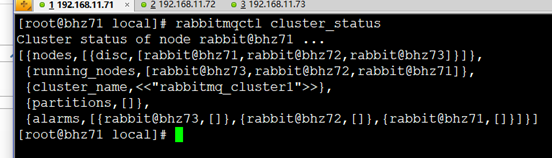

### 6、管控台界面

PS: 访问任意一个管控台节点：http://192.168.11.71:15672 如图所示

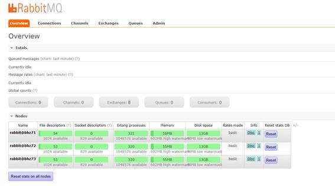

## 2.4  配置镜像队列

PS:设置镜像队列策略（在任意一个节点上执行）

```bash
  rabbitmqctl set_policy ha-all "^"  '{"ha-mode":"all"}'  
  
```

> 将所有队列设置为镜像队列，即队列会被复制到各个节点，各个节点状态一致，RabbitMQ高可用集群就已经搭建好了,我们可以重启服务，查看其队列是否在从节点同步。


## 2.5  消息一致性问题

在使用rabbitmq中，消息的一致性是非常重要的一个话题。下面我们来研究一下，在数据一致性方面，有哪些需要关注的。发送者发送消息出来，在数据一致性的要求下，我们通常认为必须达到以下条件

broker持久化消息

publisher知道消息已经成功持久化

首先，我们可以采用事务来解决此问题。每个消息都必须经历以上两个步骤，就算一次事务成功。

事务是同步的。因此，如果采用事务，发送性能必然很差。官方给出来的性能是：


异步的方法的效率是事务方法效率的100倍。

我们可以采用异步的方式来解决此问题。publisher发送消息后，不进行等待，而是异步监听是否成功。这种方式又分为两种模式，一种是return，另一种是confirm. 前一种是publisher发送到exchange后，异步收到消息。第二种是publisher发送消息到exchange,queue,consumer收到消息后才会收到异步收到消息。可见，第二种方式更加安全可靠。如下所示：

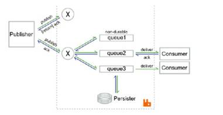

但是，异步也存在些局限性。如果一旦出现broker挂机或者网络不稳定，broker已经成功接收消息，但是publisher并没有收到confirm或return.这时，对于publisher来说，只能重发消息解决问题。而在这里面，我们会发生重复消息的问题。当然，如果业务类型要求数据一致性非常高，可以采用低效率的事务型解决方案：引用：http://www.rabbitmq.com/blog/2011/02/10/introducing-publisher-confirms/

 

## 2.6  安装Ha-Proxy 

### 1、Haproxy简介

HAProxy是一款提供高可用性、负载均衡以及基于TCP和HTTP应用的代理软件，HAProxy是完全免费的、借助HAProxy可以快速并且可靠的提供基于TCP和HTTP应用的代理解决方案。

HAProxy适用于那些负载较大的web站点，这些站点通常又需要会话保持或七层处理。

HAProxy可以支持数以万计的并发连接,并且HAProxy的运行模式使得它可以很简单安全的整合进架构中，同时可以保护web服务器不被暴露到网络上。

PS:haproxy学习博客：https://www.cnblogs.com/f-ck-need-u/p/8540805.html

### 2、Haproxy安装

**PS:74、75节点同时安装Haproxy，下面步骤统一**

```bash
//下载依赖包
//下载haproxy
wget http://www.haproxy.org/download/1.6/src/haproxy-1.6.5.tar.gz
//解压
tar -zxvf haproxy-1.6.5.tar.gz -C /usr/local
//进入目录、进行编译、安装
cd /usr/local/haproxy-1.6.5
make TARGET=linux31 PREFIX=/usr/local/haproxy
make install PREFIX=/usr/local/haproxy
mkdir /etc/haproxy
//赋权
groupadd -r -g 149 haproxy
useradd -g haproxy -r -s /sbin/nologin -u 149 haproxy
//创建haproxy配置文件
touch /etc/haproxy/haproxy.cfg
```


 

### 3、Haproxy配置

PS:haproxy 配置文件haproxy.cfg详解

```bash
 vim  /etc/haproxy/haproxy.cfg  
```

```bash
#logging options
global
	log 127.0.0.1 local0 info
	maxconn 5120
	chroot /usr/local/haproxy
	uid 99
	gid 99
	daemon
	quiet
	nbproc 20
	pidfile /var/run/haproxy.pid

defaults
	log global
	#使用4层代理模式，”mode http”为7层代理模式
	mode tcp
	#if you set mode to tcp,then you nust change tcplog into httplog
	option tcplog
	option dontlognull
	retries 3
	option redispatch
	maxconn 2000
	contimeout 10s
     ##客户端空闲超时时间为 60秒 则HA 发起重连机制
     clitimeout 10s
     ##服务器端链接超时时间为 15秒 则HA 发起重连机制
     srvtimeout 10s	
#front-end IP for consumers and producters

listen rabbitmq_cluster
	bind 0.0.0.0:5672
	#配置TCP模式
	mode tcp
	#balance url_param userid
	#balance url_param session_id check_post 64
	#balance hdr(User-Agent)
	#balance hdr(host)
	#balance hdr(Host) use_domain_only
	#balance rdp-cookie
	#balance leastconn
	#balance source //ip
	#简单的轮询
	balance roundrobin
	#rabbitmq集群节点配置 #inter 每隔五秒对mq集群做健康检查， 2次正确证明服务器可用，2次失败证明服务器不可用，并且配置主备机制
        server bhz71 192.168.11.71:5672 check inter 5000 rise 2 fall 2
        server bhz72 192.168.11.72:5672 check inter 5000 rise 2 fall 2
        server bhz73 192.168.11.73:5672 check inter 5000 rise 2 fall 2
#配置haproxy web监控，查看统计信息
listen stats
	bind 192.168.11.74:8100
	mode http
	option httplog
	stats enable
	#设置haproxy监控地址为http://localhost:8100/rabbitmq-stats
	stats uri /rabbitmq-stats
	stats refresh 5s
```


### 4、启动haproxy

```bash
/usr/local/haproxy/sbin/haproxy -f /etc/haproxy/haproxy.cfg
//查看haproxy进程状态
```

### 5、访问haproxy

PS:访问如下地址可以对rmq节点进行监控：[http://192.168.11.74:8100/rabbitmq-stats](http://192.168.1.27:8100/rabbitmq-stats)

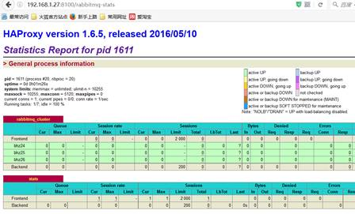

### 6、关闭haproxy

```bash
killall haproxy
ps -ef | grep haproxy
netstat -tunpl | grep haproxy
ps -ef |grep haproxy |awk '{print $2}'|xargs kill -9
```


 

## 2.7  安装KeepAlived 

 

### 1、Keepalived简介

Keepalived，它是一个高性能的服务器高可用或热备解决方案，Keepalived主要来防止服务器单点故障的发生问题，可以通过其与Nginx、Haproxy等反向代理的负载均衡服务器配合实现web服务端的高可用。Keepalived以VRRP协议为实现基础，用VRRP协议来实现高可用性（HA）.VRRP（Virtual Router Redundancy Protocol）协议是用于实现路由器冗余的协议，VRRP协议将两台或多台路由器设备虚拟成一个设备，对外提供虚拟路由器IP（一个或多个）。

 

### 2、Keepalived安装

**PS:下载地址：http://www.keepalived.org/download.html**

```bash
//安装所需软件包
yum install -y openssl openssl-devel
//下载
wget http://www.keepalived.org/software/keepalived-1.2.18.tar.gz
//解压、编译、安装
tar -zxvf keepalived-1.2.18.tar.gz -C /usr/local/
cd ..
cd keepalived-1.2.18/ && ./configure --prefix=/usr/local/keepalived
make && make install
//将keepalived安装成Linux系统服务，因为没有使用keepalived的默认安装路径（默认路径：/usr/local）,安装完成之后，需要做一些修改工作
//首先创建文件夹，将keepalived配置文件进行复制：
mkdir /etc/keepalived
cp /usr/local/keepalived/etc/keepalived/keepalived.conf /etc/keepalived/
//然后复制keepalived脚本文件：
cp /usr/local/keepalived/etc/rc.d/init.d/keepalived /etc/init.d/
cp /usr/local/keepalived/etc/sysconfig/keepalived /etc/sysconfig/
ln -s /usr/local/sbin/keepalived /usr/sbin/
//如果存在则进行删除: rm /sbin/keepalived
ln -s /usr/local/keepalived/sbin/keepalived /sbin/
//可以设置开机启动：chkconfig keepalived on，到此我们安装完毕!
chkconfig keepalived on

```

### 3、Keepalived配置

PS:修改keepalived.conf配置文件

```bash
vim /etc/keepalived/keepalived.conf
```

 

**PS: 79节点（Master）配置如下**

```bash
! Configuration File for keepalived

global_defs {
   router_id bhz74  ##标识节点的字符串，通常为hostname

}

vrrp_script chk_haproxy {
    script "/etc/keepalived/haproxy_check.sh"  ##执行脚本位置
    interval 2  ##检测时间间隔
    weight -20  ##如果条件成立则权重减20
}

vrrp_instance VI_1 {
    state MASTER  ## 主节点为MASTER，备份节点为BACKUP
    interface eno16777736 ## 绑定虚拟IP的网络接口（网卡），与本机IP地址所在的网络接口相同（我这里是eth0）
    virtual_router_id 74  ## 虚拟路由ID号（主备节点一定要相同）
    mcast_src_ip 192.168.11.74 ## 本机ip地址
    priority 100  ##优先级配置（0-254的值）
    nopreempt
    advert_int 1  ## 组播信息发送间隔，俩个节点必须配置一致，默认1s
authentication {  ## 认证匹配
        auth_type PASS
        auth_pass bhz
    }

    track_script {
        chk_haproxy
    }

    virtual_ipaddress {
        192.168.11.70  ## 虚拟ip，可以指定多个
    }
}
```

**PS: 80节点（backup）配置如下**

```bash
! Configuration File for keepalived

global_defs {
   router_id bhz75  ##标识节点的字符串，通常为hostname

}

vrrp_script chk_haproxy {
    script "/etc/keepalived/haproxy_check.sh"  ##执行脚本位置
    interval 2  ##检测时间间隔
    weight -20  ##如果条件成立则权重减20
}

vrrp_instance VI_1 {
    state BACKUP  ## 主节点为MASTER，备份节点为BACKUP
    interface eno16777736 ## 绑定虚拟IP的网络接口（网卡），与本机IP地址所在的网络接口相同（我这里是eno16777736）
    virtual_router_id 74  ## 虚拟路由ID号（主备节点一定要相同）
    mcast_src_ip 192.168.11.75  ## 本机ip地址
    priority 90  ##优先级配置（0-254的值）
    nopreempt
    advert_int 1  ## 组播信息发送间隔，俩个节点必须配置一致，默认1s
authentication {  ## 认证匹配
        auth_type PASS
        auth_pass bhz
    }

    track_script {
        chk_haproxy
    }

    virtual_ipaddress {
        192.168.1.70  ## 虚拟ip，可以指定多个
    }
}
```


### 4、执行脚本编写

**PS:添加文件位置为/etc/keepalived/haproxy_check.sh（74、75两个节点文件内容一致即可）**

```bash
#!/bin/bash
COUNT=`ps -C haproxy --no-header |wc -l`
if [ $COUNT -eq 0 ];then
    /usr/local/haproxy/sbin/haproxy -f /etc/haproxy/haproxy.cfg
    sleep 2
    if [ `ps -C haproxy --no-header |wc -l` -eq 0 ];then
        killall keepalived
    fi
fi

```


### 5、执行脚本赋权

**PS:haproxy_check.sh脚本授权,赋予可执行权限.**

```bash
chmod +x /etc/keepalived/haproxy_check.sh
```

### 6、启动keepalived

**PS:当我们启动俩个haproxy节点以后，我们可以启动keepalived服务程序：**

```bash
//如果74、75的haproxy没有启动则执行启动脚本
/usr/local/haproxy/sbin/haproxy -f /etc/haproxy/haproxy.cfg
//查看haproxy进程状态
ps -ef | grep haproxy
//启动两台机器的keepalived
service keepalived start | stop | status | restart
//查看状态
ps -ef | grep haproxy
ps -ef | grep keepalived

```


### 7、高可用测试

**PS:vip在27节点上**

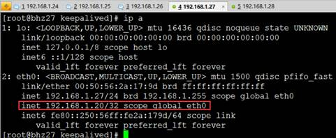

**PS:27节点宕机测试：停掉27的keepalived服务即可。**

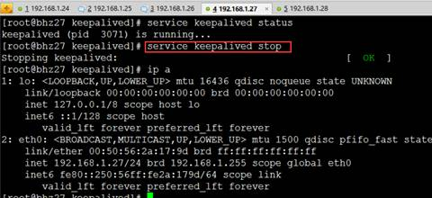

**PS:查看28节点状态：我们发现VIP漂移到了28节点上，那么28节点的haproxy可以继续对外提供服务！**

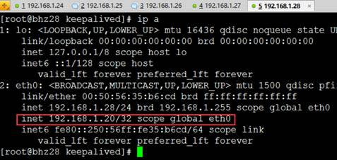

 

 

## 2.8  集群配置文件

创建如下配置文件位于：/etc/rabbitmq目录下（这个目录需要自己创建）

环境变量配置文件：rabbitmq-env.conf

配置信息配置文件：rabbitmq.config（可以不创建和配置，修改）

rabbitmq-env.conf配置文件：

---------------------------------------关键参数配置-------------------------------------------

RABBITMQ_NODE_IP_ADDRESS=本机IP地址

RABBITMQ_NODE_PORT=5672

RABBITMQ_LOG_BASE=/var/lib/rabbitmq/log

RABBITMQ_MNESIA_BASE=/var/lib/rabbitmq/mnesia

 

配置参考参数如下：

RABBITMQ_NODENAME=FZTEC-240088 节点名称

RABBITMQ_NODE_IP_ADDRESS=127.0.0.1 监听IP

RABBITMQ_NODE_PORT=5672 监听端口

RABBITMQ_LOG_BASE=/data/rabbitmq/log 日志目录

RABBITMQ_PLUGINS_DIR=/data/rabbitmq/plugins 插件目录

RABBITMQ_MNESIA_BASE=/data/rabbitmq/mnesia 后端存储目录

更详细的配置参见： http://www.rabbitmq.com/configure.html#configuration-file

 

配置文件信息修改：

/usr/lib/rabbitmq/lib/rabbitmq_server-3.6.4/ebin/rabbit.app和rabbitmq.config配置文件配置任意一个即可，我们进行配置如下：

vim /usr/lib/rabbitmq/lib/rabbitmq_server-3.6.4/ebin/rabbit.app

-------------------------------------关键参数配置----------------------------------------

tcp_listerners 设置rabbimq的监听端口，默认为[5672]。
 disk_free_limit 磁盘低水位线，若磁盘容量低于指定值则停止接收数据，默认值为{mem_relative, 1.0},即与内存相关联1：1，也可定制为多少byte.
 vm_memory_high_watermark，设置内存低水位线，若低于该水位线，则开启流控机制，默认值是0.4，即内存总量的40%。
 hipe_compile 将部分rabbimq代码用High Performance Erlang compiler编译，可提升性能，该参数是实验性，若出现erlang vm segfaults，应关掉。
 force_fine_statistics， 该参数属于rabbimq_management，若为true则进行精细化的统计，但会影响性能

\------------------------------------------------------------------------------------------

更详细的配置参见：http://www.rabbitmq.com/configure.html

 

## 2.9  服务测试运行

### 1、集群启动

#### rabbitMQ集群启动： 

```bash
//启动各个MQ节点
rabbitmq-server -detached
//查看集群状态
rabbitmqctl cluster_status

```

#### rabbitMQ集群关闭：

  ```bash
//各节点停止MQ集群命令
rabbitmqctl stop_app | start_app | cluster_status | reset
//各节点停止MQ服务
/etc/init.d/rabbitmq-server stop | start | restart | status

  ```

 

设置keepalived开机启动后，则会直接运行chk_haproxy.sh脚本，从而启动haproxy服务，所以对于负载均衡和高可用层我们无需任何配置。

PS:由《2.2章节 MQ服务架构图》所示。我们的虚拟VIP节点为192.168.1.20，所以我们进行MQ服务生产消费消息测试。

 

### 2、测试代码

 

**PS: MQ Sender代码**

 

```java
package bhz.rabbitmq.helloword;

import java.util.concurrent.ExecutorService;
import java.util.concurrent.Executors;
import java.util.concurrent.TimeUnit;

import com.rabbitmq.client.Address;
import com.rabbitmq.client.Channel;
import com.rabbitmq.client.Connection;
import com.rabbitmq.client.ConnectionFactory;
  
/**
 * <B>中文类名：</B>rabbitmq负载均衡测试<BR>
 * <B>概要说明：</B><BR>
 * @author bhz（Alienware）
 * @since 2016年7月20日
 */
public class Sender {  
      
    public static void main(String[] args) throws Exception {  
          
    	ConnectionFactory connectionFactory = new ConnectionFactory() ;  
    	
        //RabbitMQ-Server安装在本机，所以直接用127.0.0.1  
        connectionFactory.setHost("192.168.1.20");
        connectionFactory.setPort(5672);
        Connection connection = connectionFactory.newConnection();
        Channel channel = connection.createChannel() ;  
        //定义Queue名称  
        String queueName = "queue01" ;  
        //为channel定义queue的属性，queueName为Queue名称  
        channel.queueDeclare(queueName , false, false, false, null) ;  
        for(int i =0; i < 100000; i ++){
            //发送消息  
        	String msg = "Hello World RabbitMQ " + i;
            channel.basicPublish("", queueName , null , msg.getBytes());         	
            System.out.println("发送数据：" + msg);
            TimeUnit.SECONDS.sleep(1);
        }
        channel.close();   
        connection.close();   
    }  
}  
```


**PS: MQ Receiver代码**

```java
package bhz.rabbitmq.helloword;

import java.util.concurrent.ExecutorService;
import java.util.concurrent.Executors;

import com.rabbitmq.client.Address;
import com.rabbitmq.client.Channel;
import com.rabbitmq.client.Connection;
import com.rabbitmq.client.ConnectionFactory;
import com.rabbitmq.client.QueueingConsumer;
import com.rabbitmq.client.QueueingConsumer.Delivery;

/**
 * <B>中文类名：</B>rabbitmq 负载均衡测试<BR>
 * <B>概要说明：</B><BR>
 * @author bhz（Alienware）
 * @since 2016年7月20日
 */
public class Receiver {  
    public static void main(String[] args) throws Exception {  
        ConnectionFactory connectionFactory = new ConnectionFactory() ;  
        connectionFactory.setHost("192.168.1.20");
        connectionFactory.setPort(5672);
        Connection connection = connectionFactory.newConnection();
        Channel channel = connection.createChannel() ;  
        String queueName = "queue01";  
        channel.queueDeclare(queueName, false, false, false, null) ;     
        //上面的部分，与Sender01是一样的  
        //配置好获取消息的方式  
        QueueingConsumer consumer = new QueueingConsumer(channel) ;  
        channel.basicConsume(queueName, true, consumer) ;  
        //循环获取消息  
        while(true){  
            //获取消息，如果没有消息，这一步将会一直阻塞  
            Delivery delivery = consumer.nextDelivery() ;  
            String msg = new String(delivery.getBody()) ;    
            System.out.println("收到消息：" + msg);  
        }  
    }  
}  
```

 

### 3、测试结果

PS: Sender程序启动发送5条数据：

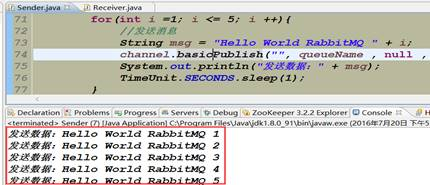

**PS:我们在MQ集群管控台查看队列情况，说明生产者消息发送到MQ集群中**。

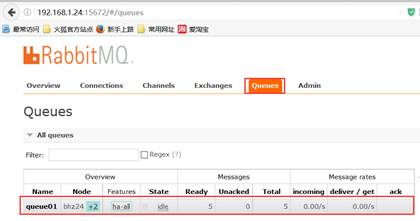

 

**PS:并且任意MQ节点执行如下命令：由下图可知我们镜像队列配置成功。**

```bash
//查看镜像队列的状态，同步到了24 25  26三个节点上  
rabbitmqctl  list_queues name pid slave_pids  
```

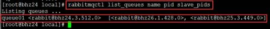

 

**PS: Received程序启动成功接收5条数据**

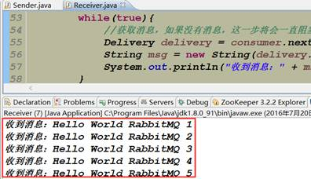

**PS:查看集群队列消费状态：已经成功消费数据**

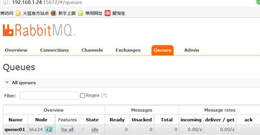

# 3  运维手册

## 3.1  集群节点重置

停止所有服务后，删除 /var/lib/rabbitmq/mnesia 文件夹内容，重新再启动每个节点！（重新进行集群的初始化等工作，重新操作<<3.3章组成集群操作即可>>）

## 3.2  集群管理操作

### 3.2.1  集群配置管理

1、首先，我们在管控台里可以对集群的vhost、exchange、queue、用户等进行增删改查。

我们在overview的最下面Import / export definitions中 可以下载（当前集群配置）和上传（修改集群）配置，这些配置为json格式。如图所示：。

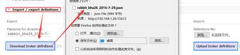

2、json文件如图所示，形如：


3、也就是说我们可以使用json的方式去通过管控台web界面去对集群配置进行修改。

### 3.2.2  集群用户管理

1、 我们点击admin标签，如图所示：

2

2、 下面会列出当前用户列表，可以进行增删改查操作，如下图所示：

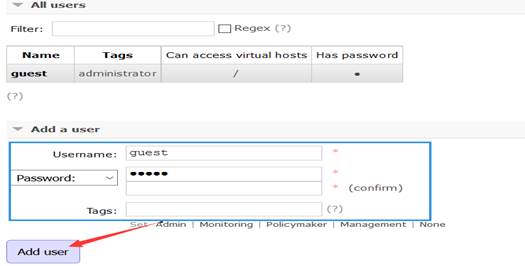

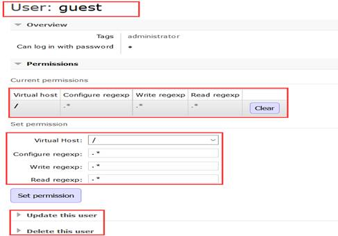

### 3.2.3  交换机、队列

PS:交换机（exchange）

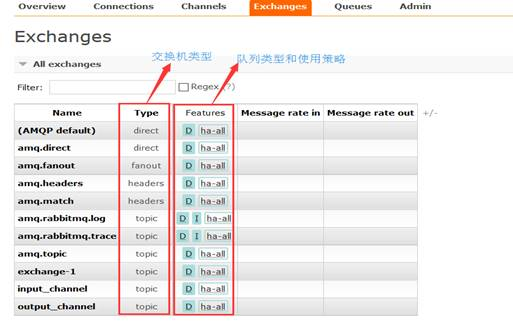

PS:队列（queue）

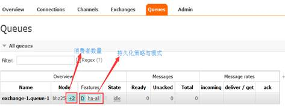

### 3.2.4  安装管理脚本

 

安装rabbitmqadmin管理脚本，唯一的要求就是unix系统中存在Python即可。我， 只需要从之前所安装好的management插件中获取该脚本即可。执行命令如下所示：

| cd /etc/rabbitmq  wget http://localhost:15672/cli/rabbitmqadmin  chmod +x rabbitmqadmin |
| ------------------------------------------------------------ |
| 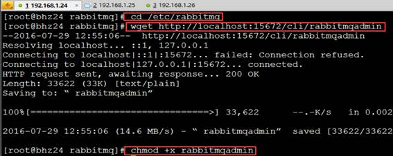    |

### 3.2.5  使用管理脚本

1、查看虚拟主机（vhost）下的交换机队列（exchange queues）

| rabbitmqadmin -V "/" list  exchanges                      |
| --------------------------------------------------------- |
| 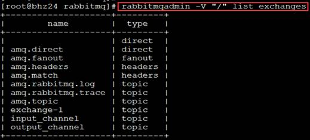 |

2、清空队列

| rabbitmqadmin purge queue  name=exchange-1.queue-1        |
| --------------------------------------------------------- |
| 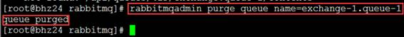 |

3、 创建交换机

| rabbitmqadmin -u guest -p guest declare  exchange \name=exchange-2 type=fanout |
| ------------------------------------------------------------ |
|     |

 

 

4、 获得链接数、关闭链接

| rabbitmqadmin list connections name  rabbitmqadmin close connection  name="链接名称" |
| ------------------------------------------------------------ |
|     |

 

PS:更多管理员操作命令详见文档：


## 1.1  集群应用监控

 

生产注意问题：https://blog.csdn.net/astiantian/article/details/84231578

按默认配置安装完RabbitMQ后，发现其File descriptors（即文件描述符）和Socket descriptors都特别低，分别为924和829。客户端（消费者）保持长连接时很容易就将socket占满。

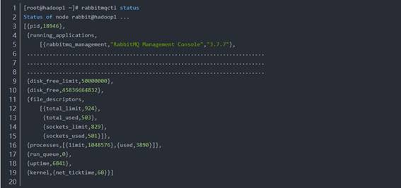

 

经查该问题是由于系统当前的`ulimit -n`仅为1024，rabbitmq在启动时会进行如下换算：


  file_limit  = 1024 - 100; // 924  sockets_limit  = trunc((1024 - 100) * 0.9 - 2); //829  

 

RabbitMQ的File descriptors（文件描述符）的数量受到三个参数的约束：

（1）系统级别，配置文件为：/proc/sys/fs/file-max，如果太小需要修改。


  [root@hadoop1  ~]# cat /proc/sys/fs/file-max   778230  [root@hadoop1  ~]# cat /proc/sys/fs/file-nr   2432  0    778230  

 

（2）用户级别，配置文件为：`/etc/security/limits.conf`

  * -  nofile 65536``  

``

```
 
（3）`进程级别，即`ulimit -n
```

  #修改  [root@hadoop1  ~]# ulimit -n 65536``  

``

以上三个参数都确认>=我们需要的连接数后，重启RabbitMQ，注意需要连Erlang一起重启：``

重启后即可看到效果。

 

## 1.2  集群性能优化

## 1.3  集群镜像恢复

# 2  制定扩展

## 2.1  延迟队列插件

\#step1：upload the ‘rabbitmq_delayed_message_exchange-0.0.1.ez’ file: 

https://github.com/rabbitmq/rabbitmq-delayed-message-exchange

http://www.rabbitmq.com/community-plugins.html

https://bintray.com/rabbitmq/community-plugins/rabbitmq_delayed_message_exchange/v3.6.x#files/

 

\#step2：PUT Directory：

/usr/lib/rabbitmq/lib/rabbitmq_server-3.6.4/plugins

\#step3：Then run the following command:

Start the rabbitmq cluster for command ##　rabbitmq-server -detached

rabbitmq-plugins enable rabbitmq_delayed_message_exchange

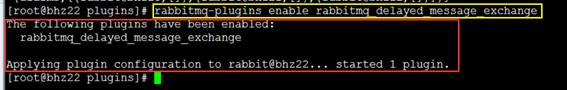

访问地址：http://192.168.1.21:15672/#/exchanges，添加延迟队列

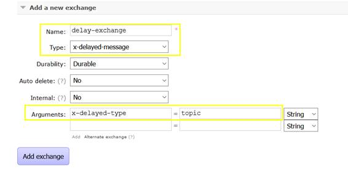

 