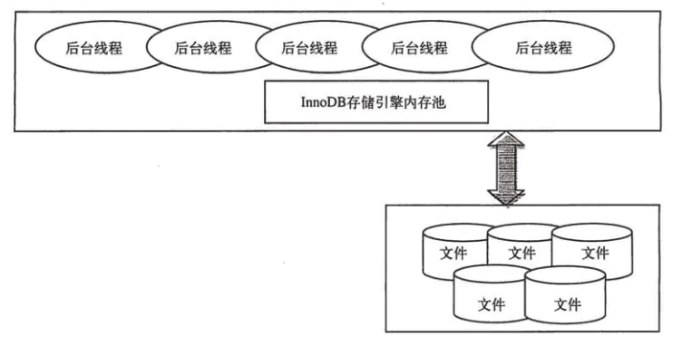
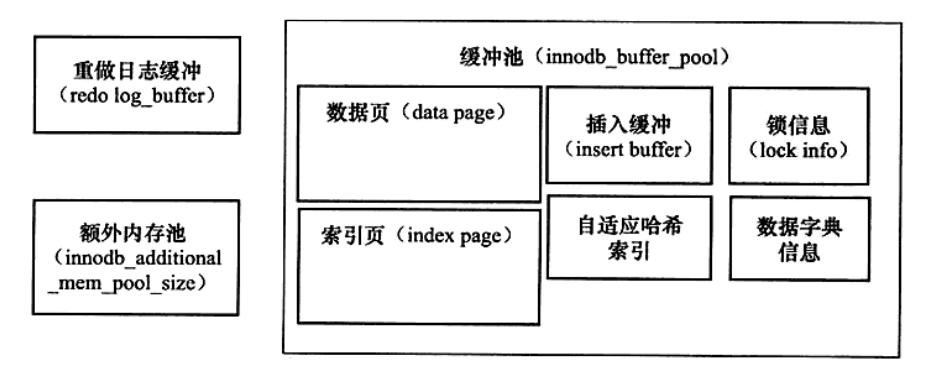

# InnoDB体系结构

 下图简单显示了InnoDB的存储引擎的体系架构

我们知道mysql是单进程多线程的模式来进行工作的，上图也显示了在使用InnoDB引擎的内存池，同时有多个线程在工作，那么下面介绍下这些后台线程。

## 后台线程

### Master Thread

Master Thread是最核心的后台线程，主要负责将缓冲池中的数据异步刷新到磁盘，保证数据的一致性，包括脏页的刷新，insert buffer，undo页的回收等。

### IO Thread

在Innodb存储引擎中大量使用AIO来处理IO请求，IO Thread主要负责的是IO请求的回调，一共有四个。4个IO thread为 insert buffer thread，log thread，read thread，write thread，

### Purge Thread

回收已经使用并分配的undo页（事务提交后，其所使用的undolog不再需要）

### Page Cleaner Thread

负责脏页的刷新，在InnoDB1.2.x之前是由master thread来完成，引入该线程其目的是为了减轻master thread的工作以及用户查询线程的阻塞。

注意：1）undo日志：存储事务开始前的数据，若发生回滚，则将undo日志里的数据用来恢复

​			2）redo日志：备份事务开始时改变的数据，在提交事务之前，需要将redo日志持久化。因为innodb采用缓存池的方式，数据插入到数据库中，并不会马上改变磁盘上的数据，redo日志是保证一致性的保障

## 内存结构

### 缓冲池

InnoDB是基于磁盘来存储的，因为磁盘的io的速度较慢，所以在内存来弥补磁盘速度较慢对数据库性能的影响，在数据库中读取页时，首先将磁盘读到的页存放到缓冲池中，下一次再读取相同的页时，首先判断该页在不在缓冲池中，若在，则直接读取该页，否则读取磁盘的页。

对于数据库中页的修改操作，则首先修改缓冲池中的页，然后再以一定的频率刷新到磁盘，并不是修改了一定会刷新到磁盘中，而是通过一种叫**checkpoint**的机制刷新回磁盘，提高了数据库的整体性能。

### 缓冲池的管理

1. 通过**LRU（**Lastest Recent Used）算法进行管理，最频繁使用的页在LRU列表的前端，而最少使用的页在LRU列表的尾端。当缓冲池不能存放新读取到的页时，将首先释放LRU列表中尾端的页。
2. 算法优化（midpoint insertion strategy）新读取到的页，虽然是最新访问的页，但并不是直接放入到LRU列表的首部，而是放入到LRU列表的midpoint位置。
3. innodb_old_blocks_time用于表示页读取到mid位置后需要等待多久才会被加入到LRU列表的热端。
4. 当需要从缓冲池分页时，首先从Free列表中查找是否有可用的空闲页，如有则将该页从Free列表中删除，放入到LRU列表中，否则，根据LRU算法，淘汰LRU列表末尾的页，将该内存空间分配给新的页。当页从LRU列表的old部分加入到new部分时，称此时发生的操作为page made young；而因为innodb_old_blocks_time的设置而导致页没有从old部分移动到new部分的操作称为page not made young。
5. buffer pool hit rate表示缓冲区的命中率，通常该值不应该小于95%，如果小于95%，用户需要观察是否是由于全表扫描引起的LRU列表被污染的问题。
6. LRU中的页包含了unzip_LRU列表中的页（压缩页），在unzip_LRU列表中对不同压缩页大小的页进行分类管理。
7. 在LRU列表中的页被修改后，称该页为脏页（dirty page），即缓冲池中的页和磁盘上的页的数据产生了不一致，脏页既存在于LRU列表中，也存在于Flush列表中。LRU列表用来管理缓冲池中页的可用性，Flush列表用来管理将页刷新回磁盘，二者互不影响。

### 重做日志缓冲

innodb存储引擎首先将重做日志信息先放入到这个缓冲区，然后按照一定的频率将其刷新到重做日志文件。默认大小为8MB，以下三种情况将重做日志刷新到磁盘的重做日志文件中。

1. Master Thread**每一秒**会将重做日志缓冲刷新到redo日志文件中
2. **每个事务提交时**，会将redo缓冲刷新到redo日志文件中
3. **当redo日志缓冲池剩余空间小于1/2时**，将redo缓冲刷新到redo日志文件中

