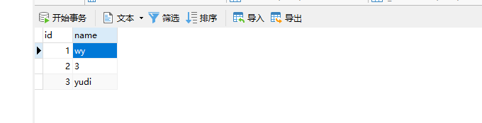
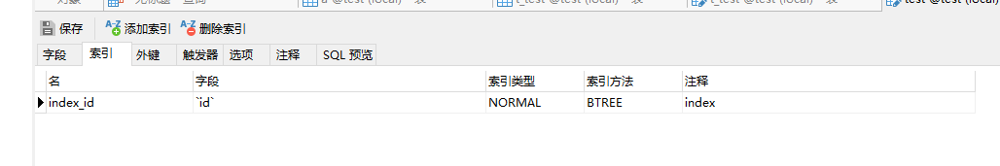
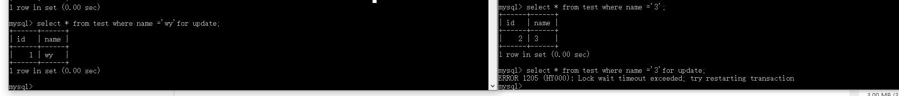
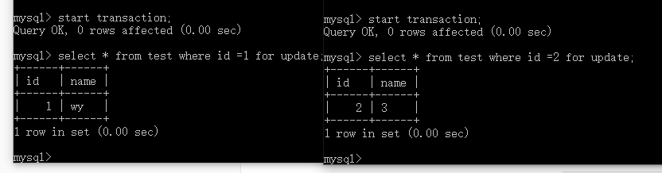
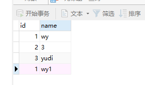
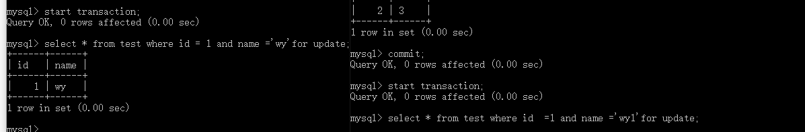
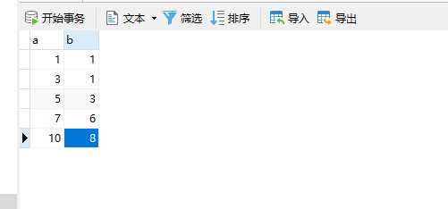
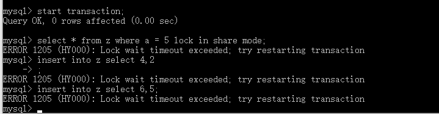
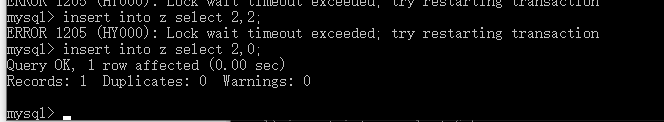

# 锁的类型

Innodb存储引擎实现了如下两种标准的行级锁

1）共享锁（S Lock），允许事务读一行数据。

2）排它锁（X Lock），允许事务删除或更新一行数据。

为了支持在不同粒度上进行加锁操作，Innodb支持一种额外的加锁方式，称之为意向锁（Intention Lock）。意向锁为表级别的锁。设计的目的主要是为了在一个事务中揭示下一行将被请求的锁类型。其支持两种意向锁

1）意向共享锁（IS Lock），事务想要获取一张表中的某几行的共享锁

2）意向排他锁（IX Lock），事务想要获得一张表中某几行的排他锁

|      |   IS   |   IX   |   S    |   X    |
| :--: | :----: | :----: | :----: | :----: |
|  IS  |  兼容  |  兼容  |  兼容  | 不兼容 |
|  IX  |  兼容  |  兼容  | 不兼容 | 不兼容 |
|  S   |  兼容  | 不兼容 |  兼容  | 不兼容 |
|  X   | 不兼容 | 不兼容 | 不兼容 | 不兼容 |

从上表可以发现，X锁与其他任何锁都不兼容，而S锁仅和S锁兼容。最令人奇怪的是，意向锁之间都兼容，那么意向锁设计的意思是什么呢？

**意向锁的存在价值在于在定位到特定的行所持有的锁之前，提供一种更粗粒度的锁，可以大大节约引擎对于锁的定位和处理的性能**。因为在存储引擎内部，锁是由一块独立的数据结构维护的，锁的数量直接决定了内存的消耗和并发性能。例如，事务A对表t的某些行修改（DML通常会产生X锁），需要对t加上意向排它锁，在A事务完成之前，B事务来一个全表操作（alter table等），**此时直接在表级别的意向排它锁就能告诉B需要等待（因为t上有意向锁），而不需要再去行级别判断。** 

意向锁是InnoDB自动加的，不需用户干预。对于UPDATE、DELETE和INSERT语句，InnoDB会自动给涉及数据集加排他锁（X)；对于普通SELECT语句，InnoDB不会加任何锁。 
事务可以通过以下语句显式给记录集加共享锁或排他锁：

- 共享锁（S）：`SELECT * FROM table_name WHERE ... LOCK IN SHARE MODE`。
- 排他锁（X）：`SELECT * FROM table_name WHERE ... FOR UPDATE`。

## InnoDB行锁实现方式

InnoDB行锁是通过给索引上的索引项加锁来实现的。InnoDB这种行锁实现特点意味着：只有通过索引条件检索数据，InnoDB才使用行级锁，**否则，InnoDB将使用表锁！** 

创建一张表如下图，id列创建索引，name列没有创建索引

### 实验一

|                     session1                     |                    seesion2                     |
| :----------------------------------------------: | :---------------------------------------------: |
|                start transaction                 |                start transaction                |
| select * from test where name = 'wy' for update; |                                                 |
|                                                  | select * from test where name = '3' for update; |

可以看到session1，查询的是name=‘wy’的数据，而session2查询的是另外一行name=‘3’的数据，但是被阻塞住了，说明不加索引for update的查询使用的是表锁。

### 实验二

|                 session1                  |                  seesion2                  |
| :---------------------------------------: | :----------------------------------------: |
|             start transaction             |             start transaction              |
| select * from test where id=1 for update; |                                            |
|                                           | select * from test where id =2 for update; |

可以看到session1和session2使用的是行锁，加锁都成功了。

### 实验三

给表插入数据如下

|                        session1                         |                         seesion2                         |
| :-----------------------------------------------------: | :------------------------------------------------------: |
|                    start transaction                    |                    start transaction                     |
| select * from test where id=1 and name=‘wy’ for update; |                                                          |
|                                                         | select * from test where id =1 and name=‘wy1’for update; |

可以看到session2阻塞住了，说明正在等待锁资源。这是**由于MySQL的行锁是针对索引加的锁，不是针对记录加的锁，所以虽然是访问不同行的记录，但是如果是使用相同的索引键，是会出现锁冲突的。**

# 锁的算法

Innodb存储引擎有三种行锁的算法，分别是：

- Record Lock ：单个行记录上的锁
- Gap Lock：间隙锁，锁定一个范围，但不包含记录本身
- Next-key Lock：Gap Lock+Record Lock，锁定一个范围，并且锁定记录本身

## Next-key Lock

next-key的设计目的是为了解决幻读问题。利用这种锁定技术，锁定的不是单个值，而是一个范围。然而当查询的索引含有唯一属性时，Innodb存储引擎会对Next-key Lock进行优化，降级为Record Lock，即仅锁住索引本身，而不是范围。

### 实验一

1，创建一张表z，并插入如下数据，

`create table z ( a int, b int, primary key(a),key(b))`

2,表z的列b是辅助索引，若在会话A中执行下面的sql语句:

`select * from z where b = 3 for update`

由于有两个索引，需要分别进行锁定，对于聚集索引，其仅对列a等于5的索引加上Record Lock，而对于辅助索引，其加上的是Next-key Lock，锁定的是（1,3），（3,6）。所以在新会话B中运行一下Sql语句，都会被阻塞。

### 实验二

在Innodb存储引擎中，对于Insert操作，其会检查插入记录的下一条记录是否被锁定，若已经被锁定，则不允许查询。

