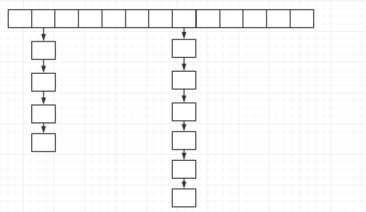
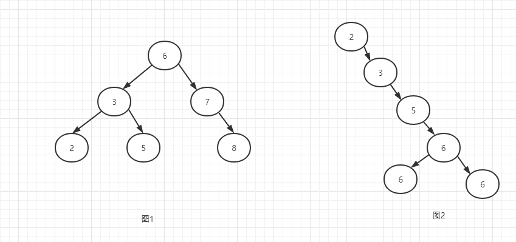
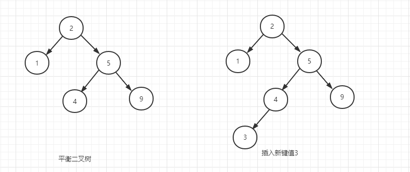
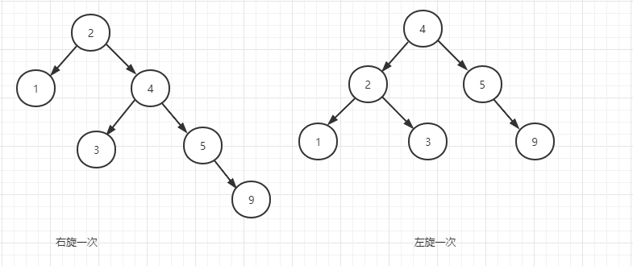
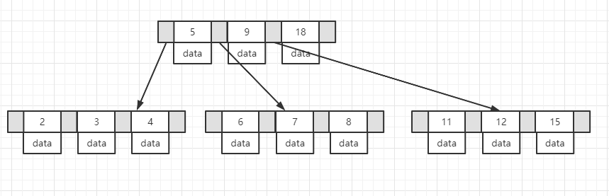
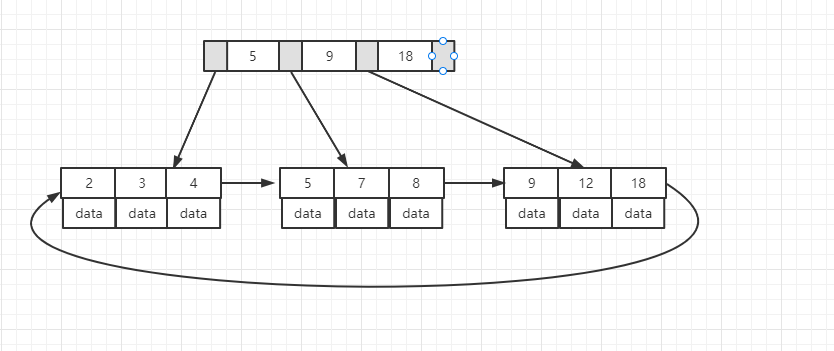

## B+树索引

### 索引介绍

​	在mysql数据库中，数据是存放在磁盘中，磁盘中数据是以页的形式存放，当从数据库中读取数据时，最小读取的数据单位是页，每次可以读取一个页。当数据量很大时，存放数据的页的数目同样相当大，那么每次需要获取某个数据时，那么遍历这些数据再取出结果时所产生的IO会十分消耗性能，在此情况下，我们可以将某一类或几类经常访问的数据按序单独另外存放一份，同时添加这些数据到某个页的映射关系，这样可以很大程度上提升了数据库的数据查找性能（空间换时间）。这类或几类按序存放的数据及其存放的方式可以称为索引。

### 索引存放数据结构

​	知道了索引是什么后，就可以思考如何存放索引的数据呢？根据上面的介绍，应该可以知道索引最起码应该是一种键值对类型的数据，键代表分类的数据，值代表指向页的指针。

#### 哈希表

​	所以很容易想到使用哈希表进行存储，但是使用哈希表进行存储时，若某个哈希值上的链表过长时，查找的效率并不是很高。

	

#### 二叉树	

​	再然后可以想到使用二叉树结构进行存储，如下图1，在二叉树中，左子树的键值总是小于根的键值，右子树的键值总是大于根的键值，所以当查找某个数据时，相当于是二分查找了，但是这种结构存储索引的键值对数据时，若数据量很大，树的深度会很大，而且如果数据存在某种极端情况，如下图2，大部分数据都在根的右边，某种程度上相当于一个链表结构了，查找的效率便会很低。

#### 平衡二叉树

​	根据上面二叉树的缺点可以想到使用平衡二叉树的结构进行存储，平衡二叉树的特点是任何节点的两个子树的高度差为1，这样就保证了不会上面图2那样的极端情况，保证了数据的查找效率。但是平衡二叉树的维护是很麻烦的，需要一次或多次左旋或右旋来得到插入或更新后树的平衡性，如下图插入键值3需要进行多次旋转操作才能保证树的平衡。所以综合考虑数据库索引存放在磁盘中，这样的维护开销也不便存储索引数据。

#### B树

​	上面的树都有一个特点，就是每个父节点的子节点都只有两个，这样很容易使树的深度变深，使得查找时效率并不是特别高，同时平衡二叉树为了不使数据存放出现极端情况，保持了根的子节点深度差为1，导致维护开销大，而B树则很好的解决了这些问题。B树支持每个父节点可以存在多个子节点，这样大大减少了树的深度问题。如下图：每个节点都存放了键值对以及数据，树的深度不会特别深，查找的效率依然很高，这样很大程度上解决了上面的问题，但是每个节点都存放数据依然会很占用内存空间，数据量很大很大时，依然会增加树的深度。同时如果需要查找所有B树的数据时，需要对整棵树的每一层进行一次遍历。

#### B+树

​	B树中每个节点都存放了数据。mysql的在磁盘中存储时是按照页的形式存储的，每页16k（可能会有压缩页），当这个大小固定时，如果每页存放的节点越多，就可以减少树的深度，所以在B树结构上，进行了一次升级，只在叶子节点存放数据，同时叶子节点使用双向链表顺序连接，增加了区间访问的性能。这样的存储结构根据实际环境中树的深度一般会保持在3-4层。

### 管理和使用B+树索引

#### 聚集索引

#### 辅助索引

#### Cardinality值

#### 联合索引

#### 覆盖索引

#### 全文检索