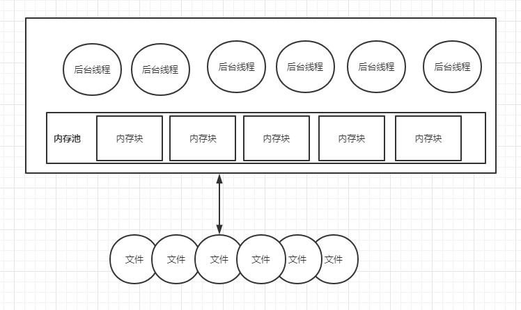
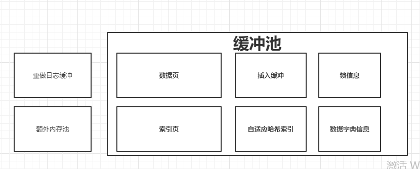

## InnoDb存储引擎特性

### InnoDb存储引擎体系架构

​	在了解InnoDb存储引擎特性之前，首先了解下其体系架构。InnoDb存储引擎体系架构如下图：

从图可见，InnoDb存储引擎有多个内存块组成一个内存池，内存池负责如下工作：

​	**维护所有进程/线程需要访问的多个内部数据结构（如索引结构等）**

​	**缓存磁盘上的数据，同时在对磁盘文件的数据修改之前在这里缓存（如脏页）**

​	**重做日志缓冲等等**

后台线程有多个，主要负责刷新内存池中数据，并且保证在数据库发生异常时能恢复正常，下面介绍各个线程的作用。

### 后台线程

#### Master Thread

​	核心的后台线程，主要负责将缓冲池中数据**异步**刷新到磁盘中，保证数据一致性，包括**脏页的刷新、合并插入缓冲**(Insert Buffer)、UNDO页的回收等。

#### IO Thread

​	InnoDb使用AIO（异步IO）处理写IO请求，这样可以提高数据库性能，而IO thread负责处理这些IO请求的回调。

#### Purge Thread

​	事务在提交后，其所使用的undolog可能不再需要，Purge thread负责回收已经使用分配的undo页。

#### Page Cleaner Thread

​	为了减轻Master Thread的负担，在InnoDb1.2版本后引入了这个线程，用来负责脏页的刷新。

### 内存结构

#### 缓冲池

​	InnoDb引擎是基于磁盘存储的，但是由于磁盘与CPU之间速度的鸿沟，InnoDb引擎使用了缓冲池来提高数据库的整体性能。缓冲池由多个内存页组成，在进行数据库读取的操作时，首先将从磁盘读取的页放入到缓冲池的页中，下次读取相同的页时，如果缓冲池中已经存在则直接读取该页，一定程度上提高了性能。对数据库进行修改操作时，首先会修改缓冲池中的页，然后会根据一定频率将缓冲池中的页刷新回磁盘，这时并不是每次修改页都会触发刷新页的操作，而是通过Checkpoint机制刷新回磁盘，提高数据库整体性能。

#### 缓冲池管理

​	上图可以看到缓冲池的内存结构，其中包括了数据页、索引页、插入缓冲页等信息，这么多的页信息，InnoDb是通过LRU算法（Latest Recent Used 最近最少使用）进行管理的，即最频繁使用的页在LRU列表的前端，最少使用的页在列表的尾端，当缓冲池中无法存放最新读取到的页时，首先释放LRU列表中尾端的页。

​	在InnoDb中，最新读取到的页并不是直接放入列表首部，而是引入了一个midpoint的位置，将最新读取到的页放入LRU列表的midpoint位置。这样做可以一定程度上提升数据库性能，比如某些索引或数据的扫描操作导致读取大量非热点数据到缓冲池中，如果这些非热点数据页都存放在LRU列表首部，导致热点数据都从LRU列表中移除，下次访问这些热点数据时又需要从磁盘中读取。

​	为了进一步管理LRU列表，放入midpoint位置的数据页在等待innodb_old_blocks_time后，会被放入LRU列表的首部，如果一直不放入首部，那么在midpoint前的数据页就很难被淘汰。

​	当数据库启动时，LRU列表中没有任何的页，这时页都存放在Free列表中，当需要从缓冲池中分页时，首先查看Free列表中是否有空闲页，若有就将Free列表中该页删除，放入LRU列表中，否则淘汰LRU列表尾部的页，将空闲出的内存空间分配给新的页。

#### 重做日志缓冲

​	InnoDb存储引擎内存区域除了缓冲池之外，还有重做日志缓冲。InnoDb首先会将重做日志信息写入到这个缓冲池，然后按照一定的频率刷新到重做日志文件。在以下三种情况下会将该缓冲区中信息刷新到重做日志文件中：

​	Master Thread每秒中刷新一次

​	每个事务提交时会刷新一次

​	当重做日志缓冲池剩余空间小于1/2时，会刷新一次

### Checkpoint机制

​	在缓冲池中，当对数据页进行修改时，不会修改完之后就将该页数据刷新回磁盘中，因为这样必然影响数据库的性能，所以InnoDb引入了一种Checkpoint机制，以一定的频率刷新脏页。这种手段保证了数据库一定的高并发。

​	同时，如果在刷新脏页时，数据库发生了宕机，那么数据就无法恢复了，为了避免数据丢失，当前事务数据库系统都采用了Write Ahead Log策略，即当事务提交时先写重做日志，再修改页，当由于数据库宕机导致数据丢失时，可以通过重做日志恢复数据，这种手段一定程度保证了数据库的高可用。

​	因此，Checkpoint机制的目的是解决以下问题：

​	缩短数据库的恢复时间；

​	缓冲池不够用时，将脏页刷新到磁盘中；

​	当重做日志不可用时，刷新脏页。

### InnoDb关键特性

#### 插入缓冲

##### Insert Buffer

​	InnoDb存储引擎中主要有两大类索引：聚集索引和非聚集索引，聚集索引包括了主键和数据，一般是自增的，有顺序的存放；非聚集索引一般只存放索引，一张表中可以有多个非聚集索引，若该非聚集索引不是唯一的，在进行插入操作时，对于非聚集索引叶子节点的插入不会是顺序性的，这时就需要离散的访问非聚集索引页，由于随机读取的存在导致了插入操作的性能下降。

​	为了减低这样的性能下降，InnoDb引入了Insert Buffer，对于非聚集索引的插入或更新操作，不会每一次都直接插入到索引页中，而是先判断插入的非聚集索引页是否存在缓冲池中，若在，则直接插入，若不在，则先放入到一个Insert Buffer对象中。然后以一定的频率和情况进行Insert Buffer和辅助索引页子节点的merge操作，大大提高了非聚集索引插入的性能。

##### 自适应哈希索引

​	InnoDb存储引擎会监控各索引页的查询，如果观察到建立哈希索引会提高速度，则建立哈希索引，称之为自适应哈希索引。自适应哈希索引有一个要求，即对这个页的连续访问模式必须是一模一样的

##### 异步IO

​	为了提高磁盘的操作性能，InnoDb采用异步IO来处理磁盘操作。如果每进行一次IO操作都等待其结果返回，那么当用户发出一条索引扫描的查询，那么这条SQL查询语句可能需要扫描多个索引页，即需要多次IO操作，在每扫描一个页并等待其完成再进行下一次扫描，比较浪费时间。所以可以在发出一个IO操作请求后立即再发出一个IO请求，最后等待所有IO操作的完成。