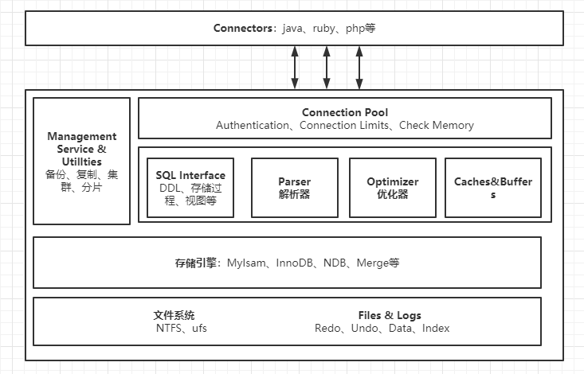

## Mysql逻辑架构

​	mysql的整体逻辑架构可分为如下几个部分：Connectors、Connection Pool、管理服务、查询器、解析器、优化器、缓存和缓冲池、存储引擎以及存储数据的磁盘。

**Connectors**

​	代表能够与mysql连接交互的程序语言，可以理解为mysql客户端。

**Connection Pool**

​	管理缓冲用户连接，线程处理等需要缓存的需求。

​	负责监听对 MySQL Server 的各种请求，接收连接请求，转发所有连接请求到线程管理模块。每一个连接上 MySQL Server 的客户端请求都会被分配（或创建）一个连接线程为其单独服务。而连接线程的主要工作就是负责 MySQL Server 与客户端的通信，接受客户端的命令请求，传递 Server 端的结果信息等。线程管理模块则负责管理维护这些连接线程。包括线程的创建，线程的 cache 等

 **Management Service & Utillties** 

​	系统管理工具

**SQL Interface**

​	SQL接口，接收用户的SQL命令，并且返回用户需要查询的结果

**Parser**

​	解析器，SQL命令传递到解析器时会被解析器验证和解析。

**Optimizer**

​	优化器，SQL查询语句在查询前会被优化器进行优化。

**Caches & Buffers**

​	mysql将查询语句的结果会放到该缓存中，当下次相同查询时，可以直接从缓存中读取结果；当查询的表中任何数据发生变化时，mysql会自动使该缓存失效。

**存储引擎**

​	可插拔的存储引擎，负责存储和获取所有存储在mysql中的数据，每个存储引擎都有各自的优缺点。

