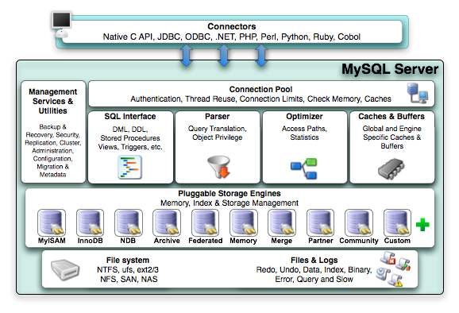

# Mysql体系结构

## 数据库和实例

在数据库领域，有两个词语容易混淆，一个是数据库，一个是实例。

**数据库**：物理操作系统文件或其他形式文件类型的集合

**实例**：Mysql数据库实例由后台线程以及一个共享内存区组成，数据库才是真正用于操作数据库文件的。

**注意**：MySQL单进程多线程和SQL Server类似。Oracle多进程。

## mysql体系结构图

可以看到mysql由以下几部分组成

1）连接池组件

2）管理服务和工具组件

3）SQL接口组件

4）查询分析器组件

5）优化器组件

6）缓冲组件

8）**插件式存储引擎**

9）物理文件

**注意：存储引擎是基于表的，而不是数据库**

# 存储引擎

## **InnoDB存储引擎：**

　　MySQL5.5.8之后默认的存储引擎，主要面向OLTP（联机事务处理，面向基本的、日常的事务处理）

　　支持事务，支持外键、支持行锁（有的情况下也会锁住整个表）、非锁定读(默认读取操作不会产生锁)

　　通过使用MVCC来获取高并发性，并且实现sql标准的4种隔离级别，默认为可重复读级别

　　使用一种被称成next-key locking的策略来避免幻读(phantom)现象

　　还提供了插入缓存(insert buffer)、二次写(double write)、自适应哈希索引(adaptive hash index)、预读(read ahead)等高性能技术。

　　表数据采用聚集方式，每张表的存储都按主键的顺序进行存放。

## **MyISAM存储引擎：**

　　不支持事务、支持全文索引，表锁设计，主要面向一些OLAP（联机分析处理，数据仓库的主要应用）。

　　它的缓冲池只缓冲索引文件，而不缓冲数据文件．

　　该存储引擎表由MYD和MYI组成，MYD用来存放数据文件，MYI用来存放索引文件.