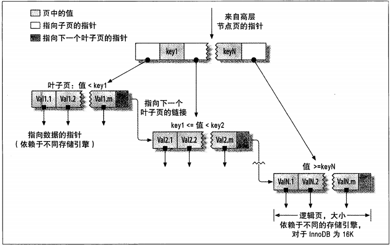

### 什么是索引

>索引，在mysql中也叫'键'（"key"），是存储引擎用于快速找到数据记录的一种**数据结构**（p141）

---

### 索引的类型

#### B-Tree索引

​	B-tree索引是大多数Mysql都支持的索引，所有的值都是按照顺序存储，且每一个叶子节点到根节点距离相同。B-Tree索引能够加快访问数据的速度，因为存储引擎不再需要进行全表扫描来获取需要的数据，曲儿待会的是从索引的根节点开始进行搜索。根节点的槽中存放了指向子节点的指针，存储引擎根据这些指针向下层查找。通过比较节点页的值和要查找的值可以找到合适的指针进入下层子节点，这些指针实际上定义了子节点页中值得上限和下限。最终存储引擎要么找到对应的值，要么该记录不存在，下图为B-Tree（从技术上说是B+Tree）索引的抽象表示。

##### B-Tree索引的特点：

* 度(Degree)-节点的数据存储个数
* 叶节点具有相同的深度
* 叶节点的指针为空

* 节点中的数据key从左到右递增排列

##### B+Tree

​	B+Tree的出现解决了B-Tree存在的一些问题，他是B-Tree的一个变种或者说技术实现

* 特点
  * 非叶子节点不存储data，只存储key，可以增大度
  * 叶子节点不存储指针
  * 顺序访问指针，提高区间访问的性能

##### B-Tree索引的限制

* 根据最左前缀原则，如果不是按照索引的最左列开始查找，则无法使用索引
* 不能跳过索引中的列
* 如果查询中有某个列的范围查询，则其右边所有的列都无法使用索引

---

#### 哈希索引

> ​		哈希索引基于哈希表实现，只有精确匹配索引所有列的查询才会有效，对于每一行数据，存储引擎都会对所有的索引计算一个hash code，hash code是一个较小的值，哈希索引将所有的哈希码存储在索引中，同时在哈希表中保存指向每个数据行的指针，在Mysql中，只有Memory引擎**显示**支持哈希索引**顺便一提，InnoDB引擎有一个特殊的功能叫做"自适应哈希索引"，当InnoDB注意到某些索引值被使用的非常频繁时，它会在内存中基于B-Tree索引之上再创建一个哈希索引，这样就让B-Tree索引也具有哈希索引的一些优点。这是一个内部的行为，用户无法控制，如果有必要，可以关闭该功能。**（p148）

#### 空间数据索引(R-Tree)

>MyISAM表支持空间索引，可以用作地理数据存储。和B-Tree不同，这类索引无须前缀查询。空间索引会从所有维度来索引数据。查询时，可以有效地使用任意维度来组合查询（151）

#### 全文索引

> 全文索引是一种特殊类型的索引，它查找的是文本中的关键词，而不是直接比较索引中的值。

---

### 聚簇索引和非聚簇索引

#### 聚簇索引

> 聚簇索引不是一个单独的索引类型而是一种数据存储方式（p162）

​	常见的聚簇索引InnoDB（在同一个结构中保存了B-Tree索引和数据行），因为无法同时把数据行放在两个地方，所以一个表只能有一个聚簇索引。

#### 非聚簇索引

> 聚簇索引的叶子节点存储的是数据本身，而非聚簇索引叶子节点存储的是指向表中对应数据行的链接（指针），所以一张表可以拥有多个非聚簇索引，且非聚簇索引和表数据行是两个文件

### explain语法

| 字段          | 作用                                                         |
| ------------- | ------------------------------------------------------------ |
| id            | 查询的序号，包含一组数字，表示查询中执行select子句或操作表的顺序 **两种情况** id相同，执行顺序从上往下 id不同，id值越大，优先级越高，越先执行 |
| select_type   | 查询类型，主要用于区别普通查询，联合查询，子查询等的复杂查询 1、simple ——简单的select查询，查询中不包含子查询或者UNION 2、primary ——查询中若包含任何复杂的子部分，最外层查询被标记 3、subquery——在select或where列表中包含了子查询 4、derived——在from列表中包含的子查询被标记为derived（衍生），MySQL会递归执行这些子查询，把结果放到临时表中 5、union——如果第二个select出现在UNION之后，则被标记为UNION，如果union包含在from子句的子查询中，外层select被标记为derived 6、union result:UNION 的结果  |
| table         | 输出的行所引用的表                                           |
| type          | 显示联结类型，显示查询使用了何种类型，按照从最佳到最坏类型排序 1、system：表中仅有一行（=系统表）这是const联结类型的一个特例。 2、const：表示通过索引一次就找到，const用于比较primary key或者unique索引。因为只匹配一行数据，所以如果将主键置于where列表中，mysql能将该查询转换为一个常量 3、eq_ref:唯一性索引扫描，对于每个索引键，表中只有一条记录与之匹配。常见于唯一索引或者主键扫描 4、ref:非唯一性索引扫描，返回匹配某个单独值的所有行，本质上也是一种索引访问，它返回所有匹配某个单独值的行，可能会找多个符合条件的行，属于查找和扫描的混合体 5、range:只检索给定范围的行，使用一个索引来选择行。key列显示使用了哪个索引，一般就是where语句中出现了between,in等范围的查询。这种范围扫描索引扫描比全表扫描要好，因为它开始于索引的某一个点，而结束另一个点，不用全表扫描 6、index:index 与all区别为index类型只遍历索引树。通常比all快，因为索引文件比数据文件小很多。 7、all：遍历全表以找到匹配的行 注意:一般保证查询至少达到range级别，最好能达到ref。  |
| possible_keys | 指出MySQL能使用哪个索引在该表中找到行                        |
| key           | 显示MySQL实际决定使用的键(索引)。如果没有选择索引,键是NULL。查询中如果使用覆盖索引，则该索引和查询的select字段重叠。 |
| key_len       | 表示索引中使用的字节数，该列计算查询中使用的索引的长度在不损失精度的情况下，长度越短越好。如果键是NULL,则长度为NULL。该字段显示为索引字段的最大可能长度，并非实际使用长度。 |
| ref           | 显示索引的哪一列被使用了，如果有可能是一个常数，哪些列或常量被用于查询索引列上的值 |
| rows          | 根据表统计信息以及索引选用情况，大致估算出找到所需的记录所需要读取的行数 |
| Extra         | 包含不适合在其他列中显示，但是十分重要的额外信息 1、Using filesort：说明mysql会对数据适用一个外部的索引排序。而不是按照表内的索引顺序进行读取。MySQL中无法利用索引完成排序操作称为“文件排序” 2、Using temporary:使用了临时表保存中间结果，mysql在查询结果排序时使用临时表。常见于排序order by和分组查询group by。 3、Using index:表示相应的select操作用使用覆盖索引，避免访问了表的数据行。如果同时出现using where，表名索引被用来执行索引键值的查找；如果没有同时出现using where，表名索引用来读取数据而非执行查询动作。 4、Using where :表明使用where过滤 5、using join buffer:使用了连接缓存 6、impossible where:where子句的值总是false，不能用来获取任何元组 7、select tables optimized away：在没有group by子句的情况下，基于索引优化Min、max操作或者对于MyISAM存储引擎优化count（*），不必等到执行阶段再进行计算，查询执行计划生成的阶段即完成优化。 8、distinct：优化distinct操作，在找到第一匹配的元组后即停止找同样值的动作。  |

