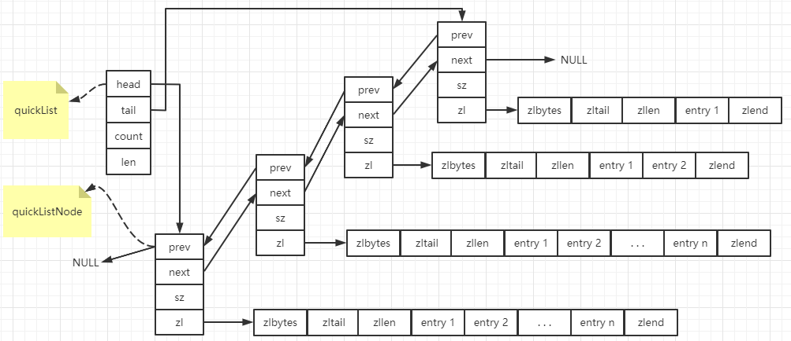

## quickList

### 出现quickList的原因

#### 双向链表的优缺点

​	双向链表由于存在表头指针和表尾指针，所以便于在表的两端进行push和pop操作

​	但是其内存消耗较大，首先它除了需要保存本身的数据外，还需要记录前后节点的指针信息；另外双向链表存储时不需要连续的内存地址空间，因此当数据回收后，容易产生内存碎片

#### 压缩列表优缺点

​	压缩列表由于是一块连续的内存空间，所以查询的效率很高

​	但是其不利于修改操作，每次数据变动都会引起内存的reallocate，尤其当ziplist长度很长时，一次reallocate会造成大量的数据拷贝，进一步影响性能。（在3.2版本以前，当出现某个条件时，ziplist会转换成linkedList）

综上，出现了quickList来解决各自的缺点

### quickList结构

​	quickList实际上是zipList和linkedList的结合，由zipList组成的双向链表，链表中的每个节点都以压缩列表zipList的结构保存着数据，而zipList有很多节点（entry），保存着数据，相当于一个quickListNode保存的是一片数据，而不是一个数据



```c
typedef struct quicklist {
    quicklistNode *head;	/* 指向链表头节点的指针 */
    quicklistNode *tail;	/* 指向链表尾节点的指针 */
    unsigned long count;        /* 所有的zipList中节点个数 */
    unsigned int len;           /* number of quicklistNodes */
    int fill : 16;              /* fill factor for individual nodes */
    unsigned int compress : 16; /* 节点压缩深度设置，存放list-compress-depth参数的值 */
} quicklist;
```

```c
typedef struct quicklistNode {
    struct quicklistNode *prev;	/* 指向链表前一个节点的指针 */
    struct quicklistNode *next; /* 指向链表后一个节点的指针 */
    unsigned char *zl;	/* 数据指针。如果当前节点的数据没有压缩，那么它指向一个ziplist结构；否则，它指向一个quicklistLZF结构。 */
    unsigned int sz;             /* zipList的数据总大小 */
    unsigned int count : 16;     /* count of items in ziplist */
    unsigned int encoding : 2;   /* RAW==1 or LZF==2 */
    unsigned int container : 2;  /* NONE==1 or ZIPLIST==2 */
    unsigned int recompress : 1; /* was this node previous compressed? */
    unsigned int attempted_compress : 1; /* node can't compress; too small */
    unsigned int extra : 10; /* more bits to steal for future usage */
} quicklistNode;
```

```c
typedef struct quicklistLZF {
    unsigned int sz; /* 表示压缩后的ziplist大小*/
    char compressed[]; /* 是个柔性数组（flexible array member），存放压缩后的ziplist字节数组*/
} quicklistLZF;
```

### 配置参数

#### list-max-ziplist-size 

​	现在转化到quicklist了，但是还需要考虑，quicklistNode里的ziplist里的内容处理呢？一个ziplist我需要存储多少个数据呀？也跟上面两个点考虑的一样

- 如果ziplist里的内容分配的越少的话，也就是往linkedlist方向发展了，就可能会产生很多的内存碎片
- 但要如果ziplist里的内容分配的越多的话，也会出现问题，就是需要很大一块连续的内存空间。

​    这个数据存储的个数就由这个配置参数决定，可以配置正数和负数

​	当它取正数的时候，表示按照数据项个数来限定quicklist节点上的ziplist长度，比如我们设置为4，就说明每个ziplist的数据项最多不能超过5个

​	当它取负数的时候，表示按照占用字节来限定quicklsit节点上的ziplist长度，这时，它只能取-1到-5这五个值，每个值的含义如下：
1)、-5：每个quicklist节点上的ziplist大小不能超过64kb。（1kb == 1024 byte）
2)、-4：每个quicklsit节点上的ziplist大小不能超过32kb。
3)、-3：每个quicklsit节点上的ziplist大小不能超过16kb。
4)、-2：每个quicklsit节点上的ziplist大小不能超过8kb。
5)、-1：每个quicklsit节点上的ziplist大小不能超过4kb。

#### list-compress-depth 

​	当链表很长的时候，最频繁访问的就是两端的数据，中间被访问的频率比较低，所以我们可以将中间部分节点进行压缩，从而能够进一步节省空间。list-compress-depth就是来设置这个的。 

​	这个参数的取值含义如下：

0：是个特殊值，表示都不压缩。这是redis的默认值

1：表示quicklist两端各有一个节点不被压缩，中间节点进行压缩

2：表示quicklist两端各有两个节点不被压缩，中间节点进行压缩

3：表示quicklist两端各有三个节点不被压缩，中间节点进行压缩

