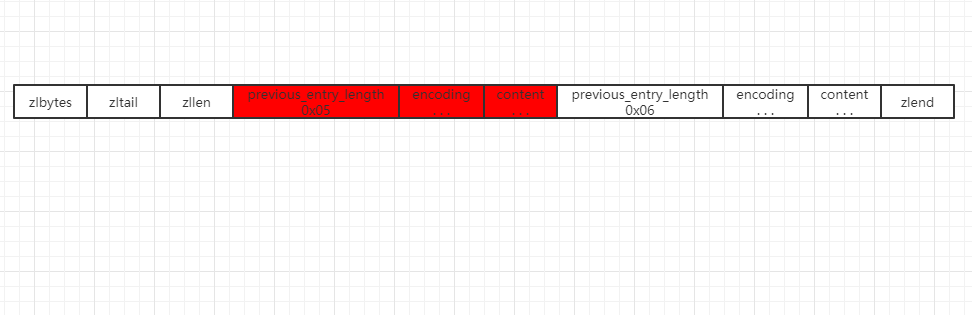

## 压缩列表

​	压缩列表是由一系列特殊编码的连续内存块组成的顺序型数据结构，一个压缩列表可以包含任意多个节点（entry），每个节点可以保存一个字节数组或者一个整数值。

### 压缩列表结构

​	zlbytes：代表当前压缩列表的总长度

​	zltail：记录压缩列表表尾节点距离压缩列表起始地址多少个字节，通过这个记录可以无需遍历整个压缩列表就可以确定表尾节点的地址。

​	zllen：属性值表示压缩列表含有几个节点（entry）

**标红部分代表一个节点**

​	previous_entry_length：记录了前一个节点的长度，可用于从表尾遍历到表头

​	encoding：记录了content内容所保存的数据的类型及长度

​	content：负责保存节点的值，可以是一个字节数组或一个整数值

### 压缩列表优缺点

​	压缩列表由于是一块连续的内存空间，所以查询的效率很高

​	但是其不利于修改操作，每次数据变动都会引起内存的reallocate，尤其当ziplist长度很长时，一次reallocate会造成大量的数据拷贝，进一步影响性能。（在3.2版本以前，当出现某个条件时，ziplist会转换成linkedList）

