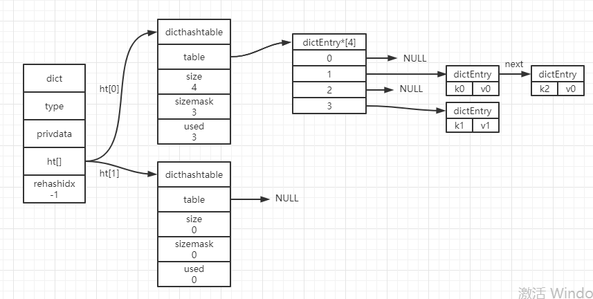

## 字典

### 简介

​	Redis的字典使用哈希表作为底层实现，一个哈希表里可以有多个哈希表节点（dictEntry），而每个哈希表节点就保存了字典中的一个键值对。当出现键的索引相同时，通过链表来保存。（每次插入键冲突的节点时是头插法）



### 字典结构

```c
typedef struct dict {
    dictType *type;	
    void *privdata; 
    dictht ht[2];	/* 一个包含两个项的数组，每个项都是一个dicthashtable哈希表，一般情况只使用ht[0]，ht[1]只会在rehash的时候使用 */
    int rehashidx;	/* 记录了目前rehash的进度，如果没有在进行rehash，它的值为-1 */
} dict;
```

### 哈希表结构

```c
typedef struct dicthashtable {
    dictEntry **table;	/* 指针数组，指针指向每个或每组哈希节点 */
    unsigned long size; /* 记录了哈希表的大小，即table数组的大小 */
    unsigned long sizemask;	/* size-1 */
    unsigned long used;	/* 记录了哈希表目前已有节点的数量 */
} dicthashtable;
```

### 哈希表节点结构

```c
typedef struct dictEntry {
    void *key;	/* 键 */
    union {
        void *val;
        unit64_t u64;
        int64_t s64;
    } v;	/* 值 */
    struct dictEntry *next;	/* 用来解决键冲突的指针，指向下一个哈希表节点 */
} dictEntry;
```

