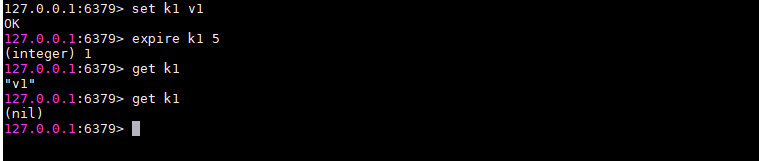

## 过期键

### 设置键的生存时间和过期时间

​	expire <key> <time>

### 过期键删除策略

#### 定时删除

​	在设置键的过期时间的同时，创建一个定时器，让定时器在键的过期时间来临时，立即执行对键的删除操作

##### 优点

​	对**内存友好**，这个策略可以保证过期键能尽可能快的被删除，并释放过期键所占用的内存

##### 缺点

​	对**CPU时间不友好**，在过期键比较多的情况下，删除过期键的操作会占用很大一部分CPU的时间，容易造成CPU在较长时间内对一些过期的和当前任务无关的数据进行操作，影响服务器的响应时间和吞吐量

#### 惰性删除

​	放任过期键不理，当每次从键空间获取键时，都检查取得的键是否过期，如果过期就删除该键；如果没有就返回该键

##### 优点

​	对**CPU时间友好**，不会用多余的时间对过期键进行删除操作，只有当使用到这个键时才决定是否删除过期键

##### 缺点

​	对**内存不友好**，过期键只有在被访问时才会被删除，如果这个过期键一直不被访问，那么将永远不会被删除，这块内存也永远不会被释放

#### 定期删除

​	每隔一段时间，程序就对数据库进行检查，删除里面的过期键，每次检查删除过期键的数量以及要检查的数据库数量由算法决定

##### 优点

​	定期删除通过每隔一段时间执行过期键的删除操作，并通过限制删除操作的频率以及时长，减少了对CPU时间的占用；另外通过定期删除过期键，释放内存，也减缓了内存的压力

### Redis过期键删除策略

​	Redis使用惰性删除和定期删除策略结合的方式

