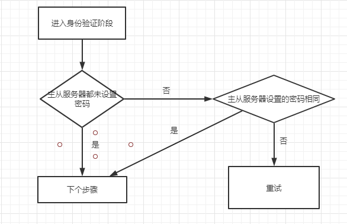
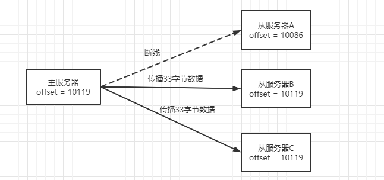
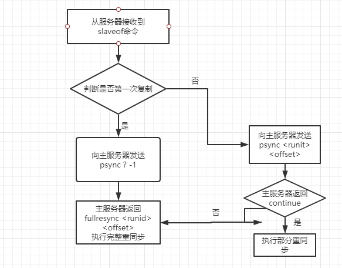

## 主从复制

### 前言

​	主从复制从一定程度上保证了系统的高可用性，另外实现了读写分离的功能，提升了系统的读写性能。

### 复制的实现

#### 1、设置主服务器的地址和端口

​	当从服务器接受到客户端发送的slaveof <master_ip> <master_port>命令之后，从服务器会将这两个参数设置到自身的服务器状态中的masterhost和masterport字段，并返回一个OK给客户端。slaveof命令是一个异步命令，真实的复制工作从返回OK后才开始。

#### 2、建立套接字连接

​	在slaveof命令执行完成后，从服务器将会根据命令设置的ip地址和端口号，创建连向主服务器的套接字。如果从服务器成功连接到主服务器，那么从服务器会为该套接字关联一个用于处理复制工作的**文件事件处理器**，比如接受RDB文件以及接受主服务器发送的写命令等

​	而主服务器接受从服务器的套接字连接之后，将为该套接字创建对应的客户端状态，并将从服务器看作一个客户端。

#### 3、发送ping命令

​	套接字建立完成后，从服务器会发送一个ping命令来查看是否通信正常，可能会遇到下面三种情况：

​	a) 主服务器向从服务器回复了消息，但从服务器不能在规定时间内读出其内容，出现这种情况从服务器会断开并重新创建连向主服务器的套接字

​	b)主服务器向从服务器返回一个错误，表示主服务器暂时无法处理从服务器的命令请求，此时从服务器也会断开并重新创建连向主服务器的套接字

​	c)主服务器回复pong，那么说明主从服务器之间网络连接正常，继续下个步骤

#### 4、身份验证

​	从服务器收到pong回复了，需要判断是否进行身份验证。

​	从服务器的密码设置选项为masterauth；主服务器的密码设置选项为requirepass

#### 5、发送端口信息

​	身份验证之后，从服务器会执行命令replconf listening-port <port-number>，向主服务器发送从服务器监听的端口号，主服务器会将该端口号存放在从服务器对应的客户端状态slave_listening_port字段中，这个字段唯一作用就是在使用info_replication命令时打印从服务器的端口号

#### 6、发送psync同步

​	端口信息发送完后，从服务器会向主服务器发送**psync**命令，执行同步操作，并将自己的数据库更新至主服务器数据库当前所处的状态。

​	如果psync执行的是**完整重同步**操作，主服务器需要成为从服务器的客户端才能将保存在缓冲区内的写命令发送给从服务器并执行；

​	如果psync执行的是**部分重同步**操作，主服务器需要成为从服务器的客户端才能将保存在复制积压缓冲区的写命令发送给从服务器执行；

#### 7、命令传播

​	上面同步过程完成后，主服务器状态已经和从服务器状态相同了，但是后续主服务器状态发生了改变，则需要通过命令传播操作才能使从服务器状态保持一致。这个步骤是主服务器一直将自己执行的写命令发送给从服务器，从服务器接收并执行的过程。

### 部分重同步的实现

​	部分重同步由以下三个部分构成：

- 主从服务器的复制偏移量(replication offset)
  	    执行复制的双方主服务器和从服务器各自维护一个复制偏移量的字段：主服务器每次向从服务器发送N个字节的数据时，就将自己的复制偏移量加N；从服务器每次接收主服务器发送的N个字节数据时，就将自己的复制偏移量加N；这样只要对比主从服务器的复制偏移量就能知道两者的数据库状态是否一致。
  思考如下情况：
  	主服务器向从服务器A、B、C发送33字节的数据，但是发送时服务器A断开连接，B和C成功接收，这样导致主服务器和B、C的复制偏移量一致，都是10119，A的复制偏移量依然是10086，若一段时间后，A与主服务器重新连接，向主服务器发送psync命令，**那么此时主服务器对A执行完整重同步还是部分同步？如果是部分重同步，那么如何补偿在A断线那段时间丢失的数据？******复制积压缓冲区****解决了上述问题。
  
- 主服务器的复制积压缓冲区(replication backlog)
       复制积压缓冲区是主服务器维护的一个固定长度的先进先出队列。当主服务器进行命令传播时，其不仅会将写命令发送给从服务器，还会将这个写命令放入复制积压缓冲区。因为这个缓冲区是一个固定长度的先进先出队列，所以总会保留一部分最近传播的写命令，这个缓冲区同时记录了复制偏移量，方便主从服务器进行比较。
       当从服务器A重新连接上主服务器后，会将自己的复制偏移量发送给主服务器，主服务器根据此偏移量决定执行何种同步操作：
       如果偏移量在复制积压缓冲区内存在，则执行部分重同步操作；如果不存在，则执行完整重同步操作。
- 服务器运行ID
       主从服务器均会维护一个服务器运行ID（全局唯一），当从服务器对主服务器进行初次复制时，主服务器会将自己的运行ID发送给从服务器保存起来。
       当从服务器重新连接后，比较重新连接的主服务器ID与之前保存的是否相同，如果相同，可以继续尝试部分重同步；如果不同，则执行完整重同步。

### psync命令的实现

问题一：主机设置set k1 v1后，从机是否可以设置set k1 v2
不可以，因为从服务器的都是read-only的

问题二：主机shutdown后是否有新的主

没有，主机shutdown后，两个从互相不干扰