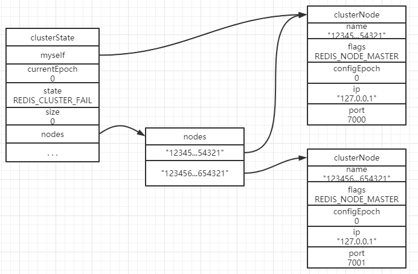
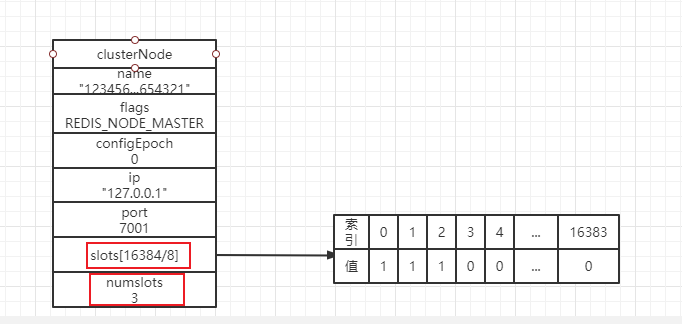
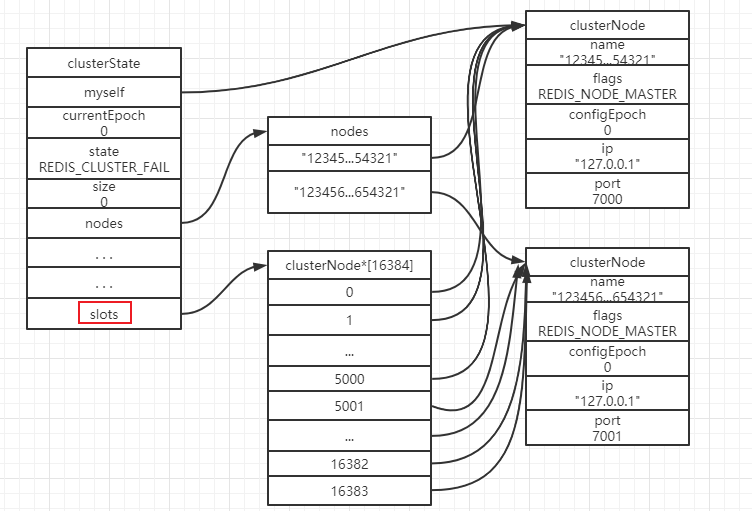
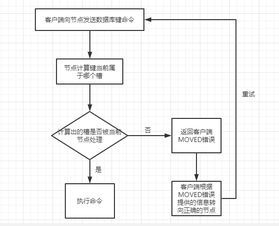
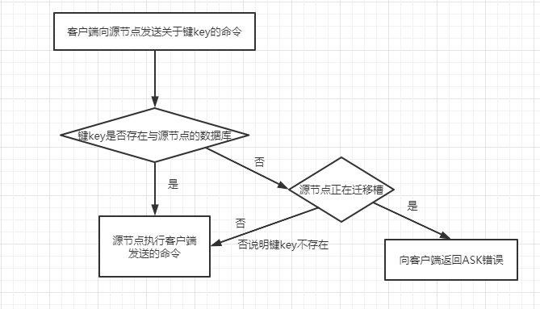

## cluster

### 节点

​	Redis集群通常由多个节点组成，每个节点在组成集群之前是相互独立的，通过向节点发送cluster meet <ip> <port>命令将该节点与ip指定的节点进行握手，握手成功后，两个节点组成一个集群。

#### 配置

​	通过修改配置文件中的**cluster-enabled**	选项为yes来开启服务器的集群模式。

#### 节点数据结构

​	节点会继续使用redisServer保存服务器状态，使用redisClient保存客户端状态，但是只有集群模式下才会使用的数据保存在clusterState、clusterNode中。

clusterState.myself：指向自己本身节点的clusterNode

clusterState.state：集群当前的状态是在线还是下线

clusterState.size：集群中至少处理一个槽的节点，如图为0，说明集群中没有节点处理槽，因此state为下线状态

clusterState.nodes：记录了集群中包含的节点

clusterNode.flags：该节点的标识，主节点还是从节点

### 槽指派

​	Redis集群通过分片的方式来保存数据库中的键值对：集群中整个数据库被分为16384个片（槽），集群中每个节点会被分配0个或最多16384个槽。当16384个槽都有节点在处理，说明集群中节点都处于上线状态，如果有其中一个槽未被节点处理，那么整个集群都处于下线状态。

#### 单个槽指派数据结构

​	单个节点槽指派信息都会存在节点的**clusterNode**结构中。

slots：长度为2048个字节的数组结构，每个值为1的二进制位代表该节点正在处理的槽号

numslots：代表了该节点正在处理的槽的数量

#### 集群所有槽指派数据结构

​	集群所有槽指派信息会存在**clusterState**结构中

slots：16384长度的数组结构，每个数组项都是一个指针，每个指针指向一个clusterNode结构，表示这个位置的槽被正在这个节点处理

### 在集群中执行命令

#### 计算键属于哪个槽

​	通过CRC16(key) & 16383这个算法得出一个介于0-16383的整数作为键key的槽号

#### 判断槽是否由当前节点处理

​	当通过上面的算法计算出一个槽号后，根据节点的clusterState结构中的slots数组中槽号位置指向的clusterNode结构是自己，说明这个槽号正是被当前节点处理，直接执行该命令；

​	如果指向的clusterNode结构不是自己，需要记录指向的clusterNode中的ip和port信息，并将这两个信息向客户端返回，返回格式：MOVED <slot> <ip> <port>，指引客户端转向正在负责处理这个槽号的节点。

### 重新分片

​	Redis集群的重新分片操作可以将任意数量已经指派给某个节点的槽改为指派给另一个节点，并且相关槽所属的键值对也会从源节点移动到目标节点。重新分片操作可以在线进行，在重新分片过程中，集群不需要下线，源节点和目标节点都可以继续处理命令请求，这就是集群可以扩容的优势。

### ASK错误

​	在重新分片期间，源节点向目标节点正在迁移某个槽的过程中，源节点接受到某个键的命令请求，这个键正好属于这个槽，可能这时候槽已经被迁移到目标节点，此时源节点将向客户端返回一个ASK错误，指引客户端转向正导入槽的目标节点，并再次发送之前想要执行的命令。

### 复制与故障转移

​	Redis集群中的节点分为主节点和从节点，其中主节点用于处理槽，从节点用于复制某个主节点，并在被复制的主节点下线时，代替下线主节点继续处理命令请求。如果下线的主节点重新上线，那么它将成为**原来从节点**的从节点

#### 设置从节点

​	通过向节点发送命令cluster replicate <node_id>，可以让接收命令的节点成为node_id所指定节点的从节点，并开始进行复制。复制功能与单机中的复制相同，相当于向从节点发送命令slaveof <master_ip> <master_port>。

#### 故障检测

​	集群中每个节点都会定期向集群中的其他节点发送PING消息，以此来检测对方是否在线。如果对方未在规定时间内返回PONG消息，则会将对方对应的clusterNode结构中flags置为**REDIS_NODE_PFAIL**（**疑似下线状态**），如果在一个集群中，半数以上负责处理槽的节点都将某个主节点X报告为疑似下线，那么这个主节点将被标记为下线（**REDIS_NODE_FAIL**）

#### 故障转移

​	从节点会执行slaveof no one命令，成为新的主节点，并且撤销所有对已下线节点的槽指派，并将这些槽全部指派给自己，广播这条消息，使集群全员感知。

#### 选举新的主节点

​	与集群的配置纪元有关。

​	当一个节点收集到大于等于N/2+1张支持票时，这个节点就会当选为新的主节点。

​	