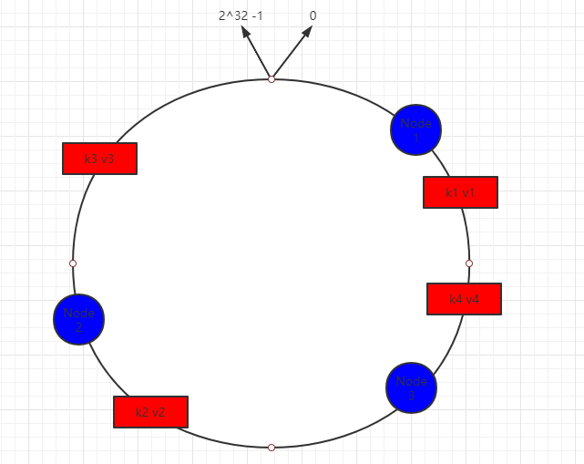
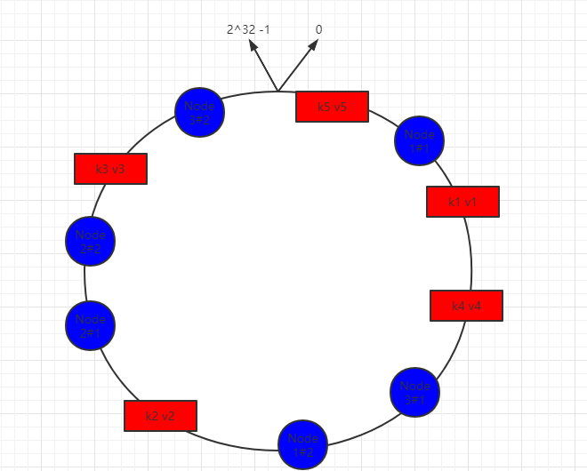

## 一致性hash算法

### 数据分片

​	数据分片是目前Redis集群采取的方式，通过分片（槽）将数据分别存放在不同的Redis服务器上，这样做一定程度上提高了系统的性能；当Redis集群需要扩容或者宕机时，通过重新分片来迁移数据，这个操作可以在线进行，对于扩容十分有效，但是在这个过程中，会导致服务器在一段时间内无法响应请求，所以引入了**一致性hash算法**， 可以有效地解决分布式存储结构下普通余数Hash算法带来的伸缩性差的问题，可以保证在动态增加和删除节点的情况下尽量有多的请求命中原来的机器节点。 

### 一致性hash算法

​		一致性hash算法将整个算法计算的Hash值组成一个虚拟的环，如假设某哈希函数H的值空间为0-2^32-1取模（即hash值是一个32位无符号整型）

​		如下图所示，一致性hash算法将服务器节点的唯一标识（id号或者主机名等）进行hash得到一个索引，这样Node1、Node2、Node3就能在hash环中得到一个位置，然后将所有数据的key进行hash同样得到不同的位置，并确定此数据在hash环中的位置。将数据从所在位置顺时针找到第一台服务器节点，这个节点就是该key存储的服务器。

### 容错性和扩容性

​	当上面的节点Node1宕机后，Redis集群只需要将k3的值迁移到Node3即可，Node2和Node3之间、Node3和Node1之间的数据不用迁移，大大减少了宕机后数据迁移带来的集群负担。

​	同样，如果是需要添加一个节点进行扩容，需要迁移的也仅仅是新增节点和其前面一个节点之间的数据。

### 数据倾斜问题

​	但是上述的方式在服务器节点数量较少时，容易出现大量的数据都存在某一个节点上，造成这个节点上的读写压力巨大，而其他节点几乎不干活的现象，为了解决这个问题，可以通过增加虚拟节点来使数据更加均匀的分担到每个节点。具体做法可以是在每个主机的唯一标识后面增加编号来实现，如上面的情况，可以为每个服务器增加两个虚拟节点，分别计算Node1#1、Node1#2、Node2#1、Node2#2、Node3#1、Node3#2的哈希值，形成6个虚拟节点。

