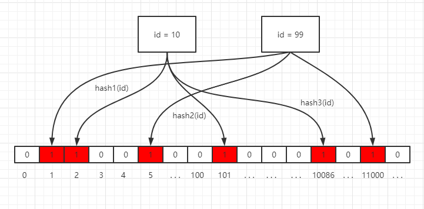

## 缓存穿透

### 简介

​	当客户端访问一个缓存和数据库中都不存在的key时，请求会直接达到数据库，但是由于数据库也不存在，导致数据不能写入缓存；如果数据量很大很大时，若每次请求都到达数据库可能会引起数据库崩溃。

### 解决方法

​	这种情况是由于请求中存在大量缓存和数据库中都不存在的key引起的，因此，可以考虑从三个时段进行考虑：到达缓存前，到达数据库前，到达数据库后的补救措施。如下：

#### 接口校验

​	在正常业务流程中一般不会出现大量key不存在的请求，所以这种场景可能是遭受了非法攻击，可以在最外层先做一层校验：用户鉴权、数据合法性校验等

#### 布隆过滤器

​	使用布隆过滤器存储所有可能访问的key，在请求到达数据库前进行过滤，不存在的key直接被过滤，存在的key则进一步查询缓存和数据库

#### 缓存空值

​	可以让最先的请求的到达数据库，然后将这个key的值设置为null存到缓存中，并且设置过期时间，这样在过期时间到达之前关于该key的请求就不会直接到达数据库了。过期时间的设置需要考虑业务特性。

​	这种方式存在比较大的风险。当受到的攻击，每次的请求都是不同的key，而且每次key在缓存和数据库中都没命中，然后将key-null这样的键值对存入缓存，会容易导致缓存中存在大量这样的键值对，减少了其他正常请求的key命中率。

### 布隆过滤器

#### 过滤器

​	若要解决缓存穿透的问题，可以在到达数据库前添加一个过滤器，过滤器中存储请求中访问数据库比较频繁的所有key，比如id，将所有id存储到过滤器中，这样，在请求到达数据库之前可以首先查找过滤器中是否存在key，不存在直接返回，存在才让请求到达数据库。

###### 缺点

​	过滤器中的值本身也是需要存储在内存中，如果将所有的id或者其他一些热门请求key都放到内存中，会导致内存比较紧张，内存空间同样是个需要考虑的问题。

##### 布隆算法

​	由于存储值比较浪费空间，所以可以将该值通过hash算法计算出一个索引，将索引上的值置为1来表示过滤器中存在该key，这样只需要一个二进制位就可以存储一个id值，大大节约了内存空间，一定程度上减缓了内存的紧张问题。

###### 缺点

​	当数据量很大时，hash算法计算出来的hash值可能会发生hash碰撞，导致错误率上升。

##### 布隆过滤器

​	由于一个hash算法算出的hash发生碰撞的概率较大，因此可以使用多个hash算法对某个key进行计算，得到多个hash值，并将多个hash值的索引值置为1，当请求过来时只有多个hash算法计算出的索引上值都为1才能说明这个key存在数据库中。

###### 缺点

​	举个例子：如下图中有个id为10的key，通过三个hash算法计算出三个索引值2、101、10086，id为99的key，通过三个hash算法算出三个索引值1、5、11000，这些索引的二进制位值都置位1，当有一个请求id=88888到达过滤器时，通过计算，三个索引值为2、5、101，这时发现三个索引位置上的值也为1，但其实id=88888的值在数据库中根本不存在，索引布隆过滤器**会概率出现错误**，可能会**将不存在的key定义为存在**。但是当过滤器觉得key不存在时，那必然是不存在。

​	

###### 考虑

​	如果需要删除一个key时，这个key计算的三个索引位置中某个位置可能也是其他key的索引位置，因此不能轻易的将这个1置为0。

​	可以在将对每个二进制位添加一个计数器，当计数器的值为0时，才可以将这个索引上的值置为0.（这样做是否又增加了内存的紧张？）

