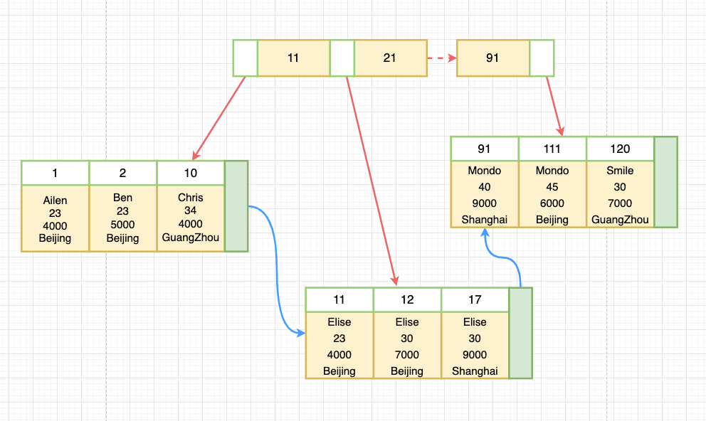

# 从索引结构来看索引失效的原因

## 前言

> ​	关于索引优化的原则，网上有太多总结性的文章，大多是列举了一系列优化的意见以及在什么情况下索引会失效，但是却很少有人能说清楚为什么索引会失效，本篇文章会从索引底层结构的角度去分析索引失效的原因

## InnoDB索引结构


​	InnoDB 是 Mysql 默认的存储引擎，一般来说索引优化针对的就是 InnoDB 引擎，相比于MyISAM ，InnoDB 在查询性能和删除性能并没有什么优势，但是 InnoDB 好处在于可以支持事务、外键以及行级锁。一般来说 InnoDB 存储引擎的索引结构是基于 B-Tree的，或者说从技术上是B+Tree，B-Tree意味着所有的值都是按照`顺序`存储的，这一点非常关键，是我们分析索引是否失效的一个重要信息。

> ​	B-Tree索引能够加快访问数据的速度，因为存储引擎不再需要进行全表扫描来获取需要 的数据，取而代之的是从索引的根节点（图示并未画出）开始进行搜索。根节点的槽中 存放了指向子节点的指针，存储引擎根据这些指针向下层查找。通过比较节点页的值和 要查找的值可以找到合适的指针进入下层子节点，这些指针实际上定义了子节点页中值 的上限和下限。最终存储引擎要么是找到对应的值，要么该记录不存在。
>
> ​	叶子节点比较特别，它们的指针指向的是被索引的数据，而不是其他的节点页（不同引 擎的“指针”类型不同）。图5-1中仅绘制了一个节点和其对应的叶子节点，其实在根节 点和叶子节点之间可能有很多层节点页。树的深度和表的大小直接相关。

## 索引失效的情况

​	下图为我们在数据库中创建的`user`表结构，我们以该表为例，讨论一下索引失效的问题，`user`表共有5个字段，分别为：主键Id、姓名、年龄、工资还有居住城市，同时我们也创建了一个组合索引`Index_1`

	


> ​	我们可以从下图了解到索引数据在底层是如何进行存储的，不难看出，整个索引结构都保持了一个相对的顺序存储



### 情况1：所有范围查询的右边，索引会失效

#### 正常情况

​	我们来看第一种情况，先是通过索引【姓名、年龄、工资】精确查询的方式进行查询，EXPLAIN 语句输出结果，我们发现`ref`字段成功识别三个索引的索引类型，表明这次查询任务有三个索引字段生效，可以看出在这种情况下，三个查询条件都会经过索引进行查找

```sql
EXPLAIN SELECT * FROM `user` WHERE name = 'Elise' AND age = 30 AND wages = 9000;
```


#### 索引失效

​	对比索引失效的情况，我们对年龄字段进行范围查找，查询年龄大于30的人员，分析 EXPLAIN 解释语句输出的结果，从`ref`字段已经得不到我们想要的信息了，但是可以看到`key_len`也就是索引总长度这一栏是比上一次查询少了8个单位长度，我们不妨来计算一下。最终我们发现，第一次完整使用了三个字段的索引，索引总长度为`778`，第二次查询中，虽然无法从`ref`字段直接获取索引的使用情况，但通过对比可以得知，索引的总长度为772，很明显丢失了第三个索引字段的长度，从而可以得出结论：范围查询`age`索引之后的索引字段失效了。

> name：char（255） = 255*3  + 2（varchar变长字段）=  767
>
> age：int = 4 + 1 （非空占位1） = 5
>
> 相加得到结果`772`

```sql
EXPLAIN SELECT * FROM `user` WHERE name = 'Elise' AND age > 30 AND wages = 9000;
```


### 分析索引失效的原因

> ​	我们从索引底层结构的角度来看待索引失效的现象，不难发现，索引的存储规律符合最左前缀原则。也就是说，在多个查询条件中，左边的索引精确查询的结果下相邻的右边的索引一定保证了顺序存储，比如当`name`字段都等于`Elise`的时候，那么结果范围里的`age`字段一定是保证顺序存储的，这也就说明，如果左边索引查询出的结果不是一个精确的值，而是一个`范围`，那么相邻右边的索引也就无法保证顺序存储了，这就是范围查询右边索引会失效的最主要原因。

