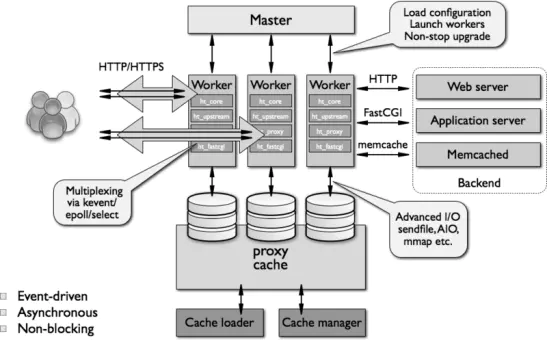

# nginx架构

## 两种进程

### Master

master进程并不处理网络请求，主要负责调度工作进程，也就是图示的三项：加载配置、启动工作进程及非停升级。所以，nginx启动以后，查看操作系统的进程列表，我们就能看到至少有两个nginx进程。

### Worker

服务器实际处理网络请求及响应的是工作进程（worker），在类unix系统上，nginx可以配置多个worker，而每个worker进程都可以同时处理数以千计的网络请求。worker进程的数量当然也不是越多越好，实际调优的时候，一般要根据cpu 的数量而定。

nginx的网络模型是io多路复用模型，基于linux系统的epoll/select模型。**事件驱动加上异步非阻塞的io模型，可以说是nginx得以获得高并发、高性能的关键因素。**

## 模块化设计

Nginx还有一个特点就是模块化设计。nginx的worker，包括核心和功能性模块，核心模块负责维持一个运行循环（run-loop），执行网络请求处理的不同阶段的模块功能，如网络读写、存储读写、内容传输、外出过滤，以及将请求发往上游服务器等。而其代码的模块化设计，也使得我们可以根据需要对功能模块进行适当的选择和修改，编译成具有特定功能的服务器。