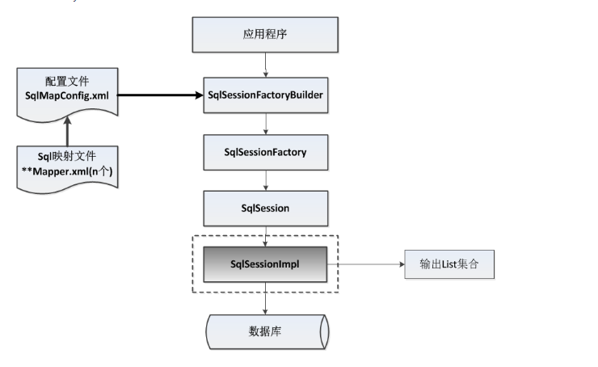
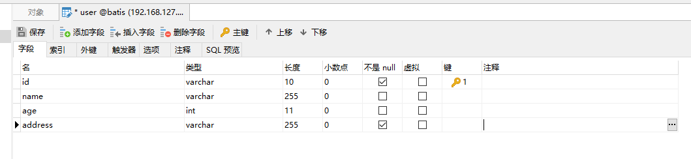
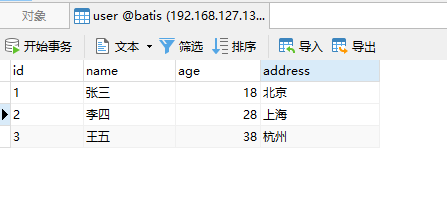
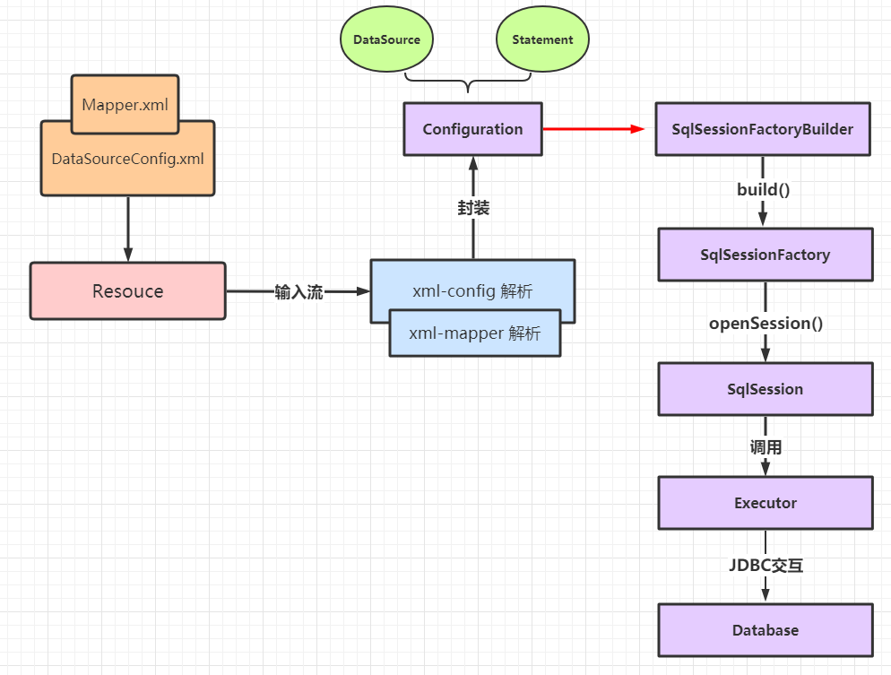

# 实现自定义的 类Mybatis 框架

## 自定义Mybatis概述

### 原生 JDBC 存在的问题

#### 问题描述

* 数据库链接信息、注册驱动、Sql 语句硬编码的问题，代码不易维护
* 频繁创建释放数据库链接造成资源的浪费
* 结果集需要手动封装，非常麻烦

#### 解决方案

* 硬编码问题可以通过配置文件来解决
* 引入数据库连接池，解决频繁释放资源造成的问题
* 使用反射、动态代理，减少重复代码，根据执行条件动态执行sql

### 自定义 Mybatis 架构图 



## 实现自定义 Mybatis 框架

### pom 文件

``` xml
<properties>
        <project.build.sourceEncoding>UTF-8</project.build.sourceEncoding>
        <maven.compiler.encoding>UTF-8</maven.compiler.encoding>
        <java.version>1.8</java.version>
        <maven.compiler.source>1.8</maven.compiler.source>
        <maven.compiler.target>1.8</maven.compiler.target>
    </properties>
    
    <dependencies>
        <dependency>
            <groupId>mysql</groupId>
            <artifactId>mysql-connector-java</artifactId>
            <version>5.1.17</version>
        </dependency>
        <dependency>
            <groupId>c3p0</groupId>
            <artifactId>c3p0</artifactId>
            <version>0.9.1.2</version>
        </dependency>
        <dependency>
            <groupId>log4j</groupId>
            <artifactId>log4j</artifactId>
            <version>1.2.12</version>
        </dependency>
        <dependency>
            <groupId>junit</groupId>
            <artifactId>junit</artifactId>
            <version>4.10</version>
        </dependency>
        <dependency>
            <groupId>dom4j</groupId>
            <artifactId>dom4j</artifactId>
            <version>1.6.1</version>
        </dependency>
        <dependency>
            <groupId>jaxen</groupId>
            <artifactId>jaxen</artifactId>
            <version>1.1.6</version>
        </dependency>
    </dependencies>
```

### 数据库表设计

#### 表结构



#### 表数据



### 读取 xml 配置信息

#### DataSourceConfig.xml

```xml
<configuration>
    <property name="driverClass" value="com.mysql.jdbc.Driver"></property>
    <property name="jdbcUrl" value="jdbc:mysql:///192.168.127.130:3306/batis"></property>
    <property name="username" value="root"></property>
    <property name="password" value="root"></property>

    <mapper resource="UserMapper.xml"></mapper>
</configuration>
```

#### UserMapper.xml

定义了两个方法，一个根据条件查询单个对象，一个用来查询全表

```xml
<mapper namespace="User">
<!--    根据条件查询单个用户-->
    <select id = "selectOne" paramterType="com.miao.entity.User" result="com.miao.entity.User">
        select * from user where id = #{id} and username = #{username}
    </select>

<!--    查询用户列表-->
    <select id = "selectList" result="com.miao.entity.User">
        select * from user
    </select>
</mapper>
```

### 资源读取，解析

#### 资源转化为字节流

定义`Resource`资源类，该类作用为根据资源路径，将资源转化为字节输入流

```java
public class Resource {

    /**
     * 根据配置文件路径获取配置文件字节输入流
     * @param path
     * @return
     */
    public InputStream getInputStream(String path){
        InputStream resourceAsStream = Resource.class.getResourceAsStream(path);
        return resourceAsStream;
    }
}

```

#### XmlConfigBuilder

字节流交给对应的`Xml`解析类进行处理，获取其中的数据库连接信息，sql信息，并将数据库连接，`sql`查询对象池封装进`Configuration`对象

```java
public class XmlConfigBuilder {

    private Configuration configuration;

    public XmlConfigBuilder(Configuration configuration) {
        this.configuration = configuration;
    }

    /**
     * 解析配置文件
     * @param inputStream
     * @return
     */
    public Configuration parseConfiguration(InputStream inputStream) throws DocumentException, PropertyVetoException {
        // dom4j方式读取字节流信息
        Document read = new SAXReader().read(inputStream);
        // 获得根节点 <Configuration>
        Element rootElement = read.getRootElement();
        // 获取属性节点
        List<Element> list = rootElement.selectNodes("//property");
        // 将所有的属性信息读取出来，并保存到Properties对象中
        Properties properties = new Properties();
        list.forEach((item) -> {
            properties.setProperty(item.attributeValue("name"),item.attributeValue("value"));
        });
        // 创建数据库链接池，填充属性信息
        ComboPooledDataSource pooledDataSource = new ComboPooledDataSource();
        pooledDataSource.setDriverClass(properties.getProperty("driverClass"));
        pooledDataSource.setJdbcUrl(properties.getProperty("jdbcUrl"));
        pooledDataSource.setUser(properties.getProperty("username"));
        pooledDataSource.setPassword(properties.getProperty("password"));

        // 封装configuration对象的数据源信息
        configuration.setDataSource(pooledDataSource);

        // 封装 Mapper 信息
        List<Element> mappers = rootElement.selectNodes("//mapper");
        XmlMapperBuilder xmlMapperBuilder = new XmlMapperBuilder(configuration);
        mappers.forEach((item) -> {
            String path = item.attributeValue("resource");
            InputStream resourceAsStream = Resource.class.getResourceAsStream(path);
            try {
                xmlMapperBuilder.parse(resourceAsStream);
            } catch (DocumentException e) {
                e.printStackTrace();
            }
        });
        return configuration;
    }
}
```

#### Configuration

配置类包含两个关键信息，一个是数据库连接池的信息，执行`sql`之前可以调用该对象获取一个临时的数据库连接。在`Configuration`对象中还存在一个`Map`集合，该集合用来保存`sql`查询对象，其中包含一次`sql`查询所需要的所有信息

```java
public class Configuration {

    /**
     * 数据源对象
     */
    private DataSource dataSource;
    /**
     * 用来保存封装好的查询对象
     */
    private Map map = new HashMap<String, MappedStatement>();

}
```

#### MappedStatement

该对象包含一次查询所需要的所有`sql`相关的信息，包括用于区分不同`sql`语句的 id 信息，待处理的 sql，请求参数类型，返回参数类型

```java
public class MappedStatement {
    /**
     * id
     */
    private String id;
    /**
     * sql语句
     */
    private String sql;
    /**
     * 请求参数类型
     */
    private Class<?> parameterType;
    /**
     * 返回参数类型
     */
    private Class<?> resultType;
}
```

#### XmlMapperBuilder

由于`XmlConfigBuilder`需要解析数据库基本信息的同时还需要处理`Mapper`下每一个`Sql`语句的信息，为了不让代码太过臃肿，创建一个`XmlMapperBuilder`类专门用于解析`Mapper`文件中的信息，处理完成后再遍历存储到`Configuration`类中

```java
public class XmlMapperBuilder {

    private Configuration configuration;

    public XmlMapperBuilder(Configuration configuration) {
        this.configuration = configuration;
    }


    public void parse(InputStream resourceAsStream) throws DocumentException {
        Document read = new SAXReader().read(resourceAsStream);
        Element rootElement = read.getRootElement();
        // 获得namespace
        String namespace = rootElement.attributeValue("namespace");
        List<Element> list = rootElement.selectNodes("//select");
        list.forEach((item) -> {
            String id = item.attributeValue("id");
            // 获得请求参数全路径
            String type = item.attributeValue("parameterType");
            // 获得返回参数全路径
            String result = item.attributeValue("result");
            // 获取参数类型
            Class<?> classType = null;
            Class<?> classType1 = null;
            try {
                classType = getClassType(type);
                classType1 = getClassType(result);
            } catch (ClassNotFoundException e) {
                e.printStackTrace();
            }
            // 获取statementId，用于区分不同的查询语句
            String statementId = namespace+"."+id;
            // 获取sql语句
            String sql = item.getTextTrim();

            //封装 mappedStatement
            MappedStatement mappedStatement = new MappedStatement();
            mappedStatement.setId(id);
            mappedStatement.setParameterType(classType);
            mappedStatement.setResultType(classType1);
            mappedStatement.setSql(sql);

            //填充 configuration
            configuration.getMap().put(statementId,mappedStatement);
        });
    }

    /**
     * 根据全路径类名获取类对象
     * @param type
     * @return
     * @throws ClassNotFoundException
     */
    private Class<?> getClassType(String type) throws ClassNotFoundException {
        Class<?> aClass = Class.forName(type);
        return aClass;
    }
}
```

### Sql 处理，执行，获取结果

#### 工厂类构建类 SqlSessionFactoryBuilder

先调用 xml 解析类解析配置文件，Mapper 配置文件，再根据封装好的`Configuration`创建 `SqlSessionFactory`工厂类

```java
public class SqlSessionFactoryBuilder {

    private Configuration configuration;

    public SqlSessionFactoryBuilder(Configuration configuration) {
        this.configuration = configuration;
    }

    public SqlSessionFactory build(InputStream inputStream) throws DocumentException, PropertyVetoException {
        // 解析配置文件，封装Configuration
        XmlConfigBuilder xmlConfigBuilder = new XmlConfigBuilder(configuration);

        Configuration configuration = xmlConfigBuilder.parseConfiguration(inputStream);

        // 创建 SqlSessionFactory
        SqlSessionFactory sqlSessionFactory = new DefaultSqlSessionFactory(configuration);
        return sqlSessionFactory;
    }
}

```

#### SqlSessionFactory 

会话工厂类，为每一次 sql 查询分配一次会话

```java
public interface SqlSessionFactory {
    /**
     * 获取一个sql会话
     * @return
     */
    public SqlSession openSession();
}
```

#### DefaultSqlSessionFactory

会话工厂类的实现类

```java
public class DefaultSqlSessionFactory implements SqlSessionFactory {

    private Configuration configuration;

    public DefaultSqlSessionFactory(Configuration configuration) {
        this.configuration = configuration;
    }

    @Override
    public SqlSession openSession() {
        return new DefaultSqlSession(configuration);
    }
}
```

#### SqlSession

会话对象接口

```java
public interface SqlSession {

    /**
    * @description: 查询列表 
    * @param: [statementId, param]
    * @return: java.util.List<E>
    * @date: 2020/9/29
    */
    public <E> List<E> selectList(String statementId, Object... param) throws Exception;
    
    /**
    * @description: 根据条件查询 
    * @param: [statementId, params]
    * @return: T
    * @date: 2020/9/29
    */
    public <T> T selectOne(String statementId,Object... params) throws Exception;
    
    /**
    * @description: 关闭会话 
    * @param: []
    * @return: void
    * @date: 2020/9/29
    */
    public void close() throws Exception;

    /**
     * 获取一个代理类对象
     * @param mapperClass
     * @param <T>
     * @return
     */
    public <T> T getMappper(Class<?> mapperClass);

}
```


#### DefaultSqlSession

`sql`会话对象的实现类

```java
public class DefaultSqlSession implements SqlSession {

    private Configuration configuration;

    /**
     * 处理器对象
     */
    private Executor simpleExecutor = new SimpleExecutor();

    public DefaultSqlSession(Configuration configuration) {
        this.configuration = configuration;
    }

    @Override
    public <E> List<E> selectList(String statementId, Object... param) throws Exception {
        // 获得 mappedStatement 对象
        MappedStatement mappedStatement = (MappedStatement) configuration.getMap().get("statementId");
        List<E> query = simpleExecutor.excute(configuration,mappedStatement,param);
        return query;
    }

    @Override
    public <T> T selectOne(String statementId, Object... params) throws Exception {

        MappedStatement mappedStatement = (MappedStatement)configuration.getMap().get("statementId");
        List<T> query = simpleExecutor.excute(configuration, mappedStatement, params);
        if (query.size()==1) {
            return query.get(0);
        }else {
            throw new RuntimeException("返回结果过多");
        }
    }

    @Override
    public void close() throws Exception {
        simpleExecutor.close();
    }

    @Override
    public <T> T getMappper(Class<?> mapperClass) {
        T o = (T) Proxy.newProxyInstance(mapperClass.getClassLoader(), new Class[]
                {mapperClass}, new InvocationHandler() {
            @Override
            public Object invoke(Object proxy, Method method, Object[] args)
                    throws Throwable {
                String methodName = method.getName();

                String className = method.getDeclaringClass().getName();

                String key = className+"."+methodName;
                MappedStatement mappedStatement = (MappedStatement) configuration.getMap().get(key);
                Type genericReturnType = method.getGenericReturnType();
                ArrayList arrayList = new ArrayList<> ();

                if(genericReturnType instanceof ParameterizedType){
                    return selectList(key,args);
                }
                return selectOne(key,args);
            }
        });
        return o;
    }
}
```

#### Executor

执行对象，最后一步需要具体的执行类来执行`sql`方法，这里是对JDBC的一次封装，整个流程和用 JDBC 查询区别不大，比较明显的区别是对 Sql 的预处理和对查询条件的封装

```java
public interface Executor {

    <E> List<E> excute(Configuration configuration, MappedStatement mappedStatement, Object[] param) throws Exception;

    void close() throws Exception;
}
```

#### SimpleExecutor

```java
public class SimpleExecutor implements Executor{

    private Connection connection = null;

    @Override
    public <E> List<E> excute(Configuration configuration, MappedStatement mappedStatement, Object[] param) throws Exception {
        // 获取数据库链接；
        connection = configuration.getDataSource().getConnection();
        // 获取sql语句
        // select * from user where id = #{id} and username = #{username}
        String sql = mappedStatement.getSql();
        // 对sql 语句进行处理，占位符替换
        BoundSql boundsql = getBoundSql(sql);

        //获取处理后的sql语句
        // select * from where id = ? and username = ?
        String sqlText = boundsql.getSqlText();
        // 获取传入参数的类型
        Class<?> parameterType = mappedStatement.getParameterType();
        PreparedStatement preparedStatement = connection.prepareStatement(sqlText);
        // 获取参数列表
        List<ParameterMapping> parameterMappingList = boundsql.getParameterMappingList();

        Object object = null;
        for (int i = 0; i < parameterMappingList.size(); i++) {

            ParameterMapping parameterMapping = parameterMappingList.get(i);

            String name = parameterMapping.getContent();

            Field declaredField = parameterType.getDeclaredField(name);
            declaredField.setAccessible(true);
            Object o = declaredField.get(param[0]);
            preparedStatement.setObject(i+1,o);
        }

        ResultSet resultSet = preparedStatement.executeQuery();
        Class<?> resultTypeClass = mappedStatement.getResultType();
        ArrayList objects = new ArrayList();

        while(resultSet.next()) {
            object = resultTypeClass.newInstance();
            ResultSetMetaData metaData = resultSet.getMetaData();

            for(int i = 1; i <= metaData.getColumnCount(); ++i) {
                String columnName = metaData.getColumnName(i);
                Object value = resultSet.getObject(columnName);
                PropertyDescriptor propertyDescriptor = new PropertyDescriptor(columnName, resultTypeClass);
                Method writeMethod = propertyDescriptor.getWriteMethod();
                writeMethod.invoke(object, value);
            }

            objects.add(object);
        }

        return objects;
    }

    /**
     * 解析sql语句和参数
     * @param sql
     * @return
     */
    private BoundSql getBoundSql(String sql) {
        ParameterMappingTokenHandler handler = new ParameterMappingTokenHandler();
        GenericTokenParser genericTokenParser = new GenericTokenParser("# {","}",handler);
        List<ParameterMapping> parameterMappings = handler.getParameterMappings();
        String parse = genericTokenParser.parse(sql);
        BoundSql boundSql = new BoundSql(parse, parameterMappings);
        return boundSql;
    }

    @Override
    public void close() throws Exception {
        connection.close();
    }
}
```

### 框架测试使用

在测试工程中引入自定义的 Mybatis 框架，调用测试方法可以返回正确值

```java
	public void test() throws Exception {
        InputStream resourceAsSteam = Resources.getResourceAsSteam("sqlMapConfig.xml");
        SqlSessionFactory sqlSessionFactory = new SqlSessionFactoryBuilder().build(resourceAsSteam);
        SqlSession sqlSession = sqlSessionFactory.openSession();

        //调用
        User user = new User();
        user.setId(1);
        user.setUsername("张三");
    	IUserDao userDao = sqlSession.getMapper(IUserDao.class);

        List<User> all = userDao.findAll();
        for (User user1 : all) {
            System.out.println(user1);
        }
    }
```


## 总结

