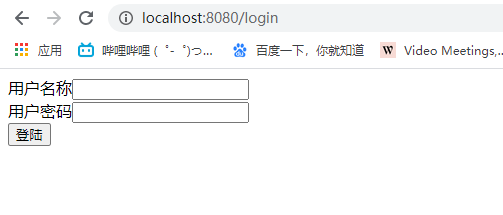

# formLogin模式登录认证

## 一、formLogin的应用场景

在本专栏之前的文章中，已经给大家介绍过Spring Security的HttpBasic模式，该模式比较简单，只是进行了通过携带Http的Header进行简单的登录验证，而且没有定制的登录页面，所以使用场景比较窄。
对于一个完整的应用系统，与登录验证相关的页面都是高度定制化的，非常美观而且提供多种登录方式。这就需要Spring Security支持我们自己定制登录页面，也就是本文给大家介绍的formLogin模式登录认证模式。

### 准备工作

- 新建一个Spring Boot 的web应用，引入Spring Security Starter。
- 准备一个login.html登录页面，页面内容非常简单，一个from表单、用户名和密码输入框，一个提交按钮
- 准备一个首页index.html，在登录成功之后需要进入index.html首页
- 首页可以看到syslog（日志管理）、sysuer（用户管理）、biz1（业务一）、biz2（业务二）四个页面超文本链接选项。通过controller控制层跳转页面，并在对应页面写一些标志性文字即可，不需写具体业务。

### 需求

- 我们希望biz1（业务一）、biz2（业务二）普通的操作用户user就可以访问
- 我们希望管理员可以访问包括syslog（日志管理）和sysuser(用户管理)在内的所有资源

以上就是本文介绍formLogin模式需要进行的准备工作及需求，下面我们就来实现其中的核心的登录验证逻辑，准备工作非常简单请自行实现。（新建spring boot应用，登录页面、首页、四个业务页面都写成非常简单的html即可，不用写实际业务和样式。）

## 二、说明

formLogin模式的三要素：

- 登录认证逻辑
- 资源访问控制规则，如：资源权限、角色权限
- 用户角色权限

一般来说，使用权限认证框架的的业务系统登录验证逻辑是固定的，而资源访问控制规则和用户信息是从数据库或其他存储介质灵活加载的。但本文所有的用户、资源、权限信息都是代码配置写死的，旨在为大家介绍formLogin认证模式，如何从数据库加载权限认证相关信息我还会结合RBAC权限模型再写文章的。

## 三、登录认证及资源访问权限的控制

首先，我们要继承WebSecurityConfigurerAdapter ，重写configure(HttpSecurity http) 方法，该方法用来配置登录验证逻辑。请注意看下文代码中的注释信息。

```java
@Configuration
public class SecurityConfig extends WebSecurityConfigurerAdapter {

    @Override
    protected void configure(HttpSecurity http) throws Exception {
        http.csrf().disable() //禁用跨站csrf攻击防御，后面的章节会专门讲解
            .formLogin()
            .loginPage("/login.html")//用户未登录时，访问任何资源都转跳到该路径，即登录页面
            .loginProcessingUrl("/login")//登录表单form中action的地址，也就是处理认证请求的路径
            .usernameParameter("username")///登录表单form中用户名输入框input的name名，不修改的话默认是username
            .passwordParameter("password")//form中密码输入框input的name名，不修改的话默认是password
            .defaultSuccessUrl("/index")//登录认证成功后默认转跳的路径
        .and()
            .authorizeRequests()
            .antMatchers("/login.html","/login").permitAll()//不需要通过登录验证就可以被访问的资源路径
            .antMatchers("/biz1","/biz2") //需要对外暴露的资源路径
                .hasAnyAuthority("ROLE_user","ROLE_admin")  //user角色和admin角色都可以访问
            .antMatchers("/syslog","/sysuser")
                .hasAnyRole("admin")  //admin角色可以访问
            //.antMatchers("/syslog").hasAuthority("sys:log")
            //.antMatchers("/sysuser").hasAuthority("sys:user")
            .anyRequest().authenticated();
    }
    
}
```

上面的代码分为两部分：

- 第一部分是formLogin配置段，用于配置登录验证逻辑相关的信息。如：登录页面、登录成功页面、登录请求处理路径等。
- 第二部分是authorizeRequests配置端，用于配置资源的访问权限。如：开发登录页面的permitAll开放访问，“/biz1”（业务一页面资源）需要有角色为user或admin的用户才可以访问。
- `hasAnyAuthority("ROLE_user","ROLE_admin")`等价于`hasAnyRole("user","admin")`,角色是一种特殊的权限。
- "sys:log"或"sys:log"是我们自定义的权限ID，有这个ID的用户可以访问对应的资源

这时候，我们通过浏览器访问，随便测试一个没有访问权限的资源，都会跳转到login.html页面。


## 四、用户及角色信息配置

在上文中，我们配置了登录验证及资源访问的权限规则，我们还没有具体的用户，下面我们就来配置具体的用户。重写WebSecurityConfigurerAdapter的 configure(AuthenticationManagerBuilder auth)方法

```java
@Override
public void configure(AuthenticationManagerBuilder auth) throws Exception {
    auth.inMemoryAuthentication()
                .withUser("user")
                .password(passwordEncoder().encode("123456"))
                .roles("user")
            .and()
                .withUser("admin")
                .password(passwordEncoder().encode("123456"))
                //.authorities("sys:log","sys:user")
                .roles("admin")
            .and()
                .passwordEncoder(passwordEncoder());//配置BCrypt加密
}

@Bean
public PasswordEncoder passwordEncoder(){
    return new BCryptPasswordEncoder();
}
```

- `inMemoryAuthentication`指的是在内存里面存储用户的身份认证和授权信息。
- `withUser("user")`用户名是user
- `password(passwordEncoder().encode("123456"))`密码是加密之后的123456
- `authorities("sys:log","sys:user")`指的是admin用户拥有资源ID对应的资源访问的的权限："/syslog"和"/sysuser"
- `roles()`方法用于指定用户的角色，一个用户可以有多个角色

## 五、静态资源访问

> 在我们的实际开发中，登录页面login.html和控制层 Controller 登录验证 '/login' 都必须无条件的开放。除此之外，一些静态资源如 css、js 文件通常也都不需要验证权限，我们需要将它们的访问权限也开放出来。下面就是实现的方法：重写 WebSecurityConfigurerAdapter类的configure(WebSecurity web) 方法

```java
   @Override
    public void configure(WebSecurity web) {
        //将项目中静态资源路径开放出来
        web.ignoring().antMatchers( "/css/**", "/fonts/**", "/img/**", "/js/**");
    }
```