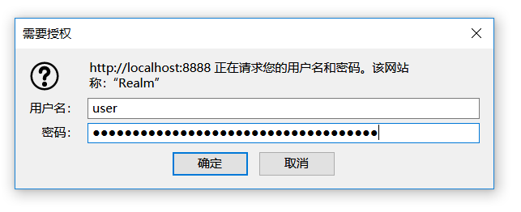

# HttpBasic模式登录认证


## 一、HttpBasic模式的应用场景

HttpBasic登录验证模式是Spring Security实现登录验证最简单的一种方式，也可以说是最简陋的一种方式。它的目的并不是保障登录验证的绝对安全，而是提供一种“防君子不防小人”的登录验证。

就好像是我小时候写日记，都买一个带小锁头的日记本，实际上这个小锁头有什么用呢？如果真正想看的人用一根钉子都能撬开。它的作用就是：某天你的父母想偷看你的日记，拿出来一看还带把锁，那就算了吧，怪麻烦的。

举一个我使用HttpBasic模式的进行登录验证的例子：我曾经在一个公司担任部门经理期间，开发了一套用于统计效率、分享知识、生成代码、导出报表的Http接口。纯粹是为了工作中提高效率，同时我又有一点点小私心，毕竟各部之间是有竞争的，所以我给这套接口加上了HttpBasic验证。公司里随便一个技术人员，最多只要给上一两个小时，就可以把这个验证破解了。说白了，这个工具的数据不那么重要，加一道锁的目的就是不让它成为公开数据。如果有心人破解了，真想看看这里面的数据，其实也无妨。这就是HttpBasic模式的典型应用场景。

## 二、spring boot2.0整合Spring security

spring boot 2,x版本maven方式引入Spring security坐标。

```
<dependency>
	<groupId>org.springframework.boot</groupId>
	<artifactId>spring-boot-starter-security</artifactId>
</dependency>
```

## 三、HttpBasic登录认证模式

**如果使用的Spring Boot版本为1.X版本,依赖的Security 4.X版本，那么就无需任何配置，启动项目访问则会弹出默认的httpbasic认证.**

我们现在使用的是spring boot2.0版本（依赖Security 5.X版本），HttpBasic不再是默认的验证模式，在spring security 5.x默认的验证模式已经是表单模式。所以我们要使用Basic模式，需要自己调整一下。并且`security.basic.enabled`已经过时了，所以我们需要自己去编码实现。

```java
@Configuration
public class SecurityConfig extends WebSecurityConfigurerAdapter {
   
   @Override
   protected void configure(HttpSecurity http) throws Exception {
      http.httpBasic()//开启httpbasic认证
      .and()
      .authorizeRequests()
      .anyRequest()
      .authenticated();//所有请求都需要登录认证才能访问
   }

}
```

启动项目，在项目后台有这样的一串日志打印，冒号后面的就是默认密码。

```
Using generated security password: 0cc59a43-c2e7-4c21-a38c-0df8d1a6d624
```

我们可以通过浏览器进行登录验证，默认的用户名是user.（下面的登录框不是我们开发的，是HttpBasic模式自带的）


当然我们也可以通过application.yml指定配置用户名密码

```yml
spring:
    security:
      user:
        name: admin
        password: admin
```

## 四、HttpBasic模式的原理说明


- 首先，HttpBasic模式要求传输的用户名密码使用Base64模式进行加密。如果用户名是 `"admin"` ，密码是“ admin”，则将字符串`"admin:admin"`使用Base64编码算法加密。加密结果可能是：YWtaW46YWRtaW4=。
- 然后，在Http请求中使用Authorization作为一个Header，“Basic YWtaW46YWRtaW4=“作为Header的值，发送给服务端。（注意这里使用Basic+空格+加密串）
- 服务器在收到这样的请求时，到达BasicAuthenticationFilter过滤器，将提取“ Authorization”的Header值，并使用用于验证用户身份的相同算法Base64进行解码。
- 解码结果与登录验证的用户名密码匹配，匹配成功则可以继续过滤器后续的访问。

所以，HttpBasic模式真的是非常简单又简陋的验证模式，Base64的加密算法是可逆的，你知道上面的原理，分分钟就破解掉。我们完全可以使用PostMan工具，发送Http请求进行登录验证。