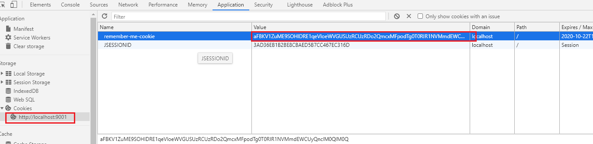

# rememberMe 记住登录状态

## 内存模式

配置 HttpSecurity ，在前端传递 remember-me 参数

```java
http.rememberMe()
                // rememberMe传递参数名称
                .rememberMeParameter("remember-me")
                // cookie名称
                .rememberMeCookieName("remember-me-cookie")
                // token过期时间
                .tokenValiditySeconds(2*24*60*60)
```


## 数据库模式

### 配置数据源以及repository：persistentTokenRepository()

```java
 @Resource
    private DataSource dataSource;

/**
     * 配置数据源，保存 remember-me-cookie
     * @return
     */
    @Bean
    public PersistentTokenRepository persistentTokenRepository() {
        JdbcTokenRepositoryImpl jdbcTokenRepository = new JdbcTokenRepositoryImpl();
        jdbcTokenRepository.setDataSource(dataSource);
        return jdbcTokenRepository;
    }

 @Override
    protected void configure(HttpSecurity http) throws Exception {
        http.rememberMe()
                // rememberMe传递参数名称
                .rememberMeParameter("remember-me")
                // cookie名称
                .rememberMeCookieName("remember-me-cookie")
                // token过期时间
                .tokenValiditySeconds(2*24*60*60)
                // 数据库持久化存储 remember-me-token
                .tokenRepository(persistentTokenRepository())
    }
```

### 在数据库中建表

```sql
CREATE TABLE security_demo.persistent_logins
(
    username  varchar(64)                         NOT NULL,
    series    varchar(64)                         NOT NULL
        PRIMARY KEY,
    token     varchar(64)                         NOT NULL,
    last_used timestamp DEFAULT CURRENT_TIMESTAMP NOT NULL ON UPDATE CURRENT_TIMESTAMP
);

```

### 登录系统点击记住密码

可以在 cookies 中找到保存的 remember-me-cookie



## redis 实现方式

## 登录成功处理：SuccessHandler

> successHandler 和 defaultSuccessUrl 两者只能存在其一

```java
@Component
public class AuthenticationSuccessHandler extends SavedRequestAwareAuthenticationSuccessHandler {

    private static ObjectMapper objectMapper = new ObjectMapper();

    @Override
    public void onAuthenticationSuccess(HttpServletRequest request, HttpServletResponse response, Authentication authentication) throws ServletException, IOException {
        response.setContentType("application/json;charset=UTF-8");
        response.getWriter().write(objectMapper.writeValueAsString(
                Result.ok("/index")
        ));
    }
}

```

```java
@Resource
private AuthenticationSuccessHandler authenticationSuccessHandler;

.formLogin()
                // 登录成功后如何处理，和defaultSuccessUrl 两者只能存在一个
                .successHandler(authenticationSuccessHandler)
                // 登录页面指定，如果不指定则使用springSecurity默认的登录页
```


## 退出登录处理：LogoutSuccessHandler

> LogoutSuccessHandler 和 logoutSuccessUrl 两者只能存在其一

```java
@Component
public class MyLogoutHandler implements LogoutSuccessHandler {

    @Override
    public void onLogoutSuccess(HttpServletRequest httpServletRequest
            , HttpServletResponse httpServletResponse
            , Authentication authentication) throws IOException, ServletException {
        httpServletResponse.sendRedirect("/login");
    }
}

```

```java
@Resource
private MyLogoutHandler myLogoutHandler;

logout()
                // 退出登录成功后跳转的页面，如果不配置的话，默认跳转到 login 页面
                //.logoutSuccessUrl("/login")
                // 退出登录后删除指定的 cookie,可删除多个
                .deleteCookies("JSESSIONID")
                // 退出登录后进行的操作，和logoutSuccessUrl两者只能存在一个
                .logoutSuccessHandler(myLogoutHandler)
```

