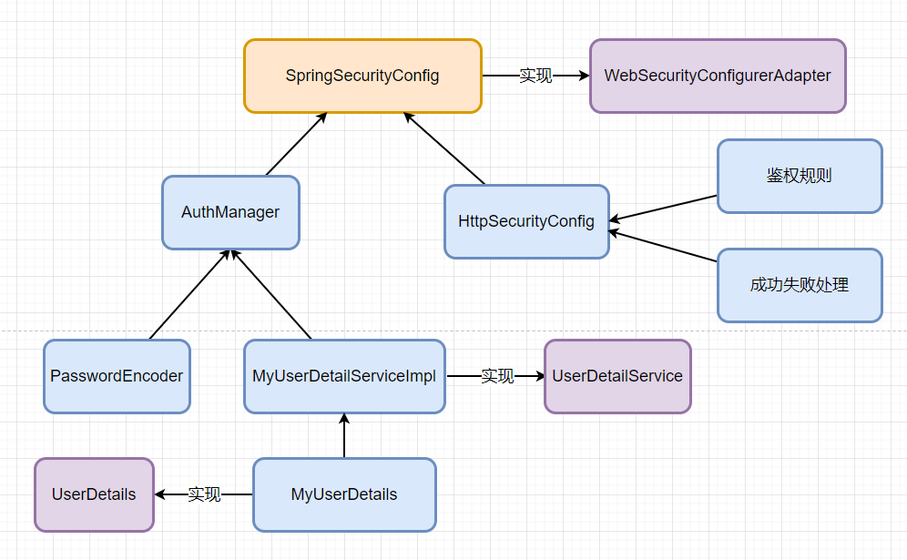

# 数据库加载用户信息&动态权限

## 前端结构

> 前端整体有 7 个页面，在登录页登录成功后会跳转到 index 页面，index 页面拥有 4 个业务系统页面，admin 用户可以访问所有页面，common 用户只能访问 businessA 和 businessB 这两个业务系统，如果登录验证失败的话，则会跳转到 error 页面


## 数据库设计

> 基于 RBAC 模型设计的权限系统，用户拥有多个角色，角色拥有多个权限/菜单


## 编码部分

### Spring Security 的配置核心

> 整个 Spring Security 的配置围绕着 SpringSecurityConfig 而来的，SpringSecurityConfig  继承 WebSecurityConfigurerAdapter 类，并实现 Spring Security 的配置，配置类中两大核心点是 AuthManager（用户信息校验），HttpSecurity（鉴权规则，失败成功处理）这两大块。



### 核心配置类解析

```java
@Configuration
/**
 * 开启注解鉴权
 */
@EnableGlobalMethodSecurity(prePostEnabled=true)
public class WebSecurityConfig extends WebSecurityConfigurerAdapter {

    @Resource
    private UserDetailServiceImpl userDetailService;

    /**
     * 配置密码解码器
     * @return
     */
    @Bean
    public PasswordEncoder passwordEncoder() {
        return new BCryptPasswordEncoder();
    }

    /**
     * 用户详情配置
     * @param auth
     * @throws Exception
     */
    @Override
    protected void configure(AuthenticationManagerBuilder auth) throws Exception {
        auth.userDetailsService(userDetailService)
                .passwordEncoder(passwordEncoder());
    }

    @Override
    protected void configure(HttpSecurity http) throws Exception {
        http.csrf().disable()
                // formLogin的方式登录
                .formLogin()
                // 登录页面指定，如果不指定则使用springSecurity默认的登录页
                .loginPage("/login")
                // 登录流程处理页面
                .loginProcessingUrl("/login")
                // 登录用户名默认参数名称
                .usernameParameter("username")
                // 登录密码默认参数名称
                .passwordParameter("password")
                // 登录成功后默认跳转页面
                .defaultSuccessUrl("/index")
                // 登录失败跳转页面
                .failureUrl("/error")
                .and()
                .authorizeRequests()
                // 以下页面不需要授权，可以直接访问登录页
                .antMatchers("/login","login.html").permitAll()
                // index 页面需要鉴权
                .antMatchers("/index").authenticated()
                // 权限表达式，配置globalAuthManager类的hasPermission()方法，进行全路径鉴权
                .anyRequest().access("@globalAuthManager.hasPermission(request,authentication)");
    }
}
```

### 实现 UserDetail

注意这里用户的过期判断，还有是否被锁的判断要返回 true，默认返回的是 false 会导致登录校验失败

```java
public class AuthUser implements UserDetails {

    /**
     * 密码
     */
    String password;
    /**
     * 用户名
     */
    String username;
    /**
     * 是否没过期
     */
    boolean accountNonExpired;
    /**
     * 是否没被锁定
     */
    boolean accountNonLocked;
    /**
     * 是否没过期
     */
    boolean credentialsNonExpired;
    /**
     * 账号是否可用
     */
    boolean enabled;
    /**
     * 用户的权限集合
     */
    Collection<? extends GrantedAuthority> authorities;


    @Override
    public Collection<? extends GrantedAuthority> getAuthorities() {
        return authorities;
    }

    @Override
    public String getPassword() {
        return password;
    }

    @Override
    public String getUsername() {
        return username;
    }

    @Override
    public boolean isAccountNonExpired() {
        return true;
    }

    @Override
    public boolean isAccountNonLocked() {
        return true;
    }

    @Override
    public boolean isCredentialsNonExpired() {
        return true;
    }

    @Override
    public boolean isEnabled() {
        return enabled;
    }

    public void setPassword(String password) {
        this.password = password;
    }

    public void setUsername(String username) {
        this.username = username;
    }

    public void setAccountNonExpired(boolean accountNonExpired) {
        this.accountNonExpired = accountNonExpired;
    }

    public void setAccountNonLocked(boolean accountNonLocked) {
        this.accountNonLocked = accountNonLocked;
    }

    public void setCredentialsNonExpired(boolean credentialsNonExpired) {
        this.credentialsNonExpired = credentialsNonExpired;
    }

    public void setEnabled(boolean enabled) {
        this.enabled = enabled;
    }

    public void setAuthorities(Collection<? extends GrantedAuthority> authorities) {
        this.authorities = authorities;
    }
}

```

### 实现 UserDetailsService

从数据库里加载用户权限信息，并封装进 AuthUser 对象，SpringSecurity 会自动校验用户权限

``` java
@RequiredArgsConstructor
@Service
public class UserDetailServiceImpl implements UserDetailsService {

    private final SysUserMapper sysUserMapper;
    private final SysRoleMapper sysRoleMapper;
    private final SysMenuMapper sysMenuMapper;


    @Override
    public UserDetails loadUserByUsername(String username) throws UsernameNotFoundException {
        //加载基础用户信息
        AuthUser user = sysUserMapper.getUserByUsername(username);
        if (user == null) {
            throw new BaseException(ErrorCode.USER_IS_NOT_EXIST);
        }
        //加载用户角色列表
        List<String> roles = sysRoleMapper.getRolesByUsername(username);

        //加载用户权限列表
        List<String> menus = sysMenuMapper.getMenusByUsername(username);

        menus.addAll(roles);
        // 将权限字符串集合转化为权限列表
        user.setAuthorities(AuthorityUtils.commaSeparatedStringToAuthorityList(String.join(",",menus)));

        return user;
    }
}

```

### 动态校验权限

如果不适用注解的方式来检验权限的话，可以自定义权限校验规则，之后再通过 HttpSecurity 的 access 方法，将校验规则注入进去

```java
@Service
@RequiredArgsConstructor
public class GlobalAuthManager {

    private final SysMenuMapper sysMenuMapper;

    private AntPathMatcher antPathMatcher = new AntPathMatcher();

    public boolean hasPermission(HttpServletRequest request, Authentication authentication) {
        // 被验证的用户主体
        Object principal = authentication.getPrincipal();
        if (principal instanceof UserDetails) {
            // 获取username
            String username = ((UserDetails) principal).getUsername();
            //根据username获得权限列表
            List<String> menus = sysMenuMapper.getMenusByUsername(username);

            String requestURI = request.getRequestURI();

            boolean b = menus.stream().anyMatch(
                    url -> antPathMatcher.match(url, requestURI)
            );
            return b;
        }
        return false;
    }
}

```

