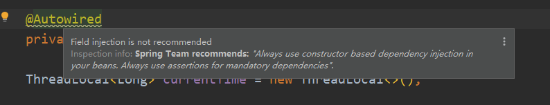

## 	       前言

我们都知道在 Spring Bean 的注入方式一般分为三种：1、构造器注入 2、Setter注入 3、基于注解的 `@Autowired` 自动装配（Field 注入）

在以往的项目开发过程中，我们大多会使用方便灵活的 `@Autowired` 自动装配的方式来管理依赖，但是 Spring 官方却不推荐这么做



> Inspection info: Spring Team recommends: "Always use constructor based dependency injection in your beans. Always use assertions for mandatory dependencies".

从上述信息中我们可以得知，Spring 团队建议我们使用构造注入的方式管理我们的依赖，对强制依赖使用断言，那么为什么不建议使用自动装配呢

## 对比构造注入和Field注入

我么可以先来对比 Field 注入和 构造器注入的区别

### Field 注入

```java
// Field注入
public class AClass(){
    
    @Autowired
    private BClass BClass;
}
```

#### 优点

* 代码少，简洁明了
* 新增依赖十分方便，不需要修改原有代码
* 注入简单，只需要使用 `@Autowired` 注解或者 `@Resource` 注解

#### 缺点

* 容易出现空指针异常，Field 注入允许构建对象实例的时候依赖的示例对象为空，这就导致了空指针异常无法尽早的暴露出来
* 对单元测试不友好，如果使用 Field 注入，那么进行单元测试就需要初始化整个Spring 环境，将所有 Bean 实例化
* 会出现循环依赖的隐患
* 容易破坏单一职责原则

### 构造器注入

```java

// 构造器注入
public class AClass(){
    // 用 final 修饰，遵从依赖不可变原则
    private final BClass bClass;
    
   	public AClass(BClass bClass){
        this.bClass = bClass;
    }
}
```

#### 优点

* 解决了依赖循环的问题（spring 的三层缓存机制）
* 强依赖处理，在编译阶段就能暴露出问题
* 方便单元测试
* 可以明确的指出依赖关系

#### 缺点

* 代码冗余，阅读不友好

### 使用 Lombok 解决构造器注入代码冗余问题

> 针对构造器注入导致代码过于繁重的问题，我们可以通过 lombok 插件来解决这个问题，使用lombok 的 `@RequiredArgsConstructor`注解生成一个包含所有常量的构造器
>
> @RequiredArgsConstructor为每个需要特殊处理的字段生成一个带有1个参数的构造函数。所有未初始化的final字段都将获得一个参数，以及任何标记为@NonNull且未在声明位置初始化的字段。对于那些用@NonNull标记的字段，还将生成显式null检查。如果用于标记为@NonNull的字段的任何参数包含null，则构造函数将抛出NullPointerException。参数的顺序与字段在类中出现的顺序相匹配

```java
@Service
@RequiredArgsConstructor
public class LogServiceImpl implements LogService {

    private final LogRepository logRepository;
    private final LogErrorMapper logErrorMapper;
}

// 实际效果等同于

@Service
public class LogServiceImpl implements LogService {

    private final LogRepository logRepository;
    private final LogErrorMapper logErrorMapper;
    
    public LogServiceImpl(final LogRepository logRepository, final LogErrorMapper logErrorMapper) {
        this.logRepository = logRepository;
        this.logErrorMapper = logErrorMapper;
    }
}


```

