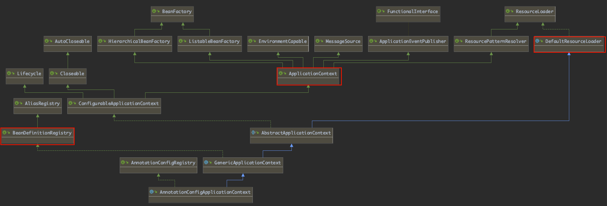

## <font color='green'>Spring容器初始化流程-Nie</font>


### <font color='#C71585'>Step1、new AnnotationConfigApplicationContext(MyConfig.class)</font>

> 下图是AnnotationConfigApplicationContext的继承关系




> 核心构造方法 AnnotationConfigApplicationContext(Class<?>... componentClasses)

```java
/**
	 * Create a new AnnotationConfigApplicationContext, deriving bean definitions
	 * from the given component classes and automatically refreshing the context.
	 * @param componentClasses one or more component classes &mdash; for example,
	 * {@link Configuration @Configuration} classes
	 */
	public AnnotationConfigApplicationContext(Class<?>... componentClasses) {
		this();
		register(componentClasses);
		refresh();
	}
```


#### <font color='#1E90FF'>1.1、this()</font>

调用父类构造器

* 获取默认的类加载器：ClassLoader
* 获得ant风格的资源解析器：ResourcePatternResolver
* 获得DefaultListableBeanFactory：BeanFactory

```java
//DefaultResourceLoader
public DefaultResourceLoader() {
		this.classLoader = ClassUtils.getDefaultClassLoader();
}
//AbstractApplicationContext
public AbstractApplicationContext() {
		this.resourcePatternResolver = getResourcePatternResolver();
}
//GenericApplicationContext
public GenericApplicationContext() {
		this.beanFactory = new DefaultListableBeanFactory();
}
//AnnotationConfigApplicationContext
public AnnotationConfigApplicationContext() {
		this.reader = new AnnotatedBeanDefinitionReader(this);
		this.scanner = new ClassPathBeanDefinitionScanner(this);
}
```


#### 1.2、调用本类构造器

* AnnotatedBeanDefinitionReader(this)：初始化BeanDefinitionReader
* ClassPathBeanDefinitionScanner(this)：初始化ClassPathBeanDefinitionScanner

```java
new AnnotatedBeanDefinitionReader(this);

-- public AnnotatedBeanDefinitionReader(...) {
		this(registry, getOrCreateEnvironment(registry));
	}

	--public AnnotatedBeanDefinitionReader(...) {
		.
    .
		AnnotationConfigUtils.registerAnnotationConfigProcessors(this.registry);
	  }

		//关键一步，注册相关的注解后置处理器
		--public static void registerAnnotationConfigProcessors(..)  {
		registerAnnotationConfigProcessors(registry, null);
	    }
```


#### 1.3、registerAnnotationConfigProcessors（）支持注解开发

注册默认的处理器到容器中，启动容器打印默认Bean可以看到以下输出

* org.springframework.context.annotation.internalConfigurationAnnotationProcessor

  @Configuration注解处理器，对应ConfigurationClassPostProcessor类


* org.springframework.context.annotation.internalAutowiredAnnotationProcessor

  自动注入注解处理器（@Autowired），对应AutowiredAnnotationBeanPostProcessor类

  

* org.springframework.context.annotation.internalCommonAnnotationProcessor

  通用注解处理器（负责管理 JSR-250规范下的注解），对应CommonAnnotationBeanPostProcessor类


* org.springframework.context.event.internalEventListenerProcessor
  事件监听处理器（负责管理@EventListener注解），对应EventListenerMethodProcessor类

  

* org.springframework.context.event.internalEventListenerFactory

  事件监听器工厂处理器，对应DefaultEventListenerFactory类

```java
public static Set<BeanDefinitionHolder> registerAnnotationConfigProcessors(..) {
   

   Set<BeanDefinitionHolder> beanDefs = new LinkedHashSet<>(8);

   if (!registry.containsBeanDefinition(CONFIGURATION_ANNOTATION_PROCESSOR_BEAN_NAME)) {
      RootBeanDefinition def= new RootBeanDefinition(ConfigurationClassPostProcessor.class);
      def.setSource(source);
      beanDefs.add(registerPostProcessor(..,CONFIGURATION_ANNOTATION_PROCESSOR_BEAN_NAME));
   }

   if (!registry.containsBeanDefinition(AUTOWIRED_ANNOTATION_PROCESSOR_BEAN_NAME)) {
      RootBeanDefinition def = new RootBeanDefinition(AutowiredAnnotationBeanPostProcessor.class);
      def.setSource(source);
      beanDefs.add(registerPostProcessor(registry, def, AUTOWIRED_ANNOTATION_PROCESSOR_BEAN_NAME));
   }

   // Check for JSR-250 support, and if present add the CommonAnnotationBeanPostProcessor.
   if (jsr250Present && !registry.containsBeanDefinition(COMMON_ANNOTATION_PROCESSOR_BEAN_NAME)) {
      RootBeanDefinition def = new RootBeanDefinition(CommonAnnotationBeanPostProcessor.class);
      def.setSource(source);
      beanDefs.add(registerPostProcessor(registry, def, COMMON_ANNOTATION_PROCESSOR_BEAN_NAME));
   }

   // Check for JPA support, and if present add the PersistenceAnnotationBeanPostProcessor.
   if (jpaPresent && !registry.containsBeanDefinition(PERSISTENCE_ANNOTATION_PROCESSOR_BEAN_NAME)) {
      RootBeanDefinition def = new RootBeanDefinition();
      try {
         def.setBeanClass(ClassUtils.forName(PERSISTENCE_ANNOTATION_PROCESSOR_CLASS_NAME,
               AnnotationConfigUtils.class.getClassLoader()));
      }
      catch (ClassNotFoundException ex) {
         throw new IllegalStateException(
               "Cannot load optional framework class: " + PERSISTENCE_ANNOTATION_PROCESSOR_CLASS_NAME, ex);
      }
      def.setSource(source);
      beanDefs.add(registerPostProcessor(registry, def, PERSISTENCE_ANNOTATION_PROCESSOR_BEAN_NAME));
   }

   if (!registry.containsBeanDefinition(EVENT_LISTENER_PROCESSOR_BEAN_NAME)) {
      RootBeanDefinition def = new RootBeanDefinition(EventListenerMethodProcessor.class);
      def.setSource(source);
      beanDefs.add(registerPostProcessor(registry, def, EVENT_LISTENER_PROCESSOR_BEAN_NAME));
   }

   if (!registry.containsBeanDefinition(EVENT_LISTENER_FACTORY_BEAN_NAME)) {
      RootBeanDefinition def = new RootBeanDefinition(DefaultEventListenerFactory.class);
      def.setSource(source);
      beanDefs.add(registerPostProcessor(registry, def, EVENT_LISTENER_FACTORY_BEAN_NAME));
   }

   return beanDefs;
}
```


### <font color='#C71585'>Step2、refresh()</font>

> 刷新初始化容器

```java
public void refresh() throws BeansException, IllegalStateException {
   synchronized (this.startupShutdownMonitor) {
      // Prepare this context for refreshing.
      prepareRefresh();

      // Tell the subclass to refresh the internal bean factory.
      ConfigurableListableBeanFactory beanFactory = obtainFreshBeanFactory();

      // Prepare the bean factory for use in this context.
      prepareBeanFactory(beanFactory);

      try {
         // Allows post-processing of the bean factory in context subclasses.
         postProcessBeanFactory(beanFactory);

         // Invoke factory processors registered as beans in the context.
         invokeBeanFactoryPostProcessors(beanFactory);

         // Register bean processors that intercept bean creation.
         registerBeanPostProcessors(beanFactory);

         // Initialize message source for this context.
         initMessageSource();

         // Initialize event multicaster for this context.
         initApplicationEventMulticaster();

         // Initialize other special beans in specific context subclasses.
         onRefresh();

         // Check for listener beans and register them.
         registerListeners();

         // Instantiate all remaining (non-lazy-init) singletons.
         finishBeanFactoryInitialization(beanFactory);

         // Last step: publish corresponding event.
         finishRefresh();
      }

      catch (BeansException ex) {
         if (logger.isWarnEnabled()) {
            logger.warn("Exception encountered during context initialization - " +
                  "cancelling refresh attempt: " + ex);
         }

         // Destroy already created singletons to avoid dangling resources.
         destroyBeans();

         // Reset 'active' flag.
         cancelRefresh(ex);

         // Propagate exception to caller.
         throw ex;
      }

      finally {
         // Reset common introspection caches in Spring's core, since we
         // might not ever need metadata for singleton beans anymore...
         resetCommonCaches();
      }
   }
}
```


#### 2.1、prepareRefresh()

刷新ApplicationContext之前设置当前事件以及初始化属性参数


* initPropertySources()

  供给子类使用的初始化参数，默认方法为空

* getEnvironment().validateRequiredProperties();

  校验设置的参数

* new LinkedHashSet<>(this.applicationListeners);

  保存容器早期的一些事件
  
  

#### 2.2、obtainFreshBeanFactory()

* refreshBeanFactory();

  刷新BeanFactory，给BeanFactory设置序列化ID，这个BeanFactory就是Step1中new AnnotationConfigApplicationContext(MyConfig.class)时调用父类构造器new出来的BeanFactory

* getBeanFactory();

  获取上一步刷新Bean工厂时创建的BeanFactory
  
  

#### 2.3、prepareBeanFactory(beanFactory)

* 由于上一步获取的BeanFactory是一个没有任何参数的BeanFactory，在这一步对BeanFactory的参数进行初始化
* 设置类加载器，表达式解析器
* 注册部分BeanProcessor处理器，如ApplicationContextAwareProcessor，用于判断Bean是否实现了ApplicationContextAware接口
* 设置可以自动解析注入的Bean，这些Bean可以@Autowired到自定义的Bean中：BeanFactory，ResourceLoader，ApplicationEventPublisher，ApplicationContext


#### 2.4、postProcessBeanFactory(beanFactory);

* 子类通过重写这个方法，实现对生成的beanFactory进行属性的修改和设置


#### 2.5、invokeBeanFactoryPostProcessors(beanFactory);

* 实例化并调用所有被注册的BeanFactoryPostProcessor，这些PostProcessor在prepareBeanFactory() BeanFactory的预处理过程中被添加进BeanFactory
* @Configuration注解的配置在这一步创建Beandefi


#### <font color='#1E90FF'>2.6、registerBeanPostProcessors(beanFactory)</font>

> 注册Bean的后置处理器，注意这里只注册和实例化BeanPostProcessors，并不执行

* beanFactory.getBeanNamesForType() ,获取所有的BeanPostProcessor的名称

* 遍历获取的BeanName列表并通过beanFactory.getBean()方法获取所有的后置处理器实例对象

* 根据后置处理器的注册优先级分为以下几种处理器

  * priorityOrderedPostProcessors

    首先注册实现了PriorityOrdered接口的后置处理器

  * orderedPostProcessorNames

    然后注册实现了Ordered接口的后置处理器

  * nonOrderedPostProcessorNames

    之后注册通常的后置处理器

  * internalPostProcessors

    最后注册内部的后置处理器


#### 2.7、initMessageSource()

> 获取并注册 MessageSource组件，为springMVC的国际化处理做支持

* getBeanFactory()，第一步获取BeanFactory
* containsLocalBean(MESSAGE_SOURCE_BEAN_NAME)，判断容器中是否有MessageSource组件，如果没有则创建默认的MessageSource组件并注册到Beanfactory中
* 若容器中已经存在MessageSource组件，则通过beanFactory.getBean()方法获取组件并注册到容器中

#### 

#### 2.8、initApplicationEventMulticaster()

> 初始化事件派发器

* getBeanFactory()，第一步获取BeanFactory
* containsLocalBean(APPLICATION_EVENT_MULTICASTER_BEAN_NAME)，判断容器中是否有事件派发器组件，如果没有则注册简单事件派发器：new SimpleApplicationEventMulticaster(beanFactory)
* 若容器中已经存在EventMulticaster组件，则通过beanFactory.getBean()方法获取组件并注册到容器中


#### 2.9、onRefresh()

> 给子类预留的方法，子类通过重写该方法自定义刷新容器过程中的逻辑处理

```java
protected void onRefresh() throws BeansException {
		// For subclasses: do nothing by default.
}
```


#### 2.10、registerListeners()

> 注册监听器到事件派发器中，该事件派发器为步骤2.8中注册的事件派发器，按照顺序注册监听器

```java
protected void registerListeners() {
		// Register statically specified listeners first.
		for (ApplicationListener<?> listener : getApplicationListeners()) {
			getApplicationEventMulticaster().addApplicationListener(listener);
		}

		// Do not initialize FactoryBeans here: We need to leave all regular beans
		// uninitialized to let post-processors apply to them!
		String[] listenerBeanNames = getBeanNamesForType(ApplicationListener.class, true, false);
		for (String listenerBeanName : listenerBeanNames) {
			getApplicationEventMulticaster().addApplicationListenerBean(listenerBeanName);
		}

		// Publish early application events now that we finally have a multicaster...
		Set<ApplicationEvent> earlyEventsToProcess = this.earlyApplicationEvents;
		this.earlyApplicationEvents = null;
		if (earlyEventsToProcess != null) {
			for (ApplicationEvent earlyEvent : earlyEventsToProcess) {
				getApplicationEventMulticaster().multicastEvent(earlyEvent);
			}
		}
	}
```

* 首先注册被指定的静态监听器：getApplicationListeners()
* 接着注册根据类型获得的监听器：getBeanNamesForType()
* 最后注册**2.1**步骤中注册的早期的监听事件


### <font color='#C71585'>Step3、finishBeanFactoryInitialization(beanFactory)</font>

> 初始化剩下的Bean实例对象

``` java
protected void finishBeanFactoryInitialization(ConfigurableListableBeanFactory beanFactory) {
		// Initialize conversion service for this context.
		if (beanFactory.containsBean(CONVERSION_SERVICE_BEAN_NAME) &&
				beanFactory.isTypeMatch(CONVERSION_SERVICE_BEAN_NAME, ConversionService.class)) {
			beanFactory.setConversionService(
					beanFactory.getBean(CONVERSION_SERVICE_BEAN_NAME, ConversionService.class));
		}

		// Register a default embedded value resolver if no bean post-processor
		// (such as a PropertyPlaceholderConfigurer bean) registered any before:
		// at this point, primarily for resolution in annotation attribute values.
		if (!beanFactory.hasEmbeddedValueResolver()) {
			beanFactory.addEmbeddedValueResolver(strVal -> getEnvironment().resolvePlaceholders(strVal));
		}

		// Initialize LoadTimeWeaverAware beans early to allow for registering their transformers early.
		String[] weaverAwareNames = beanFactory.getBeanNamesForType(LoadTimeWeaverAware.class, false, false);
		for (String weaverAwareName : weaverAwareNames) {
			getBean(weaverAwareName);
		}

		// Stop using the temporary ClassLoader for type matching.
		beanFactory.setTempClassLoader(null);

		// Allow for caching all bean definition metadata, not expecting further changes.
		beanFactory.freezeConfiguration();

		// Instantiate all remaining (non-lazy-init) singletons.
		beanFactory.preInstantiateSingletons();
	}
```


#### 3.1、beanFactory.preInstantiateSingletons()

> 实例化所有的非懒加载的单例对象


#### 3.2、new ArrayList<>(this.beanDefinitionNames)

> 获取所有Bean定义的名称，用于初始化


#### 3.3、getMergedLocalBeanDefinition(beanName)

* 遍历数组集合通过BeanName获取Bean的定义对象RootBeanDefinition

* !bd.isAbstract() && bd.isSingleton() && !bd.isLazyInit()，如果这个Bean不是抽象类且是作用域为单例模式且不是懒加载模式的Bean，那么就可以进一步获取Bean


#### 3.4、isFactoryBean(beanName)

* 判断是否为工厂类Bean
* 如果不是，那么直接调用getBean即可
* 如果是工厂Bean，那么在Bean的名称前加上工厂类的前缀获取对应的工厂Bean,再通过FactoryBean.getObject()获取对应的Bean


#### <font color='#1E90FF'>3.5、getBean(beanName)→doGetBean</font>

* Object sharedInstance = getSingleton(beanName)，首先检查缓存中有没有对应的Bean对象，因为可能这并不是第一次来获取Bean，如果缓存中存在，那么直接获得Bean对象。

  > 三级缓存如下图，三级缓存解决了属性注入模式下出现的循环依赖问题，当A对象实例化之前会先检查其依赖的对象，并把实例化但并未初始化的A对象放入earlySingletonObjectsh缓存中，如果实例化B对象发现其依赖A对象，那么B对象可以先从缓存中取得还未初始化完成的A的实例对象先解决依赖问题，之后对应的A对象也能完成对B对象的依赖

```java
//单例对象的缓存
/** Cache of singleton objects: bean name to bean instance. */
private final Map<String, Object> singletonObjects = new ConcurrentHashMap<>(256);

//对象工厂类的缓存
/** Cache of singleton factories: bean name to ObjectFactory. */
private final Map<String, ObjectFactory<?>> singletonFactories = new HashMap<>(16);

//提前暴露的实例化对象，此时对象并未初始化完成
/** Cache of early singleton objects: bean name to bean instance. */
private final Map<String, Object> earlySingletonObjects = new HashMap<>(16);
```


#### <font color='#1E90FF'>3.6、getSingleton(String beanName, boolean allowEarlyReference)</font>

> 判断Bean是否在创建中，缓存中是否能拿到单例对象

```java
protected Object getSingleton(String beanName, boolean allowEarlyReference) {
		Object singletonObject = this.singletonObjects.get(beanName);
		if (singletonObject == null && isSingletonCurrentlyInCreation(beanName)) {
			synchronized (this.singletonObjects) {
				singletonObject = this.earlySingletonObjects.get(beanName);
				if (singletonObject == null && allowEarlyReference) {
					ObjectFactory<?> singletonFactory = this.singletonFactories.get(beanName);
					if (singletonFactory != null) {
						singletonObject = singletonFactory.getObject();
						this.earlySingletonObjects.put(beanName, singletonObject);
						this.singletonFactories.remove(beanName);
					}
				}
			}
		}
		return singletonObject;
	}
```

* 如果缓存中拿不到，那么就到提前暴露对象缓存中去取单例对象
* 如果前暴露对象缓存中也没有单例对象，同时对象是否该创建标志为true，那么就尝试从对象工厂缓存中获取对象工厂：FactoryBean，获取工厂对象后，调用工厂对象的getObject()方法获取Bean
* 获取对象后将单例对象加入提前暴露缓存中，this.earlySingletonObjects.put(beanName, singletonObject);再将工厂对象缓存中的Bean去除this.singletonFactories.remove(beanName);
* 最终返回单例对象return singletonObject;
* 如果工厂缓存中也没有FactoryBean，那么返回空对象，第一次初始化容器基本上返回的都是空对象

#### <font color='red'>疑问</font>

```java
singletonObject == null && isSingletonCurrentlyInCreation(beanName)
//这一步判断中，isSingletonCurrentlyInCreation(beanName)判断Bean是否在创建中，如果是则返回true，但是这里应该需要Bean不在创建中才能进行下一步，这里有疑问
```


#### 3.7、if (isPrototypeCurrentlyInCreation(beanName)

* 如果返回的单例对象为空，那么判断当前创建的对象是否是Prototype作用域的对象，如果是，那么抛出异常：BeanCurrentlyInCreationException


#### 3.8、if (parentBeanFactory != null && !containsBeanDefinition(beanName)

* 判断Bean对象的父工厂是否存在且判断当前BeanDefinitionMap中是否包含当前bean的定义


#### 3.9、markBeanAsCreated(beanName);

* 如果3.9的判断失败，调用markBeanAsCreated方法将Bean加入创建队列中，保证在多线程情况下只能有一个线程创建对应的单例对象，在这里使用了同步代码块+double check的模式来保证线程的安全

``` java
protected void markBeanAsCreated(String beanName) {
  //double check 模式
		if (!this.alreadyCreated.contains(beanName)) {
			synchronized (this.mergedBeanDefinitions) {
				if (!this.alreadyCreated.contains(beanName)) {
					// Let the bean definition get re-merged now that we're actually creating
					// the bean... just in case some of its metadata changed in the meantime.
					clearMergedBeanDefinition(beanName);
					this.alreadyCreated.add(beanName);
				}
			}
		}
	}
```


#### 3.10、getRootBeanDefinition() →if (dependsOn != null) 

* 获取Bean的定义对象
* 判断Bean是否存在依赖关系，如果存在依赖关系那么先去获取依赖类
* **if (isDependent(beanName, dep))**判断依赖的Bean是否已经注册，如果没有，那么抛出循环依赖异常：

``` java
if (isDependent(beanName, dep)) {
							throw new BeanCreationException(mbd.getResourceDescription(), beanName,
									"Circular depends-on relationship between '" + beanName + "' and '" + dep + "'");
						}
```

* 如果已经注册则将依赖注册到当前的Bean中
* 注册后获取对应的依赖对象，如果没有获取到对应的依赖对象，那么抛出依赖缺失异常

```java
try {
			 getBean(dep);
		}
		catch (NoSuchBeanDefinitionException ex) {
				throw new BeanCreationException(mbd.getResourceDescription(), beanName,
				"'" + beanName + "' depends on missing bean '" + dep + "'", ex);
}
```


#### 3.11、if (mbd.isPrototype())

> 如果是Prototype作用域的Bean，那么直接新建一个就可以了，在创建Bean之前调用beforePrototypeCreation(beanName);方法，创建之后调用afterPrototypeCreation(beanName)方法

* getObjectForBeanInstance（），使用创建出的Object对象，BeanName，RootBeanDefinition对象，创建最终的Bean对象


#### 3.12、if (mbd.isSingleton())

> 如果Bean的作用域为单例模式，则进行单例对象的创建，在这主要讨论单例模式对象的创建


#### <font color='#1E90FF'>3.13、getSingleton(String beanName, ObjectFactory<?> singletonFactory)</font>

> 此方法为3.6步骤getSingleton()的重载方法

``` java
public Object getSingleton(String beanName, ObjectFactory<?> singletonFactory) {
		Assert.notNull(beanName, "Bean name must not be null");
		synchronized (this.singletonObjects) {
			Object singletonObject = this.singletonObjects.get(beanName);
			if (singletonObject == null) {
				if (this.singletonsCurrentlyInDestruction) {
					throw new BeanCreationNotAllowedException(beanName,
							"Singleton bean creation not allowed while singletons of this factory are in destruction " +
							"(Do not request a bean from a BeanFactory in a destroy method implementation!)");
				}
				if (logger.isDebugEnabled()) {
					logger.debug("Creating shared instance of singleton bean '" + beanName + "'");
				}
				beforeSingletonCreation(beanName);
				boolean newSingleton = false;
				boolean recordSuppressedExceptions = (this.suppressedExceptions == null);
				if (recordSuppressedExceptions) {
					this.suppressedExceptions = new LinkedHashSet<>();
				}
				try {
					singletonObject = singletonFactory.getObject();
					newSingleton = true;
				}
				catch (IllegalStateException ex) {
					// Has the singleton object implicitly appeared in the meantime ->
					// if yes, proceed with it since the exception indicates that state.
					singletonObject = this.singletonObjects.get(beanName);
					if (singletonObject == null) {
						throw ex;
					}
				}
				catch (BeanCreationException ex) {
					if (recordSuppressedExceptions) {
						for (Exception suppressedException : this.suppressedExceptions) {
							ex.addRelatedCause(suppressedException);
						}
					}
					throw ex;
				}
				finally {
					if (recordSuppressedExceptions) {
						this.suppressedExceptions = null;
					}
					afterSingletonCreation(beanName);
				}
				if (newSingleton) {
					addSingleton(beanName, singletonObject);
				}
			}
			return singletonObject;
		}
	}
```

* this.singletonObjects.get(beanName)，先尝试在单例缓存中获取单例对象
* 如果获取不到缓存对象，那么判断该对象是否正在销毁流程中，如果是，那么抛出异常：BeanCreationNotAllowedException
* 在对象创建前调用beforeSingletonCreation(beanName);判断对象是否排除在新建检查列表之外，且将对象加入到创建队列中，表示对象正在创建中，如果判断为false则抛出异常：BeanCurrentlyInCreationException
* singletonFactory.getObject()，通过FactoryBean对象获取Bean对象
* 进行异常处理流程
* 在finally代码块中执行afterSingletonCreation() 方法，将Bean对象从创建队列中移除
* 调用addSingleton()方法，对Bean对象的三级缓存进行处理
  * 将对象放入缓存singletonObjects中
  * 将对象的FactoryBean对象缓存从singletonFactories中移除
  * 将对象从早期暴露对象缓存中移除
* registeredSingletons.add(beanName)，将对象加入到注册集合中
* 最终返回sharedInstance,共享实例对象


#### <font color='#1E90FF'>3.14、getObjectForBeanInstance</font>

<font color='red' size='4'>疑问：该方法重写了父类的getObjectForBeanInstance方法，对当前Bean的依赖进行了判断并调用registerDependentBean进行了依赖的注入，猜测这里和解决循环依赖相关</font></font>

``` java
@Override
	protected Object getObjectForBeanInstance(
			Object beanInstance, String name, String beanName, @Nullable RootBeanDefinition mbd) {

		String currentlyCreatedBean = this.currentlyCreatedBean.get();
		if (currentlyCreatedBean != null) {
			registerDependentBean(beanName, currentlyCreatedBean);
		}

		return super.getObjectForBeanInstance(beanInstance, name, beanName, mbd);
	}
```

* super.getObjectForBeanInstance(beanInstance, name, beanName, mbd)

``` java
protected Object getObjectForBeanInstance(
			Object beanInstance, String name, String beanName, @Nullable RootBeanDefinition mbd) {

		// Don't let calling code try to dereference the factory if the bean isn't a factory.
		if (BeanFactoryUtils.isFactoryDereference(name)) {
			if (beanInstance instanceof NullBean) {
				return beanInstance;
			}
			if (!(beanInstance instanceof FactoryBean)) {
				throw new BeanIsNotAFactoryException(beanName, beanInstance.getClass());
			}
			if (mbd != null) {
				mbd.isFactoryBean = true;
			}
			return beanInstance;
		}

		// Now we have the bean instance, which may be a normal bean or a FactoryBean.
		// If it's a FactoryBean, we use it to create a bean instance, unless the
		// caller actually wants a reference to the factory.
		if (!(beanInstance instanceof FactoryBean)) {
			return beanInstance;
		}

		Object object = null;
		if (mbd != null) {
			mbd.isFactoryBean = true;
		}
		else {
			object = getCachedObjectForFactoryBean(beanName);
		}
		if (object == null) {
			// Return bean instance from factory.
			FactoryBean<?> factory = (FactoryBean<?>) beanInstance;
			// Caches object obtained from FactoryBean if it is a singleton.
			if (mbd == null && containsBeanDefinition(beanName)) {
				mbd = getMergedLocalBeanDefinition(beanName);
			}
			boolean synthetic = (mbd != null && mbd.isSynthetic());
			object = getObjectFromFactoryBean(factory, beanName, !synthetic);
		}
		return object;
	}
```

* 根据提供的对象实例返回Object对象
*  return (T) bean，最终完成Bean实例的初始化
* 返回到3.1步骤，getBean(beanName)，依次返回对应的对象实例


