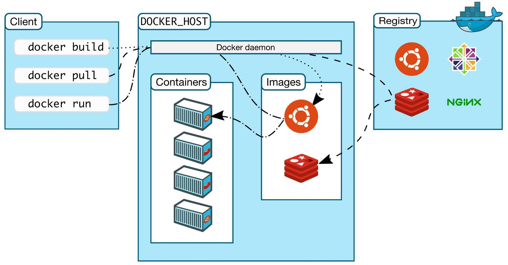
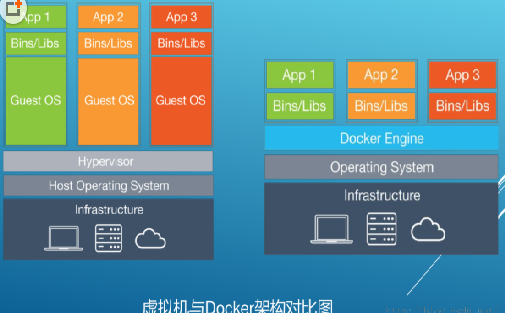

## Docker 安装

### Docker 架构图

> ​		需要正确的理解仓储/镜像/容器这几个概念: Docker 本身是一个容器运行载体或称之为管理引擎。我们把应用程序和配置依赖打包好形成一个可交付的运行环境，这个打包好的运行环境就似乎 image镜像文件。只有通过这个镜像文件才能生成 Docker 容器。image 文件可以看作是容器的模板。Docker 根据 image 文件生成容器的实例。同一个 image 文件，可以生成多个同时运行的容器实例。
>



---

### Docker 在线安装步骤

#### 安装 GCC 相关依赖

```shell
yum -y install gcc
yum -y install gcc-c++
```

#### 卸载旧版本

```shell
yum -y remove docker docker-common docker-selinux docker-engine
# 或者2018.3旧版本
yum remove docker \
                  docker-client \
                  docker-client-latest \
                  docker-common \
                  docker-latest \
                  docker-latest-logrotate \
                  docker-logrotate \
                  docker-selinux \
                  docker-engine-selinux \
                  docker-engine

```

#### 安装需要的软件包

```shell
yum install -y yum-utils device-mapper-persistent-data lvm2
```

#### 设置 stable 镜像仓库

```shell
yum-config-manager --add-repo http://mirrors.aliyun.com/docker-ce/linux/centos/docker-ce.repo
```

#### 更新 yum 包索引

```shell
yum makecache fast
```

#### 安装 Docker 社区版

```shell
yum -y install docker-ce
```

#### 启动 Docker

```shell
systemctl start docker
```

#### 测试

```shell
docker version
```

#### 卸载 Docker

```shell
# 停止 docker 运行
systemctl stop docker
# yum -y remove docker-ce
卸载 docker 社区版
# 删除 docker 相关目录
rm -rf /var/lib/docker
```

---

### Docker 离线安装步骤

#### Docker 下载

[下载地址](https://download.docker.com/linux/static/stable/x86_64/)

#### Docker 解压并安装

```shell
# 将安装包解压到当前目录
tar -zxvf docker-18.06.2-ce.tgz

# 复制解压出来的文件到一个可执行的目录
cp docker/* /usr/bin/

# 编写 docker 服务脚本
vim /etc/systemd/system/docker.service

# 将以下内容粘贴进去

[Unit]
Description=Docker Application Container Engine
Documentation=https://docs.docker.com
After=network-online.target firewalld.service
Wants=network-online.target
   
[Service]
Type=notify
# the default is not to use systemd for cgroups because the delegate issues still
# exists and systemd currently does not support the cgroup feature set required
# for containers run by docker
ExecStart=/usr/bin/dockerd -H tcp://0.0.0.0:2375 -H unix://var/run/docker.sock
ExecReload=/bin/kill -s HUP $MAINPID
# Having non-zero Limit*s causes performance problems due to accounting overhead
# in the kernel. We recommend using cgroups to do container-local accounting.
LimitNOFILE=infinity
LimitNPROC=infinity
LimitCORE=infinity
# Uncomment TasksMax if your systemd version supports it.
# Only systemd 226 and above support this version.
#TasksMax=infinity
TimeoutStartSec=0
# set delegate yes so that systemd does not reset the cgroups of docker containers
Delegate=yes
# kill only the docker process, not all processes in the cgroup
KillMode=process
# restart the docker process if it exits prematurely
Restart=on-failure
StartLimitBurst=3
StartLimitInterval=60s
   
[Install]
WantedBy=multi-user.target

# 重载systemd下 xxx.service文件
systemctl daemon-reload

# 启动Docker
systemctl start docker
```

#### 测试

```shell
docker version
# 若输出以下内容则安装成功
Client:
 Version:           18.06.2-ce
 API version:       1.38
 Go version:        go1.10.4
 Git commit:        6d37f41
 Built:             Sun Feb 10 03:43:40 2019
 OS/Arch:           linux/amd64
 Experimental:      false

Server:
 Engine:
  Version:          18.06.2-ce
  API version:      1.38 (minimum version 1.12)
  Go version:       go1.10.3
  Git commit:       6d37f41
  Built:            Sun Feb 10 03:51:58 2019
  OS/Arch:          linux/amd64
  Experimental:     false
```

---

### Docker 底层原理

> 1、docker 有着比虚拟机更少的抽象层。由于 docker 不需要 Hypervisor 实现硬件资源虚拟化,运行在 docker 容器上的程序直接使用的都是实际物理机的硬件资源。因此在 CPU、内存利用率上 docker 将会在效率上有明显优势。

> 2、docker 利用的是宿主机的内核,而不需要 Guest OS。因此,当新建一个容器时, docker 不需要和虚拟机一样重新加载一个操作系统内核。仍而避免引寻、加载操作系统内核返个比较费时费资源的过程,当新建一个虚拟机时,虚拟机软件需要加载 Guest OS ,返个新建过程是分钟级别的。而 docker 由于直接利用宿主机的操作系统,则省略了返个过程,因此新建一个 docker 容器只需要几秒钟。



---

### Docker常用命令

#### docker images 镜像命令

* docker images：列出本地主机上的镜像
* -a ：列出本地所有的镜像（含中间映像层）
* -q ：只显示镜像ID
* --digests ：显示镜像的摘要信
* --no-trunc ：显示完整的镜像信息
* docker search [OPTIONS] 镜像名字：在 [资源仓库](https://hub.docker.com )上搜索对应的镜像
* docker pull [OPTIONS] 镜像名字：拉取镜像
* docker rmi  -f 镜像ID：删除单个镜像
* docker rmi -f 镜像名1:TAG 镜像名2:TAG ：删除多个镜像
* docker rmi -f $(docker images -qa)：删除全部镜像
* docker images  -f [condition] ：根据条件查询本地镜像
* docker images  -f=reference='abc*'：查询以abc为开头的镜像 
* docker update -restart=always [容器ID]

#### docker run [OPTIONS] 

> 新建并启动一个容器

* --name="容器新名字"： 为容器指定一个名称；
* -d：后台运行容器，并返回容器ID，也即启动守护式容器；

> docker run -d centos 会启动一个 centos 的容器，但是会立刻结束
>
> 很重要的要说明的一点: Docker容器后台运行,就必须有一个前台进程.
> 容器运行的命令如果不是那些一直挂起的命令（比如运行top，tail），就是会自动退出的

* -i：以交互模式运行容器，通常与 -t 同时使用；
* -t：为容器重新分配一个伪输入终端，通常与 -i 同时使用；
* -P： 随机端口映射；
* -p：指定端口映射 ，有四种配置方式
  * ip::containerPort
  *  ip:hostPort:containerPort     
  *  hostPort:containerPort
  *  containerPort

```shell
# 启动一个交互式容器
docker run -it nginx -p 80:80 /bin/bash 
# 启动一个守护式进程容器
docker run --name nginx-demo -p 80:80 -d nginx

# 如果出现了错误：Error response from daemon: oci runtime error: container_linux.go:247: starting container process，那么原因可能是 docker 版本和 centos 版本对不上，下载对应版本即可
```

#### docker ps [OPTIONS]

> 列出当前所有正在运行的容器

* -a ：列出当前所有正在运行的容器+历史上运行过的
* -l ：显示最近创建的容器。
* -n：显示最近n个创建的容器。
* -q ：静默模式，只显示容器编号。
* --no-trunc ：不截断输出。

#### docker start [containerID/containerName]

> 根据容器ID或名称启动指定容器

#### docker restart [containerID/containerName]

> 根据容器ID或名称重启指定容器

#### docker stop/kill  [containerID/containerName]

> 根据容器ID或名称（stop）关闭容器（kill）强制关闭

#### docker rm [containerID]

> 删除已经关闭的容器
>
> docker rm -f $(docker ps -a -q)：一次性删除全部容器

#### docker logs -f -t --tail [containerID]

> 查看容器日志

* -t：加入时间戳
* -f：跟随最新的日志打印
* --tail 数字：显示最后多少条

#### docker top [containerID]

> 查看容器内运行的进程

#### `docker inspect [containerID]`

> 查询容器内部细节，可以通过该命令查看容器配置，数据卷挂载等重要信息

#### docker exec -it  [containerID]  bashShell

> 进入正在运行的容器并以命令行交互

#### docker cp   [containerID] :容器内路径 目的主机路径

> 将容器中文件拷贝至宿主机上

---

### Docker 容器数据卷

> Docker 容器产生的数据，如果不通过 docker commit 生成新的镜像，使得数据做为镜像的一部分保存下来，
> 那么当容器删除后，数据自然也就没有了
>
> 为了能保存数据在docker中我们使用卷，主要作用有三个：容器的持久化，容器继承数据，容器共享数据

#### 如何使用

```shell
# 在根目录下创建 docker 文件夹
mkdir docker
# 直接挂载并运行容器，将宿主机的 nginxData 文件夹映射到容器内 subData 文件夹
docker run -it -p 80:80  -v /docker/nginx/nginxData:/etc/subData nginx
# 在宿主机文件夹中创建文件 test.conf 文件
touch test.conf
# 在容器中发现 subData 文件夹下出现了对应的文件 test.conf
root@d851022772a3:/etc/subData pwd
/etc/subData
root@d851022772a3:/etc/subData ls
test.conf
```

#### 查看容器是否挂载成功

```shell
# 查询容器详细信息
`docker inspect [containerID]`

# 在容器信息中可以找到数据卷挂载的信息
"Mounts": [
    {
        "Type": "bind",
        "Source": "/docker/nginx/nginxData",
        "Destination": "/etc/subData",
        "Mode": "",
        "RW": true,
        "Propagation": "rprivate"
     }
]
# RW 指的是读写权限，如果在创建容器挂载数据卷的时候在【容器内目录】后加上‘:ro’，那么该容器只能从宿主机读取文件而不能写文件，且 RW 会置为false 
```

#### 通过 DockerFile 挂载数据卷

```shell
# 创建 DockerFile
vim DockerFile

# DockerFile 内容
From nginx # 继承自nginx镜像
VOLUME ["/dataVolumeContainer1","/dataVolumeContainer2"] # 挂载两个数据卷
CMD /bin/bash # 打开交互控制台

# 利用 DockerFile 根据已有的 nginx 镜像生成自定义镜像
docker build -f /docker/dockerFile/DockerFile1 -t nie/nginx .

# 查看刚才创建的镜像
[root@localhost dockerFile]# docker images
REPOSITORY          TAG                 IMAGE ID            CREATED             SIZE
nie/nginx           latest              50d4b01dd5b3        5 seconds ago       132MB
nginx               latest              2622e6cca7eb        5 days ago          132MB
mysql               latest              be0dbf01a0f3        5 days ago          541MB
centos              latest              470671670cac        4 months ago        237MB

# 利用刚才创建的镜像新建一个容器
docker run -it nie/nginx

# 查看数据卷是否创建出来成功，发现刚才指定的两个数据卷已经成功创建
root@635a952d2e4a:/# ls -l
total 12
drwxr-xr-x.   2 root root 4096 Jun  7 00:00 bin
drwxr-xr-x.   2 root root    6 May  2 16:39 boot
drwxr-xr-x.   2 root root    6 Jun 14 18:12 `dataVolumeContainer1`
drwxr-xr-x.   2 root root    6 Jun 14 18:12 `dataVolumeContainer2`
drwxr-xr-x.   5 root root  360 Jun 14 18:12 dev
drwxr-xr-x.   1 root root   41 Jun  9 16:57 docker-entrypoint.d
-rwxrwxr-x.   1 root root 1087 Jun  9 16:57 docker-entrypoint.sh
drwxr-xr-x.   1 root root   66 Jun 14 18:12 etc
drwxr-xr-x.   2 root root    6 May  2 16:39 home
drwxr-xr-x.   1 root root   56 Jun  9 16:57 lib
drwxr-xr-x.   2 root root   34 Jun  7 00:00 lib64
drwxr-xr-x.   2 root root    6 Jun  7 00:00 media
drwxr-xr-x.   2 root root    6 Jun  7 00:00 mnt
drwxr-xr-x.   2 root root    6 Jun  7 00:00 opt
dr-xr-xr-x. 126 root root    0 Jun 14 18:12 proc
drwx------.   2 root root   37 Jun  7 00:00 root
drwxr-xr-x.   3 root root   30 Jun  7 00:00 run
drwxr-xr-x.   2 root root 4096 Jun  7 00:00 sbin
drwxr-xr-x.   2 root root    6 Jun  7 00:00 srv
dr-xr-xr-x.  13 root root    0 Jun 14 14:34 sys
drwxrwxrwt.   1 root root    6 Jun  9 16:57 tmp
drwxr-xr-x.   1 root root   66 Jun  7 00:00 usr
drwxr-xr-x.   1 root root   41 Jun  7 00:00 var

# 查看宿主机关联的文件夹，使用 docker inspect 命令，Source 属性即为宿主机映射的文件夹
"Mounts": [
    {
       "Type": "volume",
       "Name": "81230bab48307bb0deee991cc361b39738c4d8efd787c844b0327d3d98fb1e3f",
       "Source": "/var/lib/docker/volumes/81230bab48307bb0deee991cc361b39738c4d8efd787c844b0327d3d98fb1e3f/_data",
       "Destination": "/dataVolumeContainer1",
       "Driver": "local",
       "Mode": "",
       "RW": true,
       "Propagation": ""
     },
     {
       "Type": "volume",
       "Name": "39b75c6f05d4b19b54ded0af3297b17b2a19df7d6fda890ecf0c9aab27158401",
       "Source": "/var/lib/docker/volumes/39b75c6f05d4b19b54ded0af3297b17b2a19df7d6fda890ecf0c9aab27158401/_data",
        "Destination": "/dataVolumeContainer2",
        "Driver": "local",
        "Mode": "",
        "RW": true,
        "Propagation": ""
      }
],

```

`Docker挂载主机目录Docker访问出现cannot open directory .: Permission denied
解决办法：在挂载目录后多加一个--privileged=true参数即可`

#### 数据卷容器

> 命名的容器挂载数据卷，其它容器通过挂载这个(父容器)实现数据共享，挂载数据卷的容器，称之为数据卷容器

```shell
# 命令如下，先创建一个父容器作为数据卷容器，接着使用 --volumes-from 命令让子容器集成父容器的数据卷
docker run -it --name dc02 --volumes-from dc01 zzyy/centos
```

`容器之间配置信息的传递，数据卷的生命周期一直持续到没有容器使用它为止`

### DockerFile解析

> Dockerfile 是用来构建Docker镜像的构建文件，是由一系列命令和参数构成的脚本，通过 DockerFile 创建容器分为三步：
>
> 1、构建 DockerFile
>
> 2、指定 DockerFile 创建镜像：docker build  -f  DockerFile  -t [nameSpace/image] 
>
> 3、根据镜像运行容器：docker run 

#### DockerFile 保留字解释

> 这里以 nginx 的官方 DockerFile进行保留字的解释

```shell
FROM debian:buster-slim

LABEL maintainer="NGINX Docker Maintainers <docker-maint@nginx.com>"

ENV NGINX_VERSION   1.19.0
ENV NJS_VERSION     0.4.1
ENV PKG_RELEASE     1~buster

RUN set -x \
# create nginx user/group first, to be consistent throughout docker variants
    && addgroup --system --gid 101 nginx \
    && adduser --system --disabled-login --ingroup nginx --no-create-home --home /nonexistent --gecos "nginx user" --shell /bin/false --uid 101 nginx \
    && apt-get update \
    && apt-get install --no-install-recommends --no-install-suggests -y gnupg1 ca-certificates \
    && \
    NGINX_GPGKEY=573BFD6B3D8FBC641079A6ABABF5BD827BD9BF62; \
    found=''; \
    for server in \
        ha.pool.sks-keyservers.net \
        hkp://keyserver.ubuntu.com:80 \
        hkp://p80.pool.sks-keyservers.net:80 \
        pgp.mit.edu \
    ; do \
        echo "Fetching GPG key $NGINX_GPGKEY from $server"; \
        apt-key adv --keyserver "$server" --keyserver-options timeout=10 --recv-keys "$NGINX_GPGKEY" && found=yes && break; \
    done; \
    test -z "$found" && echo >&2 "error: failed to fetch GPG key $NGINX_GPGKEY" && exit 1; \
    apt-get remove --purge --auto-remove -y gnupg1 && rm -rf /var/lib/apt/lists/* \
    && dpkgArch="$(dpkg --print-architecture)" \
    && nginxPackages=" \
        nginx=${NGINX_VERSION}-${PKG_RELEASE} \
        nginx-module-xslt=${NGINX_VERSION}-${PKG_RELEASE} \
        nginx-module-geoip=${NGINX_VERSION}-${PKG_RELEASE} \
        nginx-module-image-filter=${NGINX_VERSION}-${PKG_RELEASE} \
        nginx-module-njs=${NGINX_VERSION}.${NJS_VERSION}-${PKG_RELEASE} \
    " \
    && case "$dpkgArch" in \
        amd64|i386) \
# arches officialy built by upstream
            echo "deb https://nginx.org/packages/mainline/debian/ buster nginx" >> /etc/apt/sources.list.d/nginx.list \
            && apt-get update \
            ;; \
        *) \
# we're on an architecture upstream doesn't officially build for
# let's build binaries from the published source packages
            echo "deb-src https://nginx.org/packages/mainline/debian/ buster nginx" >> /etc/apt/sources.list.d/nginx.list \
            \
# new directory for storing sources and .deb files
            && tempDir="$(mktemp -d)" \
            && chmod 777 "$tempDir" \
# (777 to ensure APT's "_apt" user can access it too)
            \
# save list of currently-installed packages so build dependencies can be cleanly removed later
            && savedAptMark="$(apt-mark showmanual)" \
            \
# build .deb files from upstream's source packages (which are verified by apt-get)
            && apt-get update \
            && apt-get build-dep -y $nginxPackages \
            && ( \
                cd "$tempDir" \
                && DEB_BUILD_OPTIONS="nocheck parallel=$(nproc)" \
                    apt-get source --compile $nginxPackages \
            ) \
# we don't remove APT lists here because they get re-downloaded and removed later
            \
# reset apt-mark's "manual" list so that "purge --auto-remove" will remove all build dependencies
# (which is done after we install the built packages so we don't have to redownload any overlapping dependencies)
            && apt-mark showmanual | xargs apt-mark auto > /dev/null \
            && { [ -z "$savedAptMark" ] || apt-mark manual $savedAptMark; } \
            \
# create a temporary local APT repo to install from (so that dependency resolution can be handled by APT, as it should be)
            && ls -lAFh "$tempDir" \
            && ( cd "$tempDir" && dpkg-scanpackages . > Packages ) \
            && grep '^Package: ' "$tempDir/Packages" \
            && echo "deb [ trusted=yes ] file://$tempDir ./" > /etc/apt/sources.list.d/temp.list \
# work around the following APT issue by using "Acquire::GzipIndexes=false" (overriding "/etc/apt/apt.conf.d/docker-gzip-indexes")
#   Could not open file /var/lib/apt/lists/partial/_tmp_tmp.ODWljpQfkE_._Packages - open (13: Permission denied)
#   ...
#   E: Failed to fetch store:/var/lib/apt/lists/partial/_tmp_tmp.ODWljpQfkE_._Packages  Could not open file /var/lib/apt/lists/partial/_tmp_tmp.ODWljpQfkE_._Packages - open (13: Permission denied)
            && apt-get -o Acquire::GzipIndexes=false update \
            ;; \
    esac \
    \
    && apt-get install --no-install-recommends --no-install-suggests -y \
                        $nginxPackages \
                        gettext-base \
                        curl \
    && apt-get remove --purge --auto-remove -y && rm -rf /var/lib/apt/lists/* /etc/apt/sources.list.d/nginx.list \
    \
# if we have leftovers from building, let's purge them (including extra, unnecessary build deps)
    && if [ -n "$tempDir" ]; then \
        apt-get purge -y --auto-remove \
        && rm -rf "$tempDir" /etc/apt/sources.list.d/temp.list; \
    fi \
# forward request and error logs to docker log collector
    && ln -sf /dev/stdout /var/log/nginx/access.log \
    && ln -sf /dev/stderr /var/log/nginx/error.log \
# create a docker-entrypoint.d directory
    && mkdir /docker-entrypoint.d

COPY docker-entrypoint.sh /
COPY 10-listen-on-ipv6-by-default.sh /docker-entrypoint.d
COPY 20-envsubst-on-templates.sh /docker-entrypoint.d
ENTRYPOINT ["/docker-entrypoint.sh"]

EXPOSE 80

STOPSIGNAL SIGTERM

CMD ["nginx", "-g", "daemon off;"]
```

| 名称       | 作用                                                         |
| ---------- | ------------------------------------------------------------ |
| FROM       | 基础镜像，当前新镜像是基于哪个镜像的                         |
| MAINTAINER | 镜像维护者的姓名和邮箱地址                                   |
| RUN        | 容器构建时需要运行的命令                                     |
| EXPOSE     | 当前容器对外暴露出的端口                                     |
| WORKDIR    | 指定在创建容器后，终端默认登陆的进来工作目录，一个落脚点     |
| ENV        | 用来在构建镜像过程中设置环境变量                             |
| ADD        | 将宿主机目录下的文件拷贝进镜像且ADD命令会自动处理URL和解压tar压缩包 |
| COPY       | 类似ADD，拷贝文件和目录到镜像中。<br/>将从构建上下文目录中 <源路径> 的文件/目录复制到新的一层的镜像内的 <目标路径> 位置 |
| VOLUME     | 容器数据卷，用于数据保存和持久化工作                         |
| CMD        | 指定一个容器启动时要运行的命令，可以有多个，但只有最后一个生效，CMD 会被 docker run 之后的参数替换 |
| ENTRYPOINT | ENTRYPOINT 的目的和 CMD 一样，都是在指定容器启动程序及参数，可以有多个，且都生效 |
| ONBUILD    | 当构建一个被继承的Dockerfile时运行命令，父镜像在被子继承后父镜像的onbuild被触发 |


